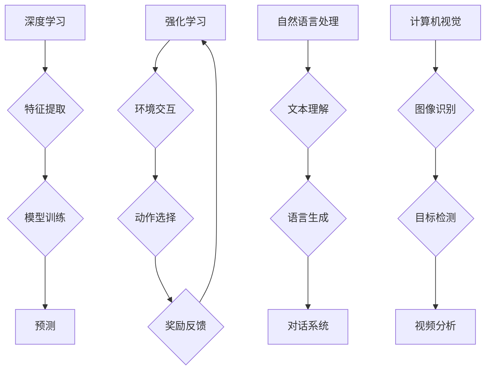

>  人工智能、深度学习、强化学习、自然语言处理、计算机视觉、边缘计算、云计算、数据安全

## 1. 背景介绍

人工智能（AI）技术近年来发展迅速，已从实验室的理论研究走向了现实生活的各个领域。从智能语音助手到自动驾驶汽车，AI正在改变着我们的生活方式和工作模式。然而，随着AI技术的不断发展，我们也面临着新的挑战和机遇。

传统的AI应用主要集中在数据分析、预测和决策等方面。随着深度学习和强化学习等技术的突破，AI的应用场景正在不断拓展，并呈现出以下几个新的方向和趋势：

* **泛化能力增强:**  传统的AI模型往往需要针对特定任务进行训练，而新的AI模型则更加注重泛化能力，能够适应不同的任务和环境。
* **解释性增强:**  传统的AI模型往往是“黑箱”模型，难以解释其决策过程。新的AI模型则更加注重解释性，能够提供更清晰的决策依据。
* **边缘计算:**  传统的AI应用主要依赖于云计算平台，而新的AI应用则更加注重边缘计算，将AI模型部署到设备端，实现更低延迟和更高效率的应用。
* **数据安全:**  随着AI技术的应用越来越广泛，数据安全问题也日益突出。新的AI应用则更加注重数据安全，采用加密、匿名化等技术保护用户隐私。

## 2. 核心概念与联系

**2.1 深度学习**

深度学习是机器学习的一种重要分支，它利用多层神经网络来模拟人类大脑的学习过程。深度学习模型能够从海量数据中自动提取特征，并进行复杂的模式识别和预测。

**2.2 强化学习**

强化学习是一种基于奖励机制的机器学习方法，它通过不断试错，学习如何完成特定的任务。强化学习模型能够在动态环境中进行决策，并根据反馈信息不断优化策略。

**2.3 自然语言处理**

自然语言处理（NLP）是人工智能领域的一个重要分支，它致力于使计算机能够理解和处理人类语言。NLP技术广泛应用于语音识别、机器翻译、文本摘要等领域。

**2.4 计算机视觉**

计算机视觉是人工智能领域的一个重要分支，它致力于使计算机能够“看”和理解图像和视频。计算机视觉技术广泛应用于图像识别、目标检测、视频分析等领域。

**2.5 边缘计算**

边缘计算是指将计算任务和数据存储部署到靠近数据源的边缘设备上，而不是依赖于云计算平台。边缘计算能够降低延迟、提高效率，并增强数据安全。

**2.6 云计算**

云计算是指通过互联网提供计算资源、存储资源和软件服务。云计算能够提供弹性、可扩展的计算资源，并降低IT成本。

**2.7 数据安全**

数据安全是指保护数据免受未经授权的访问、使用、披露或破坏。随着AI技术的应用越来越广泛，数据安全问题也日益突出。

**2.8 Mermaid 流程图**



## 3. 核心算法原理 & 具体操作步骤

### 3.1  算法原理概述

深度学习算法的核心是多层神经网络。神经网络由多个层组成，每层包含多个神经元。神经元之间通过连接进行信息传递，每个连接都有一个权重。通过训练，神经网络可以学习到这些权重的最佳值，从而实现对数据的学习和预测。

### 3.2  算法步骤详解

1. **数据预处理:** 将原始数据转换为深度学习模型可以理解的格式。
2. **网络结构设计:** 根据任务需求设计神经网络的结构，包括层数、神经元数量、激活函数等。
3. **参数初始化:** 为神经网络的参数（权重和偏置）进行随机初始化。
4. **前向传播:** 将输入数据通过神经网络进行前向传播，得到输出结果。
5. **损失函数计算:** 计算输出结果与真实值的差异，即损失函数的值。
6. **反向传播:** 根据损失函数的梯度，反向传播更新神经网络的参数。
7. **迭代训练:** 重复步骤4-6，直到损失函数达到预设的阈值。

### 3.3  算法优缺点

**优点:**

* 能够自动提取特征，无需人工特征工程。
* 能够处理海量数据，学习复杂的模式。
* 性能优异，在许多任务上取得了突破性进展。

**缺点:**

* 训练时间长，需要大量的计算资源。
* 对数据质量要求高，数据偏差会影响模型性能。
* 模型解释性差，难以理解模型的决策过程。

### 3.4  算法应用领域

* **图像识别:** 人脸识别、物体检测、图像分类等。
* **语音识别:** 语音转文本、语音助手等。
* **自然语言处理:** 机器翻译、文本摘要、情感分析等。
* **推荐系统:** 商品推荐、内容推荐等。
* **医疗诊断:** 病情预测、疾病诊断等。

## 4. 数学模型和公式 & 详细讲解 & 举例说明

### 4.1  数学模型构建

深度学习模型的数学基础是神经网络。神经网络可以看作是一个由多个层组成的图结构，每个层包含多个神经元。神经元之间通过连接进行信息传递，每个连接都有一个权重。

**4.1.1  激活函数**

激活函数是神经网络中一个重要的组成部分，它决定了神经元的输出值。常见的激活函数包括 sigmoid 函数、ReLU 函数、tanh 函数等。

**4.1.2  损失函数**

损失函数用于衡量模型预测结果与真实值的差异。常见的损失函数包括均方误差（MSE）、交叉熵损失（Cross-Entropy Loss）等。

**4.1.3  优化算法**

优化算法用于更新神经网络的参数，使其能够最小化损失函数的值。常见的优化算法包括梯度下降（Gradient Descent）、Adam 算法、RMSprop 算法等。

### 4.2  公式推导过程

**4.2.1  前向传播公式**

```
z = Wx + b
a = f(z)
```

其中：

* z 是神经元的输入值。
* W 是连接权重矩阵。
* x 是输入数据。
* b 是偏置项。
* f 是激活函数。
* a 是神经元的输出值。

**4.2.2  反向传播公式**

```
δ = (a - y) * f'(z)
W = W - α * δ * x^T
b = b - α * δ
```

其中：

* δ 是误差信号。
* α 是学习率。
* y 是真实值。

### 4.3  案例分析与讲解

**4.3.1  图像分类案例**

假设我们有一个图像分类任务，目标是将图像分类为不同的类别（例如猫、狗、鸟）。我们可以使用深度学习模型，例如卷积神经网络（CNN），来完成这个任务。

CNN 模型能够自动提取图像特征，并学习到不同类别的特征表示。通过训练，CNN 模型能够将输入图像映射到不同的类别概率。

**4.3.2  文本生成案例**

假设我们有一个文本生成任务，目标是生成一段符合特定风格和主题的文本。我们可以使用深度学习模型，例如循环神经网络（RNN）或Transformer，来完成这个任务。

RNN 模型能够处理序列数据，例如文本。通过训练，RNN 模型能够学习到文本的语法和语义规则，并生成符合规则的文本。

## 5. 项目实践：代码实例和详细解释说明

### 5.1  开发环境搭建

* **操作系统:** Ubuntu 20.04 LTS
* **编程语言:** Python 3.8
* **深度学习框架:** TensorFlow 2.0
* **其他工具:** Jupyter Notebook、Git

### 5.2  源代码详细实现

```python
import tensorflow as tf

# 定义模型结构
model = tf.keras.models.Sequential([
    tf.keras.layers.Conv2D(32, (3, 3), activation='relu', input_shape=(28, 28, 1)),
    tf.keras.layers.MaxPooling2D((2, 2)),
    tf.keras.layers.Conv2D(64, (3, 3), activation='relu'),
    tf.keras.layers.MaxPooling2D((2, 2)),
    tf.keras.layers.Flatten(),
    tf.keras.layers.Dense(10, activation='softmax')
])

# 编译模型
model.compile(optimizer='adam',
              loss='sparse_categorical_crossentropy',
              metrics=['accuracy'])

# 加载数据集
(x_train, y_train), (x_test, y_test) = tf.keras.datasets.mnist.load_data()

# 数据预处理
x_train = x_train.astype('float32') / 255.0
x_test = x_test.astype('float32') / 255.0
x_train = x_train.reshape((x_train.shape[0], 28, 28, 1))
x_test = x_test.reshape((x_test.shape[0], 28, 28, 1))

# 训练模型
model.fit(x_train, y_train, epochs=5)

# 评估模型
loss, accuracy = model.evaluate(x_test, y_test)
print('Test loss:', loss)
print('Test accuracy:', accuracy)
```

### 5.3  代码解读与分析

这段代码实现了使用 TensorFlow 框架训练一个简单的卷积神经网络模型，用于手写数字识别任务。

* **模型结构:** 代码定义了一个包含卷积层、池化层和全连接层的卷积神经网络模型。
* **模型编译:** 代码使用 Adam 优化器、交叉熵损失函数和准确率指标来编译模型。
* **数据加载:** 代码使用 MNIST 数据集作为训练数据和测试数据。
* **数据预处理:** 代码将数据转换为浮点数格式，并进行归一化处理。
* **模型训练:** 代码使用 `model.fit()` 方法训练模型，训练 epochs=5 次。
* **模型评估:** 代码使用 `model.evaluate()` 方法评估模型在测试集上的性能。

### 5.4  运行结果展示

训练完成后，模型能够准确识别手写数字。

## 6. 实际应用场景

### 6.1  智能客服

AI 驱动的智能客服能够自动回答客户常见问题，提供24/7 的服务，提高客户满意度。

### 6.2  个性化推荐

AI 算法能够分析用户的行为数据，提供个性化的商品、内容或服务推荐，提升用户体验。

### 6.3  医疗诊断辅助

AI 能够辅助医生进行疾病诊断，提高诊断准确率，并帮助医生更快地做出决策。

### 6.4  未来应用展望

AI 技术的应用场景还在不断拓展，未来将应用于更多领域，例如：

* **自动驾驶:** AI 驱动的自动驾驶汽车将改变交通出行方式。
* **机器人技术:** AI 赋能机器人，使其能够更智能地完成任务。
* **教育领域:** AI 可以个性化教学，提高学习效率。
* **金融领域:** AI 可以用于欺诈检测、风险管理等。

## 7. 工具和资源推荐

### 7.1  学习资源推荐

* **在线课程:** Coursera、edX、Udacity 等平台提供丰富的 AI 课程。
* **书籍:** 《深度学习》、《机器学习》、《人工智能》等书籍。
* **博客:** TensorFlow Blog、PyTorch Blog 等博客提供最新的 AI