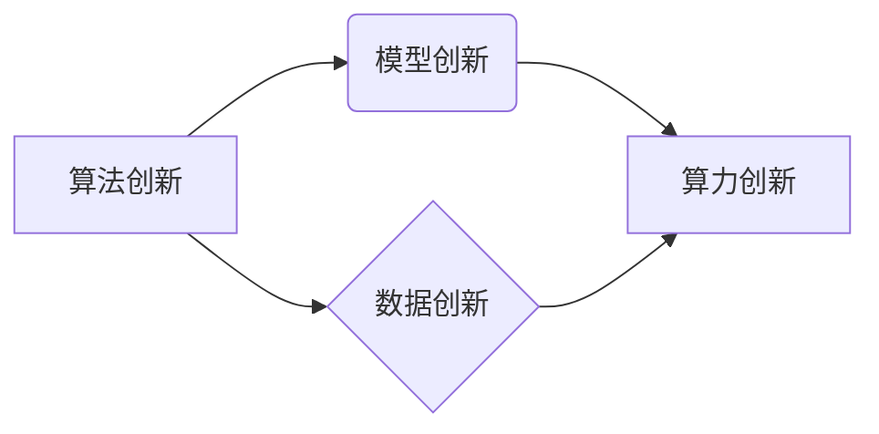

>  人工智能、底层创新、算法原理、数学模型、项目实践、实际应用场景、未来发展趋势

## 1. 背景介绍

人工智能（AI）作为科技发展的重要驱动力，近年来取得了显著进展，并在各个领域展现出巨大的应用潜力。从语音识别、图像识别到自然语言处理、机器学习等，AI技术已经深入到我们的日常生活，并不断改变着我们的世界。然而，当前AI发展面临着一些瓶颈，例如算法效率低下、数据依赖性强、可解释性差等。为了突破这些瓶颈，推动AI技术的持续发展，我们需要从底层创新入手，构建一个完整的AI底层创新体系。

## 2. 核心概念与联系

**2.1 AI底层创新体系**

AI底层创新体系是指从算法、模型、算力、数据等多个方面进行深入研究和突破，构建支撑AI技术发展和应用的完整基础设施。它涵盖了以下几个核心概念：

* **算法创新:** 研发更高效、更鲁棒、更具普适性的AI算法，例如深度学习、强化学习、迁移学习等。
* **模型创新:** 设计更灵活、更强大的AI模型，例如Transformer、Graph Neural Network等，能够更好地处理复杂数据和任务。
* **算力创新:** 开发更高效、更低功耗的AI算力平台，例如GPU、TPU、FPGA等，加速AI模型训练和推理。
* **数据创新:** 构建高质量、多样化的AI训练数据，并开发数据标注、数据清洗、数据增强等技术，提升数据质量和效率。

**2.2 核心概念联系**

AI底层创新体系各个核心概念相互关联，共同推动AI技术发展。算法创新为模型创新提供基础，模型创新则需要强大的算力和海量数据支持。数据创新则为算法和模型的训练提供燃料，算力创新则加速了整个AI发展进程。



## 3. 核心算法原理 & 具体操作步骤

**3.1 算法原理概述**

深度学习作为AI领域最热门的算法之一，其核心原理是利用多层神经网络模拟人类大脑的学习过程。通过不断调整神经网络的权重和偏置，深度学习模型能够从海量数据中学习到复杂的特征和模式，从而实现对各种任务的精准预测和处理。

**3.2 算法步骤详解**

深度学习算法的训练过程通常包括以下几个步骤：

1. **数据预处理:** 将原始数据进行清洗、转换、归一化等处理，使其能够被深度学习模型所接受。
2. **模型构建:** 根据具体任务需求，选择合适的深度学习模型架构，例如卷积神经网络（CNN）、循环神经网络（RNN）等。
3. **模型训练:** 使用训练数据对深度学习模型进行训练，通过反向传播算法不断调整模型参数，使其能够准确预测目标值。
4. **模型评估:** 使用测试数据对训练好的模型进行评估，并根据评估结果进行模型调优。
5. **模型部署:** 将训练好的模型部署到实际应用场景中，用于进行预测或处理任务。

**3.3 算法优缺点**

**优点:**

* 能够学习到复杂的特征和模式，实现高精度预测。
* 适用于各种类型的数据，例如图像、文本、音频等。
* 具有良好的泛化能力，能够应用于新的数据和任务。

**缺点:**

* 训练数据量要求高，需要大量的labeled数据。
* 训练时间长，计算资源消耗大。
* 模型解释性差，难以理解模型的决策过程。

**3.4 算法应用领域**

深度学习算法已广泛应用于各个领域，例如：

* **计算机视觉:** 图像识别、目标检测、图像分割等。
* **自然语言处理:** 文本分类、情感分析、机器翻译等。
* **语音识别:** 语音转文本、语音助手等。
* **医疗诊断:** 病理图像分析、疾病预测等。
* **金融风险控制:** 欺诈检测、信用评分等。

## 4. 数学模型和公式 & 详细讲解 & 举例说明

**4.1 数学模型构建**

深度学习模型本质上是一个复杂的数学模型，其核心是神经网络的结构和参数。神经网络由多个层组成，每一层包含多个神经元。每个神经元接收来自上一层的输入信号，并通过激活函数进行处理，输出到下一层。

**4.2 公式推导过程**

深度学习模型的训练过程基于梯度下降算法，其目标是找到最优的模型参数，使得模型的预测结果与真实值之间的误差最小化。梯度下降算法通过计算模型参数的梯度，并沿着梯度相反的方向更新参数，逐步逼近最优解。

**损失函数:** 用于衡量模型预测结果与真实值之间的误差。常见的损失函数包括均方误差（MSE）、交叉熵损失（Cross-Entropy Loss）等。

**梯度:** 损失函数对模型参数的偏导数，表示参数变化对损失函数的影响。

**更新规则:** 用于更新模型参数的公式，例如随机梯度下降（SGD）、动量梯度下降（Momentum）等。

**4.3 案例分析与讲解**

以图像分类任务为例，假设我们使用卷积神经网络（CNN）模型进行训练。模型的输入是图像数据，输出是图像类别标签。

损失函数可以选择交叉熵损失，用于衡量模型预测类别概率与真实类别标签之间的差异。梯度下降算法会计算损失函数对模型参数的梯度，并根据更新规则更新模型参数。

通过不断迭代训练，模型的参数会逐渐调整，使得模型能够准确预测图像类别。

## 5. 项目实践：代码实例和详细解释说明

**5.1 开发环境搭建**

深度学习项目开发通常需要使用Python语言和相关的深度学习框架，例如TensorFlow、PyTorch等。

**5.2 源代码详细实现**

以下是一个使用TensorFlow框架实现图像分类任务的简单代码示例：

```python
import tensorflow as tf

# 定义模型结构
model = tf.keras.models.Sequential([
    tf.keras.layers.Conv2D(32, (3, 3), activation='relu', input_shape=(28, 28, 1)),
    tf.keras.layers.MaxPooling2D((2, 2)),
    tf.keras.layers.Conv2D(64, (3, 3), activation='relu'),
    tf.keras.layers.MaxPooling2D((2, 2)),
    tf.keras.layers.Flatten(),
    tf.keras.layers.Dense(10, activation='softmax')
])

# 编译模型
model.compile(optimizer='adam',
              loss='sparse_categorical_crossentropy',
              metrics=['accuracy'])

# 训练模型
model.fit(x_train, y_train, epochs=5)

# 评估模型
loss, accuracy = model.evaluate(x_test, y_test)
print('Test loss:', loss)
print('Test accuracy:', accuracy)
```

**5.3 代码解读与分析**

这段代码定义了一个简单的卷积神经网络模型，用于图像分类任务。模型包含两层卷积层、两层最大池化层、一层全连接层和一层输出层。

模型使用Adam优化器、交叉熵损失函数和准确率作为评估指标。

训练过程使用训练数据进行迭代训练，并使用测试数据评估模型的性能。

**5.4 运行结果展示**

训练完成后，模型的准确率会随着训练轮数的增加而提高。最终的准确率取决于训练数据、模型结构和训练参数等因素。

## 6. 实际应用场景

深度学习算法已广泛应用于各个领域，例如：

**6.1 医疗诊断:**

* **病理图像分析:** 深度学习模型能够识别病理图像中的异常细胞，辅助医生进行诊断。
* **疾病预测:** 基于患者的医疗历史、基因信息等数据，深度学习模型可以预测患者患病风险。

**6.2 金融风险控制:**

* **欺诈检测:** 深度学习模型可以识别信用卡交易中的欺诈行为。
* **信用评分:** 基于用户的信用历史、收入等数据，深度学习模型可以评估用户的信用风险。

**6.3 自动驾驶:**

* **目标检测:** 深度学习模型可以识别道路上的车辆、行人、交通信号灯等目标。
* **路径规划:** 深度学习模型可以根据周围环境信息规划车辆行驶路径。

**6.4 其他应用场景:**

* **自然语言处理:** 文本分类、情感分析、机器翻译等。
* **语音识别:** 语音转文本、语音助手等。
* **图像生成:** 生成逼真的图像、视频等。

**6.5 未来应用展望**

随着深度学习算法的不断发展，其应用场景将更加广泛，例如：

* **个性化医疗:** 基于患者的基因信息、生活习惯等数据，提供个性化的医疗方案。
* **智能制造:** 利用深度学习算法实现智能生产线，提高生产效率和产品质量。
* **智慧城市:** 利用深度学习算法实现城市管理的智能化，例如交通管理、环境监测等。

## 7. 工具和资源推荐

**7.1 学习资源推荐**

* **书籍:**
    * 深度学习 (Deep Learning) - Ian Goodfellow, Yoshua Bengio, Aaron Courville
    * 深度学习实践 (Deep Learning with Python) - Francois Chollet
* **在线课程:**
    * TensorFlow 官方教程: https://www.tensorflow.org/tutorials
    * PyTorch 官方教程: https://pytorch.org/tutorials/
    * Coursera 深度学习课程: https://www.coursera.org/specializations/deep-learning

**7.2 开发工具推荐**

* **深度学习框架:** TensorFlow, PyTorch, Keras
* **编程语言:** Python
* **数据处理工具:** Pandas, NumPy

**7.3 相关论文推荐**

* **AlexNet:** ImageNet Classification with Deep Convolutional Neural Networks
* **VGGNet:** Very Deep Convolutional Networks for Large-Scale Image Recognition
* **ResNet:** Deep Residual Learning for Image Recognition

## 8. 总结：未来发展趋势与挑战

**8.1 研究成果总结**

近年来，AI底层创新取得了显著进展，算法、模型、算力和数据等各个方面都取得了突破。深度学习算法在图像识别、自然语言处理等领域取得了令人瞩目的成果，并开始应用于各个领域。

**8.2 未来发展趋势**

* **算法创新:** 研发更高效、更鲁棒、更具普适性的AI算法，例如联邦学习、自监督学习等。
* **模型创新:** 设计更灵活、更强大的AI模型，例如Transformer、Graph Neural Network等，能够更好地处理复杂数据和任务。
* **算力创新:** 开发更高效、更低功耗的AI算力平台，例如量子计算、神经形态计算等。
* **数据创新:** 构建高质量、多样化的AI训练数据，并开发数据标注、数据清洗、数据增强等技术，提升数据质量和效率。

**8.3 面临的挑战**

* **算法可解释性:** 深度学习模型的决策过程难以理解，缺乏可解释性，这限制了其在一些领域，例如医疗诊断、金融风险控制等领域的应用。
* **数据安全和隐私:** AI模型的训练需要大量数据，如何保证数据安全和隐私是重要的挑战。
* **伦理问题:** AI技术的快速发展引发了一些伦理问题，例如算法偏见、人工智能的责任等，需要引起重视和探讨。

**8.4 研究展望**

未来，AI底层创新将继续推动AI技术的进步，并应用于更多领域，为人类社会带来更多福祉。我们需要加强基础研究，突破关键技术瓶颈，并关注AI技术的伦理和社会影响，确保AI技术能够安全、可持续地发展。

## 9. 附录：常见问题与解答

**9.1 如何选择合适的深度学习框架？**

选择深度学习框架需要根据具体项目需求和个人经验进行选择。TensorFlow和PyTorch是目前最流行的深度学习框架，各有优缺点。