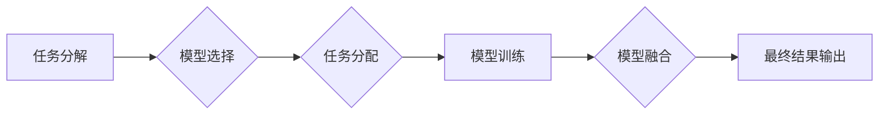

> AI模型、任务协作、任务分配、协同学习、联邦学习、资源优化、算法效率

## 1. 背景介绍

随着人工智能技术的飞速发展，AI模型在各个领域展现出强大的应用潜力。然而，单一模型往往难以应对复杂的任务，需要多个模型协同工作才能实现最佳效果。因此，AI模型的任务协作与分配成为一个重要的研究方向。

传统的AI模型训练通常是独立完成的，每个模型负责特定的任务。这种方式存在以下问题：

* **数据孤岛问题:** 不同模型的数据集可能存在差异，导致模型训练效果不佳。
* **资源浪费问题:** 每个模型都需要独立训练，浪费了计算资源和时间。
* **模型能力局限性:** 单一模型难以覆盖所有任务，导致整体性能受限。

为了解决这些问题，研究者们提出了多种AI模型任务协作与分配的方案，例如协同学习、联邦学习等。这些方案旨在通过模型之间的信息共享和资源协同，提高整体模型性能和效率。

## 2. 核心概念与联系

**2.1 任务协作**

任务协作是指多个AI模型共同完成一个复杂任务，每个模型负责特定的子任务，并通过信息交互和资源共享来实现最终目标。

**2.2 任务分配**

任务分配是指将一个复杂任务分解成多个子任务，并根据模型的特性和能力分配给不同的模型。

**2.3 协同学习**

协同学习是指多个模型共同学习，通过信息共享和模型融合来提高整体模型性能。

**2.4 联邦学习**

联邦学习是一种分布式机器学习方法，允许模型在不共享原始数据的情况下进行协同训练。

**2.5 资源优化**

资源优化是指在任务协作与分配过程中，合理分配计算资源、存储资源和网络资源，以提高整体效率。

**2.6 算法效率**

算法效率是指任务协作与分配算法的计算复杂度和时间复杂度，直接影响着模型训练速度和资源消耗。

**Mermaid 流程图**



## 3. 核心算法原理 & 具体操作步骤

### 3.1 算法原理概述

任务协作与分配算法的核心是将复杂任务分解成多个子任务，并根据模型的特性和能力进行合理分配。常用的算法包括：

* **贪婪算法:** 贪婪算法每次选择最优的分配方案，并逐步迭代，最终得到全局最优解。
* **遗传算法:** 遗传算法模拟自然选择机制，通过基因编码和交叉变异等操作，不断优化分配方案。
* **强化学习:** 强化学习算法通过奖励机制，训练模型学习最优的分配策略。

### 3.2 算法步骤详解

以贪婪算法为例，其具体操作步骤如下：

1. **任务分解:** 将复杂任务分解成多个子任务，并定义每个子任务的特征和需求。
2. **模型选择:** 根据子任务的特征，选择合适的模型进行分配。
3. **任务分配:** 贪婪算法会根据模型的性能和资源消耗，选择最优的分配方案，将子任务分配给相应的模型。
4. **模型训练:** 分配完成后，每个模型独立训练，并根据任务结果进行反馈。
5. **结果融合:** 训练完成后，将各个模型的输出结果进行融合，得到最终的预测结果。

### 3.3 算法优缺点

**优点:**

* 算法简单易实现。
* 能够找到局部最优解。

**缺点:**

* 容易陷入局部最优解，无法保证全局最优解。
* 对任务和模型的特征描述依赖性强。

### 3.4 算法应用领域

贪婪算法广泛应用于资源分配、任务调度、路径规划等领域。

## 4. 数学模型和公式 & 详细讲解 & 举例说明

### 4.1 数学模型构建

假设有N个任务，M个模型，每个模型的性能可以用一个指标来表示，例如准确率、召回率等。我们可以用一个矩阵来表示模型的性能，其中第i行第j列表示模型i对任务j的性能。

```
性能矩阵：
[P(1,1) P(1,2) ... P(1,N)]
[P(2,1) P(2,2) ... P(2,N)]
[... ... ... ...]
[P(M,1) P(M,2) ... P(M,N)]
```

### 4.2 公式推导过程

目标是找到一个任务分配方案，使得整体模型性能最大化。我们可以用以下公式来表示目标函数：

```
目标函数：∑_{i=1}^{M}∑_{j=1}^{N} P(i,j) * w(i,j)
```

其中：

* P(i,j) 表示模型i对任务j的性能。
* w(i,j) 表示任务j的权重。

### 4.3 案例分析与讲解

假设有3个任务，2个模型，性能矩阵如下：

```
性能矩阵：
[0.8 0.7 0.9]
[0.6 0.9 0.8]
```

任务权重分别为0.3, 0.4, 0.3。

我们可以使用目标函数计算不同任务分配方案的性能，并选择性能最高的方案。

## 5. 项目实践：代码实例和详细解释说明

### 5.1 开发环境搭建

* Python 3.7+
* TensorFlow 2.0+
* PyTorch 1.0+

### 5.2 源代码详细实现

```python
import numpy as np

# 性能矩阵
performance_matrix = np.array([[0.8, 0.7, 0.9],
                             [0.6, 0.9, 0.8]])

# 任务权重
task_weights = np.array([0.3, 0.4, 0.3])

# 任务分配方案
task_allocation = np.array([0, 1, 0])  # 模型0负责任务0和2，模型1负责任务1

# 计算目标函数
def calculate_performance(task_allocation):
    total_performance = 0
    for i in range(len(task_allocation)):
        model_index = task_allocation[i]
        task_index = i
        total_performance += performance_matrix[model_index, task_index] * task_weights[task_index]
    return total_performance

# 计算目标函数值
performance = calculate_performance(task_allocation)
print(f"目标函数值: {performance}")
```

### 5.3 代码解读与分析

* 代码首先定义了性能矩阵和任务权重。
* 然后定义了一个任务分配方案，指定每个任务由哪个模型负责。
* `calculate_performance()` 函数计算了目标函数值，即模型性能的总和。
* 最后打印了目标函数值。

### 5.4 运行结果展示

运行代码后，会输出目标函数值，表示当前任务分配方案的性能。

## 6. 实际应用场景

**6.1 图像识别**

多个模型可以协同完成图像识别任务，例如，一个模型负责图像分割，另一个模型负责目标检测，最终将结果融合得到完整的图像识别结果。

**6.2 自然语言处理**

多个模型可以协同完成自然语言处理任务，例如，一个模型负责文本分类，另一个模型负责情感分析，最终将结果融合得到更准确的文本理解结果。

**6.3 机器翻译**

多个模型可以协同完成机器翻译任务，例如，一个模型负责源语言到中间语言的翻译，另一个模型负责中间语言到目标语言的翻译，最终将结果融合得到更准确的机器翻译结果。

**6.4 未来应用展望**

随着人工智能技术的不断发展，AI模型的任务协作与分配将应用于更多领域，例如：

* **医疗诊断:** 多个模型协同完成病症诊断，提高诊断准确率。
* **金融风险评估:** 多个模型协同完成风险评估，降低金融风险。
* **智能交通:** 多个模型协同完成交通管理，提高交通效率。

## 7. 工具和资源推荐

### 7.1 学习资源推荐

* **书籍:**
    * 《深度学习》
    * 《机器学习》
    * 《人工智能：现代方法》
* **在线课程:**
    * Coursera
    * edX
    * Udacity

### 7.2 开发工具推荐

* **TensorFlow:** 开源深度学习框架
* **PyTorch:** 开源深度学习框架
* **Keras:** 高级深度学习API

### 7.3 相关论文推荐

* **Federated Learning: Strategies for Improving Communication Efficiency**
* **Multi-Task Learning: A Survey**
* **Cooperative Learning: A Survey**

## 8. 总结：未来发展趋势与挑战

### 8.1 研究成果总结

AI模型的任务协作与分配取得了显著进展，例如协同学习、联邦学习等方法取得了成功应用。

### 8.2 未来发展趋势

* **模型架构设计:** 研究更有效的模型架构，提高协同学习和任务分配的效率。
* **算法优化:** 研究更优的算法，提高任务分配的准确性和效率。
* **资源管理:** 研究更有效的资源管理策略，提高协同学习和任务分配的资源利用率。

### 8.3 面临的挑战

* **数据孤岛问题:** 如何解决不同模型之间数据共享的问题。
* **模型异构性问题:** 如何处理不同模型的异构性，实现有效的协同学习。
* **安全隐私问题:** 如何保证模型训练和任务分配过程中的数据安全和隐私。

### 8.4 研究展望

未来研究将继续探索AI模型任务协作与分配的更深层次问题，例如：

* **动态任务分配:** 如何根据任务变化动态调整任务分配方案。
* **自适应协同学习:** 如何让模型能够自适应地调整协同学习策略。
* **可解释性:** 如何提高AI模型任务协作与分配过程的可解释性。

## 9. 附录：常见问题与解答

**Q1: 协同学习和联邦学习有什么区别？**

**A1:** 协同学习是指多个模型共同学习，通过信息共享和模型融合来提高整体模型性能。联邦学习是一种分布式机器学习方法，允许模型在不共享原始数据的情况下进行协同训练。

**Q2: 如何选择合适的任务分配算法？**

**A2:** 选择合适的任务分配算法需要根据具体任务的特点和模型的特性进行选择。例如，对于简单任务，贪婪算法可能足够有效；对于复杂任务，遗传算法或强化学习算法可能更合适。

**Q3: 如何解决模型异构性问题？**

**A3:** 针对模型异构性问题，可以采用以下方法：

* **模型转换:** 将不同模型转换为统一的格式。
* **模型融合:** 将不同模型的输出结果融合在一起。
* **多模态学习:** 结合不同类型的模型，例如文本模型和图像模型。


作者：禅与计算机程序设计艺术 / Zen and the Art of Computer Programming 
<end_of_turn>