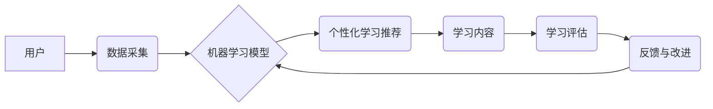

> 人工智能，员工培训，发展系统，个性化学习，机器学习，深度学习，自然语言处理，推荐系统

## 1. 背景介绍

在当今瞬息万变的数字化时代，企业面临着不断变化的市场需求和技术革新带来的挑战。员工的技能和知识水平直接影响着企业的竞争力。传统的员工培训模式往往缺乏针对性和灵活性，难以满足员工个性化的学习需求。

人工智能（AI）技术的快速发展为员工培训与发展带来了新的机遇。AI驱动的员工培训与发展系统能够利用机器学习、深度学习、自然语言处理等技术，实现个性化学习、智能推荐、实时反馈等功能，从而提升培训效率和效果。

## 2. 核心概念与联系

**2.1 核心概念**

* **人工智能（AI）：** 人工智能是指模拟人类智能行为的计算机系统。在员工培训领域，AI可以用于个性化学习路径推荐、智能问答、自动评估等。
* **机器学习（ML）：** 机器学习是人工智能的一个子领域，它通过算法从数据中学习，不断改进预测或决策能力。在员工培训中，机器学习可以用于分析员工学习行为、预测学习效果、个性化推荐学习内容。
* **深度学习（DL）：** 深度学习是机器学习的一个子领域，它使用多层神经网络来模拟人类大脑的学习过程。深度学习可以用于自然语言处理、图像识别等任务，在员工培训中可以用于智能问答、学习内容理解等。
* **自然语言处理（NLP）：** 自然语言处理是指计算机理解和处理人类语言的技术。在员工培训中，NLP可以用于智能问答、文本摘要、个性化学习内容生成等。
* **推荐系统：** 推荐系统是指根据用户的历史行为和偏好，推荐相关内容或服务。在员工培训中，推荐系统可以根据员工的学习目标、技能水平、学习偏好等信息，推荐个性化的学习内容。

**2.2 架构图**



## 3. 核心算法原理 & 具体操作步骤

**3.1 算法原理概述**

AI驱动的员工培训与发展系统通常采用以下核心算法：

* **协同过滤算法：** 基于用户的相似性或物品的相似性进行推荐。
* **内容过滤算法：** 基于学习内容的特征和用户的兴趣进行推荐。
* **混合推荐算法：** 结合协同过滤算法和内容过滤算法进行推荐。
* **深度学习算法：** 使用深度神经网络进行学习和预测，例如用于个性化学习路径推荐、智能问答等。

**3.2 算法步骤详解**

1. **数据采集：** 收集员工的学习行为数据、技能水平数据、学习偏好数据等。
2. **数据预处理：** 对收集到的数据进行清洗、转换、特征提取等处理。
3. **模型训练：** 使用机器学习算法对预处理后的数据进行训练，构建推荐模型。
4. **个性化推荐：** 根据员工的个人信息和学习行为，使用训练好的模型进行个性化学习内容推荐。
5. **学习评估：** 对员工的学习效果进行评估，例如通过测试、问卷调查等方式。
6. **反馈与改进：** 根据学习评估结果，对推荐模型进行调整和优化。

**3.3 算法优缺点**

* **优点：**
    * 个性化学习：根据员工的个人需求和学习风格提供个性化的学习内容。
    * 智能推荐：利用机器学习算法推荐最合适的学习资源。
    * 提升效率：自动化学习过程，提高培训效率。
    * 数据驱动：通过数据分析，了解员工的学习情况和需求。
* **缺点：**
    * 数据依赖：需要大量的数据进行模型训练。
    * 算法复杂：机器学习算法的训练和调优需要专业知识。
    * 伦理问题：需要考虑数据隐私和算法公平性等伦理问题。

**3.4 算法应用领域**

* **个性化学习路径推荐**
* **智能问答系统**
* **学习内容生成**
* **学习效果评估**
* **员工技能发展规划**

## 4. 数学模型和公式 & 详细讲解 & 举例说明

**4.1 数学模型构建**

在推荐系统中，常用的数学模型包括协同过滤模型和内容过滤模型。

* **协同过滤模型：** 基于用户的相似性或物品的相似性进行推荐。例如，用户A和用户B都喜欢学习编程，那么系统会推荐用户A喜欢的编程课程给用户B。
* **内容过滤模型：** 基于学习内容的特征和用户的兴趣进行推荐。例如，如果用户A对机器学习感兴趣，那么系统会推荐与机器学习相关的学习内容给用户A。

**4.2 公式推导过程**

协同过滤模型中常用的算法是基于矩阵分解的算法，例如奇异值分解（SVD）。SVD可以将用户-物品交互矩阵分解成三个矩阵，从而得到每个用户的隐向量和每个物品的隐向量。

**4.3 案例分析与讲解**

假设有一个用户-物品交互矩阵，其中用户和物品分别用数字表示。

```
用户 | 物品1 | 物品2 | 物品3
------- | -------- | -------- | --------
用户1 | 5 | 3 | 2
用户2 | 4 | 2 | 5
用户3 | 3 | 5 | 4
```

使用SVD算法对该矩阵进行分解，可以得到每个用户的隐向量和每个物品的隐向量。然后，可以根据用户的隐向量和物品的隐向量计算出用户对每个物品的预测评分。

## 5. 项目实践：代码实例和详细解释说明

**5.1 开发环境搭建**

* Python 3.x
* TensorFlow 或 PyTorch
* Jupyter Notebook

**5.2 源代码详细实现**

```python
# 导入必要的库
import tensorflow as tf

# 定义模型
model = tf.keras.Sequential([
    tf.keras.layers.Dense(64, activation='relu'),
    tf.keras.layers.Dense(32, activation='relu'),
    tf.keras.layers.Dense(1)
])

# 编译模型
model.compile(optimizer='adam', loss='mse')

# 训练模型
model.fit(X_train, y_train, epochs=10)

# 预测
predictions = model.predict(X_test)
```

**5.3 代码解读与分析**

* 该代码示例展示了使用TensorFlow构建一个简单的推荐系统模型。
* 模型使用多层感知机（MLP）结构，包含三个全连接层和ReLU激活函数。
* 模型使用均方误差（MSE）作为损失函数，Adam优化器进行训练。
* 训练过程使用训练数据（X_train, y_train）进行迭代，最终得到一个能够预测用户对物品评分的模型。

**5.4 运行结果展示**

训练完成后，可以使用测试数据（X_test）对模型进行评估，并观察模型的预测结果。

## 6. 实际应用场景

**6.1 企业培训平台**

* 个性化学习路径推荐：根据员工的技能水平、学习目标和学习偏好，推荐个性化的学习路径。
* 智能问答系统：提供智能问答功能，帮助员工解决学习过程中遇到的问题。
* 学习内容生成：根据员工的学习需求，自动生成个性化的学习内容。

**6.2 教育机构**

* 个性化学习辅导：根据学生的学习情况，提供个性化的学习辅导。
* 智能考试系统：自动批改试卷，提供个性化的学习建议。
* 在线学习平台：提供个性化的在线学习体验。

**6.3 个人学习**

* 个性化学习推荐：根据用户的学习兴趣和目标，推荐相关的学习资源。
* 学习进度跟踪：跟踪用户的学习进度，提供学习建议。
* 学习社区：提供学习社区，方便用户交流学习经验。

**6.4 未来应用展望**

* **更智能的推荐系统：** 利用更先进的机器学习算法，提供更精准的学习推荐。
* **更沉浸式的学习体验：** 利用虚拟现实（VR）和增强现实（AR）技术，提供更沉浸式的学习体验。
* **更个性化的学习内容：** 利用自然语言生成（NLG）技术，生成更个性化的学习内容。

## 7. 工具和资源推荐

**7.1 学习资源推荐**

* **书籍：**
    * 《深度学习》
    * 《机器学习实战》
    * 《推荐系统实践》
* **在线课程：**
    * Coursera
    * edX
    * Udacity

**7.2 开发工具推荐**

* **Python：** 广泛用于机器学习和深度学习开发。
* **TensorFlow：** 开源深度学习框架。
* **PyTorch：** 开源深度学习框架。
* **Scikit-learn：** 机器学习库。

**7.3 相关论文推荐**

* **协同过滤算法：**
    * "Collaborative Filtering: A User-Based Approach"
    * "Memory-Based Collaborative Filtering"
* **内容过滤算法：**
    * "Content-Based Recommendation Systems"
    * "A Hybrid Approach to Content-Based and Collaborative Filtering"
* **深度学习推荐系统：**
    * "Deep Learning for Recommender Systems"
    * "Neural Collaborative Filtering"

## 8. 总结：未来发展趋势与挑战

**8.1 研究成果总结**

AI驱动的员工培训与发展系统已经取得了显著的成果，能够有效提升培训效率和效果。

**8.2 未来发展趋势**

* **更智能的推荐系统：** 利用更先进的机器学习算法，提供更精准的学习推荐。
* **更沉浸式的学习体验：** 利用虚拟现实（VR）和增强现实（AR）技术，提供更沉浸式的学习体验。
* **更个性化的学习内容：** 利用自然语言生成（NLG）技术，生成更个性化的学习内容。

**8.3 面临的挑战**

* **数据隐私和安全：** 需要确保员工数据的隐私和安全。
* **算法公平性：** 需要确保算法公平公正，避免歧视。
* **技术可解释性：** 需要提高算法的可解释性，让用户理解算法的决策过程。

**8.4 研究展望**

未来，AI驱动的员工培训与发展系统将朝着更智能、更个性化、更沉浸式的方向发展。


## 9. 附录：常见问题与解答

**9.1 如何保证数据隐私和安全？**

* 使用加密技术保护员工数据。
* 遵循数据隐私法规，例如GDPR。
* 明确员工数据的使用目的和范围。

**9.2 如何避免算法歧视？**

* 使用公平的算法和数据。
* 定期评估算法的公平性。
* 寻求专家意见，确保算法的公平性。

**9.3 如何提高算法的可解释性？**

* 使用可解释的机器学习算法。
* 提供算法决策的解释性报告。
* 与用户进行交互，解释算法的决策过程。


作者：禅与计算机程序设计艺术 / Zen and the Art of Computer Programming 
<end_of_turn>