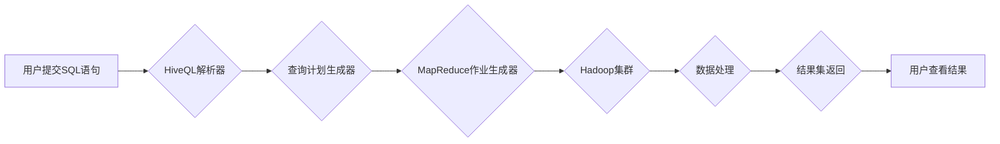

> Hive, Hadoop, 数据仓库, SQL, MapReduce, 数据处理, ETL

## 1. 背景介绍

在海量数据时代，高效地存储、管理和分析数据成为企业发展的关键。Hive作为一款开源的基于Hadoop的数据仓库系统，凭借其SQL-like查询语言和分布式处理能力，在数据分析领域获得了广泛应用。本文将深入探讨Hive的原理、核心算法、代码实例以及实际应用场景，帮助读者全面理解Hive的工作机制并掌握其应用技巧。

## 2. 核心概念与联系

Hive是一个基于Hadoop的数据仓库系统，它将SQL语言与Hadoop的分布式处理能力相结合，使得用户能够使用熟悉的SQL语句进行大规模数据的查询和分析。Hive的核心概念包括：

* **元数据存储:** Hive使用元数据存储系统（例如Apache Derby或MySQL）来存储表结构、数据类型、分区信息等元数据。
* **查询计划生成:** Hive将SQL语句转换为MapReduce作业，并生成执行计划，指导数据处理过程。
* **数据存储:** Hive支持多种数据存储格式，例如ORC、Parquet和TextFile，并根据数据特性选择最优的存储格式。
* **数据处理:** Hive利用Hadoop的分布式处理能力，将数据切分并并行处理，提高数据处理效率。

**Hive架构流程图:**



## 3. 核心算法原理 & 具体操作步骤

### 3.1  算法原理概述

Hive的核心算法是基于MapReduce的分布式数据处理框架。MapReduce将数据处理任务分解成多个独立的Map和Reduce任务，并将其分配到不同的节点上并行执行。

* **Map阶段:** 将输入数据切分成多个块，每个块由一个Map任务处理，每个Map任务对数据进行局部处理，并将处理结果输出到中间存储系统。
* **Reduce阶段:** 将Map阶段产生的中间结果聚合，每个Reduce任务负责处理特定数据范围，并最终输出最终结果。

### 3.2  算法步骤详解

1. **数据切分:** Hive将输入数据根据表分区、数据类型等信息进行切分，并将每个数据块分配给不同的Map任务。
2. **Map任务执行:** 每个Map任务对数据块进行局部处理，例如过滤、聚合、转换等操作，并将处理结果输出到中间存储系统。
3. **数据聚合:** Reduce任务从中间存储系统读取Map任务产生的数据，并根据键值对进行聚合，例如求和、计数、分组等操作。
4. **结果输出:** Reduce任务将最终结果输出到指定存储位置，例如HDFS或数据库。

### 3.3  算法优缺点

**优点:**

* **分布式处理:** 利用Hadoop的分布式处理能力，可以高效处理海量数据。
* **易于使用:** 使用SQL-like查询语言，方便用户进行数据查询和分析。
* **可扩展性强:** 可以根据需要增加节点数量，扩展处理能力。

**缺点:**

* **性能瓶颈:** MapReduce框架本身存在性能瓶颈，对于实时数据处理效率较低。
* **数据一致性:** 数据处理过程中存在数据一致性问题，需要采取措施保证数据完整性。

### 3.4  算法应用领域

Hive的MapReduce算法广泛应用于以下领域:

* **数据仓库:** 建立企业级数据仓库，进行数据整合、分析和报表生成。
* **数据挖掘:** 对海量数据进行挖掘，发现数据中的隐藏模式和规律。
* **机器学习:** 为机器学习模型提供数据支持，进行模型训练和评估。

## 4. 数学模型和公式 & 详细讲解 & 举例说明

### 4.1  数学模型构建

Hive的查询优化器使用基于成本的优化算法，其核心是构建一个查询执行计划的成本模型。该模型考虑了以下因素:

* **数据规模:** 数据量越大，处理成本越高。
* **数据分布:** 数据分布均匀，处理效率更高。
* **操作类型:** 不同的操作类型，例如过滤、聚合、排序等，其处理成本不同。
* **硬件资源:** 处理器、内存等硬件资源的配置也会影响处理成本。

### 4.2  公式推导过程

Hive的查询优化器使用以下公式来计算查询执行计划的成本:

```latex
Cost(Plan) = \sum_{i=1}^{n} Cost(Operator_i)
```

其中:

* `Cost(Plan)` 表示查询执行计划的总成本。
* `n` 表示查询计划中操作符的数量。
* `Cost(Operator_i)` 表示第 `i` 个操作符的成本。

每个操作符的成本计算公式根据其具体类型而不同。例如，过滤操作符的成本计算公式如下:

```latex
Cost(Filter) = DataSize * FilterRate
```

其中:

* `DataSize` 表示过滤操作符处理的数据量。
* `FilterRate` 表示过滤操作符的过滤率。

### 4.3  案例分析与讲解

假设有一个表 `users`，包含 100 万条数据，其中 10% 的数据满足特定条件。如果需要过滤满足特定条件的用户数据，则可以使用 `Filter` 操作符。

根据上述公式，过滤操作符的成本计算如下:

```
Cost(Filter) = 1000000 * 0.1 = 100000
```

这意味着过滤操作符需要处理 100,000 条数据，其成本为 100,000。

## 5. 项目实践：代码实例和详细解释说明

### 5.1  开发环境搭建

Hive开发环境搭建需要以下软件:

* **Hadoop:** Hive依赖Hadoop进行数据存储和处理。
* **Hive:** Hive本身是一个开源软件，可以从官网下载安装。
* **JDBC驱动:** 用于连接数据库，例如MySQL或PostgreSQL。

### 5.2  源代码详细实现

以下是一个简单的Hive查询示例，用于查询用户表中所有年龄大于 18 的用户:

```sql
SELECT * FROM users WHERE age > 18;
```

### 5.3  代码解读与分析

该查询语句使用 `SELECT` 语句选择所有列，使用 `FROM` 语句指定表名，使用 `WHERE` 语句过滤年龄大于 18 的用户。

### 5.4  运行结果展示

运行该查询语句后，Hive会将结果集返回，包含所有年龄大于 18 的用户数据。

## 6. 实际应用场景

Hive在以下实际应用场景中发挥着重要作用:

* **电商平台:** 分析用户行为、商品销售数据，进行精准营销和商品推荐。
* **金融机构:** 分析交易数据、客户画像，进行风险控制和精准投资。
* **医疗机构:** 分析患者数据、疾病流行趋势，进行疾病预防和医疗决策支持。

### 6.4  未来应用展望

随着大数据技术的不断发展，Hive的应用场景将更加广泛，例如:

* **实时数据分析:** Hive将与实时数据处理系统结合，实现对实时数据的分析和监控。
* **机器学习:** Hive将与机器学习平台结合，提供数据支持和模型训练环境。
* **云计算:** Hive将与云计算平台结合，提供弹性、可扩展的数据处理服务。

## 7. 工具和资源推荐

### 7.1  学习资源推荐

* **Hive官方文档:** https://hive.apache.org/docs/
* **Hive教程:** https://www.tutorialspoint.com/hive/index.htm
* **Hive社区论坛:** https://community.hortonworks.com/

### 7.2  开发工具推荐

* **Hive CLI:** Hive命令行工具，用于提交Hive查询语句。
* **Hive Web UI:** Hive网页界面，提供图形化的查询和管理功能。
* **IDE:** Eclipse、IntelliJ IDEA等IDE支持Hive开发。

### 7.3  相关论文推荐

* **Hive: A Data Warehouse System on Top of Hadoop:** https://www.usenix.org/system/files/conference/osdi09/osdi09-paper-deppeler.pdf

## 8. 总结：未来发展趋势与挑战

### 8.1  研究成果总结

Hive作为一款开源的数据仓库系统，在数据分析领域取得了显著的成果，为企业提供了高效、灵活的数据处理解决方案。

### 8.2  未来发展趋势

Hive将继续朝着以下方向发展:

* **实时数据处理:** 支持实时数据处理，满足对实时分析的需求。
* **机器学习集成:** 与机器学习平台深度集成，提供端到端的机器学习解决方案。
* **云原生化:** 拥抱云计算技术，提供弹性、可扩展的数据处理服务。

### 8.3  面临的挑战

Hive也面临着一些挑战:

* **性能优化:** 提升Hive的性能，特别是对于实时数据处理的需求。
* **数据一致性:** 保证数据处理过程中的数据一致性，避免数据丢失或错误。
* **生态系统建设:** 完善Hive的生态系统，提供更多工具和资源支持。

### 8.4  研究展望

未来，Hive的研究方向将集中在以下几个方面:

* **优化查询执行计划:** 开发更智能的查询优化器，提高查询效率。
* **支持新数据格式:** 支持新的数据格式，例如JSON、XML等，满足多样化的数据需求。
* **增强安全性:** 加强Hive的安全机制，保护数据安全。

## 9. 附录：常见问题与解答

### 9.1  常见问题

* **Hive查询语句语法错误怎么办?**

可以使用Hive CLI或Hive Web UI查看错误信息，并根据错误信息进行修改。

* **Hive查询执行时间过长怎么办?**

可以尝试优化查询语句，例如添加索引、使用更合适的聚合函数等。

* **Hive数据存储格式选择有什么建议?**

根据数据特性选择最优的存储格式，例如ORC格式适合大数据量、高压缩率的数据，Parquet格式适合数据更新频繁的数据。

### 9.2  解答

* **Hive查询语句语法错误怎么办?**

可以使用Hive CLI或Hive Web UI查看错误信息，并根据错误信息进行修改。

* **Hive查询执行时间过长怎么办?**

可以尝试优化查询语句，例如添加索引、使用更合适的聚合函数等。

* **Hive数据存储格式选择有什么建议?**

根据数据特性选择最优的存储格式，例如ORC格式适合大数据量、高压缩率的数据，Parquet格式适合数据更新频繁的数据。


作者：禅与计算机程序设计艺术 / Zen and the Art of Computer Programming 
<end_of_turn>