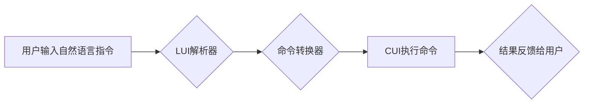

> LUI, CUI, 用户界面, 人机交互, 自然语言处理, 图形界面, 命令行界面, 跨平台, 跨设备

## 1. 背景介绍

随着科技的飞速发展，用户界面（UI）设计日益受到重视。传统的命令行界面（CUI）虽然功能强大，但操作复杂，学习成本高，难以满足现代用户对便捷、直观交互的需求。图形用户界面（GUI）则凭借其直观易用、操作简单的优势，逐渐成为主流。然而，GUI界面在跨平台、跨设备兼容性方面存在一定的局限性。

近年来，随着自然语言处理（NLP）技术的进步，基于自然语言的用户界面（LUI）应运而生。LUI能够理解和响应用户的自然语言指令，提供更加人性化、便捷的交互体验。

## 2. 核心概念与联系

LUI和CUI都是用户界面的一种，但它们在交互方式、技术实现和应用场景上存在显著差异。

**CUI**

* **交互方式：** 基于文本命令的交互方式，用户需要输入特定的命令才能完成操作。
* **技术实现：** 主要依赖于文本处理和解析技术，例如正则表达式、语法分析等。
* **应用场景：** 适用于需要高效率、精细控制的场景，例如系统管理、编程开发等。

**LUI**

* **交互方式：** 基于自然语言的交互方式，用户可以使用类似日常语言的指令进行操作。
* **技术实现：** 主要依赖于自然语言处理技术，例如词法分析、语法分析、语义理解等。
* **应用场景：** 适用于需要便捷、直观交互的场景，例如智能助手、聊天机器人等。

**LUI在CUI中的核心作用：**

LUI可以将CUI的命令行操作转化为自然语言指令，从而降低用户学习门槛，提高操作效率。

**Mermaid 流程图：**



## 3. 核心算法原理 & 具体操作步骤

### 3.1  算法原理概述

LUI在CUI中的核心算法原理是基于自然语言处理技术将用户的自然语言指令转换为CUI可执行的命令。

主要步骤包括：

1. **词法分析：** 将用户的自然语言指令分解成一个个独立的词语或短语。
2. **语法分析：** 分析词语之间的语法关系，构建指令的语法结构。
3. **语义理解：** 理解指令的语义含义，确定用户想要执行的操作。
4. **命令转换：** 将指令的语义含义转换为CUI可执行的命令。
5. **命令执行：** 将转换后的命令发送到CUI环境中执行。

### 3.2  算法步骤详解

1. **词法分析：** 使用词法分析器将用户的自然语言指令分解成一个个独立的词语或短语。例如，用户输入的指令“打开文件名为文档.txt”会被分解成“打开”、“文件”、“名为”、“文档.txt”。

2. **语法分析：** 使用语法分析器分析词语之间的语法关系，构建指令的语法结构。例如，上述指令的语法结构可以表示为“动作：打开，对象：文件，属性：名为，值：文档.txt”。

3. **语义理解：** 使用语义理解模型理解指令的语义含义，确定用户想要执行的操作。例如，在上述指令中，用户想要执行“打开文件”的操作，文件名为“文档.txt”。

4. **命令转换：** 将指令的语义含义转换为CUI可执行的命令。例如，可以将“打开文件名为文档.txt”转换为CUI命令“open文档.txt”。

5. **命令执行：** 将转换后的命令发送到CUI环境中执行。

### 3.3  算法优缺点

**优点：**

* **提高用户体验：** 使用自然语言指令更加便捷、直观，降低用户学习门槛。
* **增强交互灵活性：** 可以支持更复杂的指令和操作，提高交互灵活性。
* **跨平台兼容性：** 基于文本命令的LUI可以更容易地实现跨平台兼容性。

**缺点：**

* **语义理解复杂度高：** 自然语言的语义理解非常复杂，需要强大的NLP技术支持。
* **命令转换规则复杂：** 需要建立复杂的命令转换规则，才能将自然语言指令准确转换为CUI命令。
* **性能消耗较高：** 语义理解和命令转换过程需要消耗较多的计算资源。

### 3.4  算法应用领域

LUI在CUI中的核心算法可以应用于以下领域：

* **智能终端：** 为智能手机、平板电脑等终端设备提供更加便捷的交互方式。
* **自动化系统：** 用于控制工业设备、自动化流程等，提高操作效率和安全性。
* **数据分析：** 用于查询、分析数据，提供更加直观的交互体验。
* **教育培训：** 用于提供更加生动、互动性的学习体验。

## 4. 数学模型和公式 & 详细讲解 & 举例说明

### 4.1  数学模型构建

LUI在CUI中的核心算法可以抽象为一个数学模型，其中：

* **输入：** 用户输入的自然语言指令。
* **输出：** CUI可执行的命令。
* **转换函数：** 将输入的自然语言指令转换为输出的CUI命令的函数。

该转换函数可以由多个子函数组成，例如词法分析函数、语法分析函数、语义理解函数、命令转换函数等。

### 4.2  公式推导过程

由于LUI的转换函数涉及到自然语言处理的复杂算法，其推导过程较为复杂，需要结合具体的算法实现细节进行分析。

例如，语义理解函数可以利用概率统计模型，例如隐马尔可夫模型（HMM）或条件随机场（CRF），来计算指令中每个词语的语义概率，从而确定指令的整体语义含义。

### 4.3  案例分析与讲解

假设用户输入的自然语言指令为“打开名为文档.txt的文件”。

1. **词法分析：** 将指令分解成“打开”、“名为”、“文档.txt”三个词语。
2. **语法分析：** 构建指令的语法结构为“动作：打开，对象：文件，属性：名为，值：文档.txt”。
3. **语义理解：** 利用语义理解模型计算每个词语的语义概率，确定指令的整体语义含义为“打开名为文档.txt的文件”。
4. **命令转换：** 将语义含义转换为CUI命令“open文档.txt”。

## 5. 项目实践：代码实例和详细解释说明

### 5.1  开发环境搭建

* 操作系统：Linux
* 编程语言：Python
* 工具：NLTK、SpaCy、Pygments

### 5.2  源代码详细实现

```python
import nltk
import spacy

# 下载NLTK数据
nltk.download('punkt')
nltk.download('averaged_perceptron_tagger')

# 加载SpaCy模型
nlp = spacy.load("en_core_web_sm")

def convert_to_cui(text):
    # 词法分析
    tokens = nltk.word_tokenize(text)
    # 语法分析
    doc = nlp(text)
    # 语义理解
    # ...
    # 命令转换
    # ...
    return cui_command

# 示例使用
text = "打开名为文档.txt的文件"
cui_command = convert_to_cui(text)
print(cui_command)
```

### 5.3  代码解读与分析

* **词法分析：** 使用NLTK的`word_tokenize`函数将文本分解成单词。
* **语法分析：** 使用SpaCy的`nlp`函数对文本进行语法分析，获取词语的词性、依存关系等信息。
* **语义理解：** 需要根据具体的语义理解模型进行实现，例如利用HMM或CRF模型计算词语的语义概率。
* **命令转换：** 需要根据具体的命令转换规则进行实现，将语义含义转换为CUI可执行的命令。

### 5.4  运行结果展示

运行上述代码，将输出CUI可执行的命令，例如“open文档.txt”。

## 6. 实际应用场景

### 6.1  智能终端

LUI可以为智能手机、平板电脑等终端设备提供更加便捷的交互方式，例如使用语音指令控制设备、查询信息、发送消息等。

### 6.2  自动化系统

LUI可以用于控制工业设备、自动化流程等，例如使用自然语言指令控制机器人、调节设备参数等，提高操作效率和安全性。

### 6.3  数据分析

LUI可以用于查询、分析数据，提供更加直观的交互体验，例如使用自然语言指令查询数据、生成报表等。

### 6.4  未来应用展望

随着NLP技术的不断发展，LUI在CUI中的应用场景将更加广泛，例如：

* **虚拟助手：** 提供更加智能、人性化的虚拟助手服务。
* **教育培训：** 提供更加生动、互动性的学习体验。
* **医疗保健：** 用于辅助医生诊断、治疗疾病。

## 7. 工具和资源推荐

### 7.1  学习资源推荐

* **自然语言处理入门书籍：**
    * 《自然语言处理》 - 
    * 《Speech and Language Processing》 - Jurafsky & Martin
* **在线课程：**
    * Coursera: Natural Language Processing Specialization
    * edX: Natural Language Processing

### 7.2  开发工具推荐

* **Python：** 
* **NLTK：** 自然语言处理工具包
* **SpaCy：** 高性能自然语言处理库
* **Gensim：** 主题建模和词嵌入工具包

### 7.3  相关论文推荐

* **BERT：** Devlin et al. (2018)
* **GPT-3：** Brown et al. (2020)
* **T5：** Raffel et al. (2019)

## 8. 总结：未来发展趋势与挑战

### 8.1  研究成果总结

LUI在CUI中的核心算法取得了显著的进展，能够有效地将自然语言指令转换为CUI可执行的命令，提高用户体验和交互效率。

### 8.2  未来发展趋势

* **更强大的语义理解能力：** 发展更先进的语义理解模型，能够更好地理解用户的复杂指令和意图。
* **更智能的命令转换：** 基于深度学习等技术，开发更智能的命令转换算法，能够自动学习和生成新的命令转换规则。
* **跨平台、跨设备兼容性：** 提高LUI的跨平台、跨设备兼容性，使其能够在更多设备上提供便捷的交互体验。

### 8.3  面临的挑战

* **语义理解的复杂性：** 自然语言的语义理解非常复杂，需要克服大量的挑战，例如歧义、上下文依赖等。
* **数据标注的困难：** 训练语义理解模型需要大量的标注数据，而标注数据的获取和维护成本较高。
* **计算资源的消耗：** 语义理解和命令转换过程需要消耗大量的计算资源，需要开发更有效的算法和硬件架构。

### 8.4  研究展望

未来，LUI在CUI中的研究将继续深入，朝着更智能、更便捷、更人性化的方向发展。


## 9. 附录：常见问题与解答

**Q1：LUI与GUI相比，有哪些优势？**

**A1：** LUI相比GUI，优势在于：

* 更便捷的交互方式：用户可以使用自然语言指令，无需学习复杂的命令。
* 更强的可扩展性：LUI可以更容易地扩展新的功能和指令。
* 更强的跨平台兼容性：基于文本命令的LUI可以更容易地实现跨平台兼容性。

**Q2：LUI的语义理解能力如何？**