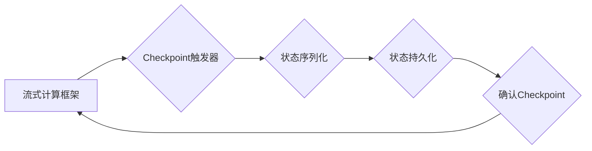

> Samza, Checkpoint, 流式计算, 数据一致性, Fault Tolerance, 容错, 分布式系统, 编程实践

## 1. 背景介绍

在现代数据处理领域，流式计算逐渐成为处理实时数据的重要方式。Samza作为一款开源的流式计算框架，以其高性能、高可用性和容错能力而备受关注。在流式计算系统中，数据流的连续性与可靠性至关重要。当系统发生故障时，需要能够恢复到故障前的状态，保证数据的一致性和完整性。Checkpoint机制正是为了解决这一问题而诞生的。

Checkpoint机制允许流式计算框架定期将计算状态持久化到外部存储系统中。当系统发生故障时，可以从最近的Checkpoint点恢复计算状态，从而减少数据丢失和计算重演。

## 2. 核心概念与联系

### 2.1  Checkpoint的概念

Checkpoint是指流式计算框架在特定时间点将计算状态持久化到外部存储系统中的过程。

### 2.2  Checkpoint的类型

* **Full Checkpoint:** 将整个计算状态持久化到外部存储系统中。
* **Incremental Checkpoint:** 只持久化自上次Checkpoint以来产生的数据变化。

### 2.3  Checkpoint的流程

1. **触发Checkpoint:** 根据预设的周期或事件触发Checkpoint操作。
2. **状态序列化:** 将计算状态序列化成可持久化的格式。
3. **状态持久化:** 将序列化后的状态数据写入外部存储系统。
4. **确认Checkpoint:** 确认Checkpoint操作成功完成。

### 2.4  Checkpoint的架构



## 3. 核心算法原理 & 具体操作步骤

### 3.1  算法原理概述

Samza的Checkpoint机制基于以下核心算法原理：

* **状态管理:** 使用状态机模型管理计算状态，并将其划分为多个独立的组件。
* **数据一致性:** 确保Checkpoint操作期间数据的一致性，避免数据丢失或冲突。
* **容错机制:** 在系统发生故障时，能够从最近的Checkpoint点恢复计算状态。

### 3.2  算法步骤详解

1. **状态序列化:** 将每个状态组件序列化成可持久化的格式，例如二进制或JSON。
2. **状态持久化:** 将序列化后的状态数据写入外部存储系统，例如HDFS或S3。
3. **Checkpoint确认:** 等待所有状态组件的持久化操作成功完成，并确认Checkpoint操作成功。
4. **故障恢复:** 当系统发生故障时，从最近的Checkpoint点恢复计算状态。

### 3.3  算法优缺点

**优点:**

* **数据一致性:** 确保Checkpoint操作期间数据的一致性。
* **容错能力:** 能够从最近的Checkpoint点恢复计算状态，减少数据丢失和计算重演。
* **可扩展性:** 可以根据需要调整Checkpoint的频率和粒度。

**缺点:**

* **性能开销:** Checkpoint操作会带来一定的性能开销，需要权衡性能和容错能力。
* **存储成本:** Checkpoint数据需要存储在外部存储系统中，会增加存储成本。

### 3.4  算法应用领域

Samza的Checkpoint机制广泛应用于各种流式计算场景，例如：

* **实时数据分析:** 实时处理海量数据，进行分析和决策。
* **事件驱动系统:** 处理各种事件，触发相应的业务逻辑。
* **机器学习:** 实时训练机器学习模型，并进行预测。

## 4. 数学模型和公式 & 详细讲解 & 举例说明

### 4.1  数学模型构建

Checkpoint操作可以抽象为一个状态转换过程，可以使用状态机模型来描述。

* 状态:  `S = {Idle, Checkpointing, Checkpointed}`
* 事件: `E = {TriggerCheckpoint, CheckpointSuccess, CheckpointFailure}`
* 转移函数: `δ(s, e)`

其中，`δ(s, e)`表示从状态`s`接收事件`e`后，转换到的下一个状态。

### 4.2  公式推导过程

* `δ(Idle, TriggerCheckpoint) = Checkpointing`
* `δ(Checkpointing, CheckpointSuccess) = Checkpointed`
* `δ(Checkpointing, CheckpointFailure) = Idle`

### 4.3  案例分析与讲解

假设一个流式计算系统，其Checkpoint周期为每分钟一次。当系统触发Checkpoint操作时，会进入`Checkpointing`状态，并执行状态序列化和持久化操作。如果操作成功，则进入`Checkpointed`状态，否则返回`Idle`状态。

## 5. 项目实践：代码实例和详细解释说明

### 5.1  开发环境搭建

* Java JDK 8+
* Apache Samza 0.10.0+
* Maven

### 5.2  源代码详细实现

```java
import org.apache.samza.config.Config;
import org.apache.samza.job.Job;
import org.apache.samza.job.JobBuilder;
import org.apache.samza.task.StreamTask;
import org.apache.samza.task.TaskCoordinator;

public class CheckpointExample {

    public static void main(String[] args) {
        Config config = new Config();
        // 配置Checkpoint相关参数
        config.set("samza.checkpoint.interval", "60"); // Checkpoint周期为60秒
        config.set("samza.checkpoint.dir", "/tmp/checkpoint"); // Checkpoint存储路径

        Job job = JobBuilder.newJob("CheckpointExample")
                .setTask(new MyStreamTask())
                .build();

        job.run(config);
    }

    public static class MyStreamTask extends StreamTask {

        private TaskCoordinator coordinator;

        @Override
        public void init(Config config, TaskCoordinator coordinator) {
            this.coordinator = coordinator;
        }

        @Override
        public void process(String message) {
            // 处理数据逻辑
            System.out.println("Received message: " + message);

            // 定期触发Checkpoint
            if (coordinator.getCheckpointInterval() > 0) {
                coordinator.triggerCheckpoint();
            }
        }
    }
}
```

### 5.3  代码解读与分析

* `config.set("samza.checkpoint.interval", "60");`: 设置Checkpoint周期为60秒。
* `config.set("samza.checkpoint.dir", "/tmp/checkpoint");`: 设置Checkpoint存储路径为`/tmp/checkpoint`。
* `coordinator.triggerCheckpoint();`: 在任务处理过程中，根据Checkpoint周期触发Checkpoint操作。

### 5.4  运行结果展示

当程序运行时，每隔60秒会触发一次Checkpoint操作，并将计算状态持久化到指定的存储路径。

## 6. 实际应用场景

### 6.1  实时数据分析

在实时数据分析场景中，Checkpoint机制可以确保数据的一致性和完整性，即使系统发生故障，也能从最近的Checkpoint点恢复计算状态，避免数据丢失和分析结果不准确。

### 6.2  事件驱动系统

在事件驱动系统中，Checkpoint机制可以确保事件的可靠处理，即使系统发生故障，也能从最近的Checkpoint点恢复事件处理状态，避免事件丢失和处理不完整。

### 6.3  机器学习

在机器学习场景中，Checkpoint机制可以确保模型训练的可靠性，即使系统发生故障，也能从最近的Checkpoint点恢复模型训练状态，避免模型训练中断和数据丢失。

### 6.4  未来应用展望

随着流式计算技术的不断发展，Checkpoint机制将发挥越来越重要的作用。未来，Checkpoint机制可能会更加智能化，能够根据系统状态和数据变化自动调整Checkpoint的频率和粒度，从而提高系统的性能和可靠性。

## 7. 工具和资源推荐

### 7.1  学习资源推荐

* Apache Samza官方文档: https://samza.apache.org/
* Samza教程: https://www.tutorialspoint.com/samza/index.htm

### 7.2  开发工具推荐

* Apache Maven: https://maven.apache.org/
* Apache ZooKeeper: https://zookeeper.apache.org/

### 7.3  相关论文推荐

* Samza: A Distributed Stream Processing Engine
* Fault Tolerance in Distributed Stream Processing Systems

## 8. 总结：未来发展趋势与挑战

### 8.1  研究成果总结

Checkpoint机制是流式计算系统中保证数据一致性和容错能力的关键技术。Samza框架通过Checkpoint机制，实现了高性能、高可用性和容错能力的流式计算系统。

### 8.2  未来发展趋势

* **智能化Checkpoint:** 根据系统状态和数据变化自动调整Checkpoint的频率和粒度。
* **跨节点Checkpoint:** 实现跨节点的Checkpoint操作，提高Checkpoint的效率和可靠性。
* **数据压缩:** 对Checkpoint数据进行压缩，减少存储成本和网络传输开销。

### 8.3  面临的挑战

* **Checkpoint性能优化:** 降低Checkpoint操作对系统性能的影响。
* **Checkpoint一致性保证:** 在分布式环境下，保证Checkpoint操作的原子性和一致性。
* **Checkpoint恢复效率:** 提高Checkpoint恢复的效率，减少系统停机时间。

### 8.4  研究展望

未来，Checkpoint机制的研究将继续深入，探索更智能、更高效、更可靠的Checkpoint方案，以满足流式计算系统对数据一致性和容错能力的不断提升需求。

## 9. 附录：常见问题与解答

### 9.1  Checkpoint周期如何设置？

Checkpoint周期的设置需要根据实际应用场景和系统性能进行调整。一般来说，Checkpoint周期越短，数据一致性和容错能力越强，但Checkpoint操作的性能开销也会越大。

### 9.2  Checkpoint存储路径如何选择？

Checkpoint存储路径的选择需要考虑存储容量、网络带宽和数据安全等因素。建议选择可靠、高性能的存储系统，并进行数据备份和恢复。


作者：禅与计算机程序设计艺术 / Zen and the Art of Computer Programming 
<end_of_turn>