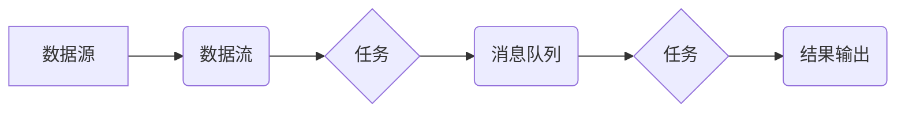

> Samza, Task, 分布式计算, 流式处理, 并行处理, 数据流, Apache Samza

## 1. 背景介绍

在当今数据爆炸的时代，处理海量实时数据成为了一个重要的挑战。传统的批处理方式难以满足对实时分析和响应的需求。为了解决这个问题，分布式流式处理框架应运而生，其中Apache Samza是一个备受关注的开源框架。

Samza 是一种基于流式处理的分布式计算框架，它提供了一种高效、可靠和可扩展的方式来处理实时数据流。Samza 的核心概念是“任务”（Task），它是一个独立的处理单元，负责处理数据流中的特定数据片段。

## 2. 核心概念与联系

Samza 的架构基于流式处理的思想，将数据流分为多个流，每个流由多个任务处理。任务之间通过消息队列进行通信，实现数据流的并行处理。

**Samza 架构流程图:**



**核心概念:**

* **数据源:** 提供数据流的源头，例如 Kafka、Flume 等。
* **数据流:** 将数据按顺序分段传输的管道。
* **任务:** 处理数据流中的特定数据片段的独立处理单元。
* **消息队列:** 任务之间进行通信的中间件，例如 Kafka、RabbitMQ 等。
* **结果输出:** 处理后的数据最终输出的目标，例如 HDFS、数据库等。

## 3. 核心算法原理 & 具体操作步骤

### 3.1  算法原理概述

Samza 的核心算法是基于流式处理的并行处理模型。它将数据流划分为多个流，每个流由多个任务处理。任务之间通过消息队列进行通信，实现数据流的并行处理。

### 3.2  算法步骤详解

1. **数据源接入:** 数据源将数据流发送到 Samza 的消息队列。
2. **任务分配:** Samza 根据任务配置将数据流分配到不同的任务。
3. **数据处理:** 每个任务接收数据流中的数据片段，并对其进行处理。
4. **结果输出:** 处理后的数据由任务发送到消息队列，最终输出到结果输出目标。

### 3.3  算法优缺点

**优点:**

* **高并行度:** 通过任务并行处理，可以充分利用集群资源，提高处理效率。
* **高可靠性:** Samza 支持数据流的容错机制，即使部分任务失败，也能保证数据流的完整性。
* **高可扩展性:** Samza 可以根据需要动态增加或减少任务数量，满足不同规模的数据处理需求。

**缺点:**

* **开发复杂度较高:** 需要对流式处理和分布式系统有一定的了解。
* **资源消耗较高:** 并行处理需要消耗更多的资源，例如 CPU、内存等。

### 3.4  算法应用领域

Samza 的流式处理能力使其广泛应用于以下领域:

* **实时数据分析:** 对实时数据进行分析，例如用户行为分析、网络流量分析等。
* **实时告警:** 对实时数据进行监控，并触发告警，例如系统异常告警、业务异常告警等。
* **实时推荐:** 基于实时用户行为数据进行个性化推荐。
* **实时交易处理:** 处理实时交易数据，例如股票交易、支付交易等。

## 4. 数学模型和公式 & 详细讲解 & 举例说明

### 4.1  数学模型构建

Samza 的任务调度和数据流分配可以抽象为一个图论模型。其中，节点代表任务，边代表数据流之间的依赖关系。

**图论模型:**

* **节点:** 任务
* **边:** 数据流之间的依赖关系

### 4.2  公式推导过程

Samza 使用基于拓扑排序的算法来调度任务。拓扑排序是一种将有向图中的节点按照依赖关系进行排序的算法。

**拓扑排序公式:**

```
TopologicalSort(G) = {v | v ∈ V, ∀u ∈ Pre(v), u ∈ TopologicalSort(G)}
```

其中:

* G 是有向图
* V 是图中的节点集合
* Pre(v) 是节点 v 的前驱节点集合

### 4.3  案例分析与讲解

假设有三个任务 A、B、C，其中 A 依赖于 B，B 依赖于 C。

**拓扑排序结果:**

```
TopologicalSort(G) = {C, B, A}
```

## 5. 项目实践：代码实例和详细解释说明

### 5.1  开发环境搭建

Samza 的开发环境搭建需要以下软件:

* Java JDK
* Apache Maven
* Apache Samza

### 5.2  源代码详细实现

以下是一个简单的 Samza 任务代码示例，用于计算数据流中的单词计数:

```java
import org.apache.samza.config.Config;
import org.apache.samza.context.Context;
import org.apache.samza.task.MessageCollector;
import org.apache.samza.task.StreamTask;
import org.apache.samza.task.TaskCoordinator;

public class WordCountTask implements StreamTask {

    @Override
    public void process(String message, Context context, MessageCollector messageCollector, TaskCoordinator taskCoordinator) {
        // 将消息分割成单词
        String[] words = message.split("\\s+");
        // 计算单词计数
        for (String word : words) {
            // ...
        }
    }

    @Override
    public void initialize(Config config) {
        // ...
    }

    @Override
    public void cleanup(Config config) {
        // ...
    }
}
```

### 5.3  代码解读与分析

* `process()` 方法是任务处理数据的核心方法，它接收数据流中的消息，并对其进行处理。
* `initialize()` 方法在任务启动时被调用，用于初始化任务状态。
* `cleanup()` 方法在任务结束时被调用，用于清理任务状态。

### 5.4  运行结果展示

运行 Samza 任务后，可以观察到单词计数结果输出到指定的目标。

## 6. 实际应用场景

Samza 在实际应用场景中具有广泛的应用前景，例如:

* **实时用户行为分析:** 对用户行为数据进行实时分析，例如用户访问路径、点击行为等，帮助企业了解用户需求和行为模式。
* **实时网络流量监控:** 对网络流量数据进行实时监控，例如流量大小、流量来源等，帮助企业发现网络异常和安全威胁。
* **实时金融交易处理:** 对金融交易数据进行实时处理，例如股票交易、支付交易等，帮助金融机构提高交易效率和风险控制能力。

### 6.4  未来应用展望

随着数据量的不断增长和实时分析需求的不断提升，Samza 将在未来发挥更加重要的作用。

## 7. 工具和资源推荐

### 7.1  学习资源推荐

* Apache Samza 官方文档: https://samza.apache.org/
* Samza 入门教程: https://www.tutorialspoint.com/samza/index.htm

### 7.2  开发工具推荐

* Apache Maven: https://maven.apache.org/
* Apache Kafka: https://kafka.apache.org/

### 7.3  相关论文推荐

* Samza: A Distributed Stream Processing Engine for Apache Kafka: https://www.usenix.org/system/files/conference/osdi15/osdi15-paper-zhou.pdf

## 8. 总结：未来发展趋势与挑战

### 8.1  研究成果总结

Samza 作为一种基于流式处理的分布式计算框架，在处理实时数据方面具有显著的优势。其并行处理能力、高可靠性和高可扩展性使其成为处理海量实时数据的理想选择。

### 8.2  未来发展趋势

Samza 的未来发展趋势包括:

* **更强大的功能:** 持续增加新的功能，例如支持更复杂的流式处理操作、更丰富的数据类型支持等。
* **更易于使用:** 简化开发流程，降低开发门槛，使 Samza 更易于被广泛使用。
* **更完善的生态系统:** 构建更完善的生态系统，包括更多第三方工具和组件，为用户提供更丰富的解决方案。

### 8.3  面临的挑战

Samza 也面临一些挑战，例如:

* **资源消耗:** 并行处理需要消耗更多的资源，如何提高资源利用效率是一个重要的挑战。
* **复杂性:** Samza 的架构相对复杂，如何降低开发和维护的复杂度是一个重要的挑战。
* **生态系统建设:** 构建完善的生态系统需要时间和努力，如何吸引更多开发者和用户参与生态系统建设是一个重要的挑战。

### 8.4  研究展望

未来，我们将继续致力于 Samza 的研究和开发，努力解决上述挑战，使其成为更强大、更易用、更完善的流式处理框架。

## 9. 附录：常见问题与解答

**常见问题:**

* **Samza 和 Apache Kafka 的关系是什么？**

Samza 可以与 Apache Kafka 集成，使用 Kafka 作为数据源和消息队列。

* **Samza 的开发语言是什么？**

Samza 的开发语言是 Java。

* **Samza 的部署方式有哪些？**

Samza 可以部署在多种环境中，例如本地机器、云平台等。

**解答:**

* **Samza 和 Apache Kafka 的关系是什么？**

Samza 可以与 Apache Kafka 集成，使用 Kafka 作为数据源和消息队列。

* **Samza 的开发语言是什么？**

Samza 的开发语言是 Java。

* **Samza 的部署方式有哪些？**

Samza 可以部署在多种环境中，例如本地机器、云平台等。


作者：禅与计算机程序设计艺术 / Zen and the Art of Computer Programming 
<end_of_turn>