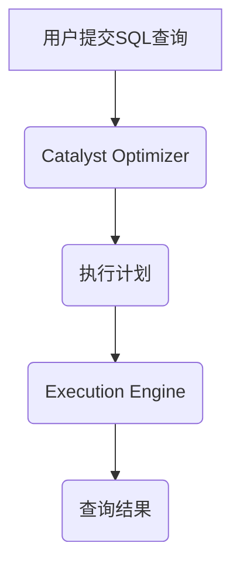

> Spark SQL, 结构化数据, DataFrame, Catalyst Optimizer, Execution Engine, SQL查询, 代码实例, Spark编程

## 1. 背景介绍

随着大数据时代的到来，海量结构化数据的处理和分析成为越来越重要的课题。Spark SQL作为Apache Spark生态系统中的一员，凭借其高性能、易用性和灵活性，成为了处理结构化数据的首选工具之一。本文将深入探讨Spark SQL的原理、核心概念、算法、代码实例以及实际应用场景，帮助读者全面理解Spark SQL的强大功能和应用价值。

## 2. 核心概念与联系

Spark SQL的核心概念包括DataFrame、Catalyst Optimizer和Execution Engine。

**2.1 DataFrame**

DataFrame是Spark SQL处理结构化数据的核心数据结构，类似于关系数据库中的表，由一系列列和行组成。DataFrame提供了丰富的API，可以方便地进行数据过滤、聚合、转换等操作。

**2.2 Catalyst Optimizer**

Catalyst Optimizer是Spark SQL的查询优化器，负责将用户提交的SQL查询转换为高效的执行计划。它通过分析查询语句、数据表结构和统计信息，选择最优的执行路径，从而提高查询性能。

**2.3 Execution Engine**

Execution Engine是Spark SQL执行查询计划的引擎，负责将优化后的执行计划转换为实际的代码，并执行相应的操作。Spark SQL支持多种Execution Engine，例如Spark SQL Engine、Spark Streaming Engine等，可以根据不同的场景选择合适的引擎。

**2.4 关系图**



## 3. 核心算法原理 & 具体操作步骤

### 3.1  算法原理概述

Spark SQL的查询优化和执行引擎基于一系列成熟的算法和技术，例如：

* **查询计划生成:** 使用基于规则的优化器和启发式算法生成最优的查询执行计划。
* **代价估计:** 估算不同执行计划的执行代价，选择代价最低的计划。
* **数据分区:** 将数据按照一定的规则分区，提高数据访问效率。
* **数据倾斜处理:** 处理数据倾斜问题，避免某些节点过载。

### 3.2  算法步骤详解

1. **解析SQL语句:** 将用户提交的SQL语句解析成抽象语法树(AST)。
2. **语义分析:** 对AST进行语义分析，检查语法错误和数据类型等问题。
3. **查询计划生成:** 使用Catalyst Optimizer生成最优的查询执行计划。
4. **执行计划优化:** 对生成的执行计划进行进一步优化，例如：
    * **选择合适的执行器:** 根据数据类型和查询条件选择合适的执行器，例如：Hash Join、Merge Join等。
    * **推断数据类型:** 推断数据类型的精确信息，提高执行效率。
    * **消除冗余操作:** 识别和消除冗余的查询操作。
5. **执行查询计划:** 使用Execution Engine执行优化后的查询计划，并返回查询结果。

### 3.3  算法优缺点

**优点:**

* **高性能:** Spark SQL基于分布式计算框架，可以充分利用集群资源，实现高性能数据处理。
* **易用性:** Spark SQL支持标准SQL语法，方便用户使用。
* **灵活性:** Spark SQL支持多种数据源和数据格式，可以灵活处理各种数据。

**缺点:**

* **复杂性:** Spark SQL的内部实现比较复杂，需要一定的学习成本。
* **资源消耗:** Spark SQL的执行过程需要消耗大量的内存和CPU资源。

### 3.4  算法应用领域

Spark SQL广泛应用于以下领域:

* **数据分析:** 对海量数据进行分析，挖掘数据中的价值。
* **机器学习:** 为机器学习模型提供数据支持。
* **实时数据处理:** 处理实时数据流，进行实时分析和决策。
* **数据仓库:** 建立数据仓库，进行数据整合和分析。

## 4. 数学模型和公式 & 详细讲解 & 举例说明

### 4.1  数学模型构建

Spark SQL的查询优化器基于代价模型，将查询执行计划的代价表示为数学公式。代价模型通常包括以下几个方面:

* **数据扫描代价:** 扫描数据表所需的时间。
* **数据交换代价:** 数据在不同节点之间传输所需的时间。
* **数据排序代价:** 对数据进行排序所需的时间。
* **数据聚合代价:** 对数据进行聚合操作所需的时间。

### 4.2  公式推导过程

假设一个查询计划包含以下操作:

* 数据扫描操作: S
* 数据排序操作: O
* 数据聚合操作: A

则该查询计划的总代价可以表示为:

```latex
Cost(P) = Cost(S) + Cost(O) + Cost(A)
```

其中:

* Cost(P) 表示查询计划P的总代价。
* Cost(S) 表示数据扫描操作S的代价。
* Cost(O) 表示数据排序操作O的代价。
* Cost(A) 表示数据聚合操作A的代价。

### 4.3  案例分析与讲解

例如，假设一个查询需要扫描一个包含100万条记录的数据表，并对该表进行分组聚合操作。

* 数据扫描代价: Cost(S) = 1000秒 (假设每条记录扫描时间为1毫秒)
* 数据排序代价: Cost(O) = 500秒 (假设排序算法为Merge Sort)
* 数据聚合代价: Cost(A) = 200秒 (假设聚合操作为COUNT)

则该查询计划的总代价为:

```latex
Cost(P) = 1000 + 500 + 200 = 1700秒
```

## 5. 项目实践：代码实例和详细解释说明

### 5.1  开发环境搭建

* 安装Java JDK
* 安装Scala
* 安装Apache Spark

### 5.2  源代码详细实现

```scala
import org.apache.spark.sql.SparkSession

object SparkSqlExample {
  def main(args: Array[String]): Unit = {
    // 创建SparkSession
    val spark = SparkSession.builder()
      .appName("SparkSqlExample")
      .getOrCreate()

    // 读取数据
    val df = spark.read.json("data.json")

    // 查询数据
    val result = df.select("name", "age").filter("age > 20")

    // 显示结果
    result.show()

    // 关闭SparkSession
    spark.stop()
  }
}
```

### 5.3  代码解读与分析

* `SparkSession.builder()`: 创建SparkSession的构建器。
* `.appName("SparkSqlExample")`: 设置Spark应用程序名称。
* `.getOrCreate()`: 获取或创建SparkSession实例。
* `spark.read.json("data.json")`: 读取JSON格式的数据文件。
* `df.select("name", "age")`: 选择"name"和"age"列。
* `.filter("age > 20")`: 过滤年龄大于20岁的记录。
* `result.show()`: 显示查询结果。
* `spark.stop()`: 关闭SparkSession。

### 5.4  运行结果展示

运行代码后，将显示符合条件的记录，例如:

```
+-------+---+
|   name|age|
+-------+---+
|  John|25|
|  Mary|22|
+-------+---+
```

## 6. 实际应用场景

Spark SQL在实际应用场景中具有广泛的应用价值，例如:

* **电商平台:** 分析用户购买行为、商品销售情况等。
* **金融机构:** 处理交易数据、风险评估等。
* **医疗机构:** 分析患者数据、疾病诊断等。
* **社交媒体:** 分析用户行为、内容传播等。

### 6.4  未来应用展望

随着大数据和人工智能技术的不断发展，Spark SQL的应用场景将更加广泛，例如:

* **实时数据分析:** 处理实时数据流，进行实时分析和决策。
* **机器学习:** 为机器学习模型提供数据支持，提高模型的准确性和效率。
* **数据可视化:** 将数据分析结果可视化，方便用户理解和决策。

## 7. 工具和资源推荐

### 7.1  学习资源推荐

* **Spark SQL官方文档:** https://spark.apache.org/docs/latest/sql-programming-guide.html
* **Spark SQL教程:** https://www.tutorialspoint.com/spark/spark_sql.htm
* **Spark SQL书籍:** 《Spark SQL权威指南》

### 7.2  开发工具推荐

* **IntelliJ IDEA:** https://www.jetbrains.com/idea/
* **Eclipse:** https://www.eclipse.org/

### 7.3  相关论文推荐

* **Catalyst Optimizer:** https://arxiv.org/abs/1506.02188
* **Spark SQL Execution Engine:** https://arxiv.org/abs/1603.07197

## 8. 总结：未来发展趋势与挑战

### 8.1  研究成果总结

Spark SQL作为Apache Spark生态系统中的一员，在结构化数据处理领域取得了显著的成果，其高性能、易用性和灵活性使其成为业界首选工具之一。

### 8.2  未来发展趋势

未来，Spark SQL将继续朝着以下方向发展:

* **更强大的查询优化:** 通过更先进的算法和技术，进一步提高查询性能。
* **更丰富的功能支持:** 支持更多的数据源、数据格式和查询语言。
* **更完善的生态系统:** 构建更完善的生态系统，提供更多工具和资源。

### 8.3  面临的挑战

Spark SQL也面临一些挑战，例如:

* **复杂性:** Spark SQL的内部实现比较复杂，需要一定的学习成本。
* **资源消耗:** Spark SQL的执行过程需要消耗大量的内存和CPU资源。
* **数据安全:** 如何保证数据安全和隐私保护是一个重要的挑战。

### 8.4  研究展望

未来，我们将继续致力于Spark SQL的研究和开发，努力解决上述挑战，推动Spark SQL技术的发展，为用户提供更强大、更便捷的数据处理工具。

## 9. 附录：常见问题与解答

### 9.1  常见问题

* **Spark SQL和Hive有什么区别?**
* **如何优化Spark SQL查询性能?**
* **如何使用Spark SQL连接外部数据源?**

### 9.2  解答

* **Spark SQL和Hive的区别:** Spark SQL是Spark框架的一部分，而Hive是一个独立的查询引擎。Spark SQL支持更丰富的查询功能，性能也更高。
* **优化Spark SQL查询性能:** 可以通过以下方法优化查询性能:
    * 使用合适的执行器。
    * 推断数据类型。
    * 避免冗余操作。
* **使用Spark SQL连接外部数据源:** 可以使用Spark SQL的内置数据源连接器，例如JDBC、ODBC等。

作者：禅与计算机程序设计艺术 / Zen and the Art of Computer Programming


<end_of_turn>