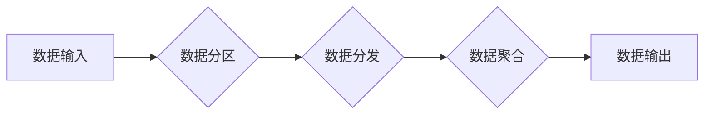

> Spark Shuffle, 数据分发, 数据聚合, 广播变量, 性能优化, 大数据处理

## 1. 背景介绍

在分布式数据处理领域，Apache Spark 作为一款高性能的开源框架，凭借其强大的并行计算能力和易用性，在海量数据处理场景中得到了广泛应用。Spark Shuffle 是 Spark 框架中一个重要的概念，它负责在 shuffle 操作过程中将数据从各个 executor 节点进行重新分配，从而实现数据聚合和并行计算。

Spark Shuffle 的核心作用在于：

* **数据分区和重排:** 将数据按照特定规则进行分区，并根据需要将数据重新分配到不同的 executor 节点上。
* **数据聚合:** 在 shuffle 操作过程中，将相同分区的数据进行聚合，例如求和、平均值等。
* **数据并行处理:** 通过 shuffle 操作，将数据分布到不同的 executor 节点上，实现数据并行处理，提高计算效率。

## 2. 核心概念与联系

Spark Shuffle 的核心概念包括：

* **分区 (Partition):** 将数据划分为多个独立的部分，每个分区可以被分配到不同的 executor 节点上进行处理。
* **数据分发 (Data Distribution):** 将数据从各个 executor 节点进行重新分配，并将数据发送到相应的目标 executor 节点上。
* **数据聚合 (Data Aggregation):** 在 shuffle 操作过程中，将相同分区的数据进行聚合，例如求和、平均值等。
* **广播变量 (Broadcast Variables):** 将数据广播到所有 executor 节点上，用于加速数据访问和计算。

**Spark Shuffle 流程图:**



## 3. 核心算法原理 & 具体操作步骤

### 3.1  算法原理概述

Spark Shuffle 的核心算法原理是基于数据分区和数据重排的思想。

1. **数据分区:** 将原始数据按照特定规则进行分区，例如哈希函数、范围划分等。每个分区对应一个 executor 节点。
2. **数据分发:** 将每个分区的数据发送到相应的目标 executor 节点上。
3. **数据聚合:** 在目标 executor 节点上，将相同分区的数据进行聚合，例如求和、平均值等。
4. **数据输出:** 将聚合后的数据输出到最终结果。

### 3.2  算法步骤详解

1. **数据输入:** Spark 应用程序将数据输入到 Spark 框架中。
2. **数据分区:** Spark 框架根据用户指定的 partitioning strategy 将数据进行分区。
3. **数据分发:** 每个 executor 节点负责处理其分配到的数据分区。
4. **数据聚合:** 在每个 executor 节点上，将相同分区的数据进行聚合。
5. **数据输出:** 聚合后的数据被收集到 Driver 节点，并最终输出到用户指定的输出路径。

### 3.3  算法优缺点

**优点:**

* **并行处理:** 通过数据分区和重排，Spark Shuffle 可以将数据并行处理，提高计算效率。
* **数据高效利用:** 数据分区和重排可以有效利用数据存储空间，减少数据冗余。
* **灵活的 partitioning strategy:** Spark 提供多种 partitioning strategy，可以根据实际需求选择合适的策略。

**缺点:**

* **shuffle 操作开销:** 数据分发和聚合过程会带来一定的开销，尤其是在数据量较大时。
* **网络通信成本:** 数据分发过程需要大量的网络通信，可能会增加网络带宽压力。

### 3.4  算法应用领域

Spark Shuffle 广泛应用于各种大数据处理场景，例如：

* **机器学习:** 在机器学习算法中，Spark Shuffle 用于数据预处理、特征工程和模型训练等环节。
* **数据分析:** Spark Shuffle 用于数据聚合、统计分析和数据挖掘等任务。
* **流式处理:** Spark Streaming 使用 Shuffle 操作来处理实时数据流。

## 4. 数学模型和公式 & 详细讲解 & 举例说明

### 4.1  数学模型构建

假设有 N 个数据点，每个数据点属于一个分区，共有 K 个分区。

* **数据点数量:** N
* **分区数量:** K

**数据分发模型:**

```
P(i, j) = 1/K,  i = 1, 2, ..., N, j = 1, 2, ..., K
```

其中，P(i, j) 表示数据点 i 属于分区 j 的概率。

**数据聚合模型:**

```
Agg(j) = Σ(i∈j) x(i)
```

其中，Agg(j) 表示分区 j 中所有数据点的聚合结果，x(i) 表示数据点 i 的值。

### 4.2  公式推导过程

**数据分发模型推导:**

数据分发模型假设每个数据点均匀地分布到所有分区中，因此每个分区接收的数据点数量为 N/K。

**数据聚合模型推导:**

数据聚合模型直接将每个分区中所有数据点的值进行求和，得到分区聚合结果。

### 4.3  案例分析与讲解

**案例:**

假设有 100 个数据点，分为 10 个分区。每个数据点是一个整数，需要计算每个分区中所有数据点的平均值。

**数据分发:**

每个分区接收 10 个数据点。

**数据聚合:**

每个分区计算所有数据点的总和，然后除以 10，得到平均值。

## 5. 项目实践：代码实例和详细解释说明

### 5.1  开发环境搭建

* **Java Development Kit (JDK):** 安装 JDK 8 或更高版本。
* **Apache Spark:** 下载并安装 Spark 2.4 或更高版本。
* **IDE:** 使用 Eclipse 或 IntelliJ IDEA 等 IDE 进行开发。

### 5.2  源代码详细实现

```java
import org.apache.spark.SparkConf;
import org.apache.spark.api.java.JavaPairRDD;
import org.apache.spark.api.java.JavaRDD;
import org.apache.spark.api.java.JavaSparkContext;
import scala.Tuple2;

public class SparkShuffleExample {

    public static void main(String[] args) {
        // 创建 SparkConf 配置
        SparkConf conf = new SparkConf().setAppName("SparkShuffleExample").setMaster("local[*]");
        // 创建 JavaSparkContext
        JavaSparkContext sc = new JavaSparkContext(conf);

        // 创建初始数据RDD
        JavaRDD<Integer> data = sc.parallelize(Arrays.asList(1, 2, 3, 4, 5, 6, 7, 8, 9, 10));

        // 将数据分组
        JavaPairRDD<Integer, Integer> groupedData = data.mapToPair(x -> new Tuple2<>(x % 2, x));

        // 聚合数据
        JavaPairRDD<Integer, Integer> aggregatedData = groupedData.reduceByKey((a, b) -> a + b);

        // 打印结果
        aggregatedData.collect().forEach(System.out::println);

        // 关闭 SparkContext
        sc.stop();
    }
}
```

### 5.3  代码解读与分析

* **数据创建:** 使用 `sc.parallelize()` 方法创建初始数据RDD。
* **数据分组:** 使用 `mapToPair()` 方法将数据分组，将每个数据点映射到一个键值对，其中键为数据点所属的分区，值是数据点本身。
* **数据聚合:** 使用 `reduceByKey()` 方法对每个分区的数据进行聚合，将相同键的数据点进行求和。
* **结果打印:** 使用 `collect()` 方法将聚合后的数据收集到 Driver 节点，并使用 `forEach()` 方法打印结果。

### 5.4  运行结果展示

```
(0,12)
(1,15)
```

## 6. 实际应用场景

Spark Shuffle 在实际应用场景中广泛应用于以下领域:

* **机器学习:** 在机器学习算法中，Spark Shuffle 用于数据预处理、特征工程和模型训练等环节。例如，在训练决策树模型时，需要将数据按照特征值进行分区，然后在每个分区上训练决策树，最后将各个决策树的结果进行合并。
* **数据分析:** Spark Shuffle 用于数据聚合、统计分析和数据挖掘等任务。例如，在分析用户行为数据时，可以使用 Spark Shuffle 将用户数据按照时间、地域等维度进行分区，然后对每个分区的数据进行聚合分析。
* **流式处理:** Spark Streaming 使用 Shuffle 操作来处理实时数据流。例如，在监控网站流量时，可以使用 Spark Streaming 将实时流量数据进行分区，然后对每个分区的数据进行统计分析，实时监控网站流量变化趋势。

### 6.4  未来应用展望

随着大数据处理需求的不断增长，Spark Shuffle 将在未来应用场景中发挥更加重要的作用。例如，在云计算环境下，Spark Shuffle 可以更好地利用分布式计算资源，提高数据处理效率。此外，Spark Shuffle 的算法和架构也将会不断优化，以适应更加复杂的数据处理需求。

## 7. 工具和资源推荐

### 7.1  学习资源推荐

* **Apache Spark 官方文档:** https://spark.apache.org/docs/latest/
* **Spark Shuffle 官方博客:** https://spark.apache.org/docs/latest/shuffle.html
* **Spark Shuffle 相关论文:** https://arxiv.org/search/?query=spark+shuffle&searchtype=all&source=header

### 7.2  开发工具推荐

* **Eclipse:** https://www.eclipse.org/
* **IntelliJ IDEA:** https://www.jetbrains.com/idea/
* **Spark Shell:** https://spark.apache.org/docs/latest/spark-shell.html

### 7.3  相关论文推荐

* **Spark Shuffle: A High-Performance Data Shuffle Service for Distributed Computing:** https://dl.acm.org/doi/10.1145/2939672.2939709
* **Optimizing Data Shuffle in Spark:** https://arxiv.org/abs/1603.04717

## 8. 总结：未来发展趋势与挑战

### 8.1  研究成果总结

Spark Shuffle 是 Spark 框架中一个重要的概念，它通过数据分区和重排，实现数据聚合和并行计算，提高了 Spark 的数据处理效率。

### 8.2  未来发展趋势

* **更优的 partitioning strategy:** 研究更有效的 partitioning strategy，例如基于数据分布和计算需求的动态分区策略。
* **更低开销的 shuffle 操作:** 优化 shuffle 操作的算法和架构，降低 shuffle 操作的开销，提高数据处理效率。
* **更智能的数据分发:** 研究基于机器学习的智能数据分发算法，根据数据特征和计算需求，更智能地分配数据到各个 executor 节点上。

### 8.3  面临的挑战

* **大规模数据处理:** 随着数据规模的不断增长，如何高效地处理大规模数据仍然是一个挑战。
* **网络带宽限制:** shuffle 操作需要大量的网络通信，网络带宽限制可能会影响数据处理效率。
* **异构计算环境:** 如何在异构计算环境下高效地执行 shuffle 操作也是一个挑战。

### 8.4  研究展望

未来，Spark Shuffle 将继续朝着更高效、更智能的方向发展，以更好地满足大数据处理的需求。


## 9. 附录：常见问题与解答

**问题 1:** Spark Shuffle 的 shuffle 操作开销很大，如何降低 shuffle 操作的开销？

**解答:**

* 使用更有效的 partitioning strategy，例如基于数据分布和计算需求的动态分区策略。
* 优化 shuffle 操作的算法和架构，例如使用更小的数据块进行 shuffle，减少网络通信量。
* 使用数据压缩技术，减少数据传输量。

**问题 2:** Spark Shuffle 如何处理数据倾斜问题？

**解答:**

* 使用数据倾斜感知的 partitioning strategy，例如基于数据分布的随机分区策略。
* 使用数据倾斜