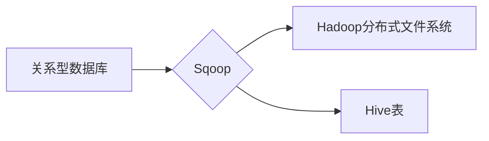

> Sqoop,数据迁移,Hadoop,Hive,MySQL,数据导入,数据导出,代码实例,原理分析

## 1. 背景介绍

随着大数据时代的到来，海量数据的存储和处理成为越来越重要的挑战。Hadoop作为分布式存储和处理框架，为大数据提供了强大的处理能力。而Hive则作为Hadoop上运行的SQL查询语言，使得对大数据的查询和分析更加便捷。然而，在实际应用中，数据往往分布在不同的数据源中，例如关系型数据库、NoSQL数据库等。如何将这些数据高效地导入到Hadoop生态系统中，成为一个关键问题。

Sqoop是一个专门用于从关系型数据库导入和导出数据的工具，它可以将数据从关系型数据库（如MySQL、PostgreSQL、Oracle等）导入到Hadoop生态系统中，也可以将数据从Hadoop生态系统导出到关系型数据库。Sqoop提供了丰富的功能和灵活的配置选项，可以满足各种数据迁移需求。

## 2. 核心概念与联系

Sqoop的核心功能是将数据从关系型数据库导入和导出到Hadoop生态系统中。它利用了Hadoop的分布式存储和处理能力，以及Hive的SQL查询语言，实现了高效的数据迁移。

**Sqoop的工作原理:**

1. **连接数据库:** Sqoop首先需要连接到目标数据库，获取数据库连接信息。
2. **定义数据表:** Sqoop需要定义要导入或导出的数据表，包括表名、字段名、数据类型等信息。
3. **执行数据迁移:** Sqoop根据定义的数据表和连接信息，执行数据迁移操作。它会将数据从数据库中读取，并将其存储到Hadoop分布式文件系统中。
4. **数据格式转换:** Sqoop支持多种数据格式，例如CSV、Avro、ORC等。它可以根据需要将数据格式进行转换。
5. **数据加载到Hive:** Sqoop可以将数据加载到Hive表中，方便后续进行数据分析和查询。

**Sqoop与Hadoop、Hive的关系:**

* **Hadoop:** Sqoop依赖于Hadoop的分布式存储和处理能力，将数据存储到HDFS中。
* **Hive:** Sqoop可以将数据加载到Hive表中，方便后续进行数据分析和查询。

**Mermaid 流程图:**



## 3. 核心算法原理 & 具体操作步骤

### 3.1  算法原理概述

Sqoop的核心算法原理是基于数据分片和并行处理。它将数据表划分为多个分片，并分别将每个分片的数据导入到Hadoop分布式文件系统中。然后，Sqoop使用MapReduce框架对数据进行并行处理，提高数据迁移效率。

### 3.2  算法步骤详解

1. **数据表扫描:** Sqoop首先扫描目标数据库中的数据表，获取表结构和数据量。
2. **数据分片:** Sqoop根据数据量和配置参数，将数据表划分为多个分片。
3. **数据读取:** Sqoop使用JDBC连接数据库，并读取每个分片的数据。
4. **数据格式转换:** Sqoop根据配置参数，将数据格式进行转换，例如将数据从CSV格式转换为Avro格式。
5. **数据写入HDFS:** Sqoop将转换后的数据写入到Hadoop分布式文件系统中。
6. **数据加载Hive:** Sqoop可以将数据加载到Hive表中，方便后续进行数据分析和查询。

### 3.3  算法优缺点

**优点:**

* **高效:** Sqoop利用了Hadoop的分布式存储和处理能力，可以实现高效的数据迁移。
* **灵活:** Sqoop提供了丰富的配置选项，可以满足各种数据迁移需求。
* **易用:** Sqoop提供了命令行工具和API，方便用户使用。

**缺点:**

* **依赖Hadoop:** Sqoop依赖于Hadoop生态系统，需要用户具备Hadoop的部署和管理经验。
* **数据格式限制:** Sqoop支持的数据库类型和数据格式有限。

### 3.4  算法应用领域

Sqoop广泛应用于以下领域:

* **数据仓库建设:** 将数据从关系型数据库导入到数据仓库中。
* **数据分析:** 将数据从关系型数据库导入到Hadoop生态系统中，方便进行大数据分析。
* **数据迁移:** 将数据从一个数据库迁移到另一个数据库。

## 4. 数学模型和公式 & 详细讲解 & 举例说明

Sqoop的数据迁移过程可以抽象为一个数学模型，其中涉及到数据量、分片数量、数据传输速度等因素。

### 4.1  数学模型构建

假设：

* **T:** 数据总量
* **N:** 分片数量
* **S:** 每片数据量
* **B:** 数据传输速度

则数据迁移时间可以表示为：

**Time = T / (N * B)**

### 4.2  公式推导过程

数据迁移时间取决于数据总量、分片数量和数据传输速度。

* 数据总量越大，数据迁移时间越长。
* 分片数量越多，数据迁移时间越短。
* 数据传输速度越快，数据迁移时间越短。

### 4.3  案例分析与讲解

假设：

* 数据总量 T = 100GB
* 分片数量 N = 10
* 数据传输速度 B = 100MB/s

则数据迁移时间：

Time = 100GB / (10 * 100MB/s) = 1000秒 = 16.67分钟

## 5. 项目实践：代码实例和详细解释说明

### 5.1  开发环境搭建

* Hadoop集群
* Sqoop工具
* JDBC驱动

### 5.2  源代码详细实现

```bash
# 导入数据
sqoop import \
  --connect jdbc:mysql://localhost:3306/mydatabase \
  --username root \
  --password mypassword \
  --table mytable \
  --target-dir /user/hive/warehouse/mydatabase.db/mytable \
  --fields-terminated-by ',' \
  --lines-terminated-by '
'

# 导出数据
sqoop export \
  --connect jdbc:mysql://localhost:3306/mydatabase \
  --username root \
  --password mypassword \
  --table mytable \
  --export-dir /user/hive/warehouse/mydatabase.db/mytable \
  --fields-terminated-by ',' \
  --lines-terminated-by '
'
```

### 5.3  代码解读与分析

* `sqoop import`: 用于导入数据到Hadoop生态系统中。
* `sqoop export`: 用于导出数据从Hadoop生态系统到关系型数据库。
* `--connect`: 连接数据库的URL。
* `--username`: 数据库用户名。
* `--password`: 数据库密码。
* `--table`: 要导入或导出的数据表名。
* `--target-dir`: 数据导入到Hadoop分布式文件系统的路径。
* `--fields-terminated-by`: 字段分隔符。
* `--lines-terminated-by`: 行分隔符。

### 5.4  运行结果展示

运行上述代码后，数据将被导入或导出到指定位置。

## 6. 实际应用场景

Sqoop在实际应用中具有广泛的应用场景，例如：

* **数据仓库建设:** 将数据从关系型数据库导入到数据仓库中，方便进行数据分析和报表生成。
* **数据分析:** 将数据从关系型数据库导入到Hadoop生态系统中，方便进行大数据分析和机器学习。
* **数据迁移:** 将数据从一个数据库迁移到另一个数据库，例如从MySQL迁移到PostgreSQL。

### 6.4  未来应用展望

随着大数据技术的不断发展，Sqoop的应用场景将会更加广泛。例如：

* **支持更多数据源:** Sqoop可以支持更多类型的数据库和数据源，例如NoSQL数据库、云存储等。
* **提高数据迁移效率:** Sqoop可以利用更先进的算法和技术，提高数据迁移效率。
* **增强数据安全:** Sqoop可以提供更完善的数据安全机制，保护数据安全。

## 7. 工具和资源推荐

### 7.1  学习资源推荐

* Sqoop官方文档: https://sqoop.apache.org/docs/
* Sqoop教程: https://www.tutorialspoint.com/sqoop/index.htm

### 7.2  开发工具推荐

* Hadoop: https://hadoop.apache.org/
* Hive: https://hive.apache.org/

### 7.3  相关论文推荐

* Sqoop: A Tool for Efficiently Transferring Data Between Relational Databases and Hadoop: https://www.usenix.org/system/files/conference/osdi10/osdi10-paper-deppeler.pdf

## 8. 总结：未来发展趋势与挑战

### 8.1  研究成果总结

Sqoop是一个成熟且功能强大的数据迁移工具，它为Hadoop生态系统提供了高效的数据导入和导出功能。Sqoop的应用场景广泛，在数据仓库建设、数据分析和数据迁移等领域发挥着重要作用。

### 8.2  未来发展趋势

未来，Sqoop将会朝着以下方向发展：

* 支持更多数据源和数据格式。
* 提高数据迁移效率和性能。
* 增强数据安全和可靠性。

### 8.3  面临的挑战

Sqoop也面临着一些挑战，例如：

* 数据迁移过程中数据质量问题。
* 数据安全和隐私保护问题。
* 与其他数据迁移工具的集成问题。

### 8.4  研究展望

未来，研究人员将继续致力于解决Sqoop面临的挑战，并开发更先进的数据迁移工具，以满足大数据时代的数据迁移需求。

## 9. 附录：常见问题与解答

### 9.1  常见问题

* Sqoop导入数据时出现错误，如何解决？
* Sqoop导出数据时数据格式不正确，如何解决？
* Sqoop数据迁移速度慢，如何提高效率？

### 9.2  解答

* 导入数据时出现错误，需要检查数据库连接信息、数据表结构和数据格式是否正确。
* 导出数据时数据格式不正确，需要检查数据格式配置参数是否正确。
* 数据迁移速度慢，可以尝试增加分片数量、提高数据传输速度或优化数据结构。


作者：禅与计算机程序设计艺术 / Zen and the Art of Computer Programming 
<end_of_turn>