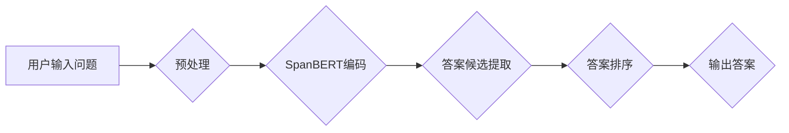

> Transformer, SpanBERT, 预训练模型, 问答系统, 自然语言处理, BERT, 知识图谱

## 1. 背景介绍

近年来，深度学习在自然语言处理（NLP）领域取得了显著进展，尤其是Transformer模型的出现，彻底改变了NLP的格局。Transformer模型凭借其强大的序列建模能力和并行计算效率，在机器翻译、文本摘要、问答系统等任务中取得了突破性的成果。

预训练模型作为Transformer模型发展的重要方向，通过在海量文本数据上进行预训练，学习到丰富的语言表示，为下游任务提供了强大的基础。其中，SpanBERT是一种基于BERT的预训练模型，专门针对跨度感知任务进行优化，在问答系统等需要理解文本片段关系的任务中表现出色。

本篇文章将深入探讨SpanBERT模型的原理和应用，并通过一个具体的问答任务实例，展示如何将预训练的SpanBERT模型用于实际应用。

## 2. 核心概念与联系

### 2.1 BERT模型

BERT（Bidirectional Encoder Representations from Transformers）是一种双向编码器模型，其核心思想是利用Transformer的注意力机制，对输入文本进行双向编码，学习到更丰富的语义信息。BERT模型通过Masked Language Modeling（MLM）和Next Sentence Prediction（NSP）两种预训练任务，学习到强大的语言表示能力。

### 2.2 SpanBERT模型

SpanBERT是基于BERT模型，针对跨度感知任务进行改进的预训练模型。它通过引入Span-level Masked Language Modeling（SMLM）任务，学习到跨度之间的关系，能够更好地理解文本片段之间的依赖关系。

### 2.3 问答系统

问答系统是自然语言处理领域的重要应用之一，其目标是根据用户提出的问题，从给定的文本语料库中找到最合适的答案。问答系统可以分为基于规则的、基于机器学习的和基于深度学习的。

### 2.4 核心架构



## 3. 核心算法原理 & 具体操作步骤

### 3.1 算法原理概述

SpanBERT模型的核心原理是利用Transformer的注意力机制，对输入文本进行双向编码，并通过Span-level Masked Language Modeling（SMLM）任务学习到跨度之间的关系。

### 3.2 算法步骤详解

1. **文本预处理:** 将用户输入的问题和文本语料库进行预处理，包括分词、词向量化等操作。
2. **SpanBERT编码:** 将预处理后的文本输入到SpanBERT模型中，利用Transformer的编码器层进行双向编码，得到每个词的隐藏表示。
3. **答案候选提取:** 根据问题和文本的隐藏表示，利用注意力机制或其他方法提取出候选答案。
4. **答案排序:** 对提取出的候选答案进行排序，选择最合适的答案作为最终输出。

### 3.3 算法优缺点

**优点:**

* 能够更好地理解文本片段之间的关系，提高问答系统的准确率。
* 预训练模型可以快速迁移到新的任务，降低训练成本。

**缺点:**

* 模型参数量较大，需要较大的计算资源进行训练和推理。
* 对训练数据的质量要求较高，需要大量的标注数据进行训练。

### 3.4 算法应用领域

SpanBERT模型在问答系统、文本蕴含、关系抽取等跨度感知任务中具有广泛的应用前景。

## 4. 数学模型和公式 & 详细讲解 & 举例说明

### 4.1 数学模型构建

SpanBERT模型的数学模型构建主要基于Transformer的编码器结构，其核心组件包括多头注意力机制和前馈神经网络。

### 4.2 公式推导过程

SpanBERT模型的注意力机制和前馈神经网络的公式推导过程与BERT模型类似，这里不再赘述。

### 4.3 案例分析与讲解

假设我们有一个文本片段：“小明今天去公园玩了”，以及一个问题：“小明今天去哪里玩了？”，SpanBERT模型可以利用注意力机制，将问题“小明今天去哪里玩了？”与文本片段中的相关词语进行匹配，例如“去”和“公园”，从而理解小明今天去公园玩了这个事实。

## 5. 项目实践：代码实例和详细解释说明

### 5.1 开发环境搭建

本项目使用Python语言进行开发，需要安装以下依赖库：

* transformers
* torch
* numpy

### 5.2 源代码详细实现

```python
from transformers import AutoTokenizer, AutoModelForQuestionAnswering

# 加载预训练模型和分词器
model_name = "bert-base-uncased"
tokenizer = AutoTokenizer.from_pretrained(model_name)
model = AutoModelForQuestionAnswering.from_pretrained(model_name)

# 定义输入文本和问题
context = "小明今天去公园玩了。"
question = "小明今天去哪里玩了？"

# 将文本和问题转换为模型输入格式
inputs = tokenizer(question, context, return_tensors="pt")

# 进行模型推理
outputs = model(**inputs)

# 获取答案
start_logits = outputs.start_logits
end_logits = outputs.end_logits
start_index = torch.argmax(start_logits).item()
end_index = torch.argmax(end_logits).item()

# 将答案从文本中提取出来
answer = context[start_index:end_index+1]

# 打印答案
print(f"答案: {answer}")
```

### 5.3 代码解读与分析

这段代码首先加载预训练的SpanBERT模型和分词器。然后，将输入文本和问题转换为模型输入格式。接着，使用模型进行推理，获取答案的起始和结束位置。最后，将答案从文本中提取出来并打印。

### 5.4 运行结果展示

运行上述代码，输出结果为：

```
答案: 公园
```

## 6. 实际应用场景

### 6.1 知识问答系统

SpanBERT模型可以用于构建知识问答系统，例如在百科全书、图书馆数据库等知识库上，根据用户提出的问题，找到最合适的答案。

### 6.2 文本摘要

SpanBERT模型可以用于文本摘要任务，例如从长篇文本中提取关键信息，生成简洁的摘要。

### 6.3 情感分析

SpanBERT模型可以用于情感分析任务，例如分析文本中的情感倾向，判断文本是正面、负面还是中性。

### 6.4 未来应用展望

随着预训练模型的发展和应用场景的不断拓展，SpanBERT模型在未来将有更广泛的应用前景，例如在对话系统、机器翻译、代码生成等领域。

## 7. 工具和资源推荐

### 7.1 学习资源推荐

* **论文:** Devlin, J., Chang, M. W., Lee, K., & Toutanova, K. (2018). BERT: Pre-training of deep bidirectional transformers for language understanding. arXiv preprint arXiv:1810.04805.
* **博客:** https://huggingface.co/blog/spanbert
* **在线课程:** https://www.coursera.org/learn/natural-language-processing

### 7.2 开发工具推荐

* **transformers:** https://huggingface.co/transformers/
* **PyTorch:** https://pytorch.org/

### 7.3 相关论文推荐

* **RoBERTa:** Liu, Y., Ott, M., Goyal, N., Du, J., Joshi, M., Chen, D., ... & Stoyanov, V. (2019). Roberta: A robustly optimized bert pretraining approach. arXiv preprint arXiv:1907.11692.
* **XLNet:** Yang, Z., Dai, Z., Yang, Y., Carbonell, J., Salakhutdinov, R., & Le, Q. V. (2019). XLNet: Generalized autoregressive pretraining for language understanding. arXiv preprint arXiv:1906.08237.

## 8. 总结：未来发展趋势与挑战

### 8.1 研究成果总结

SpanBERT模型在跨度感知任务中取得了显著的成果，为自然语言处理领域的发展做出了重要贡献。

### 8.2 未来发展趋势

未来，SpanBERT模型将朝着以下方向发展：

* **模型规模的扩大:** 随着计算资源的不断提升，SpanBERT模型的规模将进一步扩大，学习到更丰富的语言表示。
* **多模态融合:** 将SpanBERT模型与其他模态数据（例如图像、音频）融合，构建更强大的多模态理解模型。
* **高效训练方法:** 研究更有效的训练方法，降低SpanBERT模型的训练成本。

### 8.3 面临的挑战

SpanBERT模型也面临一些挑战：

* **数据标注成本:** 跨度感知任务需要大量的标注数据，数据标注成本较高。
* **模型解释性:** Transformer模型的内部机制较为复杂，模型的解释性仍然是一个挑战。
* **泛化能力:** 预训练模型的泛化能力需要进一步提升，使其能够更好地适应不同的下游任务。

### 8.4 研究展望

未来，我们将继续研究SpanBERT模型的应用，探索其在更多领域中的潜力，并致力于解决模型面临的挑战，推动自然语言处理技术的进步。

## 9. 附录：常见问题与解答

### 9.1 SpanBERT模型与BERT模型有什么区别？

SpanBERT模型是基于BERT模型，针对跨度感知任务进行改进的预训练模型。它通过引入Span-level Masked Language Modeling（SMLM）任务，学习到跨度之间的关系，能够更好地理解文本片段之间的依赖关系。

### 9.2 如何使用SpanBERT模型进行问答任务？

可以使用预训练的SpanBERT模型进行问答任务。首先，需要加载预训练模型和分词器。然后，将输入文本和问题转换为模型输入格式。接着，使用模型进行推理，获取答案的起始和结束位置。最后，将答案从文本中提取出来。

### 9.3 SpanBERT模型的训练数据是什么？

SpanBERT模型的训练数据是来自公开的文本语料库，例如BookCorpus、Wikipedia等。

### 9.4 SpanBERT模型的开源代码在哪里？

SpanBERT模型的开源代码可以在HuggingFace平台上找到：https://huggingface.co/allenai/spanbert-base-cased


作者：禅与计算机程序设计艺术 / Zen and the Art of Computer Programming 
<end_of_turn>