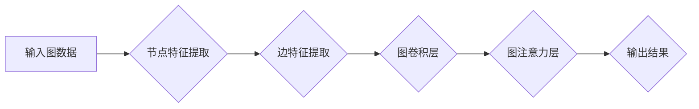

> 图神经网络(GNN)、图数据、节点特征、边特征、图卷积、图注意力机制、深度学习、机器学习

## 1. 背景介绍

在数据爆炸的时代，传统机器学习模型难以有效处理复杂、非结构化的图数据。图数据，以节点和边表示关系，广泛存在于社交网络、推荐系统、生物网络、知识图谱等领域。图神经网络(GNN)应运而生，为图数据分析提供了强大的工具。

GNN 是一种基于深度学习的图模型，能够学习图结构中节点和边的特征，并进行预测或分类。与传统的机器学习模型不同，GNN 可以捕获图结构中的全局信息，从而更好地理解图数据的复杂关系。

## 2. 核心概念与联系

图神经网络的核心概念包括：

* **节点(Node)：** 图中的基本单元，代表图中的实体或对象。
* **边(Edge)：** 连接节点的线，代表节点之间的关系。
* **特征(Feature)：** 节点和边的属性描述，例如节点的年龄、性别、边类型的强度等。
* **邻域(Neighborhood)：** 节点与其直接连接的节点集合。

GNN 通过迭代更新节点特征的方式，学习图结构中的信息。

**Mermaid 流程图:**



## 3. 核心算法原理 & 具体操作步骤

### 3.1  算法原理概述

图神经网络的核心算法是图卷积(Graph Convolution)。图卷积操作类似于传统的卷积神经网络中的卷积操作，但它作用于图结构上的节点特征。

图卷积的基本思想是：将节点的特征与其邻域节点的特征进行聚合，得到新的节点特征。聚合操作通常使用加权平均或其他聚合函数。

### 3.2  算法步骤详解

1. **初始化节点特征:** 为每个节点赋予初始特征向量。
2. **图卷积层:** 对每个节点进行图卷积操作，更新节点特征。
3. **激活函数:** 应用激活函数对更新后的节点特征进行非线性变换。
4. **重复步骤2和3:** 重复图卷积层和激活函数，直到达到预设的迭代次数或收敛条件。
5. **输出结果:** 将最终的节点特征作为模型的输出。

### 3.3  算法优缺点

**优点:**

* 可以捕获图结构中的全局信息。
* 能够处理非结构化数据。
* 在许多图数据分析任务中表现出色。

**缺点:**

* 计算复杂度较高。
* 对于大型图数据，训练时间较长。
* 容易受到噪声数据的影响。

### 3.4  算法应用领域

图神经网络在以下领域有广泛的应用:

* **社交网络分析:** 用户关系分析、社区发现、推荐系统。
* **知识图谱推理:** 实体关系抽取、知识问答、知识图谱补全。
* **药物研发:** 药物分子结构分析、药物相互作用预测。
* **生物信息学:** 蛋白质相互作用网络分析、疾病诊断。

## 4. 数学模型和公式 & 详细讲解 & 举例说明

### 4.1  数学模型构建

图神经网络的数学模型可以表示为一个图卷积层堆叠结构。

假设图 G = (V, E)，其中 V 是节点集合，E 是边集合。每个节点 v ∈ V 都有一个特征向量 h_v ∈ R^d。图卷积层可以表示为：

```latex
h'_v = \sigma(\sum_{u \in N(v)} \frac{e_{uv}}{ \sum_{w \in N(v)} e_{uv}} W h_u)
```

其中：

* h'_v 是节点 v 的更新后的特征向量。
* N(v) 是节点 v 的邻域节点集合。
* e_{uv} 是节点 u 和 v 之间的边权重。
* W 是一个权重矩阵。
* σ 是一个激活函数。

### 4.2  公式推导过程

图卷积层的公式推导过程可以参考相关文献，例如：

* Kipf, T. N., & Welling, M. (2016). Semi-supervised classification with graph convolutional networks.

### 4.3  案例分析与讲解

例如，在社交网络分析中，我们可以使用图卷积网络来预测用户之间的关系。

节点特征可以包含用户的年龄、性别、兴趣爱好等信息。边特征可以包含用户之间的互动关系，例如点赞、评论、转发等。

通过图卷积层，模型可以学习用户之间的关系模式，并预测用户之间的潜在关系。

## 5. 项目实践：代码实例和详细解释说明

### 5.1  开发环境搭建

* Python 3.6+
* TensorFlow/PyTorch
* NetworkX

### 5.2  源代码详细实现

```python
import tensorflow as tf
import networkx as nx

# 定义图卷积层
class GraphConvLayer(tf.keras.layers.Layer):
    def __init__(self, units, activation=None):
        super(GraphConvLayer, self).__init__()
        self.units = units
        self.activation = activation
        self.W = tf.Variable(tf.random.normal([units, units]))

    def call(self, inputs):
        # 输入：节点特征矩阵，邻接矩阵
        features = inputs[0]
        adj_matrix = inputs[1]
        # 图卷积操作
        output = tf.matmul(adj_matrix, tf.matmul(features, self.W))
        if self.activation:
            output = self.activation(output)
        return output

# 定义图神经网络模型
class GNNModel(tf.keras.Model):
    def __init__(self, units, activation='relu'):
        super(GNNModel, self).__init__()
        self.conv1 = GraphConvLayer(units, activation)
        self.conv2 = GraphConvLayer(units, activation)
        self.output = tf.keras.layers.Dense(1)

    def call(self, inputs):
        features, adj_matrix = inputs
        x = self.conv1([features, adj_matrix])
        x = self.conv2([x, adj_matrix])
        output = self.output(x)
        return output

# 加载图数据
graph = nx.karate_club_graph()
features = nx.to_numpy_array(graph.nodes(data=True))[:, 1]
adj_matrix = nx.to_numpy_array(graph.adj_matrix())

# 创建模型并训练
model = GNNModel(units=32)
model.compile(optimizer='adam', loss='mse')
model.fit([features, adj_matrix], labels, epochs=10)

```

### 5.3  代码解读与分析

* 代码首先定义了图卷积层和图神经网络模型。
* 图卷积层使用矩阵乘法和激活函数实现图卷积操作。
* 图神经网络模型将多个图卷积层堆叠在一起，并使用全连接层进行输出。
* 代码然后加载图数据，并使用模型训练。

### 5.4  运行结果展示

训练完成后，模型可以用于预测图数据中的各种信息，例如节点分类、边预测等。

## 6. 实际应用场景

### 6.1  推荐系统

图神经网络可以用于构建基于图结构的推荐系统，例如推荐用户可能感兴趣的商品、电影或文章。

### 6.2  知识图谱补全

图神经网络可以用于知识图谱补全，例如预测实体之间的关系或填充缺失的知识。

### 6.3  药物研发

图神经网络可以用于药物研发，例如预测药物分子与蛋白质的相互作用或发现新的药物候选物。

### 6.4  未来应用展望

图神经网络在未来将有更广泛的应用，例如：

* **自动驾驶:** 图神经网络可以用于构建交通网络模型，帮助自动驾驶汽车更好地理解道路环境。
* **金融风险管理:** 图神经网络可以用于识别金融网络中的风险节点，帮助金融机构更好地管理风险。
* **医疗诊断:** 图神经网络可以用于分析患者的医疗记录和基因信息，帮助医生做出更准确的诊断。

## 7. 工具和资源推荐

### 7.1  学习资源推荐

* **书籍:**
    * 《图神经网络》
    * 《深度学习》
* **在线课程:**
    * Coursera: Graph Neural Networks Specialization
    * Udacity: Deep Learning Nanodegree

### 7.2  开发工具推荐

* **TensorFlow:** https://www.tensorflow.org/
* **PyTorch:** https://pytorch.org/
* **NetworkX:** https://networkx.org/

### 7.3  相关论文推荐

* Kipf, T. N., & Welling, M. (2016). Semi-supervised classification with graph convolutional networks.
* Veličković, P., et al. (2018). Graph attention networks.

## 8. 总结：未来发展趋势与挑战

### 8.1  研究成果总结

图神经网络在图数据分析领域取得了显著的成果，在许多应用场景中表现出色。

### 8.2  未来发展趋势

* **模型效率:** 研究更高效的图神经网络模型，降低计算复杂度和训练时间。
* **可解释性:** 提高图神经网络模型的可解释性，帮助用户更好地理解模型的决策过程。
* **动态图:** 研究处理动态图数据的图神经网络模型。
* **联邦学习:** 研究在联邦学习框架下训练图神经网络模型。

### 8.3  面临的挑战

* **大规模图数据处理:** 对于大型图数据，图神经网络的训练和推理仍然面临挑战。
* **数据稀疏性:** 图数据通常是稀疏的，这会影响图神经网络的训练效果。
* **模型泛化能力:** 图神经网络的泛化能力仍然需要进一步提高。

### 8.4  研究展望

未来，图神经网络的研究将继续深入，在更多领域发挥重要作用。

## 9. 附录：常见问题与解答

* **什么是图卷积？**

图卷积是一种类似于传统卷积神经网络中的卷积操作，但它作用于图结构上的节点特征。

* **图神经网络有哪些应用场景？**

图神经网络在社交网络分析、知识图谱推理、药物研发、生物信息学等领域有广泛的应用。

* **如何选择合适的图神经网络模型？**

选择合适的图神经网络模型需要根据具体应用场景和数据特点进行选择。

* **如何训练图神经网络模型？**

训练图神经网络模型需要使用图数据和相应的标签信息，并使用深度学习框架进行训练。


作者：禅与计算机程序设计艺术 / Zen and the Art of Computer Programming 
<end_of_turn>