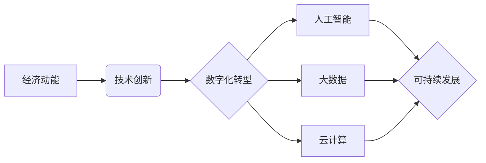

> 世界经济，动能不足，技术创新，数字化转型，人工智能，大数据，云计算，可持续发展

## 1. 背景介绍

全球经济近年来呈现出增长乏力的趋势，许多发达国家和新兴市场都面临着经济动能不足的挑战。传统经济增长模式已不再有效，需要探索新的驱动力来推动经济发展。

## 2. 核心概念与联系

**2.1  经济动能**

经济动能是指推动经济增长的内在力量，包括技术创新、人力资本、制度环境、市场机制等多方面因素。

**2.2  技术创新**

技术创新是经济增长的关键驱动力，它可以提高生产效率、创造新的产品和服务，并推动产业结构升级。

**2.3  数字化转型**

数字化转型是指利用数字技术改造传统产业和商业模式，提升企业效率、降低成本、创造新的价值。

**2.4  人工智能、大数据、云计算**

人工智能、大数据、云计算等新兴技术是数字化转型的核心力量，它们可以为经济发展提供新的机遇。

**2.5  可持续发展**

可持续发展是指在满足当前需求的同时，不损害后代满足其自身需求的能力。

**2.6  核心概念关系图**

## 3. 核心算法原理 & 具体操作步骤

**3.1  算法原理概述**

**3.2  算法步骤详解**

**3.3  算法优缺点**

**3.4  算法应用领域**

## 4. 数学模型和公式 & 详细讲解 & 举例说明

**4.1  数学模型构建**

**4.2  公式推导过程**

**4.3  案例分析与讲解**

## 5. 项目实践：代码实例和详细解释说明

**5.1  开发环境搭建**

**5.2  源代码详细实现**

**5.3  代码解读与分析**

**5.4  运行结果展示**

## 6. 实际应用场景

**6.1  案例分析**

**6.2  应用效果评估**

**6.3  未来应用展望**

## 7. 工具和资源推荐

**7.1  学习资源推荐**

**7.2  开发工具推荐**

**7.3  相关论文推荐**

## 8. 总结：未来发展趋势与挑战

**8.1  研究成果总结**

**8.2  未来发展趋势**

**8.3  面临的挑战**

**8.4  研究展望**

## 9. 附录：常见问题与解答

<end_of_turn>