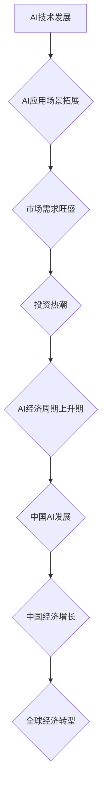

> AI经济周期、中国AI发展、机遇与挑战、算法原理、应用场景、未来趋势

## 1. 背景介绍

人工智能（AI）技术近年来发展迅速，已成为全球经济发展的重要驱动力。从自动驾驶到医疗诊断，从金融风控到个性化推荐，AI技术的应用场景日益广泛，深刻地改变着人们的生活方式和生产方式。

中国作为世界第二大经济体，在AI领域也取得了显著的进展。近年来，中国政府高度重视AI发展，出台了一系列政策措施，鼓励企业和科研机构加大AI研发投入。同时，中国拥有庞大的数据资源和市场规模，为AI技术的应用提供了良好的基础。

然而，中国AI发展也面临着诸多挑战。一方面，AI技术本身仍处于发展初期，许多关键技术尚未成熟。另一方面，中国AI产业链相对薄弱，核心技术和关键零部件依赖进口。此外，AI技术应用还存在伦理和安全等问题，需要得到妥善解决。

## 2. 核心概念与联系

**2.1 AI经济周期**

AI经济周期是指AI技术发展和应用带来的经济周期性波动。

* **上升期:** AI技术快速发展，应用场景不断拓展，市场需求旺盛，投资热潮涌现。
* **成熟期:** AI技术逐渐成熟，应用场景更加广泛，市场竞争加剧，企业开始注重盈利能力。
* **衰退期:** AI技术发展放缓，市场需求下降，投资热情减退，企业面临生存压力。

**2.2 中国AI发展与AI经济周期**

中国AI发展与AI经济周期密切相关。随着中国AI技术的快速发展，中国正处于AI经济周期的上升期。

**2.3 AI经济周期与中国经济发展**

AI经济周期对中国经济发展具有重要影响。AI技术的应用可以提高生产效率，降低生产成本，促进经济增长。同时，AI技术也可能导致部分产业结构调整，带来新的就业机会。

**2.4  AI经济周期与全球经济发展**

AI经济周期也是全球经济发展的重要趋势。AI技术的应用将深刻地改变全球经济格局，推动全球经济向智能化、数字化转型。

**Mermaid 流程图**



## 3. 核心算法原理 & 具体操作步骤

**3.1 算法原理概述**

深度学习是AI领域最热门的技术之一，其核心是利用多层神经网络来模拟人类大脑的学习过程。深度学习算法能够从海量数据中自动提取特征，并进行复杂的模式识别和预测。

**3.2 算法步骤详解**

1. **数据预处理:** 将原始数据进行清洗、转换和格式化，使其适合深度学习算法的训练。
2. **网络结构设计:** 根据具体任务需求，设计深度神经网络的结构，包括层数、节点数、激活函数等参数。
3. **模型训练:** 使用训练数据对深度神经网络进行训练，调整网络参数，使其能够准确地预测目标输出。
4. **模型评估:** 使用测试数据对训练好的模型进行评估，衡量模型的准确率、召回率等指标。
5. **模型部署:** 将训练好的模型部署到实际应用场景中，用于进行预测或决策。

**3.3 算法优缺点**

**优点:**

* 能够自动提取特征，无需人工特征工程。
* 能够处理海量数据，学习复杂模式。
* 在图像识别、语音识别、自然语言处理等领域取得了突破性进展。

**缺点:**

* 训练数据量要求高，需要大量的标注数据。
* 计算资源消耗大，训练时间长。
* 模型解释性差，难以理解模型的决策过程。

**3.4 算法应用领域**

* **图像识别:** 人脸识别、物体检测、图像分类等。
* **语音识别:** 语音转文本、语音助手等。
* **自然语言处理:** 机器翻译、文本摘要、情感分析等。
* **推荐系统:** 商品推荐、内容推荐等。
* **医疗诊断:** 疾病诊断、影像分析等。

## 4. 数学模型和公式 & 详细讲解 & 举例说明

**4.1 数学模型构建**

深度学习模型的核心是神经网络，其结构可以抽象为一个多层感知机（MLP）。每个神经元接收多个输入信号，并通过权重进行加权求和，然后经过激活函数进行非线性变换，输出一个信号。

**4.2 公式推导过程**

* **激活函数:** 常见的激活函数包括 sigmoid 函数、ReLU 函数等。

* **损失函数:** 用于衡量模型预测结果与真实值的差距，常见的损失函数包括均方误差（MSE）、交叉熵损失等。

* **梯度下降:** 用于更新模型参数，使其朝着最小化损失函数的方向进行调整。

**4.3 案例分析与讲解**

以图像分类为例，假设我们有一个包含10个类别的数据集，每个类别有1000张图片。我们可以使用深度学习模型来训练一个分类器，能够将新的图片分类到正确的类别中。

训练过程如下：

1. 将数据集随机划分成训练集和测试集。
2. 设计一个深度神经网络模型，例如卷积神经网络（CNN）。
3. 使用训练集数据训练模型，并使用损失函数和梯度下降算法更新模型参数。
4. 使用测试集数据评估模型的性能，例如准确率、召回率等。

## 5. 项目实践：代码实例和详细解释说明

**5.1 开发环境搭建**

* Python 3.x
* TensorFlow 或 PyTorch 深度学习框架
* CUDA 和 cuDNN GPU加速库

**5.2 源代码详细实现**

```python
import tensorflow as tf

# 定义模型结构
model = tf.keras.models.Sequential([
    tf.keras.layers.Conv2D(32, (3, 3), activation='relu', input_shape=(28, 28, 1)),
    tf.keras.layers.MaxPooling2D((2, 2)),
    tf.keras.layers.Conv2D(64, (3, 3), activation='relu'),
    tf.keras.layers.MaxPooling2D((2, 2)),
    tf.keras.layers.Flatten(),
    tf.keras.layers.Dense(10, activation='softmax')
])

# 编译模型
model.compile(optimizer='adam',
              loss='sparse_categorical_crossentropy',
              metrics=['accuracy'])

# 训练模型
model.fit(x_train, y_train, epochs=10)

# 评估模型
loss, accuracy = model.evaluate(x_test, y_test)
print('Test loss:', loss)
print('Test accuracy:', accuracy)
```

**5.3 代码解读与分析**

* 代码定义了一个简单的卷积神经网络模型，用于手写数字识别任务。
* 模型包含两层卷积层、两层最大池化层、一层全连接层和一层输出层。
* 模型使用Adam优化器、交叉熵损失函数和准确率作为评估指标。
* 模型使用训练数据进行训练，并使用测试数据进行评估。

**5.4 运行结果展示**

训练完成后，模型的准确率通常会达到较高的水平，例如98%以上。

## 6. 实际应用场景

**6.1 医疗诊断**

* **疾病诊断:** 利用深度学习算法分析患者的影像数据（如X光片、CT扫描）和临床数据，辅助医生诊断疾病。
* **药物研发:** 利用深度学习算法分析药物分子结构和生物活性数据，加速药物研发过程。

**6.2 金融风控**

* **欺诈检测:** 利用深度学习算法分析交易数据，识别异常交易行为，防止金融欺诈。
* **信用评估:** 利用深度学习算法分析客户的信用历史数据，评估客户的信用风险。

**6.3 自动驾驶**

* **目标检测:** 利用深度学习算法识别道路上的车辆、行人、交通信号灯等目标。
* **路径规划:** 利用深度学习算法规划车辆行驶路径，避免碰撞事故。

**6.4 其他应用场景**

* **智能客服:** 利用深度学习算法构建智能聊天机器人，为客户提供24小时在线服务。
* **个性化推荐:** 利用深度学习算法分析用户的行为数据，推荐个性化的商品、内容或服务。

**6.5 未来应用展望**

随着AI技术的不断发展，其应用场景将更加广泛，例如：

* **个性化医疗:** 根据患者的基因信息、生活习惯等数据，提供个性化的医疗方案。
* **智能制造:** 利用AI技术实现智能生产线，提高生产效率和产品质量。
* **智慧城市:** 利用AI技术构建智慧城市，提高城市管理效率和居民生活质量。

## 7. 工具和资源推荐

**7.1 学习资源推荐**

* **在线课程:** Coursera、edX、Udacity 等平台提供丰富的AI课程。
* **书籍:** 《深度学习》、《机器学习》、《人工智能导论》等书籍。
* **开源项目:** TensorFlow、PyTorch、Keras 等开源深度学习框架。

**7.2 开发工具推荐**

* **Python:** 深度学习开发的主要编程语言。
* **Jupyter Notebook:** 用于深度学习代码开发和实验的交互式环境。
* **GPU:** 加速深度学习训练的硬件设备。

**7.3 相关论文推荐**

* **《ImageNet Classification with Deep Convolutional Neural Networks》**
* **《Attention Is All You Need》**
* **《BERT: Pre-training of Deep Bidirectional Transformers for Language Understanding》**

## 8. 总结：未来发展趋势与挑战

**8.1 研究成果总结**

近年来，AI技术取得了显著进展，在图像识别、语音识别、自然语言处理等领域取得了突破性进展。

**8.2 未来发展趋势**

* **模型规模和能力提升:** 未来AI模型将更加强大，能够处理更复杂的任务。
* **算法效率提升:** 未来AI算法将更加高效，能够在更短的时间内完成训练和推理。
* **跨模态学习:** 未来AI模型将能够处理多种模态数据，例如文本、图像、音频等。
* **边缘计算:** 未来AI模型将部署到边缘设备，实现更快速的响应和更低的延迟。

**8.3 面临的挑战**

* **数据安全和隐私保护:** AI模型的训练和应用需要大量数据，如何保证数据安全和隐私保护是一个重要挑战。
* **算法可解释性和公平性:** AI模型的决策过程往往难以理解，如何提高算法的可解释性和公平性是一个重要挑战。
* **伦理和社会影响:** AI技术的应用可能带来一些伦理和社会问题，需要进行深入研究和探讨。

**8.4 研究展望**

未来，AI研究将继续朝着更智能、更安全、更可解释的方向发展。


## 9. 附录：常见问题与解答

**9.1 什么是深度学习？**

深度学习是一种机器学习的子领域，它利用多层神经网络来模拟人类大脑的学习过程。

**9.2 深度学习有哪些应用场景？**

深度学习的应用场景非常广泛，包括图像识别、语音识别、自然语言处理、推荐系统、医疗诊断、金融风控等。

**9.3 如何学习深度学习？**

可以通过在线课程、书籍、开源项目等方式学习深度学习。

**9.4 深度学习有哪些主流框架？**

主流深度学习框架包括 TensorFlow、PyTorch、Keras 等。

**9.5 深度学习有哪些挑战？**

深度学习面临着数据安全和隐私保护、算法可解释性和公平性、伦理和社会影响等挑战。


作者：禅与计算机程序设计艺术 / Zen and the Art of Computer Programming 
<end_of_turn>