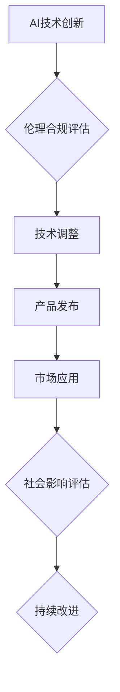

> 人工智能，创业，伦理，合规，策略，风险管理，社会责任，法律法规

## 1. 背景介绍

人工智能（AI）技术近年来发展迅速，已渗透到各个领域，为社会带来了巨大变革。AI创业正成为新的热点，涌现出许多创新型企业和应用。然而，AI技术的快速发展也带来了新的伦理和合规挑战。

**1.1 AI 创业的机遇与挑战**

AI创业机遇巨大，可以解决传统行业难题，创造新的商业模式和价值。例如，在医疗领域，AI可以辅助诊断、预测疾病风险，提高医疗效率和质量；在金融领域，AI可以用于风险评估、欺诈检测，提升金融服务安全性和效率。

然而，AI创业也面临着诸多挑战：

* **伦理风险:** AI算法可能存在偏见、歧视等问题，导致不公平的结果，损害个体权益。
* **合规风险:** AI技术应用需要遵守相关法律法规，例如数据隐私保护、算法透明度等。
* **技术风险:** AI技术本身存在不确定性，算法可能出现错误或漏洞，导致不可预知的风险。
* **社会影响:** AI技术的广泛应用可能导致就业岗位减少、社会结构变化等问题。

**1.2 伦理合规的重要性**

在AI创业过程中，伦理合规问题至关重要。

* **维护社会信任:** 伦理合规的AI应用可以赢得公众信任，促进AI技术的健康发展。
* **规避法律风险:** 遵守相关法律法规可以避免法律诉讼和经济损失。
* **提升企业声誉:** 具有社会责任感的AI企业可以获得更好的市场口碑和品牌形象。

## 2. 核心概念与联系

**2.1 核心概念**

* **人工智能 (AI):** 指能够模拟人类智能行为的计算机系统，例如学习、推理、决策、感知等。
* **伦理:** 指关于什么是对的和什么是错的道德准则和价值观。
* **合规:** 指遵守法律法规和行业标准的行为。

**2.2 核心概念联系**

AI创业需要在技术创新与伦理合规之间取得平衡。

* **技术创新:** 推动AI技术的进步，开发新的应用场景。
* **伦理合规:** 确保AI技术的应用符合伦理道德和法律法规，避免负面影响。

**2.3  Mermaid 流程图**



## 3. 核心算法原理 & 具体操作步骤

**3.1 算法原理概述**

深度学习是AI领域的重要算法之一，其核心原理是利用多层神经网络模拟人类大脑的学习过程。

**3.2 算法步骤详解**

1. **数据收集和预处理:** 收集大量相关数据，并进行清洗、格式化等预处理工作。
2. **网络结构设计:** 根据任务需求设计神经网络的层数、节点数量等结构参数。
3. **模型训练:** 利用训练数据训练神经网络，调整网络参数，使模型能够准确预测或分类。
4. **模型评估:** 使用测试数据评估模型的性能，例如准确率、召回率等指标。
5. **模型部署:** 将训练好的模型部署到实际应用场景中。

**3.3 算法优缺点**

* **优点:** 深度学习算法能够自动学习特征，具有强大的学习能力和泛化能力。
* **缺点:** 深度学习算法需要大量数据进行训练，训练时间长，计算资源消耗大。

**3.4 算法应用领域**

深度学习算法广泛应用于图像识别、自然语言处理、语音识别、机器翻译等领域。

## 4. 数学模型和公式 & 详细讲解 & 举例说明

**4.1 数学模型构建**

深度学习模型可以看作是一个复杂的数学函数，其输入是数据特征，输出是预测结果。

**4.2 公式推导过程**

深度学习模型的训练过程是通过优化模型参数来最小化损失函数的过程。损失函数衡量模型预测结果与真实结果之间的差异。常用的损失函数包括均方误差、交叉熵等。

**4.3 案例分析与讲解**

例如，在图像分类任务中，可以使用卷积神经网络（CNN）作为深度学习模型。CNN模型通过卷积层、池化层和全连接层来提取图像特征，并最终输出类别概率。

## 5. 项目实践：代码实例和详细解释说明

**5.1 开发环境搭建**

可以使用Python语言和深度学习框架（例如TensorFlow、PyTorch）进行AI项目开发。

**5.2 源代码详细实现**

```python
import tensorflow as tf

# 定义模型结构
model = tf.keras.models.Sequential([
    tf.keras.layers.Conv2D(32, (3, 3), activation='relu', input_shape=(28, 28, 1)),
    tf.keras.layers.MaxPooling2D((2, 2)),
    tf.keras.layers.Conv2D(64, (3, 3), activation='relu'),
    tf.keras.layers.MaxPooling2D((2, 2)),
    tf.keras.layers.Flatten(),
    tf.keras.layers.Dense(10, activation='softmax')
])

# 编译模型
model.compile(optimizer='adam',
              loss='sparse_categorical_crossentropy',
              metrics=['accuracy'])

# 训练模型
model.fit(x_train, y_train, epochs=5)

# 评估模型
loss, accuracy = model.evaluate(x_test, y_test)
print('Test loss:', loss)
print('Test accuracy:', accuracy)
```

**5.3 代码解读与分析**

这段代码定义了一个简单的卷积神经网络模型，用于手写数字识别任务。

* `tf.keras.models.Sequential` 创建一个顺序模型，层级结构清晰。
* `tf.keras.layers.Conv2D` 定义卷积层，提取图像特征。
* `tf.keras.layers.MaxPooling2D` 定义池化层，降低特征维度。
* `tf.keras.layers.Flatten` 将多维特征转换为一维向量。
* `tf.keras.layers.Dense` 定义全连接层，输出类别概率。
* `model.compile` 编译模型，指定优化器、损失函数和评价指标。
* `model.fit` 训练模型，使用训练数据进行迭代训练。
* `model.evaluate` 评估模型，使用测试数据计算损失和准确率。

**5.4 运行结果展示**

训练完成后，可以将模型应用于新的手写数字图像，预测其类别。

## 6. 实际应用场景

**6.1 医疗领域**

* **疾病诊断:** AI可以辅助医生诊断疾病，例如癌症、心血管疾病等。
* **药物研发:** AI可以加速药物研发过程，例如预测药物活性、筛选候选药物等。
* **个性化医疗:** AI可以根据患者的基因信息、生活习惯等数据，提供个性化的医疗方案。

**6.2 金融领域**

* **风险评估:** AI可以评估贷款申请者的信用风险，帮助金融机构做出更明智的贷款决策。
* **欺诈检测:** AI可以识别金融交易中的欺诈行为，例如信用卡盗刷、网络诈骗等。
* **投资决策:** AI可以分析市场数据，提供投资建议，帮助投资者做出更优的投资决策。

**6.3 其他领域**

* **教育领域:** AI可以个性化教学，提供智能辅导，提高学习效率。
* **交通领域:** AI可以辅助驾驶，提高交通安全，优化交通流量。
* **制造业:** AI可以实现智能制造，提高生产效率，降低生产成本。

**6.4 未来应用展望**

随着AI技术的不断发展，其应用场景将更加广泛，例如：

* **智能机器人:** AI可以赋予机器人更强的智能能力，使其能够完成更复杂的任务。
* **虚拟助手:** AI可以开发更智能的虚拟助手，例如智能家居助手、智能客服等。
* **个性化体验:** AI可以根据用户的喜好和需求，提供更加个性化的产品和服务。

## 7. 工具和资源推荐

**7.1 学习资源推荐**

* **在线课程:** Coursera、edX、Udacity等平台提供丰富的AI课程。
* **书籍:** 《深度学习》、《人工智能：一个现代方法》等书籍。
* **开源项目:** TensorFlow、PyTorch等开源深度学习框架。

**7.2 开发工具推荐**

* **Python:** AI开发的主要编程语言。
* **Jupyter Notebook:** 用于代码编写、数据分析和可视化。
* **深度学习框架:** TensorFlow、PyTorch、Keras等。

**7.3 相关论文推荐**

* **《ImageNet Classification with Deep Convolutional Neural Networks》**
* **《Attention Is All You Need》**
* **《BERT: Pre-training of Deep Bidirectional Transformers for Language Understanding》**

## 8. 总结：未来发展趋势与挑战

**8.1 研究成果总结**

近年来，AI技术取得了长足进步，在各个领域都取得了显著应用。

**8.2 未来发展趋势**

* **模型规模和能力提升:** AI模型将更加强大，能够处理更复杂的任务。
* **边缘计算和部署:** AI模型将部署到边缘设备，实现更实时、更低延迟的应用。
* **跨模态学习:** AI模型将能够处理多种数据类型，例如文本、图像、音频等。

**8.3 面临的挑战**

* **数据安全和隐私保护:** AI模型训练需要大量数据，如何保证数据安全和隐私保护是一个重要挑战。
* **算法透明度和可解释性:** AI模型的决策过程往往难以理解，如何提高算法透明度和可解释性是一个关键问题。
* **伦理和社会影响:** AI技术的应用可能带来伦理和社会问题，需要认真思考和应对。

**8.4 研究展望**

未来，AI研究将更加注重伦理、可解释性和安全性，并探索更广泛的应用场景。


## 9. 附录：常见问题与解答

**9.1 如何评估AI模型的性能？**

常用的评估指标包括准确率、召回率、F1-score、AUC等。

**9.2 如何解决AI模型的过拟合问题？**

可以使用正则化、Dropout、数据增强等技术来解决过拟合问题。

**9.3 如何保证AI模型的公平性和不偏见性？**

需要使用多样化的训练数据，并对模型进行公平性评估和调整。


作者：禅与计算机程序设计艺术 / Zen and the Art of Computer Programming 
<end_of_turn>