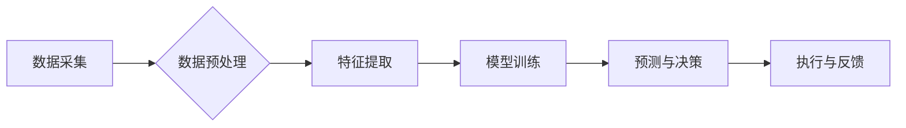

> AI代理，工作流分析，数据分析，机器学习，预测建模，自动化决策

## 1. 背景介绍

在当今数据爆炸的时代，企业面临着海量数据的处理和分析挑战。如何从海量数据中提取有价值的洞察，并将其转化为可操作的决策，成为企业竞争力的关键。AI代理作为一种新兴的技术，正在改变着我们与数据交互的方式。它能够自动学习和理解数据模式，并根据这些模式做出智能决策，从而提高工作效率和决策准确性。

AI代理工作流中的分析引擎是实现智能决策的核心组件。它负责从数据中提取特征，构建预测模型，并为AI代理提供决策支持。传统的分析引擎通常依赖于人工特征工程和预设规则，而AI代理工作流中的分析引擎则更加智能化，能够自动学习和发现数据中的隐藏模式。

## 2. 核心概念与联系

**2.1 AI代理**

AI代理是一种能够自主学习、感知环境并做出决策的智能系统。它通常由以下几个核心组件组成：

* **感知模块:** 收集和处理来自环境的信息，例如传感器数据、文本数据、图像数据等。
* **推理模块:** 分析和理解感知到的信息，并根据预先定义的目标或规则做出决策。
* **执行模块:** 将决策转化为实际行动，例如控制机器、发送指令、执行任务等。

**2.2 工作流分析**

工作流分析是指对业务流程进行建模、分析和优化的一种方法。它可以帮助企业识别流程中的瓶颈、冗余和浪费，并提出改进建议。

**2.3 分析引擎**

分析引擎是AI代理工作流中的核心组件，负责从数据中提取特征、构建预测模型和提供决策支持。

**2.4 核心架构**

AI代理工作流中的分析引擎通常采用以下架构：



**数据采集:** 从各种数据源收集相关数据。

**数据预处理:** 对收集到的数据进行清洗、转换和格式化，使其适合模型训练。

**特征提取:** 从数据中提取有价值的特征，这些特征可以是原始数据、统计特征、文本特征等。

**模型训练:** 使用机器学习算法对提取的特征进行训练，构建预测模型。

**预测与决策:** 将新的数据输入到训练好的模型中，进行预测并根据预测结果做出决策。

**执行与反馈:** 将决策转化为实际行动，并收集反馈信息，用于模型的进一步优化。

## 3. 核心算法原理 & 具体操作步骤

### 3.1  算法原理概述

AI代理工作流中的分析引擎通常采用以下几种核心算法：

* **监督学习:** 利用标记数据训练模型，预测新的数据标签。例如，分类、回归等任务。
* **无监督学习:** 从未标记数据中发现模式和结构。例如，聚类、降维等任务。
* **强化学习:** 通过与环境交互，学习最优策略。例如，游戏、机器人控制等任务。

### 3.2  算法步骤详解

**3.2.1 监督学习**

1. **数据收集:** 收集包含输入特征和输出标签的标记数据。
2. **数据预处理:** 对数据进行清洗、转换和格式化。
3. **特征工程:** 从数据中提取有价值的特征。
4. **模型选择:** 选择合适的监督学习算法，例如决策树、支持向量机、神经网络等。
5. **模型训练:** 使用标记数据训练模型，调整模型参数。
6. **模型评估:** 使用测试数据评估模型性能，例如准确率、召回率、F1-score等。
7. **模型部署:** 将训练好的模型部署到生产环境中，用于预测新的数据标签。

**3.2.2 无监督学习**

1. **数据收集:** 收集未标记数据。
2. **数据预处理:** 对数据进行清洗、转换和格式化。
3. **特征工程:** 从数据中提取有价值的特征。
4. **算法选择:** 选择合适的无监督学习算法，例如k-means聚类、主成分分析等。
5. **模型训练:** 使用未标记数据训练模型，发现数据中的模式和结构。
6. **模型评估:** 使用聚类指标或降维效果评估模型性能。
7. **模型部署:** 将训练好的模型部署到生产环境中，用于数据分析、异常检测等任务。

**3.2.3 强化学习**

1. **环境定义:** 定义强化学习环境，包括状态空间、动作空间和奖励函数。
2. **代理设计:** 设计AI代理，使其能够感知环境、做出决策并执行动作。
3. **策略学习:** 使用强化学习算法，例如Q-learning、SARSA等，训练代理学习最优策略。
4. **环境交互:** 让代理与环境交互，根据环境反馈调整策略。
5. **策略评估:** 使用奖励函数评估代理的策略效果。
6. **策略部署:** 将训练好的策略部署到生产环境中，让代理在实际环境中执行任务。

### 3.3  算法优缺点

**监督学习:**

* **优点:** 准确率高，能够处理分类、回归等多种任务。
* **缺点:** 需要大量标记数据，数据标注成本高。

**无监督学习:**

* **优点:** 不需要标记数据，能够发现数据中的隐藏模式。
* **缺点:** 模型解释性差，难以评估模型性能。

**强化学习:**

* **优点:** 能够学习最优策略，适用于复杂环境下的决策问题。
* **缺点:** 训练时间长，需要大量的环境交互数据。

### 3.4  算法应用领域

* **金融领域:** 欺诈检测、风险评估、投资决策等。
* **医疗领域:** 疾病诊断、药物研发、患者个性化治疗等。
* **电商领域:** 商品推荐、用户画像、精准营销等。
* **制造业:** 故障预测、生产优化、质量控制等。

## 4. 数学模型和公式 & 详细讲解 & 举例说明

### 4.1  数学模型构建

**4.1.1 监督学习模型**

假设我们有一个包含n个样本的数据集D，每个样本包含d个特征和一个标签y。我们想要训练一个模型f(x)来预测新的样本的标签。

**4.1.2 无监督学习模型**

无监督学习模型通常试图发现数据中的隐藏结构，例如聚类或降维。

**4.1.3 强化学习模型**

强化学习模型通常使用状态-动作-奖励的框架，其中状态表示环境的当前状态，动作表示代理可以采取的行动，奖励表示代理采取行动后的反馈。

### 4.2  公式推导过程

**4.2.1 监督学习模型**

常用的监督学习算法，例如线性回归，其目标是找到一个函数f(x)来最小化预测值与真实值的误差。

**损失函数:**

$$
L(f(x), y) = \frac{1}{2} \sum_{i=1}^{n} (f(x_i) - y_i)^2
$$

**梯度下降算法:**

$$
\theta = \theta - \alpha \nabla L(f(x), y)
$$

其中，$\theta$是模型参数，$\alpha$是学习率，$\nabla L(f(x), y)$是损失函数的梯度。

**4.2.2 无监督学习模型**

无监督学习模型的公式推导过程取决于具体的算法，例如k-means聚类的目标是找到k个聚类中心，使得每个样本到其所属聚类中心的距离最小。

**4.2.3 强化学习模型**

强化学习模型的目标是找到一个策略$\pi(s, a)$，使得代理在环境中获得最大的累积奖励。

**Bellman方程:**

$$
V(s) = \max_a \left[ R(s, a) + \gamma \sum_{s'} P(s' | s, a) V(s') \right]
$$

其中，$V(s)$是状态$s$的价值函数，$R(s, a)$是采取动作$a$在状态$s$获得的奖励，$\gamma$是折扣因子，$P(s' | s, a)$是采取动作$a$从状态$s$转移到状态$s'$的概率。

### 4.3  案例分析与讲解

**4.3.1 监督学习案例**

使用线性回归模型预测房价。

**数据:** 房屋面积、房间数量、地理位置等特征，以及对应的房价标签。

**模型训练:** 使用梯度下降算法训练线性回归模型，最小化预测房价与真实房价的误差。

**模型评估:** 使用测试数据评估模型的预测准确率。

**4.3.2 无监督学习案例**

使用k-means聚类算法将客户进行分组。

**数据:** 客户的购买记录、浏览历史、年龄、性别等特征。

**模型训练:** 使用k-means算法将客户分成k个聚类，每个聚类代表一类客户。

**模型分析:** 分析每个聚类的特征，了解不同客户群体的特点。

**4.3.3 强化学习案例**

使用Q-learning算法训练一个机器人控制游戏。

**环境:** 游戏环境，包括游戏地图、游戏规则、游戏目标。

**代理:** 机器人，可以采取移动、攻击等动作。

**奖励:** 当机器人完成游戏目标时获得奖励，否则获得惩罚。

**模型训练:** 使用Q-learning算法训练机器人，学习最优策略，使得机器人能够在游戏中获得最高奖励。

## 5. 项目实践：代码实例和详细解释说明

### 5.1  开发环境搭建

* **操作系统:** Ubuntu 20.04 LTS
* **编程语言:** Python 3.8
* **深度学习框架:** TensorFlow 2.0
* **数据处理库:** Pandas, NumPy
* **可视化库:** Matplotlib, Seaborn

### 5.2  源代码详细实现

```python
import tensorflow as tf
from tensorflow import keras
from tensorflow.keras import layers

# 定义模型架构
model = keras.Sequential(
    [
        layers.Dense(64, activation="relu", input_shape=(784,)),
        layers.Dense(10, activation="softmax"),
    ]
)

# 编译模型
model.compile(
    optimizer="adam",
    loss="sparse_categorical_crossentropy",
    metrics=["accuracy"],
)

# 加载MNIST数据集
(x_train, y_train), (x_test, y_test) = keras.datasets.mnist.load_data()

# 数据预处理
x_train = x_train.reshape(60000, 784).astype("float32") / 255
x_test = x_test.reshape(10000, 784).astype("float32") / 255

# 模型训练
model.fit(x_train, y_train, epochs=5)

# 模型评估
loss, accuracy = model.evaluate(x_test, y_test)
print("Test loss:", loss)
print("Test accuracy:", accuracy)
```

### 5.3  代码解读与分析

* **模型架构:** 使用了两个全连接层，第一层有64个神经元，激活函数为ReLU，输入层维度为784（MNIST图像的像素数）。第二层有10个神经元，激活函数为softmax，用于输出10个类别概率。
* **模型编译:** 使用Adam优化器，损失函数为稀疏类别交叉熵，评估指标为准确率。
* **数据预处理:** 将MNIST图像数据reshape成一维向量，并归一化到0到1之间。
* **模型训练:** 使用训练数据训练模型5个epoch。
* **模型评估:** 使用测试数据评估模型的性能，输出测试损失和准确