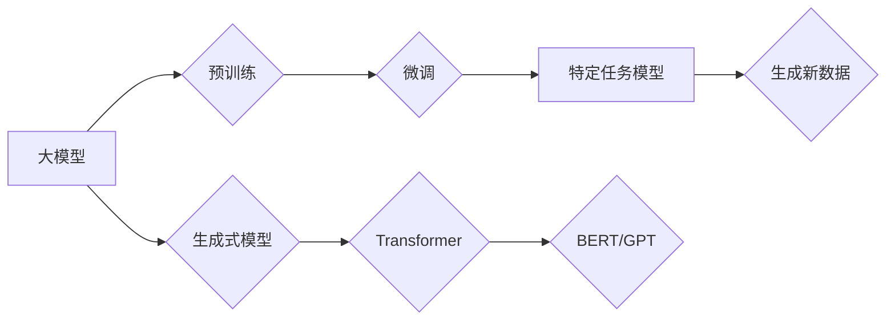

> 大模型、微调、生成式模型、古诗词、自然语言处理、Transformer、BERT、GPT

## 1. 背景介绍

近年来，深度学习技术取得了飞速发展，特别是生成式模型在文本生成、图像生成、音频生成等领域展现出强大的潜力。其中，基于Transformer架构的生成式模型，例如GPT、BERT等，在自然语言处理任务中取得了突破性的进展。

古诗词作为中华文化的瑰宝，蕴含着丰富的文化内涵和艺术魅力。近年来，利用深度学习技术生成古诗词引起了广泛关注。本文将从零开始，介绍大模型开发与微调的流程，并以古诗词生成为例，深入探讨生成式模型的原理、算法、实践以及应用场景。

## 2. 核心概念与联系

### 2.1 大模型

大模型是指参数量达到亿级甚至万亿级的深度学习模型。它们通常在海量数据上进行预训练，并能够泛化到各种下游任务。

### 2.2 微调

微调是指在预训练的大模型基础上，针对特定任务进行进一步训练的过程。通过微调，可以将大模型的通用能力应用于特定领域，提高模型的性能。

### 2.3 生成式模型

生成式模型是指能够根据输入数据生成新数据的模型。例如，文本生成模型可以根据输入的文本片段生成新的文本，图像生成模型可以根据输入的文本描述生成新的图像。

### 2.4 Transformer

Transformer是一种基于注意力机制的深度学习架构，在自然语言处理领域取得了显著的成果。它能够捕捉文本序列中的长距离依赖关系，并有效地处理文本数据。

### 2.5 BERT、GPT

BERT和GPT都是基于Transformer架构的生成式模型。BERT主要用于文本理解任务，而GPT主要用于文本生成任务。

**核心概念与联系流程图:**



## 3. 核心算法原理 & 具体操作步骤

### 3.1 算法原理概述

生成式模型的核心原理是学习数据之间的概率分布。通过训练，模型能够学习到数据的规律和模式，并根据这些规律生成新的数据。

### 3.2 算法步骤详解

1. **数据预处理:** 将原始数据进行清洗、格式化和编码，使其能够被模型理解。
2. **模型构建:** 选择合适的生成式模型架构，例如Transformer、GPT等，并根据任务需求进行参数设置。
3. **预训练:** 在海量数据上进行模型预训练，学习数据的整体规律和模式。
4. **微调:** 将预训练好的模型应用于特定任务，并根据任务数据进行微调，提高模型的性能。
5. **数据生成:** 使用微调后的模型，根据输入数据生成新的数据。

### 3.3 算法优缺点

**优点:**

* 能够生成高质量、多样化的文本数据。
* 能够泛化到各种下游任务。
* 训练效率高。

**缺点:**

* 需要海量数据进行预训练。
* 模型参数量大，计算资源需求高。
* 容易受到训练数据偏差的影响。

### 3.4 算法应用领域

* 文本生成：小说、诗歌、剧本等。
* 机器翻译：将一种语言翻译成另一种语言。
* 文本摘要：将长篇文本压缩成短篇摘要。
* 对话系统：与用户进行自然语言交互。

## 4. 数学模型和公式 & 详细讲解 & 举例说明

### 4.1 数学模型构建

生成式模型通常使用概率模型来表示数据的分布。例如，可以使用条件概率分布来表示给定输入数据的情况下，生成输出数据的概率。

### 4.2 公式推导过程

具体的公式推导过程取决于所使用的模型架构和任务需求。例如，GPT模型使用自回归语言模型，其目标函数是最大化生成文本序列的似然概率。

### 4.3 案例分析与讲解

假设我们想要训练一个生成古诗词的模型。我们可以使用BERT模型作为基础，并进行微调。

在微调过程中，我们可以使用古诗词数据集进行训练，并使用交叉熵损失函数来评估模型的性能。

## 5. 项目实践：代码实例和详细解释说明

### 5.1 开发环境搭建

需要安装Python、PyTorch或TensorFlow等深度学习框架，以及必要的库，例如transformers、datasets等。

### 5.2 源代码详细实现

```python
from transformers import AutoModelForCausalLM, AutoTokenizer

# 加载预训练模型和词典
model_name = "bert-base-uncased"
tokenizer = AutoTokenizer.from_pretrained(model_name)
model = AutoModelForCausalLM.from_pretrained(model_name)

# 定义古诗词生成函数
def generate_poem(prompt, max_length=50):
    inputs = tokenizer(prompt, return_tensors="pt")
    outputs = model.generate(**inputs, max_length=max_length)
    poem = tokenizer.decode(outputs[0], skip_special_tokens=True)
    return poem

# 生成古诗词
prompt = "春风拂柳绿"
poem = generate_poem(prompt)
print(poem)
```

### 5.3 代码解读与分析

这段代码首先加载预训练的BERT模型和词典。然后定义了一个`generate_poem`函数，该函数接受一个提示词和最大生成长度作为输入，并使用模型生成古诗词。

### 5.4 运行结果展示

运行代码后，会输出一个根据提示词生成的古诗词。

## 6. 实际应用场景

### 6.1 文学创作辅助工具

生成式模型可以帮助作家克服创作瓶颈，生成新的故事、诗歌、剧本等。

### 6.2 教育教学辅助工具

生成式模型可以生成个性化的学习内容，帮助学生更好地理解和掌握知识。

### 6.3 文本营销辅助工具

生成式模型可以帮助企业生成吸引人的广告文案、产品描述等。

### 6.4 未来应用展望

随着技术的进步，生成式模型将在更多领域得到应用，例如：

* 医疗诊断辅助
* 法律文本生成
* 代码生成

## 7. 工具和资源推荐

### 7.1 学习资源推荐

* **书籍:**
    * 《深度学习》
    * 《自然语言处理》
* **在线课程:**
    * Coursera
    * edX

### 7.2 开发工具推荐

* **Python:** 
* **PyTorch:** 
* **TensorFlow:** 
* **transformers:** 

### 7.3 相关论文推荐

* **BERT: Pre-training of Deep Bidirectional Transformers for Language Understanding**
* **GPT: Generative Pre-trained Transformer**

## 8. 总结：未来发展趋势与挑战

### 8.1 研究成果总结

近年来，生成式模型取得了显著的进展，能够生成高质量、多样化的文本数据。

### 8.2 未来发展趋势

* 模型规模的进一步扩大
* 跨模态生成模型的开发
* 生成式模型的伦理和安全问题研究

### 8.3 面临的挑战

* 数据偏差和公平性问题
* 模型的可解释性和可控性问题
* 生成式模型的潜在滥用风险

### 8.4 研究展望

未来，生成式模型将继续朝着更强大、更安全、更可解释的方向发展，并在更多领域发挥重要作用。

## 9. 附录：常见问题与解答

### 9.1 如何选择合适的生成式模型？

选择合适的生成式模型取决于具体的应用场景和任务需求。例如，对于文本生成任务，GPT模型通常效果较好；对于文本理解任务，BERT模型通常效果较好。

### 9.2 如何进行模型微调？

模型微调需要使用特定任务的数据进行训练，并调整模型的超参数。

### 9.3 如何评估生成式模型的性能？

可以使用BLEU、ROUGE等指标来评估生成式模型的性能。

### 9.4 如何避免生成式模型的潜在滥用风险？

需要制定相应的伦理规范和安全机制，并加强对生成式模型的监管。


作者：禅与计算机程序设计艺术 / Zen and the Art of Computer Programming 
<end_of_turn>