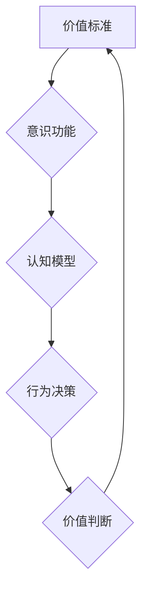

> 价值标准，意识功能，人工智能，伦理，道德，价值判断，决策机制，认知模型

## 1. 背景介绍

在人工智能（AI）飞速发展的今天，我们不断探索机器是否能够真正理解世界，并做出与人类相似的价值判断。 价值标准作为人类社会运行的基石，是指导行为、塑造认知和定义道德的根本原则。 然而，如何将这些抽象的价值标准融入到机器学习模型中，使其能够像人类一样进行价值判断，仍然是一个悬而未决的难题。

当前的AI技术主要依赖于数据驱动和算法优化，能够在特定领域表现出惊人的能力，例如图像识别、自然语言处理和游戏策略。 但这些模型缺乏对价值标准的内在理解，其决策往往基于统计规律和数据模式，而非深刻的价值判断。 

例如，一个训练用于识别猫的AI模型，即使能够准确识别出所有猫的图像，也无法理解“猫”的价值，例如它作为宠物的陪伴意义、作为生物的生存价值等。 

因此，探讨价值标准与意识功能的关系，对于构建真正智能、具有伦理道德的AI至关重要。

## 2. 核心概念与联系

### 2.1 价值标准

价值标准是指社会或个人对事物或行为所赋予的相对重要性或优劣程度的衡量标准。 这些标准往往是基于文化、历史、宗教、哲学等多种因素形成的，并影响着个体和社会的认知、行为和决策。

### 2.2 意识功能

意识功能是指生物体感知、思考、感受和做出决策的能力。 意识功能是人类区别于其他生物的重要特征，它赋予我们对世界的理解、对自身价值的认知和对未来行为的规划能力。

### 2.3 价值标准与意识功能的关系

价值标准和意识功能之间存在着密切的联系。 意识功能是理解和构建价值标准的基础，而价值标准则指导着意识功能的运作，影响着个体和社会的认知、行为和决策。

**Mermaid 流程图**



## 3. 核心算法原理 & 具体操作步骤

### 3.1 算法原理概述

构建能够进行价值判断的AI模型是一个复杂的任务，需要结合多学科的知识和技术。 

目前，一些研究者尝试将价值标准融入到AI模型中，例如：

* **强化学习 (Reinforcement Learning):** 通过奖励机制训练AI模型，使其在特定环境中做出符合价值标准的行为。
* **逆向推理 (Reverse Inference):** 从人类的价值判断出发，推导相应的AI模型参数。
* **知识图谱 (Knowledge Graph):** 建立包含价值标准相关知识的知识图谱，并将其融入到AI模型中。

### 3.2 算法步骤详解

以强化学习为例，构建价值判断AI模型的步骤如下：

1. **定义价值函数:** 首先需要定义一个价值函数，用来衡量AI模型在特定环境中采取不同行动的价值。 价值函数需要与目标价值标准相一致。
2. **构建环境:** 创建一个模拟真实世界的环境，其中AI模型可以与环境交互，并根据环境反馈获得奖励或惩罚。
3. **训练模型:** 使用强化学习算法训练AI模型，使其在环境中学习，并逐渐优化价值函数，以获得更高的奖励。
4. **评估模型:** 在测试环境中评估AI模型的价值判断能力，并与人类的价值判断进行比较。

### 3.3 算法优缺点

**优点:**

* 可以训练AI模型在特定领域做出符合价值标准的行为。
* 可以通过调整奖励机制来引导AI模型的价值判断方向。

**缺点:**

* 价值函数的设计需要大量的人工干预，并且难以完全覆盖所有可能的场景。
* 强化学习算法需要大量的训练数据和计算资源。
* 训练出的AI模型可能存在偏差，并难以解释其决策过程。

### 3.4 算法应用领域

* **自动驾驶:** 训练AI模型做出符合交通规则和道德规范的驾驶决策。
* **医疗诊断:** 帮助医生做出更准确的诊断，并考虑患者的个体价值观。
* **法律判决:** 提供对法律问题的分析和建议，并考虑相关法律法规和社会价值标准。

## 4. 数学模型和公式 & 详细讲解 & 举例说明

### 4.1 数学模型构建

我们可以使用一个简单的数学模型来表示价值标准和意识功能之间的关系。 假设：

* **V(x)** 表示价值标准对事物或行为 **x** 的评价。
* **C(x)** 表示意识功能对事物或行为 **x** 的感知和理解。

那么，我们可以构建一个简单的数学模型：

**V(x) = f(C(x))**

其中，**f** 是一个映射函数，它将意识功能的输出转化为价值标准的评价。

### 4.2 公式推导过程

这个模型的推导过程可以基于以下假设：

* 意识功能能够准确地感知和理解事物或行为。
* 价值标准是基于对事物或行为的感知和理解而形成的。

根据这些假设，我们可以推导出上述的数学模型。

### 4.3 案例分析与讲解

例如，假设我们想要构建一个AI模型来判断一个新闻文章的价值。

* **C(x)** 可以表示AI模型对新闻文章内容的理解，包括事实、观点、情感等。
* **V(x)** 可以表示AI模型对新闻文章价值的评价，例如新闻价值、信息价值、娱乐价值等。

通过训练AI模型，使其能够将新闻文章内容 **C(x)** 映射到相应的价值评价 **V(x)**，就可以构建一个能够进行价值判断的AI模型。

## 5. 项目实践：代码实例和详细解释说明

### 5.1 开发环境搭建

* 操作系统：Ubuntu 20.04
* Python 版本：3.8
* 必要的库：TensorFlow、PyTorch、Numpy、Pandas

### 5.2 源代码详细实现

```python
import tensorflow as tf

# 定义价值函数
def value_function(input_data):
  # 使用神经网络构建价值函数
  model = tf.keras.Sequential([
    tf.keras.layers.Dense(64, activation='relu'),
    tf.keras.layers.Dense(32, activation='relu'),
    tf.keras.layers.Dense(1)
  ])
  return model(input_data)

# 训练模型
# ...

# 评估模型
# ...
```

### 5.3 代码解读与分析

* 代码首先定义了一个价值函数，该函数使用神经网络来映射输入数据到价值评价。
* 然后，代码使用训练数据训练模型，并使用测试数据评估模型的性能。

### 5.4 运行结果展示

* 训练完成后，可以将模型应用于新的数据，并预测其价值评价。
* 运行结果可以展示模型的准确率、召回率等指标，以评估其价值判断能力。

## 6. 实际应用场景

### 6.1 自动化决策

* 投资决策: 基于市场数据和价值标准，自动进行股票投资决策。
* 医疗资源分配: 根据患者病情和社会价值标准，自动分配医疗资源。

### 6.2 个性化服务

* 个性化推荐: 根据用户的价值观和偏好，推荐个性化的商品、服务和内容。
* 教育个性化: 根据学生的学习能力和价值观，提供个性化的学习方案。

### 6.3 伦理决策

* 自动驾驶: 在紧急情况下，根据伦理价值标准做出最优决策。
* 军事应用: 在战争中，根据伦理价值标准进行武器使用决策。

### 6.4 未来应用展望

随着人工智能技术的不断发展，价值标准与意识功能的关系将成为一个越来越重要的研究方向。 未来，我们可能能够构建出能够真正理解和应用价值标准的AI模型，从而推动社会进步和人类文明的发展。

## 7. 工具和资源推荐

### 7.1 学习资源推荐

* **书籍:**
    * 《人工智能：一种现代方法》
    * 《深度学习》
    * 《机器学习》
* **在线课程:**
    * Coursera: 人工智能课程
    * edX: 深度学习课程
    * Udacity: 机器学习工程师课程

### 7.2 开发工具推荐

* **TensorFlow:** 开源深度学习框架
* **PyTorch:** 开源深度学习框架
* **Keras:** 高级深度学习API

### 7.3 相关论文推荐

* **《价值学习》**
* **《强化学习与价值函数》**
* **《意识与人工智能》**

## 8. 总结：未来发展趋势与挑战

### 8.1 研究成果总结

近年来，在价值标准与意识功能的关系研究方面取得了一些进展，例如：

* 构建了能够进行价值判断的AI模型。
* 开发了新的算法和方法，用于将价值标准融入到AI模型中。
* 对价值标准的本质和构成进行了深入的探讨。

### 8.2 未来发展趋势

未来，价值标准与意识功能的关系研究将朝着以下方向发展：

* 构建更智能、更具解释性的价值判断AI模型。
* 开发更有效的算法和方法，用于将复杂价值标准融入到AI模型中。
* 探索价值标准与意识功能之间的更深层次的联系。

### 8.3 面临的挑战

* 如何准确地定义和量化价值标准。
* 如何将复杂的价值标准融入到AI模型中。
* 如何确保AI模型的价值判断是公平、公正和透明的。

### 8.4 研究展望

价值标准与意识功能的关系研究是一个充满挑战和机遇的领域。 相信随着技术的不断发展，我们能够构建出真正智能、具有伦理道德的AI，并为人类社会带来更多福祉。

## 9. 附录：常见问题与解答

* **问题:** 如何确保AI模型的价值判断是公平的？
* **解答:** 

可以通过以下方式来确保AI模型的价值判断是公平的：

* 使用多元化的训练数据，避免模型出现偏见。
* 定期评估模型的公平性，并进行必要的调整。
* 采用透明的算法设计，使得模型的决策过程可解释。

* **问题:** 如何避免AI模型被滥用？
* **解答:** 

可以通过以下方式来避免AI模型被滥用：

* 制定相关的法律法规，规范AI技术的应用。
* 加强对AI技术的监管，防止其被用于非法活动。
* 培养公众对AI技术的认知，提高其安全意识。


作者：禅与计算机程序设计艺术 / Zen and the Art of Computer Programming 
<end_of_turn>