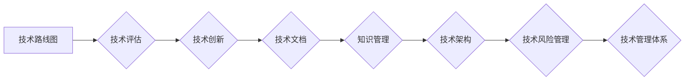

>  核心技术管理、技术架构、技术路线图、知识管理、技术文档、技术评估、技术创新、技术风险

## 1. 背景介绍

在当今科技日新月异的时代，核心技术已成为企业竞争力的关键驱动力。拥有强大的核心技术，能够帮助企业在市场中占据领先地位，应对激烈的竞争挑战。然而，如何有效地管理和利用核心技术，使其发挥最大价值，是企业面临的重要课题。

传统的技术管理模式往往以项目为中心，缺乏全局视角和长远规划。随着企业规模和业务复杂度的不断增加，传统的管理模式已难以满足企业对核心技术管理的需求。因此，建立一套完善的、以企业整体发展为导向的**公司整体核心技术管理方案**，显得尤为重要。

## 2. 核心概念与联系

**2.1 核心技术定义**

核心技术是指企业在特定领域拥有独创性、竞争优势、难以被模仿的技术，是企业核心竞争力的基础。

**2.2 技术管理体系**

技术管理体系是指企业为管理和利用核心技术而建立的制度、流程、方法和工具的总和。

**2.3 技术路线图**

技术路线图是企业未来技术发展的规划，明确了企业在未来一段时间内要攻克的技术难题、要实现的技术目标以及相应的技术路径。

**2.4 知识管理**

知识管理是指企业收集、整理、存储、共享和利用技术知识的系统化过程。

**2.5 技术文档**

技术文档是企业技术知识的载体，包括技术规范、设计文档、测试报告等。

**2.6 技术评估**

技术评估是指对企业现有技术水平、技术潜力和技术风险进行分析和评估。

**2.7 技术创新**

技术创新是指企业不断开发和改进新技术，提升技术水平的过程。

**2.8 技术风险**

技术风险是指企业在技术研发、应用和推广过程中可能面临的各种风险。

**2.9 技术架构**

技术架构是指企业整体技术系统的结构和设计，包括硬件、软件、网络、数据等方面的规划和设计。

**2.10 关联关系**

上述核心概念之间相互关联，共同构成了企业核心技术管理体系。

**Mermaid 流程图**

## 3. 核心算法原理 & 具体操作步骤

**3.1 算法原理概述**

**3.2 算法步骤详解**

**3.3 算法优缺点**

**3.4 算法应用领域**

## 4. 数学模型和公式 & 详细讲解 & 举例说明

**4.1 数学模型构建**

**4.2 公式推导过程**

**4.3 案例分析与讲解**

## 5. 项目实践：代码实例和详细解释说明

**5.1 开发环境搭建**

**5.2 源代码详细实现**

**5.3 代码解读与分析**

**5.4 运行结果展示**

## 6. 实际应用场景

**6.1 应用场景介绍**

**6.2 案例分析**

**6.3 效益评估**

**6.4 未来应用展望**

## 7. 工具和资源推荐

**7.1 学习资源推荐**

**7.2 开发工具推荐**

**7.3 相关论文推荐**

## 8. 总结：未来发展趋势与挑战

**8.1 研究成果总结**

**8.2 未来发展趋势**

**8.3 面临的挑战**

**8.4 研究展望**

## 9. 附录：常见问题与解答

**9.1 常见问题**

**9.2 问题解答**

作者：禅与计算机程序设计艺术 / Zen and the Art of Computer Programming

<end_of_turn>