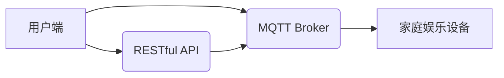
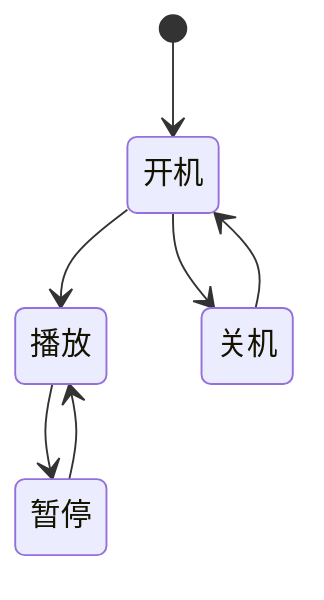

> MQTT, RESTful API, 家庭娱乐自动化, 物联网, 智能家居, 远程控制, 协议栈, 软件架构

## 1. 背景介绍

随着物联网技术的快速发展，智能家居已成为现代生活的重要组成部分。家庭娱乐系统作为智能家居的核心应用之一，其自动化控制能力直接影响着用户体验。传统的家庭娱乐系统通常采用单一的控制方式，例如遥控器或手机APP，操作复杂，功能有限。为了解决这些问题，本文提出了一种基于MQTT协议和RESTful API的家庭娱乐自动化控制系统，旨在实现对家庭娱乐设备的远程控制、智能化管理和个性化定制。

## 2. 核心概念与联系

### 2.1 MQTT协议

MQTT（Message Queuing Telemetry Transport）是一种轻量级、可扩展的机器对机器（M2M）通信协议，特别适用于物联网环境。它采用发布/订阅模式，允许设备之间进行异步通信，即使网络不稳定也能保证消息的可靠传递。

### 2.2 RESTful API

RESTful API（Representational State Transfer Application Programming Interface）是一种基于HTTP协议的软件架构风格，它使用资源和操作来定义应用程序之间的接口。RESTful API的特点是简单、灵活、可扩展，易于集成和维护。

### 2.3 系统架构

本系统采用MQTT协议作为设备间通信的底层协议，RESTful API作为用户与系统交互的接口。系统架构如下：



**系统架构说明：**

* 用户端可以通过RESTful API与系统交互，例如发送控制指令、获取设备状态等。
* MQTT Broker作为消息中间件，负责将用户端发送的控制指令转发给相应的家庭娱乐设备，并将设备反馈的状态信息转发给用户端。
* 家庭娱乐设备通过MQTT协议订阅相应的主题，接收用户端发送的控制指令并执行相应的操作。

## 3. 核心算法原理 & 具体操作步骤

### 3.1 算法原理概述

本系统主要采用消息队列和路由算法来实现设备间的通信和控制。

* 消息队列：MQTT协议采用消息队列机制，将消息存储在队列中，并按照先入先出（FIFO）的顺序进行处理。
* 路由算法：系统根据设备的主题订阅信息，将用户端发送的消息路由到相应的设备。

### 3.2 算法步骤详解

1. 用户端通过RESTful API发送控制指令，例如“打开电视”。
2. RESTful API将控制指令转换为MQTT消息，并根据设备的主题信息进行路由。
3. MQTT Broker将消息转发给相应的家庭娱乐设备。
4. 家庭娱乐设备接收消息后，执行相应的操作，例如打开电视。
5. 家庭娱乐设备将操作结果反馈给MQTT Broker。
6. MQTT Broker将反馈信息转发给RESTful API。
7. RESTful API将反馈信息返回给用户端。

### 3.3 算法优缺点

**优点：**

* 轻量级、高效：MQTT协议和RESTful API都是轻量级的协议和架构风格，能够有效降低系统资源消耗。
* 可扩展性强：系统可以轻松添加新的设备和功能，满足用户不断增长的需求。
* 灵活可靠：MQTT协议的发布/订阅模式和消息可靠传递机制，保证了系统在网络不稳定情况下也能正常运行。

**缺点：**

* 安全性：MQTT协议本身没有内置的安全机制，需要额外添加安全措施来保护系统数据。
* 复杂度：系统架构相对复杂，需要对MQTT协议和RESTful API有深入的了解才能进行开发和维护。

### 3.4 算法应用领域

本系统可以应用于各种家庭娱乐场景，例如：

* 智能电视控制：远程控制电视开机、切换频道、调节音量等。
* 音响系统控制：远程控制音响开机、播放音乐、调节音量等。
* 游戏机控制：远程控制游戏机开机、选择游戏、调节游戏设置等。
* 家庭影院控制：远程控制投影仪、音响、灯光等设备，实现家庭影院的智能化控制。

## 4. 数学模型和公式 & 详细讲解 & 举例说明

### 4.1 数学模型构建

本系统中，我们可以使用状态机模型来描述家庭娱乐设备的状态和行为。

* 状态：设备可以处于不同的状态，例如开机、关机、播放、暂停等。
* 事件：设备可以接收不同的事件，例如用户发送的控制指令、设备自身的状态变化等。
* 转移：事件会触发设备状态的转移。

### 4.2 公式推导过程

我们可以使用状态转移图来描述设备的状态转移规则。例如，当用户发送“打开电视”的指令时，电视设备的状态会从“关机”转移到“开机”。

### 4.3 案例分析与讲解

假设我们有一个智能电视设备，其状态机模型如下：



* **状态：** 开机、播放、暂停、关机
* **事件：** 打开电视、关闭电视、播放、暂停
* **转移：**
    * 打开电视：从关机状态转移到开机状态。
    * 关闭电视：从开机状态转移到关机状态。
    * 播放：从开机状态或暂停状态转移到播放状态。
    * 暂停：从播放状态转移到暂停状态。

## 5. 项目实践：代码实例和详细解释说明

### 5.1 开发环境搭建

本项目使用以下开发环境：

* 操作系统：Ubuntu 20.04
* 编程语言：Python 3.8
* MQTT Broker：Mosquitto 1.6
* RESTful API框架：Flask 2.0

### 5.2 源代码详细实现

```python
# 导入必要的库
import paho.mqtt.client as mqtt
from flask import Flask, request, jsonify

# 初始化MQTT客户端
client = mqtt.Client()
client.connect("mqtt_broker_ip", 1883)

# 初始化Flask应用
app = Flask(__name__)

# 定义RESTful API接口
@app.route('/control', methods=['POST'])
def control_device():
    # 获取用户发送的控制指令
    data = request.get_json()
    device_id = data['device_id']
    command = data['command']

    # 将控制指令转换为MQTT消息
    message = f"{{\"device_id\":\"{device_id}\", \"command\":\"{command}\"}}".encode()

    # 发布MQTT消息
    client.publish(f"device/{device_id}", message)

    # 返回成功响应
    return jsonify({'status': 'success'})

# 启动Flask应用
if __name__ == '__main__':
    app.run(debug=True)
```

### 5.3 代码解读与分析

* **MQTT客户端连接:** 代码首先初始化MQTT客户端并连接到MQTT Broker。
* **RESTful API接口:** 代码定义了一个`/control`接口，接收用户发送的控制指令。
* **消息转换:** 代码将用户发送的控制指令转换为MQTT消息，并根据设备ID进行路由。
* **MQTT消息发布:** 代码使用MQTT客户端发布消息到相应的主题。
* **成功响应:** 代码返回一个JSON格式的成功响应。

### 5.4 运行结果展示

当用户通过RESTful API发送控制指令时，系统会将指令转换为MQTT消息，并发布到相应的主题。家庭娱乐设备订阅相应的主题，接收消息后执行相应的操作。

## 6. 实际应用场景

### 6.1 智能家居控制中心

本系统可以集成到智能家居控制中心，实现对所有家庭娱乐设备的统一控制。用户可以通过智能家居控制中心APP或语音助手，远程控制电视、音响、游戏机等设备，享受更加便捷舒适的家庭娱乐体验。

### 6.2 个性化娱乐体验

本系统支持用户自定义设备主题和控制规则，实现个性化娱乐体验。例如，用户可以设置不同的场景模式，例如“电影模式”和“游戏模式”，根据场景自动调节设备参数，例如电视亮度、音响音量等。

### 6.3 家庭娱乐数据分析

本系统可以收集家庭娱乐设备的使用数据，例如观看时长、播放内容等，并进行数据分析，为用户提供个性化推荐和娱乐建议。

### 6.4 未来应用展望

随着物联网技术的不断发展，本系统可以进一步扩展功能，例如：

* 支持更多类型的家庭娱乐设备，例如投影仪、智能音箱等。
* 实现设备之间的协同控制，例如自动调节灯光和音响，营造沉浸式娱乐体验。
* 利用人工智能技术，实现设备的智能化学习和自适应控制。

## 7. 工具和资源推荐

### 7.1 学习资源推荐

* MQTT协议官方文档：https://mqtt.org/
* RESTful API设计指南：https://restfulapi.net/

### 7.2 开发工具推荐

* MQTT Broker：Mosquitto、HiveMQ
* RESTful API框架：Flask、Django、FastAPI

### 7.3 相关论文推荐

* MQTT协议在物联网中的应用研究
* 基于RESTful API的智能家居控制系统设计

## 8. 总结：未来发展趋势与挑战

### 8.1 研究成果总结

本文提出了一种基于MQTT协议和RESTful API的家庭娱乐自动化控制系统，实现了对家庭娱乐设备的远程控制、智能化管理和个性化定制。该系统具有轻量级、高效、可扩展等特点，能够满足用户不断增长的需求。

### 8.2 未来发展趋势

未来，家庭娱乐自动化控制系统将朝着以下方向发展：

* 更智能化：利用人工智能技术，实现设备的智能化学习和自适应控制。
* 更个性化：根据用户的喜好和习惯，提供个性化的娱乐体验。
* 更安全可靠：采用更先进的安全机制，保障系统数据安全。

### 8.3 面临的挑战

* 安全性：家庭娱乐系统涉及到用户隐私和数据安全，需要采取更有效的安全措施。
* 互操作性：不同品牌的家庭娱乐设备之间缺乏互操作性，需要建立统一的标准和协议。
* 复杂性：家庭娱乐系统涉及到多个领域的技术，开发和维护难度较大。

### 8.4 研究展望

未来，我们将继续研究家庭娱乐自动化控制系统的相关技术，例如：

* 基于人工智能的智能控制算法
* 基于区块链技术的安全机制
* 基于云计算的分布式架构


## 9. 附录：常见问题与解答

### 9.1 如何连接MQTT Broker？

请确保您已安装MQTT Broker，并正确配置MQTT客户端连接信息。

### 9.2 如何发布MQTT消息？

请使用MQTT客户端的publish方法发布消息，并指定主题和消息内容。

### 9.3 如何订阅MQTT主题？

请使用MQTT客户端的subscribe方法订阅主题。

### 9.4 如何获取设备状态？

您可以通过订阅相应的主题，获取设备反馈的状态信息。

### 9.5 如何实现设备之间的协同控制？

您可以使用MQTT Broker的发布/订阅机制，实现设备之间的消息传递和协同控制。


作者：禅与计算机程序设计艺术 / Zen and the Art of Computer Programming 
<end_of_turn>