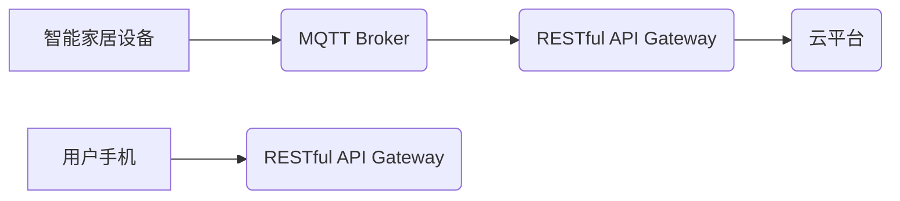

> MQTT, RESTful API, 智能家居, 远程控制, 状态监测, 物联网,  设备管理

## 1. 背景介绍

随着物联网技术的快速发展，智能家居已成为现代生活的重要组成部分。智能家居系统能够通过网络连接各种智能设备，实现对设备的远程控制和状态监测，为用户提供更加便捷、舒适的生活体验。

传统的智能家居系统通常采用中心化架构，所有设备都连接到一个中央控制器，这导致系统复杂度高、可靠性差、扩展性有限。为了解决这些问题，基于MQTT协议和RESTful API的智能家居系统应运而生。

MQTT协议是一种轻量级、低功耗的消息传输协议，非常适合物联网应用场景。它采用发布/订阅模式，使得设备之间可以进行无缝通信，即使网络不稳定也能保证消息的可靠传递。RESTful API是一种基于HTTP协议的接口规范，它提供了一种简单、灵活、可扩展的方式来访问和管理资源。

结合MQTT协议和RESTful API，可以构建一个更加灵活、可靠、可扩展的智能家居系统。

## 2. 核心概念与联系

### 2.1 MQTT协议

MQTT（Message Queuing Telemetry Transport）是一种轻量级、低功耗的机器对机器（M2M）通信协议，旨在为物联网应用提供可靠、高效的消息传输机制。

MQTT协议采用发布/订阅模式，其中：

* **发布者（Publisher）:** 发送消息的设备或应用程序。
* **订阅者（Subscriber）:** 接收特定主题消息的设备或应用程序。

MQTT协议支持多种消息类型，包括：

* **CONNECT:** 连接到MQTT服务器。
* **PUBLISH:** 发布消息到指定主题。
* **SUBSCRIBE:** 订阅指定主题的消息。
* **DISCONNECT:** 断开与MQTT服务器的连接。

### 2.2 RESTful API

RESTful API（Representational State Transfer Application Programming Interface）是一种基于HTTP协议的接口规范，它提供了一种简单、灵活、可扩展的方式来访问和管理资源。

RESTful API遵循以下原则：

* **客户端-服务器架构:** 客户端请求资源，服务器提供资源。
* **Statelessness:** 每个请求都是独立的，服务器不存储客户端状态。
* **缓存:** 允许客户端缓存资源，提高性能。
* **统一资源标识符（URI）:** 使用URI标识资源。
* **标准HTTP方法:** 使用HTTP方法（GET、POST、PUT、DELETE等）操作资源。

### 2.3 核心架构

基于MQTT协议和RESTful API的智能家居系统架构如下：



**架构说明:**

* **智能家居设备:** 包括各种智能设备，如智能灯泡、智能插座、智能门锁等。
* **MQTT Broker:** 消息中间件，负责设备之间的消息传递。
* **RESTful API Gateway:** 提供RESTful API接口，用于用户手机与云平台进行交互。
* **云平台:** 用于存储设备信息、用户数据、控制逻辑等。
* **用户手机:** 用于控制智能家居设备和查看设备状态。

## 3. 核心算法原理 & 具体操作步骤

### 3.1  算法原理概述

本系统主要基于MQTT协议和RESTful API实现设备远程控制和状态监测。

* **MQTT协议:** 用于设备之间进行消息传递，实现设备状态的实时更新和控制指令的发送。
* **RESTful API:** 用于用户手机与云平台进行交互，实现对设备的远程控制和状态查询。

### 3.2  算法步骤详解

1. **设备连接MQTT Broker:** 智能家居设备连接到MQTT Broker，并订阅和发布相关主题消息。
2. **用户手机连接RESTful API Gateway:** 用户手机通过RESTful API Gateway与云平台进行交互。
3. **用户控制设备:** 用户通过手机应用程序发送控制指令到RESTful API Gateway。
4. **RESTful API Gateway转发指令:** RESTful API Gateway将控制指令转发到MQTT Broker。
5. **MQTT Broker转发指令:** MQTT Broker将控制指令发布到相应的设备主题。
6. **设备执行指令:** 设备收到控制指令后执行相应的操作。
7. **设备状态更新:** 设备将状态信息发布到相应的主题。
8. **MQTT Broker转发状态信息:** MQTT Broker将状态信息转发到RESTful API Gateway。
9. **RESTful API Gateway返回状态信息:** RESTful API Gateway将状态信息返回给用户手机。

### 3.3  算法优缺点

**优点:**

* **轻量级、低功耗:** MQTT协议和RESTful API都是轻量级、低功耗的协议，适合物联网应用场景。
* **可靠性高:** MQTT协议支持消息确认机制，保证消息的可靠传递。
* **可扩展性强:** RESTful API支持RESTful架构，可以轻松扩展系统功能。
* **易于开发:** MQTT协议和RESTful API都比较容易学习和使用。

**缺点:**

* **安全性:** MQTT协议和RESTful API都需要进行安全认证，否则容易受到攻击。
* **复杂性:** 系统架构比较复杂，需要对MQTT协议和RESTful API有深入了解。

### 3.4  算法应用领域

* **智能家居:** 控制和监测智能家居设备，如智能灯泡、智能插座、智能门锁等。
* **工业自动化:** 控制和监测工业设备，如传感器、执行器、控制系统等。
* **农业物联网:** 控制和监测农业设备，如灌溉系统、温控系统、土壤监测系统等。
* **医疗保健:** 控制和监测医疗设备，如血糖仪、血压计、心率监测器等。

## 4. 数学模型和公式 & 详细讲解 & 举例说明

### 4.1  数学模型构建

本系统中，我们可以使用状态机模型来描述智能家居设备的状态和行为。

状态机模型由以下几个部分组成：

* **状态:** 设备可以处于不同的状态，例如“开”、“关”、“待机”等。
* **事件:** 设备可以接收不同的事件，例如“用户控制”、“传感器数据”等。
* **转换:** 事件可以导致设备状态的转换。
* **动作:** 状态转换后，设备可以执行相应的动作，例如“打开灯”、“关闭插座”等。

### 4.2  公式推导过程

状态机模型的转换规则可以用数学公式来表示。例如，假设智能灯泡有“开”、“关”两种状态，用户控制事件可以导致状态转换。我们可以用以下公式表示：

```
状态(t+1) = f(状态(t), 事件(t))
```

其中：

* 状态(t) 表示设备在时间t的当前状态。
* 事件(t) 表示设备在时间t接收到的事件。
* 状态(t+1) 表示设备在时间t+1的下一个状态。
* f() 是状态转换函数，根据当前状态和事件，决定下一个状态。

### 4.3  案例分析与讲解

例如，假设智能灯泡的初始状态为“关”，用户发送“打开灯”事件，则状态转换函数可以定义为：

```
状态(t+1) = "开"
```

因此，设备的状态将从“关”变为“开”。

## 5. 项目实践：代码实例和详细解释说明

### 5.1  开发环境搭建

* **操作系统:** Ubuntu 20.04 LTS
* **编程语言:** Python 3.8
* **MQTT Broker:** Mosquitto 1.6
* **RESTful API Framework:** Flask 2.0

### 5.2  源代码详细实现

```python
# 设备代码示例
import paho.mqtt.client as mqtt

# MQTT Broker地址
MQTT_BROKER = "mqtt.example.com"
# MQTT主题
MQTT_TOPIC = "smart_home/light"

def on_connect(client, userdata, flags, rc):
    if rc == 0:
        print("Connected to MQTT Broker")
        client.subscribe(MQTT_TOPIC)
    else:
        print("Connection failed")

def on_message(client, userdata, msg):
    print("Received message:", msg.payload.decode())
    # 处理控制指令

client = mqtt.Client()
client.on_connect = on_connect
client.on_message = on_message
client.connect(MQTT_BROKER, 1883, 60)
client.loop_forever()

# RESTful API代码示例
from flask import Flask, request

app = Flask(__name__)

@app.route('/control_light', methods=['POST'])
def control_light():
    data = request.get_json()
    command = data.get('command')
    # 发送控制指令到MQTT Broker
    return 'OK'

if __name__ == '__main__':
    app.run(debug=True)
```

### 5.3  代码解读与分析

* **设备代码:** 使用paho-mqtt库连接到MQTT Broker，订阅和发布消息。
* **RESTful API代码:** 使用Flask框架构建RESTful API，处理用户手机发送的控制指令。

### 5.4  运行结果展示

* 设备连接到MQTT Broker，并订阅“smart_home/light”主题。
* 用户手机发送POST请求到`/control_light`接口，发送控制指令。
* RESTful API接收控制指令，并将其发送到MQTT Broker。
* MQTT Broker将控制指令发布到“smart_home/light”主题。
* 设备收到控制指令后执行相应的操作，例如打开或关闭灯泡。

## 6. 实际应用场景

### 6.1 智能家居场景

* **远程控制灯光:** 用户可以通过手机应用程序远程控制智能灯泡的开关、亮度和颜色。
* **场景联动:** 用户可以设置场景联动，例如“回家模式”可以自动打开灯光、空调等设备。
* **智能家居安全:** 智能门锁可以远程控制，并通过传感器检测门窗状态，提醒用户是否关闭。

### 6.2 工业自动化场景

* **远程监控设备状态:** 工厂可以远程监控设备运行状态，及时发现故障。
* **远程控制设备:** 工厂可以远程控制设备，例如启动、停止、调整参数等。
* **数据采集和分析:** 工厂可以采集设备运行数据，进行分析和优化生产流程。

### 6.3 其他应用场景

* **农业物联网:** 远程控制灌溉系统、温控系统、土壤监测系统等。
* **医疗保健:** 远程监控患者健康数据，例如血糖、血压、心率等。
* **智慧城市:** 远程控制交通信号灯、监控摄像头、环境监测设备等。

### 6.4 未来应用展望

随着物联网技术的不断发展，基于MQTT协议和RESTful API的智能家居系统将有更广泛的应用场景。未来，我们可以期待以下发展趋势：

* **更智能的设备:** 设备将更加智能，能够自主学习和决策。
* **更强大的云平台:** 云平台将提供更丰富的功能，例如人工智能、大数据分析等。
* **更安全的系统:** 系统安全性将得到进一步提升，保障用户隐私和数据安全。

## 7. 工具和资源推荐

### 7.1 学习资源推荐

* **MQTT协议:** https://mqtt.org/
* **RESTful API:** https://restfulapi.net/
* **Python编程:** https://www.python.org/

### 7.2 开发工具推荐

* **MQTT Broker:** Mosquitto, HiveMQ
* **RESTful API Framework:** Flask, Django, FastAPI
* **代码编辑器:** VS Code, Atom, Sublime Text

### 7.3 相关论文推荐

* **MQTT协议:**
    * MQTT Protocol Specification
    * MQTT for the Internet of Things
* **RESTful API:**
    * RESTful Web Services
    * REST API Design

## 8. 总结：未来发展趋势与挑战

### 8.1 研究成果总结

本篇文章介绍了基于