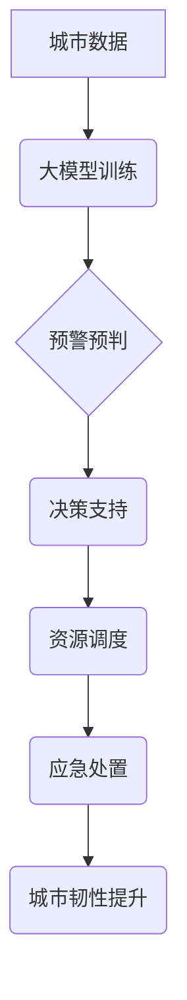

> 大模型、智慧应急、城市韧性、灾害应对、人工智能、机器学习、数据分析、风险预警、决策支持

## 1. 背景介绍

近年来，城市化进程加速，人口密集度不断提高，城市面临着越来越多的风险挑战，如自然灾害、公共卫生事件、网络安全威胁等。这些风险事件一旦发生，往往会造成人员伤亡、财产损失、社会秩序混乱等严重后果。因此，提升城市韧性，增强城市应对风险的能力，成为全球关注的焦点。

智慧应急作为城市韧性提升的重要手段，旨在通过信息化、智能化手段，提高城市应对风险事件的预警、响应、处置能力。大模型作为人工智能领域的新兴技术，凭借其强大的学习能力和泛化能力，为智慧应急提供了新的技术支撑。

## 2. 核心概念与联系

**2.1 智慧应急**

智慧应急是指利用信息技术、人工智能等先进技术手段，构建全流程、全覆盖、智能化应急管理体系，实现应急预警、决策支持、资源调度、信息共享等功能，提升城市应对风险事件的快速响应能力和处置效率。

**2.2 大模型**

大模型是指在海量数据上训练的深度学习模型，具有强大的泛化能力和学习能力，能够处理复杂的任务，例如自然语言处理、图像识别、语音合成等。

**2.3 联系**

大模型可以为智慧应急提供以下方面的技术支撑：

* **数据分析与预警:** 大模型可以对海量城市数据进行分析，识别潜在风险，进行预警预判，帮助城市提前做好应对准备。
* **决策支持:** 大模型可以根据实时数据和历史经验，为应急决策提供科学依据，帮助指挥决策者做出更准确、更有效的决策。
* **资源调度:** 大模型可以优化资源分配，根据实际需求，快速调度资源到灾区或事故现场，提高应急资源的利用效率。
* **信息共享:** 大模型可以构建城市应急信息共享平台，实现不同部门、不同地区的应急信息实时共享，提高应急响应的协同效率。

**2.4 核心架构**



## 3. 核心算法原理 & 具体操作步骤

**3.1 算法原理概述**

大模型训练通常采用深度学习算法，例如Transformer、BERT等。这些算法通过多层神经网络结构，学习数据中的复杂模式和关系，从而实现对数据的理解和预测。

**3.2 算法步骤详解**

1. **数据收集与预处理:** 收集城市相关数据，例如人口数据、交通数据、气象数据、社会媒体数据等，并进行清洗、格式化、标注等预处理工作。
2. **模型选择与训练:** 选择合适的深度学习模型，并根据训练数据进行模型训练。训练过程需要大量的计算资源和时间。
3. **模型评估与调优:** 对训练好的模型进行评估，并根据评估结果进行模型调优，例如调整模型参数、增加训练数据等。
4. **模型部署与应用:** 将训练好的模型部署到生产环境中，并将其应用于智慧应急系统中。

**3.3 算法优缺点**

**优点:**

* 强大的学习能力和泛化能力，能够处理复杂的任务。
* 可以从海量数据中提取隐藏的模式和关系。
* 可以实现自动化决策和资源调度。

**缺点:**

* 训练成本高，需要大量的计算资源和时间。
* 对训练数据的质量要求高，数据偏差会影响模型性能。
* 模型解释性差，难以理解模型的决策过程。

**3.4 算法应用领域**

* **灾害预警:** 利用大模型对气象数据、地质数据等进行分析，预测自然灾害的发生时间、地点和强度。
* **公共卫生事件防控:** 利用大模型对疫情数据、医疗资源数据等进行分析，预测疫情的传播趋势，辅助决策制定。
* **交通安全管理:** 利用大模型对交通数据、道路状况等进行分析，预测交通事故的发生概率，优化交通流量。

## 4. 数学模型和公式 & 详细讲解 & 举例说明

**4.1 数学模型构建**

大模型训练通常采用基于损失函数的优化算法。损失函数衡量模型预测结果与真实结果之间的差异，目标是通过优化模型参数，最小化损失函数的值。

**4.2 公式推导过程**

假设模型的预测结果为y，真实结果为y’，损失函数为L(y,y’)。模型参数为θ。优化算法的目标是找到最优的θ，使得损失函数最小化。

```latex
\theta = argmin_{\theta} L(y, y')
```

常用的优化算法包括梯度下降法、Adam算法等。这些算法通过迭代更新模型参数，逐步降低损失函数的值。

**4.3 案例分析与讲解**

例如，在自然语言处理任务中，可以使用交叉熵损失函数来衡量模型预测结果与真实结果之间的差异。

```latex
L(y, y') = - \sum_{i=1}^{n} y_i \log(p_i)
```

其中，y是真实标签，p是模型预测的概率分布。

## 5. 项目实践：代码实例和详细解释说明

**5.1 开发环境搭建**

* 操作系统：Linux
* Python版本：3.7+
* 深度学习框架：TensorFlow、PyTorch等

**5.2 源代码详细实现**

```python
# 使用TensorFlow框架训练一个简单的文本分类模型

import tensorflow as tf

# 定义模型结构
model = tf.keras.models.Sequential([
    tf.keras.layers.Embedding(input_dim=10000, output_dim=128),
    tf.keras.layers.LSTM(units=64),
    tf.keras.layers.Dense(units=2, activation='softmax')
])

# 定义损失函数和优化器
model.compile(loss='sparse_categorical_crossentropy', optimizer='adam', metrics=['accuracy'])

# 训练模型
model.fit(x_train, y_train, epochs=10)

# 评估模型
loss, accuracy = model.evaluate(x_test, y_test)
print('Loss:', loss)
print('Accuracy:', accuracy)
```

**5.3 代码解读与分析**

* 代码首先定义了模型结构，包括嵌入层、LSTM层和全连接层。
* 然后定义了损失函数和优化器，用于训练模型。
* 接着使用`fit()`方法训练模型，传入训练数据和训练轮数。
* 最后使用`evaluate()`方法评估模型性能，输出损失值和准确率。

**5.4 运行结果展示**

训练完成后，可以将模型应用于实际场景，例如对文本进行分类、预测事件发生概率等。

## 6. 实际应用场景

**6.1 灾害预警系统**

大模型可以分析气象数据、地质数据等，预测自然灾害的发生时间、地点和强度，为灾害预警系统提供数据支撑。

**6.2 公共卫生事件防控系统**

大模型可以分析疫情数据、医疗资源数据等，预测疫情的传播趋势，辅助决策制定，提高疫情防控效率。

**6.3 交通安全管理系统**

大模型可以分析交通数据、道路状况等，预测交通事故的发生概率，优化交通流量，提高交通安全。

**6.4 未来应用展望**

随着大模型技术的不断发展，其在智慧应急领域的应用场景将更加广泛，例如：

* **智能应急指挥平台:** 利用大模型实现智能化指挥决策，提高应急响应效率。
* **个性化应急服务:** 根据用户的需求和风险情况，提供个性化的应急服务。
* **跨部门协同应急:** 利用大模型构建跨部门协同应急平台，实现信息共享和资源协同。

## 7. 工具和资源推荐

**7.1 学习资源推荐**

* **书籍:**
    * 《深度学习》
    * 《自然语言处理》
* **在线课程:**
    * Coursera
    * edX
    * fast.ai

**7.2 开发工具推荐**

* **深度学习框架:** TensorFlow、PyTorch
* **云计算平台:** AWS、Azure、Google Cloud

**7.3 相关论文推荐**

* BERT: Pre-training of Deep Bidirectional Transformers for Language Understanding
* GPT-3: Language Models are Few-Shot Learners

## 8. 总结：未来发展趋势与挑战

**8.1 研究成果总结**

大模型在智慧应急领域取得了显著成果，为提升城市韧性提供了新的技术支撑。

**8.2 未来发展趋势**

* 模型规模和能力将进一步提升，能够处理更复杂的任务。
* 模型解释性将得到加强，能够更好地理解模型的决策过程。
* 模型应用场景将更加广泛，覆盖更多领域。

**8.3 面临的挑战**

* 训练成本高，需要大量的计算资源和时间。
* 对训练数据的质量要求高，数据偏差会影响模型性能。
* 模型安全性和隐私性需要得到保障。

**8.4 研究展望**

未来研究将重点关注以下方面:

* 降低大模型训练成本，提高训练效率。
* 提升大模型的解释性，增强模型的可信度。
* 研究大模型在智慧应急领域的应用场景，探索新的应用模式。


## 9. 附录：常见问题与解答

**9.1 如何选择合适的深度学习模型？**

选择合适的深度学习模型需要根据具体任务和数据特点进行选择。例如，对于文本分类任务，可以使用BERT、GPT等预训练模型；对于图像识别任务，可以使用ResNet、Inception等模型。

**9.2 如何评估大模型的性能？**

大模型的性能可以通过多种指标进行评估，例如准确率、召回率、F1-score等。

**9.3 如何保障大模型的安全性和隐私性？**

保障大模型的安全性和隐私性需要采取多种措施，例如数据加密、模型安全审计、隐私保护机制等。


作者：禅与计算机程序设计艺术 / Zen and the Art of Computer Programming 
<end_of_turn>