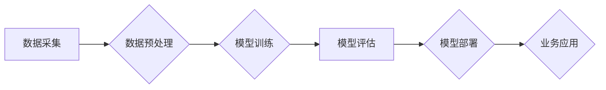

> 大模型、深度学习、自然语言处理、计算机视觉、数据驱动、商业创新、人工智能

## 1. 背景介绍

近年来，人工智能（AI）技术取得了飞速发展，其中大模型作为AI领域的重要突破口，展现出强大的学习和推理能力，在自然语言处理、计算机视觉、语音识别等领域取得了令人瞩目的成果。大模型的出现，标志着人工智能进入了一个新的时代，其强大的能力将深刻地改变我们的生活和工作方式，并为商业创新带来无限可能。

传统的机器学习模型通常需要大量的人工特征工程和标注数据，而大模型则通过学习海量数据，自动提取特征，从而降低了模型开发的门槛，提高了模型的泛化能力。

大模型的训练需要大量的计算资源和时间，但随着云计算技术的不断发展，大模型的训练成本也在逐渐降低。同时，开源社区也为大模型的开发和应用提供了丰富的资源和工具，促进了大模型技术的普及和应用。

## 2. 核心概念与联系

大模型是指参数量达到数亿甚至数千亿的深度学习模型。这些模型通过学习海量数据，能够掌握复杂的知识和模式，并应用于各种任务。

**大模型的架构通常包括以下几个部分：**

* **编码器（Encoder）：**负责将输入数据转换为向量表示，提取数据的语义信息。
* **解码器（Decoder）：**根据编码器的输出，生成相应的输出结果，例如文本、图像或语音。
* **注意力机制（Attention）：**帮助模型关注输入数据中重要的部分，提高模型的理解能力。
* **Transformer：**一种新型的网络架构，能够有效地处理序列数据，并具有强大的泛化能力。

**大模型与商业创新的联系：**

大模型能够帮助企业在以下方面实现商业创新：

* **个性化服务：**通过分析用户的行为数据和偏好，提供个性化的产品推荐、内容推送和服务体验。
* **智能化运营：**自动完成数据分析、预测和决策，提高运营效率和决策准确性。
* **新产品开发：**利用大模型的生成能力，开发新的产品和服务，例如自动生成创意内容、设计产品原型等。
* **客户服务优化：**利用大模型构建智能客服系统，提供快速、高效的客户服务。

**Mermaid 流程图：**



## 3. 核心算法原理 & 具体操作步骤

### 3.1  算法原理概述

大模型的核心算法是深度学习，特别是基于Transformer的架构。Transformer模型通过注意力机制，能够有效地处理序列数据，并具有强大的泛化能力。

**注意力机制：**

注意力机制是一种机制，允许模型关注输入数据中最重要的部分。它通过计算每个词与其他词之间的相关性，并根据相关性赋予每个词不同的权重，从而提高模型的理解能力。

**Transformer架构：**

Transformer架构由编码器和解码器组成。编码器负责将输入序列转换为向量表示，解码器根据编码器的输出生成输出序列。Transformer模型中使用了多头注意力机制和前馈神经网络，能够有效地捕捉序列数据的长距离依赖关系。

### 3.2  算法步骤详解

**大模型训练的步骤如下：**

1. **数据采集和预处理：**收集大量相关数据，并进行清洗、格式化和编码等预处理操作。
2. **模型构建：**根据任务需求，选择合适的模型架构，例如BERT、GPT-3等。
3. **模型训练：**使用训练数据训练模型，并通过优化算法调整模型参数，使模型的预测性能达到最佳。
4. **模型评估：**使用测试数据评估模型的性能，并根据评估结果进行模型调优。
5. **模型部署：**将训练好的模型部署到生产环境中，用于实际应用。

### 3.3  算法优缺点

**优点：**

* 强大的学习能力：大模型能够学习海量数据，掌握复杂的知识和模式。
* 泛化能力强：大模型能够应用于多种任务，并具有较强的泛化能力。
* 自动特征提取：大模型能够自动提取特征，降低了模型开发的门槛。

**缺点：**

* 训练成本高：大模型的训练需要大量的计算资源和时间。
* 数据依赖性强：大模型的性能取决于训练数据的质量和数量。
* 可解释性差：大模型的决策过程难以理解，缺乏可解释性。

### 3.4  算法应用领域

大模型在以下领域具有广泛的应用前景：

* **自然语言处理：**文本生成、机器翻译、问答系统、情感分析等。
* **计算机视觉：**图像识别、物体检测、图像生成等。
* **语音识别：**语音转文本、语音合成等。
* **推荐系统：**个性化推荐、内容推荐等。
* **医疗诊断：**疾病诊断、药物研发等。

## 4. 数学模型和公式 & 详细讲解 & 举例说明

### 4.1  数学模型构建

大模型的训练过程本质上是一个优化问题，目标是找到模型参数，使得模型的预测结果与真实值之间的误差最小。

**损失函数：**

损失函数用于衡量模型预测结果与真实值的差异。常用的损失函数包括均方误差（MSE）、交叉熵损失（Cross-Entropy Loss）等。

**优化算法：**

优化算法用于更新模型参数，使得损失函数的值不断减小。常用的优化算法包括梯度下降（Gradient Descent）、Adam、RMSprop等。

### 4.2  公式推导过程

**梯度下降算法：**

梯度下降算法的基本思想是沿着损失函数的负梯度方向更新模型参数。

**公式：**

```
θ = θ - lr * ∇L(θ)
```

其中：

* θ：模型参数
* lr：学习率
* ∇L(θ)：损失函数对模型参数的梯度

### 4.3  案例分析与讲解

**举例说明：**

假设我们训练一个线性回归模型，目标是预测房价。损失函数为均方误差，模型参数为权重和偏差。

使用梯度下降算法更新模型参数，可以逐步降低模型的预测误差，最终得到一个能够准确预测房价的模型。

## 5. 项目实践：代码实例和详细解释说明

### 5.1  开发环境搭建

**开发环境：**

* 操作系统：Linux、macOS或Windows
* Python版本：3.6或更高版本
* 深度学习框架：TensorFlow、PyTorch等

**软件安装：**

* 安装Python和必要的库，例如NumPy、Pandas、Scikit-learn等。
* 安装深度学习框架，例如TensorFlow或PyTorch。

### 5.2  源代码详细实现

**代码示例：**

```python
import tensorflow as tf

# 定义模型
model = tf.keras.models.Sequential([
    tf.keras.layers.Dense(64, activation='relu', input_shape=(10,)),
    tf.keras.layers.Dense(1)
])

# 编译模型
model.compile(optimizer='adam', loss='mse')

# 训练模型
model.fit(x_train, y_train, epochs=10)

# 评估模型
loss = model.evaluate(x_test, y_test)
```

**代码解读：**

* 使用TensorFlow框架定义一个简单的线性回归模型。
* 使用Adam优化器和均方误差损失函数编译模型。
* 使用训练数据训练模型，设置训练轮数为10。
* 使用测试数据评估模型的性能，并打印损失值。

### 5.3  代码解读与分析

**代码分析：**

* 代码定义了一个简单的线性回归模型，包含两个全连接层。
* 模型使用Adam优化器和均方误差损失函数进行训练。
* 训练过程使用训练数据进行迭代，每次迭代更新模型参数，直到损失函数达到最小值。
* 评估过程使用测试数据计算模型的损失值，并打印结果。

### 5.4  运行结果展示

**运行结果：**

训练完成后，模型的损失值会不断降低，最终达到一个稳定值。

评估结果会显示模型在测试数据上的损失值，可以用来评估模型的性能。

## 6. 实际应用场景

### 6.1  个性化推荐

大模型可以分析用户的行为数据和偏好，提供个性化的产品推荐、内容推送和服务体验。例如，电商平台可以利用大模型推荐用户可能感兴趣的商品，提高转化率。

### 6.2  智能客服

大模型可以构建智能客服系统，提供快速、高效的客户服务。例如，银行可以利用大模型构建智能客服机器人，解答客户常见问题，提高客户满意度。

### 6.3  自动生成创意内容

大模型可以自动生成创意内容，例如文案、诗歌、音乐等。例如，广告公司可以利用大模型生成创意广告文案，提高广告效果。

### 6.4  未来应用展望

大模型的应用场景还在不断扩展，未来将应用于更多领域，例如：

* **医疗诊断：**辅助医生诊断疾病，提高诊断准确率。
* **教育教学：**个性化学习辅导，提高学习效率。
* **科学研究：**加速科学发现，推动科技进步。

## 7. 工具和资源推荐

### 7.1  学习资源推荐

* **书籍：**
    * 《深度学习》
    * 《自然语言处理》
    * 《机器学习》
* **在线课程：**
    * Coursera
    * edX
    * Udacity

### 7.2  开发工具推荐

* **深度学习框架：**
    * TensorFlow
    * PyTorch
    * Keras
* **数据处理工具：**
    * Pandas
    * NumPy
* **可视化工具：**
    * Matplotlib
    * Seaborn

### 7.3  相关论文推荐

* **BERT：** Devlin, J., Chang, M. W., Lee, K., & Toutanova, K. (2018). BERT: Pre-training of deep bidirectional transformers for language understanding. arXiv preprint arXiv:1810.04805.
* **GPT-3：** Brown, T. B., Mann, B., Ryder, N., Subbiah, M., Kaplan, J., Dhariwal, P., ... & Amodei, D. (2020). Language models are few-shot learners. arXiv preprint arXiv:2005.14165.

## 8. 总结：未来发展趋势与挑战

### 8.1  研究成果总结

大模型技术取得了显著进展，在自然语言处理、计算机视觉等领域取得了突破性成果。大模型的出现，标志着人工智能进入了一个新的时代，其强大的能力将深刻地改变我们的生活和工作方式。

### 8.2  未来发展趋势

* **模型规模进一步扩大：**未来大模型的规模将继续扩大，参数量将达到数万亿甚至数千亿。
* **多模态学习：**大模型将能够处理多种模态数据，例如文本、图像、音频等，实现跨模态理解和生成。
* **可解释性增强：**研究人员将致力于提高大模型的可解释性，使模型的决策过程更加透明和可理解。

### 8.3  面临的挑战

* **训练成本高：**大模型的训练需要大量的计算资源和时间，成本较高。
* **数据依赖性强：**大模型的性能取决于训练数据的质量和数量，数据获取和标注成本高。
* **伦理问题：**大模型的应用可能带来一些伦理问题，例如偏见、隐私等，需要引起重视和解决。

### 8.4  研究展望

未来，大模型技术将继续发展，并应用于更多领域，为人类社会带来更多福祉。研究人员将继续探索大模型的潜力，解决其面临的挑战，推动大模型技术向更安全、更可靠、更智能的方向发展。

## 9. 附录：