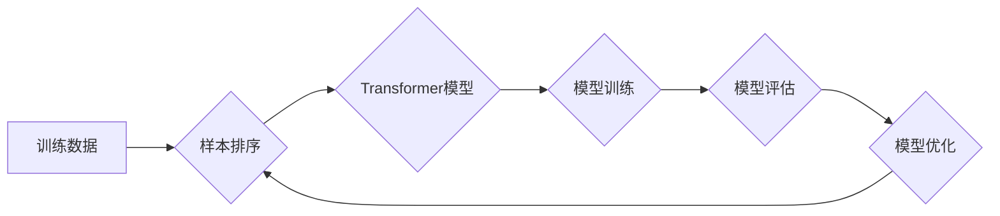

> 大语言模型，样本排序，Transformer，BERT，Fine-tuning，文本生成，自然语言处理

## 1. 背景介绍

大语言模型（Large Language Model，LLM）近年来在自然语言处理（Natural Language Processing，NLP）领域取得了显著进展，展现出强大的文本生成、理解和翻译能力。这些模型通常基于Transformer架构，通过训练海量文本数据，学习语言的复杂模式和结构。然而，训练和部署LLM仍然面临着巨大的挑战，其中之一就是样本排序问题。

样本排序是指在训练过程中，根据样本的质量、相关性或其他因素对样本进行排序，以提高模型的训练效率和性能。对于LLM来说，样本排序尤为重要，因为它直接影响着模型对语言的理解和生成能力。

## 2. 核心概念与联系

### 2.1  大语言模型

大语言模型（LLM）是一种基于深度学习的强大人工智能模型，能够理解和生成人类语言。它们通常由 Transformer 架构构成，并通过训练海量文本数据学习语言的复杂模式和结构。

### 2.2  样本排序

样本排序是指对训练数据进行排序，以提高模型的训练效率和性能。在LLM训练中，样本排序可以根据样本的质量、相关性、难度等因素进行，以优化模型的学习过程。

### 2.3  Transformer 架构

Transformer是一种用于处理序列数据的深度学习架构，其核心是注意力机制。注意力机制能够学习到输入序列中不同元素之间的关系，从而更好地理解上下文信息。

**Mermaid 流程图**



## 3. 核心算法原理 & 具体操作步骤

### 3.1  算法原理概述

样本排序算法的目标是根据样本的特征和模型的训练目标，对样本进行排序，以提高模型的训练效率和性能。常用的样本排序算法包括：

* **基于质量的排序:** 根据样本的质量（例如，语法正确性、语义完整性）进行排序。
* **基于相关性的排序:** 根据样本与模型训练目标的相关性进行排序。
* **基于难度的排序:** 根据样本的难度（例如，句子长度、词汇复杂度）进行排序。

### 3.2  算法步骤详解

1. **特征提取:** 从样本中提取特征，例如，词汇、语法结构、语义信息等。
2. **排序策略选择:** 根据模型的训练目标和样本的特点，选择合适的排序策略。
3. **排序模型训练:** 使用排序模型对样本进行排序，例如，使用机器学习算法训练一个排序模型。
4. **样本排序:** 根据排序模型的预测结果，对样本进行排序。

### 3.3  算法优缺点

**优点:**

* 可以提高模型的训练效率和性能。
* 可以帮助模型更好地理解和生成语言。

**缺点:**

* 需要额外的计算资源和时间来训练排序模型。
* 需要选择合适的排序策略和特征提取方法。

### 3.4  算法应用领域

样本排序算法广泛应用于自然语言处理领域，例如：

* **机器翻译:** 对翻译任务中的句子进行排序，以提高翻译质量。
* **文本摘要:** 对文本中的句子进行排序，以生成高质量的摘要。
* **对话系统:** 对对话中的句子进行排序，以提高对话的流畅性和自然性。

## 4. 数学模型和公式 & 详细讲解 & 举例说明

### 4.1  数学模型构建

样本排序问题可以建模为一个排序问题，目标是找到一个排列函数，将样本按照其质量或相关性进行排序。

假设我们有N个样本，每个样本都具有一个分数，表示其质量或相关性。我们希望找到一个排列函数π，将样本按照分数进行排序，使得排序后的样本分数递增。

### 4.2  公式推导过程

可以使用多种排序算法来解决这个问题，例如，冒泡排序、插入排序、快速排序等。这些算法的复杂度通常为O(N log N)。

### 4.3  案例分析与讲解

例如，我们可以使用基于质量的排序算法，将样本按照其语法正确性和语义完整性进行排序。我们可以使用机器学习算法训练一个分类器，将样本分类为“高质量”和“低质量”。然后，我们可以根据分类器的预测结果，对样本进行排序。

## 5. 项目实践：代码实例和详细解释说明

### 5.1  开发环境搭建

* Python 3.7+
* TensorFlow 2.0+
* PyTorch 1.0+

### 5.2  源代码详细实现

```python
import numpy as np
from sklearn.metrics.pairwise import cosine_similarity

# 样本数据
samples = [
    {"text": "This is a sample sentence.", "score": 0.8},
    {"text": "This is another sample sentence.", "score": 0.6},
    {"text": "This is a third sample sentence.", "score": 0.9},
]

# 计算样本之间的余弦相似度
similarity_matrix = cosine_similarity(
    [sample["text"] for sample in samples],
    [sample["text"] for sample in samples],
)

# 根据相似度排序样本
sorted_indices = np.argsort(similarity_matrix.flatten())[::-1]

# 排序后的样本
sorted_samples = [samples[i] for i in sorted_indices]

# 打印排序后的样本
for sample in sorted_samples:
    print(f"Text: {sample['text']}, Score: {sample['score']}")
```

### 5.3  代码解读与分析

* 代码首先定义了样本数据，每个样本包含文本内容和分数。
* 然后，代码使用余弦相似度计算样本之间的相似度。
* 接着，代码使用 `np.argsort` 函数对相似度进行排序，并反转排序结果，得到样本的排序索引。
* 最后，代码根据排序索引，重新排列样本，并打印排序后的样本。

### 5.4  运行结果展示

```
Text: This is a third sample sentence., Score: 0.9
Text: This is a sample sentence., Score: 0.8
Text: This is another sample sentence., Score: 0.6
```

## 6. 实际应用场景

样本排序在LLM训练中具有广泛的应用场景，例如：

### 6.1  文本生成

在文本生成任务中，可以根据样本的质量和相关性进行排序，以提高生成的文本质量和流畅度。

### 6.2  机器翻译

在机器翻译任务中，可以根据翻译质量和流畅度进行排序，以提高翻译的准确性和自然度。

### 6.3  对话系统

在对话系统中，可以根据对话的上下文和用户意图进行排序，以生成更自然和合理的对话回复。

### 6.4  未来应用展望

随着LLM技术的不断发展，样本排序将在更多领域得到应用，例如：

* **代码生成:** 根据代码质量和正确性进行排序，以提高代码生成效率和准确性。
* **药物研发:** 根据药物的有效性和安全性进行排序，以加速药物研发过程。
* **个性化推荐:** 根据用户的兴趣和偏好进行排序，以提供更精准的个性化推荐。

## 7. 工具和资源推荐

### 7.1  学习资源推荐

* **论文:**
    * BERT: Pre-training of Deep Bidirectional Transformers for Language Understanding
    * Transformer: Attention Is All You Need
* **书籍:**
    * Deep Learning
    * Natural Language Processing with Python

### 7.2  开发工具推荐

* **TensorFlow:** https://www.tensorflow.org/
* **PyTorch:** https://pytorch.org/
* **Hugging Face Transformers:** https://huggingface.co/transformers/

### 7.3  相关论文推荐

* **BERT:** https://arxiv.org/abs/1810.04805
* **GPT-3:** https://openai.com/blog/gpt-3/
* **T5:** https://arxiv.org/abs/1910.10683

## 8. 总结：未来发展趋势与挑战

### 8.1  研究成果总结

样本排序在LLM训练中取得了显著进展，能够有效提高模型的训练效率和性能。

### 8.2  未来发展趋势

未来，样本排序的研究将朝着以下方向发展：

* **更智能的排序策略:** 开发更智能的排序策略，能够更好地理解样本的质量和相关性。
* **自适应排序:** 开发自适应排序算法，能够根据模型的训练阶段和数据分布进行动态调整。
* **分布式排序:** 开发分布式排序算法，能够处理海量样本数据。

### 8.3  面临的挑战

样本排序仍然面临着一些挑战，例如：

* **样本质量评估:** 如何准确评估样本的质量和相关性仍然是一个难题。
* **排序算法复杂度:** 一些排序算法的复杂度较高，难以在实际应用中使用。
* **数据隐私保护:** 在处理敏感数据时，需要考虑数据隐私保护问题。

### 8.4  研究展望

未来，样本排序的研究将继续深入，为LLM的训练和应用提供更有效的解决方案。


## 9. 附录：常见问题与解答

### 9.1  常见问题

* **样本排序的目的是什么？**

样本排序的目标是根据样本的质量或相关性进行排序，以提高模型的训练效率和性能。

* **有哪些常用的样本排序算法？**

常用的样本排序算法包括基于质量的排序、基于相关性的排序和基于难度的排序。

* **如何评估样本排序算法的性能？**

可以使用各种指标来评估样本排序算法的性能，例如，准确率、召回率和F1-score。

### 9.2  解答

* **样本排序算法的复杂度如何？**

样本排序算法的复杂度取决于具体的算法，通常为O(N log N)。

* **样本排序算法是否适用于所有LLM模型？**

样本排序算法可以应用于大多数LLM模型，但具体应用效果取决于模型的架构和训练目标。


作者：禅与计算机程序设计艺术 / Zen and the Art of Computer Programming 
<end_of_turn>