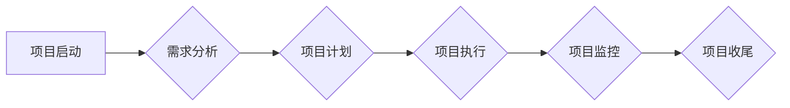
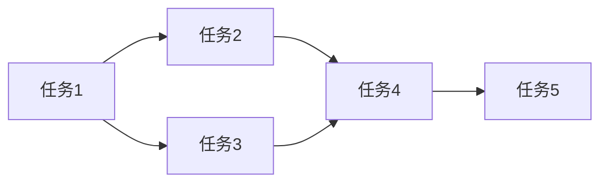

> 项目管理, Agile, Scrum, Kanban, 团队协作, 沟通, 风险管理, 进度控制

## 1. 背景介绍

在当今快速发展的科技时代，软件开发项目日益复杂，项目规模不断扩大，团队成员分布更加分散。如何有效地管理项目和团队，确保项目按时、按预算、按质量完成，成为企业和个人面临的重大挑战。

传统的项目管理方法，例如瀑布模型，由于其线性、阶段性的特点，难以适应快速变化的项目需求和环境。而敏捷开发方法，例如 Scrum 和 Kanban，则更加注重迭代开发、持续改进和团队协作，能够更好地应对复杂项目的需求。

## 2. 核心概念与联系

项目管理的核心是将资源、时间和技能有效地整合起来，以实现预定的目标。项目管理涉及到多个方面，包括：

* **项目计划:** 明确项目目标、范围、时间、成本和资源等关键要素。
* **项目执行:** 按照计划执行项目任务，并进行必要的调整和控制。
* **项目监控:** 定期跟踪项目进度、成本和质量，并及时采取措施解决问题。
* **项目收尾:** 项目完成后进行总结和评估，并进行知识管理和经验积累。

**项目管理流程图:**



## 3. 核心算法原理 & 具体操作步骤

在项目管理中，算法和流程可以帮助我们更有效地管理项目和团队。例如，甘特图可以帮助我们可视化项目进度，而优先级算法可以帮助我们确定哪些任务需要优先完成。

### 3.1  算法原理概述

甘特图是一种常用的项目管理工具，它使用条形图来表示项目进度。每个条形图代表一个任务，条形图的长度代表任务的持续时间。甘特图可以帮助我们直观地了解项目进度，并识别潜在的风险和问题。

优先级算法可以根据任务的紧急程度、重要程度和依赖关系来确定任务的优先级。常见的优先级算法包括：

* **莫斯科矩阵:** 将任务按照紧急程度和重要程度进行分类，并制定不同的处理策略。
* **艾森豪威尔矩阵:** 将任务按照重要程度和紧急程度进行分类，并制定不同的处理策略。

### 3.2  算法步骤详解

**甘特图绘制步骤:**

1. 确定项目任务清单。
2. 确定每个任务的开始时间、结束时间和持续时间。
3. 使用甘特图软件或工具绘制甘特图。

**优先级算法步骤:**

1. 收集所有任务的信息，包括紧急程度、重要程度和依赖关系。
2. 根据选择的优先级算法，计算每个任务的优先级。
3. 根据优先级排序任务，并制定相应的处理策略。

### 3.3  算法优缺点

**甘特图:**

* **优点:** 直观易懂，可以清晰地展示项目进度。
* **缺点:** 难以处理复杂项目，对项目计划的变更不灵敏。

**优先级算法:**

* **优点:** 可以帮助我们高效地处理任务，提高工作效率。
* **缺点:** 算法的准确性取决于输入数据的质量，需要根据实际情况选择合适的算法。

### 3.4  算法应用领域

甘特图和优先级算法广泛应用于项目管理、软件开发、生产制造等领域。

## 4. 数学模型和公式 & 详细讲解 & 举例说明

在项目管理中，数学模型和公式可以帮助我们进行项目计划、进度控制和风险分析。例如，PERT 网络分析法可以帮助我们计算项目完成时间和关键路径，而蒙特卡罗模拟可以帮助我们评估项目风险。

### 4.1  数学模型构建

PERT 网络分析法是一种常用的项目管理方法，它使用网络图来表示项目任务之间的依赖关系，并使用数学公式来计算项目完成时间和关键路径。

**PERT 网络图:**



**关键路径:**

关键路径是指项目完成时间最长的路径，它决定了项目的整体完成时间。

### 4.2  公式推导过程

PERT 网络分析法中常用的公式包括：

* **期望时间:**  Te = (乐观时间 + 4 * 估计时间 + 悲观时间) / 6
* **方差:**  σ^2 = ((悲观时间 - 乐观时间) / 6)^2
* **关键路径时间:**  Tcr = max(Te1, Te2, ..., Ten)

其中，Te 表示任务的期望时间，σ^2 表示任务的方差，Tcr 表示关键路径时间。

### 4.3  案例分析与讲解

假设一个项目有五个任务，它们的期望时间和方差分别如下：

* 任务1: Te1 = 5 天，σ1^2 = 1 天^2
* 任务2: Te2 = 3 天，σ2^2 = 0.5 天^2
* 任务3: Te3 = 4 天，σ3^2 = 1 天^2
* 任务4: Te4 = 2 天，σ4^2 = 0.25 天^2
* 任务5: Te5 = 6 天，σ5^2 = 2 天^2

根据PERT 网络分析法，我们可以计算出项目的关键路径时间和风险。

## 5. 项目实践：代码实例和详细解释说明

在实际项目中，我们可以使用编程语言和工具来实现项目管理功能。例如，我们可以使用 Python 和 Django 来开发一个项目管理系统，或者使用 Jira 和 Trello 来管理项目任务。

### 5.1  开发环境搭建

为了开发一个简单的项目管理系统，我们需要搭建一个开发环境。

* 安装 Python 3.x
* 安装 Django 框架
* 创建一个 Django 项目

### 5.2  源代码详细实现

以下是一个简单的项目管理系统代码示例：

```python
# models.py
from django.db import models

class Task(models.Model):
    title = models.CharField(max_length=200)
    description = models.TextField()
    priority = models.IntegerField()
    status = models.CharField(max_length=10, choices=[('TODO', '待完成'), ('IN_PROGRESS', '进行中'), ('DONE', '已完成')])
    created_at = models.DateTimeField(auto_now_add=True)

# views.py
from django.shortcuts import render
from .models import Task

def task_list(request):
    tasks = Task.objects.all()
    return render(request, 'task_list.html', {'tasks': tasks})
```

### 5.3  代码解读与分析

* models.py 文件定义了 Task 模型，它包含了任务的标题、描述、优先级、状态和创建时间等字段。
* views.py 文件定义了 task_list 函数，它负责渲染任务列表页面。

### 5.4  运行结果展示

运行上述代码后，我们可以访问 http://127.0.0.1:8000/tasks/ 页面，查看任务列表。

## 6. 实际应用场景

项目管理方法和工具广泛应用于各个行业，例如：

* **软件开发:** 使用 Scrum 和 Kanban 等敏捷开发方法来管理软件开发项目。
* **建筑工程:** 使用甘特图和 PERT 网络分析法来管理建筑工程项目。
* **市场营销:** 使用项目管理工具来管理营销活动和推广计划。

### 6.4  未来应用展望

随着科技的不断发展，项目管理方法和工具将更加智能化、自动化和协作化。例如，人工智能和机器学习可以帮助我们更好地预测项目风险和进度，而云计算和移动设备可以帮助我们随时随地管理项目。

## 7. 工具和资源推荐

### 7.1  学习资源推荐

* **书籍:**
    * 《项目管理实战》
    * 《敏捷软件开发》
    * 《Scrum: The Art of Doing Twice the Work in Half the Time》
* **网站:**
    * PMI (Project Management Institute)
    * Scrum Alliance
    * Atlassian

### 7.2  开发工具推荐

* **Jira:** 敏捷项目管理工具
* **Trello:** 看板式项目管理工具
* **Asana:** 协作项目管理工具
* **Microsoft Project:** 传统项目管理工具

### 7.3  相关论文推荐

* **The Standish Group Chaos Report:** 项目管理的失败率和成功率
* **Agile Manifesto:** 敏捷软件开发宣言
* **Scrum Guide:** Scrum 框架指南

## 8. 总结：未来发展趋势与挑战

项目管理是一个不断发展的领域，未来将面临着新的挑战和机遇。

### 8.1  研究成果总结

近年来，项目管理领域取得了显著的进展，例如：

* 敏捷开发方法的普及
* 项目管理工具的智能化和自动化
* 项目风险管理的精细化

### 8.2  未来发展趋势

未来项目管理的发展趋势包括：

* **更加智能化和自动化:** 人工智能和机器学习将被更加广泛地应用于项目管理，例如预测项目风险、优化资源分配和自动生成项目报告。
* **更加协作化:** 云计算和移动设备将促进项目团队的协作和沟通，例如实时共享项目信息、在线协同工作和远程协作。
* **更加个性化:** 项目管理工具将更加注重个性化定制，例如根据用户的需求和工作习惯提供不同的功能和界面。

### 8.3  面临的挑战

项目管理领域也面临着一些挑战，例如：

* **项目复杂性不断增加:** 项目规模和复杂度不断增加，对项目管理能力提出了更高的要求。
* **团队成员分布更加分散:** 团队成员分布更加分散，需要更加有效的沟通和协作机制。
* **技术变化日新月异:** 新技术不断涌现，需要项目经理不断学习和适应。

### 8.4  研究展望

未来，项目管理研究将更加注重以下方面：

* **人工智能在项目管理中的应用:** 研究人工智能如何帮助我们更好地预测项目风险、优化资源分配和自动生成项目报告。
* **项目团队协作的优化:** 研究如何提高项目团队的协作效率和沟通质量。
* **项目管理方法的适应性:** 研究如何将项目管理方法应用于不同类型的项目和行业。

## 9. 附录：常见问题与解答

**常见问题:**

* **什么是敏捷开发？**

敏捷开发是一种迭代开发方法，它强调灵活性和适应性，并注重团队协作和持续改进。

* **什么是 Scrum？**

Scrum 是敏捷开发框架的一种，它使用迭代开发和每日站会等机制来管理项目。

* **什么是 Kanban？**

Kanban 是看板式项目管理方法，它使用看板和卡片来可视化项目进度和工作流程。

**解答:**

* **什么是敏捷开发？**

敏捷开发是一种迭代开发方法，它强调灵活性和适应性，并注重团队协作和持续改进。

* **什么是 Scrum？**

Scrum 是敏捷开发框架的一种，它使用迭代开发和每日站会等机制来管理项目。

* **什么是 Kanban？**

Kanban 是看板式项目管理方法，它使用看板和卡片来可视化项目进度和工作流程。


作者：禅与计算机程序设计艺术 / Zen and the Art of Computer Programming 
<end_of_turn>