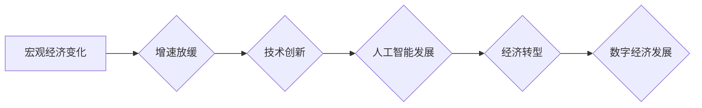

> 宏观经济、增速放缓、人工智能、技术创新、经济转型、数字经济、数据驱动、算法优化、可持续发展

## 1. 背景介绍

全球经济近年来呈现出增速放缓的趋势，传统产业发展面临挑战，新兴技术与产业的崛起也带来了新的机遇和挑战。人工智能（AI）作为一项颠覆性技术，正在深刻地改变着经济结构、生产方式和生活方式。

宏观经济变化对科技发展和应用产生着深远影响。一方面，经济增速放缓可能导致科技创新投入减少，阻碍AI技术的发展和应用。另一方面，宏观经济环境的变化也催生了新的需求和应用场景，推动AI技术在各个领域的应用。

## 2. 核心概念与联系

**2.1 宏观经济变化**

宏观经济是指一个国家或地区的整体经济活动，包括国民生产总值（GDP）、就业率、通货膨胀率、利率等指标。宏观经济变化是指这些指标在一段时间内的波动和趋势变化。

**2.2 增速放缓**

增速放缓是指经济增长速度逐渐减慢，通常表现为GDP增长率下降。增速放缓的原因复杂多样，包括人口老龄化、资源枯竭、技术创新乏力、国际经济环境变化等。

**2.3 人工智能（AI）**

人工智能是指模拟人类智能行为的计算机系统。AI技术涵盖了机器学习、深度学习、自然语言处理、计算机视觉等多个领域。

**2.4 技术创新**

技术创新是指通过研发新产品、新技术、新工艺等方式，提高生产效率、降低生产成本、满足新兴需求的过程。

**2.5 数字经济**

数字经济是指以数字技术为基础，以数据为核心要素，以网络为平台，以智能为驱动，以创新为动力，以服务为导向的经济形态。

**2.6 数据驱动**

数据驱动是指利用大数据分析和挖掘技术，为决策提供数据支持，提高决策效率和准确性。

**2.7 算法优化**

算法优化是指通过改进算法设计和实现，提高算法的效率、准确性和鲁棒性。

**2.8 可持续发展**

可持续发展是指满足当前需求，不损害后代满足其自身需求的能力。

**2.9 经济转型**

经济转型是指由传统经济模式向新经济模式转变的过程，例如由制造业向服务业转型。

**2.10 经济结构调整**

经济结构调整是指改变经济中不同部门的比例和结构，以适应经济发展的新需求和挑战。

**2.11 产业升级**

产业升级是指通过技术创新、产品升级、服务升级等方式，提高产业的附加值和竞争力。

**2.12 创新驱动发展**

创新驱动发展是指以科技创新为动力，推动经济发展和社会进步。

**2.13 数字技术应用**

数字技术应用是指将数字技术应用于各个领域，例如工业、农业、医疗、教育等，以提高效率、降低成本、提升服务质量。

**2.14 智能化转型**

智能化转型是指通过人工智能、物联网、云计算等技术，实现生产、生活、服务等领域的智能化升级。

**2.15 经济全球化**

经济全球化是指各国经济相互联系和融合的趋势，包括贸易、投资、技术交流等方面的全球化。

**2.16 宏观调控**

宏观调控是指政府通过财政、货币、税收等政策手段，调节经济运行，实现经济稳定和可持续发展。

**2.17 政策环境**

政策环境是指政府制定的法律法规、政策措施等，对企业和市场活动的影响。

**2.18 社会发展**

社会发展是指社会各方面的发展，包括经济、政治、文化、教育、医疗等。

**2.19 人才培养**

人才培养是指培养具有创新能力、实践能力和社会责任感的优秀人才。

**2.20 国际合作**

国际合作是指各国在经济、科技、文化等领域进行合作，共同解决全球性问题。

**2.21 伦理问题**

伦理问题是指人工智能技术发展过程中可能带来的伦理风险和挑战，例如算法偏见、数据隐私、工作岗位替代等。

**2.22 监管机制**

监管机制是指政府对人工智能技术发展和应用的监管制度和措施，以确保人工智能技术安全、可控、可持续发展。

**2.23 未来趋势**

未来，人工智能技术将继续发展和应用，对经济社会产生更深远的影响。

**2.24 挑战与机遇**

宏观经济变化和人工智能技术发展相互影响，也带来了新的挑战和机遇。

**Mermaid 流程图**

## 3. 核心算法原理 & 具体操作步骤

**3.1 算法原理概述**

**3.2 算法步骤详解**

**3.3 算法优缺点**

**3.4 算法应用领域**

## 4. 数学模型和公式 & 详细讲解 & 举例说明

**4.1 数学模型构建**

**4.2 公式推导过程**

**4.3 案例分析与讲解**

## 5. 项目实践：代码实例和详细解释说明

**5.1 开发环境搭建**

**5.2 源代码详细实现**

**5.3 代码解读与分析**

**5.4 运行结果展示**

## 6. 实际应用场景

**6.1 具体应用案例**

**6.2 应用效果分析**

**6.3 未来应用展望**

## 7. 工具和资源推荐

**7.1 学习资源推荐**

**7.2 开发工具推荐**

**7.3 相关论文推荐**

## 8. 总结：未来发展趋势与挑战

**8.1 研究成果总结**

**8.2 未来发展趋势**

**8.3 面临的挑战**

**8.4 研究展望**

## 9. 附录：常见问题与解答

**9.1 常见问题**

**9.2 问题解答**

作者：禅与计算机程序设计艺术 / Zen and the Art of Computer Programming

<end_of_turn>