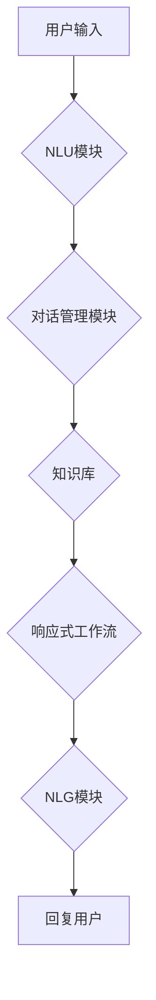

> AI代理, 响应式工作流, 实时客户服务, 自然语言处理, 机器学习, 聊天机器人, 客户体验

## 1. 背景介绍

在当今数字化的时代，客户期望能够随时随地获得快速、高效的客户服务。传统的客服模式，例如电话或电子邮件，往往难以满足这一需求，尤其是在高峰时段，等待时间过长，客户体验难以保证。

人工智能（AI）技术的快速发展为实时客户服务提供了新的解决方案。AI代理，也称为聊天机器人，能够利用自然语言处理（NLP）和机器学习（ML）技术，与客户进行自然流畅的对话，提供即时响应和个性化服务。

## 2. 核心概念与联系

**2.1 AI代理**

AI代理是一种基于人工智能的虚拟助手，能够理解和响应用户的自然语言输入，并提供相关信息或完成特定任务。AI代理通常由以下几个核心组件组成：

* **自然语言理解（NLU）模块：**负责将用户的自然语言输入转换为机器可理解的结构化数据。
* **对话管理模块：**负责管理对话流程，根据用户的输入和上下文信息，选择合适的回复并引导对话方向。
* **知识库：**存储了AI代理需要使用的知识和信息，例如产品信息、服务指南、常见问题解答等。
* **自然语言生成（NLG）模块：**负责将机器生成的回复转换为自然流畅的文本，并以符合用户期望的方式呈现。

**2.2 响应式工作流**

响应式工作流是一种基于事件驱动的自动化流程，能够根据用户的输入或系统事件，动态地调整流程执行路径，提供个性化和即时的服务体验。

**2.3 AI代理的响应式工作流**

将AI代理与响应式工作流相结合，可以构建出更加智能、灵活和高效的实时客户服务系统。AI代理可以根据用户的输入，识别用户的意图和需求，并根据预定义的规则或机器学习模型，动态地选择合适的服务流程，提供个性化的服务体验。



## 3. 核心算法原理 & 具体操作步骤

**3.1 算法原理概述**

AI代理的响应式工作流的核心算法原理主要包括：

* **自然语言理解（NLU）:** 利用深度学习模型，例如BERT、GPT等，对用户的自然语言输入进行分析，识别用户的意图、实体和情感等信息。
* **对话管理:** 利用状态机、决策树或强化学习等算法，根据用户的输入和对话上下文，选择合适的回复并引导对话方向。
* **知识图谱:** 利用知识图谱技术，将相关知识和信息进行组织和关联，帮助AI代理理解用户的意图并提供更准确的回复。

**3.2 算法步骤详解**

1. **用户输入:** 用户向AI代理发送自然语言输入。
2. **NLU分析:** NLU模块对用户的输入进行分析，识别用户的意图、实体和情感等信息。
3. **对话状态更新:** 根据用户的输入和对话上下文，对话管理模块更新对话状态。
4. **知识库查询:** 根据用户的意图和对话状态，对话管理模块查询知识库，获取相关信息。
5. **回复生成:** NLG模块根据查询到的信息，生成自然流畅的回复，并发送给用户。
6. **用户反馈:** 用户对回复进行反馈，例如点赞、评论或重新提问。
7. **流程调整:** 根据用户的反馈，对话管理模块调整对话流程，提供更个性化的服务体验。

**3.3 算法优缺点**

**优点:**

* **实时响应:** AI代理能够提供即时的回复，满足用户对快速服务的期望。
* **个性化服务:** 响应式工作流能够根据用户的输入和上下文信息，动态地调整服务流程，提供个性化的服务体验。
* **成本效益:** AI代理能够自动处理大量客户请求，减轻人工客服的负担，降低服务成本。

**缺点:**

* **理解能力有限:** AI代理的理解能力仍然有限，无法处理所有复杂或模糊的自然语言输入。
* **缺乏情感共鸣:** AI代理缺乏情感共鸣，难以处理一些需要情感支持的客户请求。
* **数据依赖:** AI代理的性能依赖于训练数据的质量，如果训练数据不足或不准确，则会影响AI代理的性能。

**3.4 算法应用领域**

AI代理的响应式工作流在以下领域具有广泛的应用前景：

* **电商:** 提供在线购物咨询、订单跟踪、退换货服务等。
* **金融:** 提供账户查询、转账、理财咨询等服务。
* **医疗:** 提供预约挂号、问诊、药品查询等服务。
* **教育:** 提供在线辅导、知识问答、学习资源推荐等服务。

## 4. 数学模型和公式 & 详细讲解 & 举例说明

**4.1 数学模型构建**

在AI代理的响应式工作流中，可以使用状态机模型来表示对话流程。状态机由状态和转换规则组成，每个状态代表对话的某个阶段，转换规则则规定了在特定条件下如何从一个状态转换到另一个状态。

**4.2 公式推导过程**

状态机的转换规则可以表示为以下公式：

```
状态转换 = f(用户输入, 对话状态, 知识库)
```

其中：

* `状态转换` 表示从一个状态到另一个状态的转换操作。
* `用户输入` 表示用户发送的自然语言输入。
* `对话状态` 表示当前对话的阶段。
* `知识库` 表示AI代理所拥有的知识和信息。

**4.3 案例分析与讲解**

例如，在电商领域的在线购物咨询场景中，一个简单的状态机模型可以表示如下：

* **状态1：初始状态**

* **状态2：产品查询**

* **状态3：购物车添加**

* **状态4：订单确认**

当用户输入“我想买一件T恤”时，系统会从状态1转换到状态2，并提示用户选择T恤款式。当用户选择了一款T恤并输入“添加到购物车”时，系统会从状态2转换到状态3，并将T恤添加到购物车中。

## 5. 项目实践：代码实例和详细解释说明

**5.1 开发环境搭建**

* Python 3.7+
* TensorFlow 2.0+
* NLTK
* Rasa

**5.2 源代码详细实现**

```python
# NLU模块示例代码
import nltk
from nltk.tokenize import word_tokenize
from nltk.tag import pos_tag

def analyze_text(text):
    tokens = word_tokenize(text)
    pos_tags = pos_tag(tokens)
    # ... 进一步分析文本，识别意图、实体等信息

# 对话管理模块示例代码
def manage_conversation(user_input, conversation_state):
    # ... 根据用户输入和对话状态，选择合适的回复并更新对话状态

# NLG模块示例代码
def generate_response(response_text):
    # ... 将机器生成的回复转换为自然流畅的文本

```

**5.3 代码解读与分析**

* NLU模块使用NLTK库对用户输入进行分词和词性标注，并进一步分析文本，识别用户的意图和实体信息。
* 对话管理模块根据用户的输入和对话状态，选择合适的回复并更新对话状态。
* NLG模块将机器生成的回复转换为自然流畅的文本，并发送给用户。

**5.4 运行结果展示**

当用户向AI代理发送“我想买一件T恤”时，AI代理会识别用户的意图为“购买产品”，并根据对话状态，提示用户选择T恤款式。

## 6. 实际应用场景

**6.1 电商客服**

AI代理可以帮助电商平台处理大量的客户咨询，例如产品信息查询、订单跟踪、退换货服务等。

**6.2 金融客服**

AI代理可以帮助银行和金融机构处理客户的账户查询、转账、理财咨询等服务。

**6.3 医疗客服**

AI代理可以帮助医院和医疗机构处理患者的预约挂号、问诊、药品查询等服务。

**6.4 教育客服**

AI代理可以帮助教育机构提供在线辅导、知识问答、学习资源推荐等服务。

**6.5 未来应用展望**

随着人工智能技术的不断发展，AI代理的响应式工作流将在更多领域得到应用，例如：

* **个性化推荐:** AI代理可以根据用户的兴趣和偏好，提供个性化的产品、服务和内容推荐。
* **智能决策支持:** AI代理可以帮助用户分析数据、识别趋势，并提供智能决策支持。
* **虚拟助手:** AI代理可以成为用户的虚拟助手，帮助用户完成各种日常任务，例如日程安排、邮件管理、信息查询等。

## 7. 工具和资源推荐

**7.1 学习资源推荐**

* **书籍:**
    * 《深度学习》
    * 《自然语言处理》
    * 《机器学习》
* **在线课程:**
    * Coursera
    * edX
    * Udacity

**7.2 开发工具推荐**

* **Rasa:** 开源的对话平台，用于构建AI代理。
* **Dialogflow:** Google提供的对话平台，用于构建AI代理。
* **Amazon Lex:** Amazon提供的对话平台，用于构建AI代理。

**7.3 相关论文推荐**

* **BERT: Pre-training of Deep Bidirectional Transformers for Language Understanding**
* **GPT-3: Language Models are Few-Shot Learners**
* **Seq2Seq Learning with Neural Networks**

## 8. 总结：未来发展趋势与挑战

**8.1 研究成果总结**

近年来，AI代理的响应式工作流取得了显著的进展，在实时客户服务领域展现出巨大的潜力。

**8.2 未来发展趋势**

* **更强大的理解能力:** 未来AI代理将能够理解更复杂和模糊的自然语言输入，并提供更准确和有针对性的回复。
* **更个性化的服务体验:** AI代理将能够根据用户的个人喜好和需求，提供更加个性化的服务体验。
* **更广泛的应用场景:** AI代理将应用于更多领域，例如教育、医疗、金融等。

**8.3 面临的挑战**

* **数据安全和隐私保护:** AI代理需要处理大量用户数据，因此数据安全和隐私保护是一个重要的挑战。
* **算法可解释性:** AI代理的决策过程往往是复杂的，难以解释，这可能会导致用户对AI代理的信任度降低。
* **伦理问题:** AI代理的应用可能会引发一些伦理问题，例如算法偏见、责任归属等。

**8.4 研究展望**

未来，研究人员将继续致力于解决以上挑战，并推动AI代理的响应式工作流技术取得更大的进步。


## 9. 附录：常见问题与解答

**9.1 AI代理可以处理所有类型的客户请求吗？**

目前，AI代理的理解能力仍然有限，无法处理所有类型的客户请求，例如需要情感支持或专业知识的请求。

**9.2 AI代理会取代人工客服吗？**

AI代理可以帮助减轻人工客服的负担，但不会完全取代人工客服。人工客服仍然在处理复杂或需要情感支持的客户请求方面发挥着重要作用。

**9.3 如何确保AI代理的安全性？**

为了确保AI代理的安全性，需要采取以下措施：

* 使用安全的开发环境和工具。
* 对用户数据进行加密和匿名处理。
* 定期进行安全测试和漏洞扫描。

作者：禅与计算机程序设计艺术 / Zen and the Art of Computer Programming 


<end_of_turn>