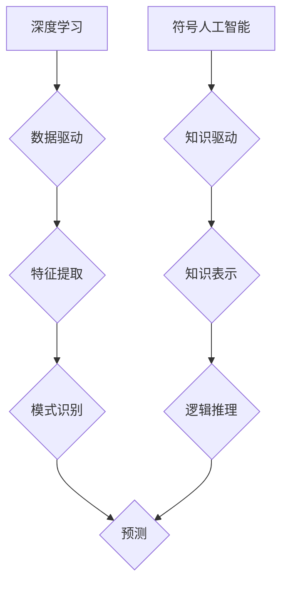

> 人工智能，深度学习，符号人工智能，专家系统，知识表示，机器学习，自然语言处理

## 1. 背景介绍

人工智能（AI）作为一项前沿科技，近年来发展迅速，取得了令人瞩目的成就。从语音识别、图像识别到自动驾驶、医疗诊断，AI技术已渗透到各个领域，深刻地改变着我们的生活。然而，在AI发展道路上，也存在着不同的观点和路径。

张钹院士，中国人工智能领域的领军人物，曾提出“人工智能的两条路径”的概念，即深度学习路径和符号人工智能路径。这两种路径分别代表着AI发展中的两种不同的思路和方法，引发了广泛的讨论和思考。

## 2. 核心概念与联系

**2.1 深度学习路径**

深度学习是近年来发展迅速的机器学习子领域，其核心是利用多层神经网络来模拟人类大脑的学习过程。深度学习算法能够从海量数据中自动提取特征，并进行复杂的模式识别和预测。

**2.2 符号人工智能路径**

符号人工智能，也称为规则人工智能，强调知识的明确表示和推理。它试图通过构建符号系统和规则库来模拟人类的逻辑思维和知识获取能力。

**2.3 两条路径的联系与区别**

深度学习和符号人工智能虽然出发点不同，但最终目标都是实现智能。深度学习擅长于处理海量数据，并发现数据中的隐含模式，而符号人工智能则更注重知识的明确表示和逻辑推理。

**Mermaid 流程图**



## 3. 核心算法原理 & 具体操作步骤

**3.1 深度学习算法原理概述**

深度学习算法的核心是多层神经网络。神经网络由多个层级的神经元组成，每个神经元接收来自上一层的输入信号，并通过激活函数进行处理，输出到下一层。通过训练，神经网络能够学习到数据中的特征和模式。

**3.2 深度学习算法步骤详解**

1. **数据预处理:** 将原始数据进行清洗、转换和特征工程，使其适合深度学习模型的训练。
2. **模型构建:** 选择合适的深度学习模型架构，例如卷积神经网络（CNN）、循环神经网络（RNN）等。
3. **模型训练:** 使用训练数据训练深度学习模型，通过调整模型参数，使模型的预测结果与真实值尽可能接近。
4. **模型评估:** 使用测试数据评估模型的性能，例如准确率、召回率等。
5. **模型部署:** 将训练好的模型部署到实际应用场景中，用于进行预测或决策。

**3.3 深度学习算法优缺点**

**优点:**

* 能够自动提取特征，无需人工特征工程。
* 能够处理海量数据，并发现数据中的隐含模式。
* 在图像识别、语音识别等领域取得了突破性进展。

**缺点:**

* 训练数据量要求高，对数据质量要求严格。
* 模型解释性差，难以理解模型的决策过程。
* 容易受到过拟合的影响。

**3.4 深度学习算法应用领域**

* 图像识别、语音识别、自然语言处理
* 自动驾驶、医疗诊断、金融风险控制
* 个性化推荐、智能客服、机器翻译

**3.5 符号人工智能算法原理概述**

符号人工智能算法的核心是知识表示和逻辑推理。它通过构建符号系统和规则库来表示知识，并利用逻辑推理规则进行知识推演和决策。

**3.6 符号人工智能算法步骤详解**

1. **知识表示:** 将领域知识表示为符号和规则，例如使用逻辑语言、概念图等。
2. **推理引擎:** 使用逻辑推理引擎进行知识推演，根据已知知识和规则，推导出新的知识或结论。
3. **决策机制:** 根据推理结果，制定决策或给出建议。

**3.7 符号人工智能算法优缺点**

**优点:**

* 能够明确表示知识，并进行逻辑推理。
* 模型解释性强，能够解释决策过程。
* 能够处理不确定性和不完整的信息。

**缺点:**

* 知识表示和规则构建需要人工干预，效率较低。
* 难以处理复杂、模糊的知识。
* 规模较小的知识库难以体现其优势。

**3.8 符号人工智能算法应用领域**

* 专家系统、自然语言理解
* 知识库管理、推理机器人
* 医疗诊断、法律咨询

## 4. 数学模型和公式 & 详细讲解 & 举例说明

**4.1 深度学习数学模型构建**

深度学习模型的核心是神经网络，其数学模型可以表示为多层感知机（MLP）。

**4.2 深度学习公式推导过程**

* **激活函数:** 激活函数用于引入非线性，使神经网络能够学习复杂的模式。常见的激活函数包括 sigmoid 函数、ReLU 函数等。

* **损失函数:** 损失函数用于衡量模型预测结果与真实值的差距。常见的损失函数包括均方误差（MSE）、交叉熵损失等。

* **梯度下降:** 梯度下降算法用于优化模型参数，使其能够最小化损失函数。

**4.3 深度学习案例分析与讲解**

**4.3.1 图像分类**

使用卷积神经网络（CNN）进行图像分类。CNN能够自动提取图像特征，并进行分类。

**4.3.2 自然语言处理**

使用循环神经网络（RNN）进行自然语言处理任务，例如机器翻译、文本摘要等。RNN能够处理序列数据，并捕捉文本中的上下文信息。

**4.4 符号人工智能数学模型构建**

符号人工智能模型的核心是逻辑推理系统，其数学模型可以表示为命题逻辑、谓词逻辑等。

**4.5 符号人工智能公式推导过程**

* **推理规则:** 符号人工智能使用逻辑推理规则进行知识推演，例如 Modus Ponens、Modus Tollens 等。

* **知识库:** 知识库用于存储领域知识，并以符号形式表示。

**4.6 符号人工智能案例分析与讲解**

**4.6.1 专家系统**

构建一个专家系统，用于诊断疾病。专家系统利用医学知识库和推理规则，根据患者的症状进行诊断。

**4.6.2 逻辑推理机器人**

设计一个逻辑推理机器人，能够理解自然语言指令，并进行相应的动作。

## 5. 项目实践：代码实例和详细解释说明

**5.1 开发环境搭建**

使用 Python 语言和 TensorFlow 或 PyTorch 深度学习框架进行开发。

**5.2 源代码详细实现**

```python
# 使用 TensorFlow 实现一个简单的线性回归模型

import tensorflow as tf

# 定义模型
model = tf.keras.models.Sequential([
    tf.keras.layers.Dense(units=1, input_shape=[1])
])

# 编译模型
model.compile(optimizer='sgd', loss='mean_squared_error')

# 训练模型
model.fit(x_train, y_train, epochs=100)

# 评估模型
loss = model.evaluate(x_test, y_test)
print('Loss:', loss)
```

**5.3 代码解读与分析**

* 使用 TensorFlow 的 Sequential 模型构建一个线性回归模型。
* 模型只有一个全连接层，输出一个单元。
* 使用随机梯度下降（SGD）作为优化器，均方误差（MSE）作为损失函数。
* 使用训练数据训练模型 100 个 epochs。
* 使用测试数据评估模型的性能。

**5.4 运行结果展示**

训练完成后，打印模型的损失值。

## 6. 实际应用场景

**6.1 深度学习应用场景**

* **图像识别:** 自动驾驶、人脸识别、物体检测
* **语音识别:** 语音助手、语音搜索、语音翻译
* **自然语言处理:** 机器翻译、文本摘要、情感分析

**6.2 符号人工智能应用场景**

* **专家系统:** 医疗诊断、法律咨询、金融风险控制
* **知识库管理:** 知识表示、知识推理、知识发现
* **逻辑推理机器人:** 自然语言理解、任务规划、决策支持

**6.3 未来应用展望**

* **深度学习:** 人工通用智能、自动程序设计、科学发现
* **符号人工智能:** 知识图谱、智能问答、可解释人工智能

## 7. 工具和资源推荐

**7.1 学习资源推荐**

* **深度学习:**
    * 深度学习 Specialization (Coursera)
    * Deep Learning Book (Ian Goodfellow)
* **符号人工智能:**
    * Artificial Intelligence: A Modern Approach (Stuart Russell & Peter Norvig)
    * Knowledge Representation and Reasoning (John Sowa)

**7.2 开发工具推荐**

* **深度学习:** TensorFlow, PyTorch, Keras
* **符号人工智能:** Prolog, CLIPS, Jess

**7.3 相关论文推荐**

* **深度学习:**
    * AlexNet: ImageNet Classification with Deep Convolutional Neural Networks (Krizhevsky et al., 2012)
    * Generative Adversarial Networks (Goodfellow et al., 2014)
* **符号人工智能:**
    * A Logic Programming Approach to Knowledge Representation (Sowa, 1984)
    * The Cyc Project: A Computational Model of Human Knowledge (Lenat & Guha, 1990)

## 8. 总结：未来发展趋势与挑战

**8.1 研究成果总结**

深度学习和符号人工智能在各自领域取得了显著进展，为人工智能的发展做出了重要贡献。

**8.2 未来发展趋势**

* **深度学习:** 
    * 更深、更广的网络结构
    * 增强学习和迁移学习
    * 可解释性增强
* **符号人工智能:**
    * 知识表示和推理的自动化
    * 知识图谱的构建和应用
    * 人机交互的智能化

**8.3 面临的挑战**

* **数据获取和隐私保护:** 深度学习依赖于海量数据，而数据获取和隐私保护是一个重要的挑战。
* **模型解释性和可信度:** 深度学习模型的决策过程难以解释，这限制了其在一些领域中的应用。
* **通用人工智能:** 目前的人工智能系统仍然局限于特定领域，实现通用人工智能仍然是一个长期目标。

**8.4 研究展望**

未来，深度学习和符号人工智能将继续发展，并相互融合，推动人工智能技术的进步。


## 9. 附录：常见问题与解答

**9.1 深度学习和符号人工智能哪个更好？**

没有绝对的优劣之分，两种方法各有优缺点，适合不同的应用场景。

**9.2 如何选择合适的深度学习框架？**

选择深度学习框架需要考虑项目需求、开发经验和社区支持等因素。

**9.3 如何构建符号人工智能知识库？**

构建符号人工智能知识库需要进行领域知识分析、概念建模和规则构建等工作。


作者：禅与计算机程序设计艺术 / Zen and the Art of Computer Programming 
<end_of_turn>