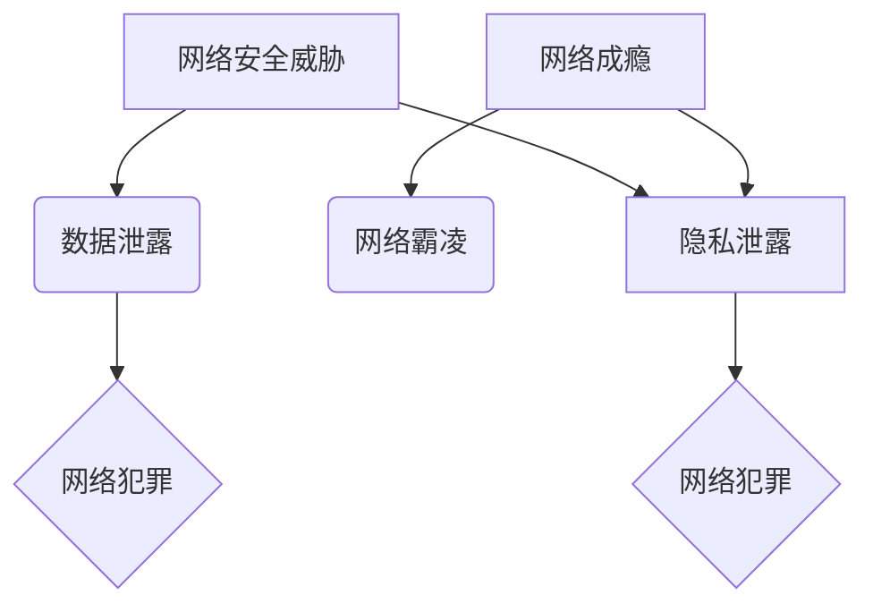

> 数字化威胁，网络成瘾，隐私安全，网络霸凌，网络安全，数字化风险，网络伦理

## 1. 背景介绍

我们生活在一个数字化时代，信息技术无处不在，深刻地改变着我们的生活方式、工作模式和社会结构。互联网、移动互联网、大数据、人工智能等技术的飞速发展，为人类社会带来了前所未有的便利和机遇。然而，数字化时代也孕育着新的风险和挑战，这些风险和挑战对个人、社会和国家安全构成威胁。

**1.1 数字化时代带来的机遇与挑战**

数字化时代为人类社会带来了诸多机遇，例如：

* **信息获取和传播的便捷化:** 互联网和移动互联网使得信息获取和传播更加便捷高效，打破了地域和时间限制，促进了知识共享和文化交流。
* **经济发展和社会进步:** 数字经济的蓬勃发展，催生了新的产业和就业机会，推动了社会经济的转型升级。
* **生活方式的改变:** 智能手机、智能家居、在线教育等数字化产品和服务，改变了人们的生活方式，提高了生活质量。

然而，数字化时代也带来了新的挑战，例如：

* **网络安全威胁:** 网络攻击、数据泄露、网络犯罪等安全威胁日益频繁，对个人隐私、企业数据和国家安全构成严重威胁。
* **网络成瘾:** 网络游戏、社交媒体等数字化产品和服务，容易让人沉迷其中，导致网络成瘾，影响身心健康和正常生活。
* **网络霸凌:** 网络平台成为网络霸凌的温床，网络欺凌、网络谣言等行为，对受害者造成严重的心理伤害。
* **隐私泄露:** 数字化时代，个人信息被广泛收集和利用，隐私泄露风险增加，个人信息安全受到威胁。

**1.2 数字化威胁意识的重要性**

在数字化时代，提高数字化威胁意识，认识到数字化带来的风险和挑战，并采取相应的防范措施，对于个人、社会和国家安全至关重要。

## 2. 核心概念与联系

**2.1 数字化威胁的概念**

数字化威胁是指在数字化环境中，对个人、组织或国家安全构成威胁的各种行为、事件或因素。

**2.2 数字化威胁的类型**

数字化威胁主要包括以下几种类型：

* **网络安全威胁:** 网络攻击、数据泄露、网络犯罪等。
* **网络成瘾:** 网络游戏、社交媒体等数字化产品和服务导致的成瘾行为。
* **网络霸凌:** 网络平台上发生的欺凌、骚扰、诽谤等行为。
* **隐私泄露:** 个人信息被非法收集、使用或泄露的行为。

**2.3 数字化威胁的联系**

数字化威胁之间存在着密切的联系，相互影响、相互促进。例如，网络攻击可以导致数据泄露，网络霸凌可以引发网络成瘾，隐私泄露可以成为网络犯罪的工具。

**2.4 数字化威胁的架构**



## 3. 核心算法原理 & 具体操作步骤

**3.1 算法原理概述**

为了应对数字化威胁，需要开发相应的算法和技术来进行防范和应对。例如，网络安全领域常用的算法包括：

* **加密算法:** 用于保护数据安全，防止数据被未授权的访问者窃取或篡改。
* **身份验证算法:** 用于验证用户的身份，确保只有授权的用户才能访问系统或数据。
* **入侵检测算法:** 用于检测网络攻击，识别恶意行为，并采取相应的防御措施。

**3.2 算法步骤详解**

以加密算法为例，其基本步骤包括：

1. **密钥生成:** 生成一个用于加密和解密数据的密钥。
2. **加密:** 使用密钥对数据进行加密，生成密文。
3. **解密:** 使用密钥对密文进行解密，恢复原始数据。

**3.3 算法优缺点**

不同的加密算法具有不同的优缺点，需要根据实际应用场景选择合适的算法。例如，AES算法是一种常用的加密算法，其安全性高，性能好，但密钥长度较长。RSA算法是一种公钥加密算法，安全性高，但性能较差。

**3.4 算法应用领域**

加密算法广泛应用于各种领域，例如：

* **网络安全:** 保护网络通信数据安全。
* **电子商务:** 保护用户支付信息安全。
* **医疗保健:** 保护患者医疗信息安全。

## 4. 数学模型和公式 & 详细讲解 & 举例说明

**4.1 数学模型构建**

为了量化数字化威胁的风险，可以构建数学模型来描述威胁的发生概率、影响程度和损失程度。例如，可以构建一个网络攻击风险模型，将网络攻击的成功概率、攻击的破坏程度和损失的经济价值等因素纳入模型中，从而评估网络攻击的风险等级。

**4.2 公式推导过程**

假设网络攻击的成功概率为P，攻击的破坏程度为D，损失的经济价值为L，则网络攻击的风险等级可以表示为：

```latex
风险等级 = P * D * L
```

**4.3 案例分析与讲解**

例如，假设一个公司的网络攻击成功概率为0.1，攻击的破坏程度为50%，损失的经济价值为100万美元，则该公司的网络攻击风险等级为：

```latex
风险等级 = 0.1 * 0.5 * 1000000 = 50000美元
```

## 5. 项目实践：代码实例和详细解释说明

**5.1 开发环境搭建**

为了实现数字化威胁防范的算法和技术，需要搭建相应的开发环境。例如，可以利用Python语言和相关的库函数，例如Scikit-learn、TensorFlow等，来开发网络安全威胁检测算法。

**5.2 源代码详细实现**

```python
# 这是一个简单的网络攻击检测算法示例
import numpy as np
from sklearn.model_selection import train_test_split
from sklearn.linear_model import LogisticRegression

# 假设我们有以下网络流量数据
data = np.array([
    [1, 0, 0, 1],
    [0, 1, 1, 0],
    [1, 1, 0, 1],
    [0, 0, 1, 0],
    [1, 0, 1, 1],
])
labels = np.array([0, 1, 0, 1, 0])

# 将数据分成训练集和测试集
X_train, X_test, y_train, y_test = train_test_split(data, labels, test_size=0.2)

# 训练逻辑回归模型
model = LogisticRegression()
model.fit(X_train, y_train)

# 对测试集进行预测
predictions = model.predict(X_test)

# 计算模型的准确率
accuracy = np.mean(predictions == y_test)
print(f"模型准确率: {accuracy}")
```

**5.3 代码解读与分析**

这段代码演示了一个简单的网络攻击检测算法。该算法使用逻辑回归模型来分类网络流量，将正常流量和攻击流量进行区分。

**5.4 运行结果展示**

运行该代码后，会输出模型的准确率。

## 6. 实际应用场景

**6.1 网络安全**

数字化威胁防范技术广泛应用于网络安全领域，例如：

* **入侵检测系统 (IDS):** 利用机器学习算法分析网络流量，识别恶意行为，并发出警报。
* **防火墙:** 过滤网络流量，阻止未授权的访问。
* **反病毒软件:** 检测和清除计算机病毒。

**6.2 网络成瘾防治**

为了防治网络成瘾，可以利用数字化威胁防范技术，例如：

* **时间管理软件:** 限制用户在特定网站或应用程序上的使用时间。
* **网络行为监控软件:** 监控用户的网络行为，识别成瘾行为。
* **心理咨询和治疗:** 提供心理咨询和治疗服务，帮助用户克服网络成瘾。

**6.3 网络霸凌防治**

为了防治网络霸凌，可以利用数字化威胁防范技术，例如：

* **网络内容过滤:** 过滤网络上的有害内容，例如仇恨言论、暴力内容等。
* **网络举报机制:** 建立网络举报机制，方便用户举报网络霸凌行为。
* **网络教育:** 进行网络安全和网络伦理教育，提高用户的网络素养。

**6.4 未来应用展望**

随着数字化时代的不断发展，数字化威胁防范技术将面临新的挑战和机遇。未来，数字化威胁防范技术将更加智能化、自动化和个性化，能够更好地应对新的威胁和挑战。

## 7. 工具和资源推荐

**7.1 学习资源推荐**

* **书籍:**
    * 《网络安全基础》
    * 《网络攻击与防御》
    * 《人工智能与机器学习》
* **在线课程:**
    * Coursera: 网络安全课程
    * edX: 人工智能课程
* **网站:**
    * SANS Institute: 网络安全培训和认证机构
    * OWASP: 开源软件安全项目

**7.2 开发工具推荐**

* **Python:** 一种常用的编程语言，广泛应用于网络安全和人工智能领域。
* **Scikit-learn:** 一种机器学习库，提供各种机器学习算法。
* **TensorFlow:** 一种深度学习框架，用于开发人工智能模型。

**7.3 相关论文推荐**

* **网络安全威胁检测论文:**
    * "A Survey of Intrusion Detection Systems"
    * "Deep Learning for Intrusion Detection: A Comprehensive Survey"
* **网络成瘾防治论文:**
    * "Internet Addiction: A Review of the Literature"
    * "Cognitive Behavioral Therapy for Internet Addiction"
* **网络霸凌防治论文:**
    * "Cyberbullying: A Review of the Literature"
    * "Preventing Cyberbullying: A Multi-Faceted Approach"

## 8. 总结：未来发展趋势与挑战

**8.1 研究成果总结**

数字化威胁防范技术取得了显著的进展，例如：

* **机器学习算法:** 在网络安全威胁检测、网络成瘾防治和网络霸凌防治等领域取得了成功应用。
* **人工智能技术:** 在网络安全威胁分析、网络攻击预警和网络安全态势感知等领域展现出巨大潜力。

**8.2 未来发展趋势**

数字化威胁防范技术将朝着以下方向发展：

* **更加智能化:** 利用人工智能技术，实现自动化威胁检测、预测和响应。
* **更加个性化:** 根据用户的行为特征和需求，提供个性化的防范服务。
* **更加协同化:** 建立多方协作的网络安全体系，共享威胁情报和防范经验。

**8.3 面临的挑战**

数字化威胁防范技术也面临着一些挑战，例如：

* **技术复杂性:** 数字化威胁不断演变，需要不断更新和改进防范技术。
* **数据安全问题:** 防范技术需要大量的数据进行训练和测试，如何保证数据的安全和隐私是一个重要问题。
* **伦理问题:** 数字化威胁防范技术可能会侵犯用户的隐私和自由，需要认真考虑伦理问题。

**8.4 研究展望**

未来，数字化威胁防范技术的研究将更加注重以下方面：

* **人工智能技术的应用:** 探索人工智能技术在数字化威胁防范领域的更多应用场景。
* **数据安全和隐私保护:** 研究新的数据安全和隐私保护技术，保障数据的安全和隐私。
* **伦理规范的制定:** 制定相应的伦理规范，引导数字化威胁防范技术的健康发展。

## 9. 附录：常见问题与解答

**9.1 如何提高网络安全意识？**

* 使用强