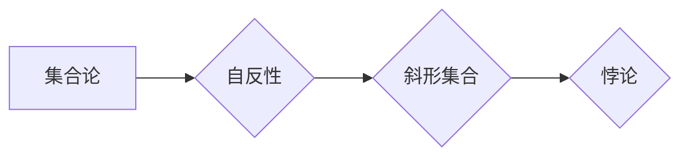

> 数理逻辑, 斜形证明, 悖论, 证明, 递归, 计算机科学, 数学基础

## 1. 背景介绍

数理逻辑作为计算机科学的基础，为我们提供了构建和分析算法的严谨框架。然而，数理逻辑的奥妙之处在于它不仅能描述逻辑的正确性，还能揭示逻辑本身的局限性。斜形证明，作为数理逻辑中一个著名的悖论，深刻地揭示了逻辑系统中可能存在的矛盾和不可避免的局限性。

斜形证明，也称为“罗素悖论”，由英国数学家伯特兰·罗素于1901年提出。它揭示了集合论中存在着自相矛盾的集合，即一个集合包含自身，从而导致逻辑系统崩溃。

## 2. 核心概念与联系

**2.1 核心概念**

* **集合论:** 研究集合及其性质的数学分支。
* **自反性:** 一个关系，如果一个元素与自身相关，则称为自反性。
* **悖论:** 逻辑上自相矛盾的陈述或论证。

**2.2 核心概念联系**

斜形证明的核心在于集合论中的自反性。罗素通过构造一个集合，这个集合包含所有不包含自身的集合，从而导致了自相矛盾的结果。

**2.3 Mermaid 流程图**

## 3. 核心算法原理 & 具体操作步骤

**3.1 算法原理概述**

斜形证明本身不是一个算法，而是一个逻辑推理过程。它通过构造一个集合，并利用集合论的基本性质，最终得出自相矛盾的结果。

**3.2 算法步骤详解**

1. **定义一个集合:** 设 R 为所有不包含自身的集合的集合。
2. **判断 R 是否包含自身:** 
    * 如果 R 包含自身，则 R 不包含自身，矛盾。
    * 如果 R 不包含自身，则 R 包含自身，矛盾。

**3.3 算法优缺点**

* **优点:** 
    * 简洁易懂，逻辑清晰。
    * 揭示了集合论中潜在的矛盾。
* **缺点:** 
    * 不是一个可用于实际计算的算法。
    * 无法解决集合论中的悖论。

**3.4 算法应用领域**

斜形证明主要应用于数理逻辑和数学基础研究领域，用于分析逻辑系统的完备性和一致性。

## 4. 数学模型和公式 & 详细讲解 & 举例说明

**4.1 数学模型构建**

设 R 为所有不包含自身的集合的集合。

**4.2 公式推导过程**

* **自反性:** 如果 R 包含自身，则 R 不包含自身，矛盾。
* **非自反性:** 如果 R 不包含自身，则 R 包含自身，矛盾。

**4.3 案例分析与讲解**

斜形证明的矛盾性在于集合 R 的定义本身。R 包含所有不包含自身的集合，但它自身是否包含自身却无法确定。

## 5. 项目实践：代码实例和详细解释说明

由于斜形证明本身不是一个算法，因此无法直接用代码实现。

## 6. 实际应用场景

斜形证明的实际应用场景主要集中在以下几个方面：

* **逻辑系统设计:** 斜形证明提醒我们，即使是看似严谨的逻辑系统，也可能存在不可避免的局限性。在设计逻辑系统时，需要谨慎考虑潜在的悖论。
* **数学基础研究:** 斜形证明促进了对集合论和数理逻辑的深入研究，推动了数学基础理论的发展。
* **哲学思考:** 斜形证明引发了关于知识、真值和逻辑系统的本质的哲学思考。

## 7. 工具和资源推荐

**7.1 学习资源推荐**

* 《数学基础》 -  艾伯特·本迪克特
* 《集合论》 -  保罗·科恩
* 《数理逻辑》 -  霍华德·戴维斯

**7.2 开发工具推荐**

* LaTeX: 用于数学公式排版
* Coq: 用于形式化证明的软件

**7.3 相关论文推荐**

* Bertrand Russell, "On Denoting" (1905)
* Kurt Gödel, "On Formally Undecidable Propositions of Principia Mathematica and Related Systems" (1931)

## 8. 总结：未来发展趋势与挑战

**8.1 研究成果总结**

斜形证明揭示了逻辑系统中潜在的矛盾，促进了对数学基础理论的深入研究。它提醒我们，即使是看似严谨的逻辑系统，也可能存在不可避免的局限性。

**8.2 未来发展趋势**

* **形式化逻辑:** 发展更完善的逻辑系统，避免类似斜形证明的悖论出现。
* **人工智能与逻辑:** 将逻辑推理技术应用于人工智能领域，提高人工智能的推理能力和可靠性。
* **哲学与逻辑:** 继续探讨逻辑与知识、真值等哲学问题的联系。

**8.3 面临的挑战**

* **逻辑系统完备性:** 寻找一个完备且一致的逻辑系统仍然是一个开放性问题。
* **人工智能的逻辑推理:** 如何让人工智能系统能够进行更复杂的逻辑推理，并避免逻辑错误，仍然是一个挑战。
* **逻辑与现实世界的联系:** 如何将逻辑推理技术应用于现实世界，解决实际问题，仍然是一个需要探索的方向。

**8.4 研究展望**

未来，随着计算机科学和数学基础理论的发展，我们相信能够更好地理解逻辑系统的局限性，并开发出更完善的逻辑系统和推理技术，为人工智能和科学研究的发展提供更坚实的基础。

## 9. 附录：常见问题与解答

**9.1 斜形证明是否意味着集合论是错误的？**

不，斜形证明并不意味着集合论是错误的。它只是揭示了集合论中存在着潜在的矛盾，需要进一步研究和完善。

**9.2 如何解决斜形证明中的悖论？**

目前还没有一个完美的解决方案来解决斜形证明中的悖论。一些学者提出了不同的解决方案，例如：

* **类型理论:** 通过引入类型系统，限制集合的构成方式，避免产生自相矛盾的集合。
* **超限集合论:** 扩展集合论的框架，引入超限序数和超限集合，避免产生悖论。

这些解决方案各有优缺点，目前还没有一个被广泛接受的解决方案。

**9.3 斜形证明有什么实际应用？**

斜形证明虽然不是一个算法，但它在以下方面具有实际意义：

* **逻辑系统设计:** 斜形证明提醒我们，即使是看似严谨的逻辑系统，也可能存在不可避免的局限性。在设计逻辑系统时，需要谨慎考虑潜在的悖论。
* **数学基础研究:** 斜形证明促进了对集合论和数理逻辑的深入研究，推动了数学基础理论的发展。
* **哲学思考:** 斜形证明引发了关于知识、真值和逻辑系统的本质的哲学思考。

作者：禅与计算机程序设计艺术 / Zen and the Art of Computer Programming 
<end_of_turn>