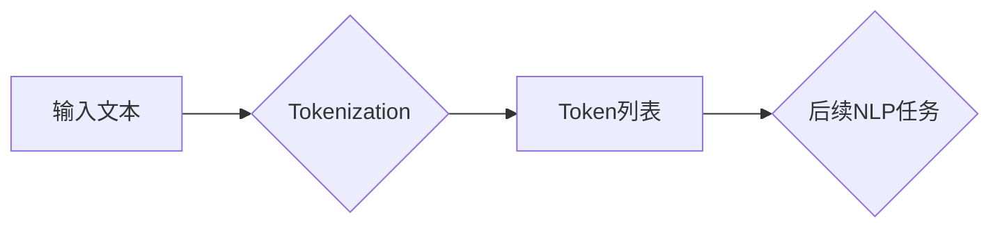

> Tokenization, 自然语言处理, NLP, 机器学习, 深度学习, 文本分析, 语义理解

## 1. 背景介绍

在当今数据爆炸的时代，文本数据已成为信息获取和分析的重要来源。然而，计算机无法直接理解人类语言。为了让机器能够处理和理解文本信息，我们需要将文本转换为计算机可理解的格式。文本Tokenization正是实现这一目标的关键技术之一。

文本Tokenization是指将文本分割成更小的单位，称为Token，这些Token可以是单词、子单词、字符或其他语义单位。Tokenization是自然语言处理 (NLP) 领域的基础任务，为后续的文本分析、机器学习和深度学习模型奠定了基础。

## 2. 核心概念与联系

**2.1  Tokenization的意义**

Tokenization的目的是将文本分解成更小的、可处理的单位，以便机器能够理解和分析文本内容。

**2.2  Tokenization与NLP的关系**

Tokenization是NLP的核心任务之一，为后续的文本分析、机器学习和深度学习模型奠定了基础。

**2.3  Tokenization与其他NLP任务的关系**

Tokenization与其他NLP任务密切相关，例如：

* **词性标注:**  需要将每个Token标记为其对应的词性。
* **依存句法分析:** 需要分析句子中每个Token与其他Token之间的关系。
* **文本分类:** 需要将文本分类到不同的类别。
* **机器翻译:** 需要将文本从一种语言翻译成另一种语言。

**2.4  Tokenization流程图**



## 3. 核心算法原理 & 具体操作步骤

**3.1  算法原理概述**

文本Tokenization算法的基本原理是根据文本中的特定规则或模式将文本分割成Token。常见的Tokenization算法包括：

* **基于空格的Tokenization:** 将文本按照空格分割成Token。
* **基于标点符号的Tokenization:** 将文本按照标点符号分割成Token。
* **基于词典的Tokenization:** 使用词典将文本分割成Token。
* **基于统计模型的Tokenization:** 使用统计模型预测文本中Token的边界。

**3.2  算法步骤详解**

以基于空格的Tokenization为例，其具体操作步骤如下：

1. **输入文本:** 将需要Tokenization的文本作为输入。
2. **扫描文本:** 从文本的开头开始扫描，逐个字符进行处理。
3. **识别空格:** 当遇到空格字符时，将前一个字符到当前空格字符之间的文本作为Token。
4. **重复步骤3:** 直到扫描到文本的结尾。
5. **输出Token列表:** 将所有Token收集到一个列表中，作为输出结果。

**3.3  算法优缺点**

* **优点:** 简单易实现，效率高。
* **缺点:** 无法处理多词语的Token，例如“人工智能”。

**3.4  算法应用领域**

基于空格的Tokenization算法广泛应用于搜索引擎、文本分析、机器翻译等领域。

## 4. 数学模型和公式 & 详细讲解 & 举例说明

**4.1  数学模型构建**

Tokenization算法可以抽象为一个状态机模型，其中每个状态代表一个Token的边界。

**4.2  公式推导过程**

Tokenization算法的推导过程主要基于状态机的转换规则。

**4.3  案例分析与讲解**

以基于空格的Tokenization为例，其状态机模型如下：

* **初始状态:**  `START`
* **转换规则:**
    * 当遇到空格字符时，从`START`状态转换到`END`状态。
    * 当遇到非空格字符时，从`START`状态转换到`TOKEN`状态。
    * 从`TOKEN`状态到`END`状态的转换需要满足文本的结尾条件。

## 5. 项目实践：代码实例和详细解释说明

**5.1  开发环境搭建**

使用Python语言进行开发，并安装必要的库，例如NLTK。

**5.2  源代码详细实现**

```python
import nltk

def tokenize_text(text):
    tokens = nltk.word_tokenize(text)
    return tokens

# 示例代码
text = "This is a sample text for tokenization."
tokens = tokenize_text(text)
print(tokens)
```

**5.3  代码解读与分析**

* `nltk.word_tokenize(text)`函数使用NLTK库中的词元化算法将文本分割成Token。
* `tokens`变量存储了分割后的Token列表。

**5.4  运行结果展示**

```
['This', 'is', 'a', 'sample', 'text', 'for', 'tokenization', '.']
```

## 6. 实际应用场景

**6.1  搜索引擎**

Tokenization用于将用户搜索的关键词分割成Token，以便搜索引擎能够准确匹配相关文档。

**6.2  文本分析**

Tokenization用于将文本分割成更小的单位，以便进行文本分类、情感分析、主题提取等分析任务。

**6.3  机器翻译**

Tokenization用于将源语言文本分割成Token，以便机器翻译模型能够准确翻译目标语言文本。

**6.4  未来应用展望**

随着人工智能技术的不断发展，Tokenization技术将在更多领域得到应用，例如：

* **对话系统:** 用于理解用户输入的意图和需求。
* **语音识别:** 用于将语音信号转换为文本。
* **自动写作:** 用于生成高质量的文本内容。

## 7. 工具和资源推荐

**7.1  学习资源推荐**

* **Stanford NLP Group:** https://nlp.stanford.edu/
* **NLTK Book:** https://www.nltk.org/book/

**7.2  开发工具推荐**

* **NLTK:** https://www.nltk.org/
* **spaCy:** https://spacy.io/

**7.3  相关论文推荐**

* **WordPiece: A Simple but Effective Tokenization Method:** https://arxiv.org/abs/1808.06226

## 8. 总结：未来发展趋势与挑战

**8.1  研究成果总结**

Tokenization技术已经取得了显著的进展，并广泛应用于NLP领域。

**8.2  未来发展趋势**

未来Tokenization技术的发展趋势包括：

* **更精确的Tokenization:** 开发更精确的Tokenization算法，能够更好地理解文本的语义。
* **跨语言Tokenization:** 开发能够处理多种语言的Tokenization算法。
* **动态Tokenization:** 开发能够根据上下文动态调整Token边界算法。

**8.3  面临的挑战**

Tokenization技术仍然面临一些挑战，例如：

* **处理复杂语言结构:** 某些语言具有复杂的语法结构，例如中文，Tokenization算法需要能够处理这些复杂结构。
* **跨领域Tokenization:** 不同领域使用的词汇和语法可能存在差异，Tokenization算法需要能够适应不同的领域。
* **数据稀疏性:** 某些语言或领域的文本数据稀疏，这会影响Tokenization算法的训练效果。

**8.4  研究展望**

未来研究方向包括：

* 开发更鲁棒、更精确的Tokenization算法。
* 研究跨语言和跨领域的Tokenization方法。
* 探索动态Tokenization的可能性。

## 9. 附录：常见问题与解答

**9.1  Tokenization和分词有什么区别？**

Tokenization和分词都是将文本分割成更小的单位，但它们的目标和方法略有不同。Tokenization更侧重于将文本分割成计算机可理解的单位，而分词则更侧重于将文本分割成具有语义意义的词语。

**9.2  如何选择合适的Tokenization算法？**

选择合适的Tokenization算法需要根据具体的应用场景和文本特点进行选择。例如，对于搜索引擎，可以使用基于空格的Tokenization算法；而对于文本分析，则可能需要使用更复杂的Tokenization算法，例如基于词典的Tokenization算法或基于统计模型的Tokenization算法。


作者：禅与计算机程序设计艺术 / Zen and the Art of Computer Programming 
<end_of_turn>