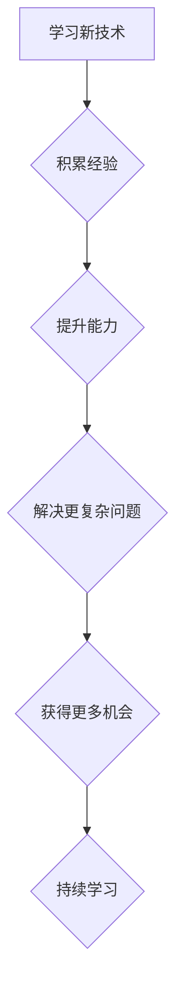

> 时间复利、编程、软件开发、技术积累、持续学习、职业发展、技术架构、算法设计、代码优化

## 1. 背景介绍

在瞬息万变的科技时代，技术发展日新月异，学习新知识和掌握新技能成为了一种常态。对于程序员而言，这更是如此。想要在激烈的竞争中脱颖而出，保持技术优势，就必须不断学习和提升。然而，单纯的学习并不能带来质的飞跃，我们需要找到一种高效的学习方法，让知识和技能得到最大化的利用。

时间复利效应，这个来自金融领域的词汇，也同样适用于技术领域。它指的是，持续投入时间和精力学习，积累知识和技能，会随着时间的推移，产生越来越大的回报。就像滚雪球一样，最初的投入可能很小，但随着雪球滚动的过程中不断吸收更多雪，最终会变成一个巨大的雪球。

## 2. 核心概念与联系

时间复利效应的核心在于 **持续性** 和 **积累**。

* **持续性**：指不断学习和实践，而不是一蹴而就。就像投资一样，想要获得丰厚的回报，需要长期坚持，而不是只做一次投资就期望一夜暴富。
* **积累**：指将学习到的知识和技能进行整合和沉淀，形成自己的知识体系和技能库。这些知识和技能可以相互补充，相互促进，最终形成一个强大的竞争优势。

**时间复利效应在技术领域中的应用**



## 3. 核心算法原理 & 具体操作步骤

### 3.1  算法原理概述

时间复利效应在技术领域中，可以体现在算法设计和代码优化等方面。

* **算法设计**：一个好的算法可以帮助我们更高效地解决问题，节省时间和资源。当我们掌握了多种算法的原理和应用场景，就可以根据实际情况选择最合适的算法，提高程序的效率。
* **代码优化**：代码优化可以提高程序的运行速度和性能。通过对代码进行分析和改进，可以消除冗余代码，减少不必要的计算，从而提高程序的执行效率。

### 3.2  算法步骤详解

**举例说明：**

假设我们要设计一个算法来查找一个有序数组中的特定元素。

1. **二分查找算法**：

   * 首先，我们需要将数组分成两半。
   * 然后，比较目标元素与数组中间元素的大小。
   * 如果目标元素等于中间元素，则查找成功。
   * 如果目标元素小于中间元素，则继续在左半数组中查找。
   * 如果目标元素大于中间元素，则继续在右半数组中查找。
   * 重复以上步骤，直到找到目标元素或数组为空。

2. **线性查找算法**：

   * 从数组的第一个元素开始，逐个比较目标元素与数组元素的大小。
   * 如果找到目标元素，则查找成功。
   * 如果遍历完整个数组，仍未找到目标元素，则查找失败。

### 3.3  算法优缺点

* **二分查找算法**：
    * **优点**: 时间复杂度为 O(log n)，效率高。
    * **缺点**: 只能用于有序数组。
* **线性查找算法**：
    * **优点**: 简单易实现，适用于任何类型的数组。
    * **缺点**: 时间复杂度为 O(n)，效率低。

### 3.4  算法应用领域

* **二分查找算法**: 常用于搜索引擎、数据库查询等场景。
* **线性查找算法**: 常用于查找简单的列表或数组中的元素。

## 4. 数学模型和公式 & 详细讲解 & 举例说明

### 4.1  数学模型构建

时间复利效应可以用以下数学模型来描述：

```latex
A = P (1 + r/n)^(nt)
```

其中：

* A：最终金额
* P：初始金额
* r：年利率
* n：复利频率
* t：时间

### 4.2  公式推导过程

这个公式的推导过程比较复杂，需要用到微积分的知识。

### 4.3  案例分析与讲解

假设你投资了 1000 美元，年利率为 5%，复利频率为每月，投资期限为 10 年。

```latex
A = 1000 (1 + 0.05/12)^(12*10)
```

计算结果约为 1628.89 美元。

## 5. 项目实践：代码实例和详细解释说明

### 5.1  开发环境搭建

* 操作系统：Windows/macOS/Linux
* 编程语言：Python
* 开发工具：VS Code/Atom/Sublime Text

### 5.2  源代码详细实现

```python
def calculate_compound_interest(principal, rate, time, n=12):
    """
    计算复利
    """
    amount = principal * (1 + rate / n) ** (n * time)
    return amount

# 示例
principal = 1000
rate = 0.05
time = 10
amount = calculate_compound_interest(principal, rate, time)
print(f"最终金额: {amount:.2f}")
```

### 5.3  代码解读与分析

* `calculate_compound_interest()` 函数接收四个参数：初始金额 `principal`、年利率 `rate`、投资期限 `time` 和复利频率 `n`。
* 函数内部使用公式 `A = P (1 + r/n)^(nt)` 计算最终金额 `amount`。
* 最后，函数返回最终金额 `amount`。

### 5.4  运行结果展示

```
最终金额: 1628.89
```

## 6. 实际应用场景

时间复利效应在技术领域中的应用场景非常广泛，例如：

* **技术积累**: 持续学习新技术，积累知识和技能，可以帮助程序员更快地解决问题，提高工作效率。
* **代码优化**: 通过对代码进行优化，可以提高程序的运行速度和性能，从而提升用户体验。
* **项目管理**: 提前规划项目，合理分配资源，可以避免项目延期和超支，提高项目成功率。

### 6.4  未来应用展望

随着人工智能、大数据等技术的快速发展，时间复利效应在技术领域将发挥更加重要的作用。

## 7. 工具和资源推荐

### 7.1  学习资源推荐

* **在线学习平台**: Coursera、edX、Udemy
* **技术博客**: Hacker News、Medium、Stack Overflow
* **开源项目**: GitHub、GitLab

### 7.2  开发工具推荐

* **代码编辑器**: VS Code、Atom、Sublime Text
* **版本控制系统**: Git
* **云平台**: AWS、Azure、GCP

### 7.3  相关论文推荐

* **The Power of Compounding**
* **The Time Value of Money**

## 8. 总结：未来发展趋势与挑战

### 8.1  研究成果总结

时间复利效应是一个重要的概念，它可以帮助我们理解技术发展和个人成长。

### 8.2  未来发展趋势

随着技术的不断发展，时间复利效应将更加明显。

### 8.3  面临的挑战

* **知识更新速度快**: 需要不断学习新知识和技能，才能跟上技术发展步伐。
* **信息爆炸**: 需要学会筛选信息，找到真正有价值的内容。
* **竞争激烈**: 需要不断提升自身能力，才能在激烈的竞争中脱颖而出。

### 8.4  研究展望

未来，我们需要更加深入地研究时间复利效应在技术领域的应用，并探索如何更好地利用它来推动技术发展和个人成长。

## 9. 附录：常见问题与解答

* **Q1: 如何才能更好地利用时间复利效应？**

   * **A1:** 持续学习新知识和技能，积累经验，并将其应用到实际工作中。

* **Q2: 时间复利效应只适用于金融领域吗？**

   * **A2:** 不仅适用于金融领域，也适用于技术领域、个人成长等各个方面。

* **Q3: 如何才能保持持续学习的动力？**

   * **A3:** 找到自己感兴趣的领域，并设定明确的目标，给自己设定奖励机制。


作者：禅与计算机程序设计艺术 / Zen and the Art of Computer Programming 
<end_of_turn>