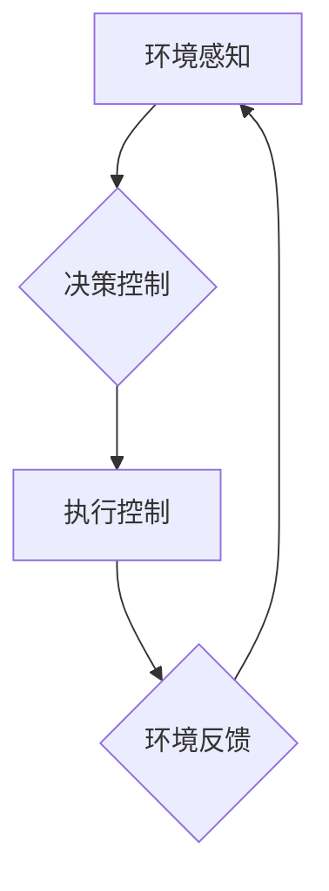

> 深度 Q-learning，智能家居，强化学习，深度神经网络，环境感知，决策控制

## 1. 背景介绍

智能家居作为未来生活的重要组成部分，正在以惊人的速度发展。它通过将各种智能设备连接起来，实现对家居环境的自动化控制和智能化管理，为用户提供更加便捷、舒适和安全的居住体验。然而，智能家居系统的复杂性也带来了新的挑战。传统的基于规则或模式识别的控制方式难以应对家居环境的动态变化和用户个性化的需求。

强化学习 (Reinforcement Learning, RL) 作为一种机器学习范式，能够有效地解决智能家居系统中的决策控制问题。它通过让智能体在与环境交互的过程中学习最优的策略，从而实现对家居环境的智能化管理。

深度 Q-learning 作为一种强大的强化学习算法，结合了深度神经网络的学习能力和 Q-learning 的策略优化机制，能够有效地处理智能家居系统中的复杂决策问题。

## 2. 核心概念与联系

**2.1 强化学习 (Reinforcement Learning)**

强化学习是一种机器学习范式，其核心思想是通过奖励和惩罚机制，引导智能体在与环境交互的过程中学习最优的策略。

* **智能体 (Agent):** 智能家居系统中的决策者，例如智能家居控制中心。
* **环境 (Environment):** 智能家居系统所处的环境，包括各种智能设备、传感器和用户行为等。
* **状态 (State):** 智能体感知到的环境信息，例如房间温度、灯光状态、用户位置等。
* **动作 (Action):** 智能体可以执行的操作，例如调节温度、打开灯光、控制家电等。
* **奖励 (Reward):** 智能体执行动作后获得的反馈，例如用户满意度、能源消耗等。
* **策略 (Policy):** 智能体根据当前状态选择动作的规则。

**2.2 深度 Q-learning**

深度 Q-learning 是一种基于深度神经网络的强化学习算法，它通过学习 Q-值表来优化策略。

* **Q-值 (Q-value):** 表示在当前状态执行某个动作后获得的期望奖励。
* **深度神经网络 (Deep Neural Network):** 用于估计 Q-值，并学习最优策略。

**2.3 智能家居系统架构**

智能家居系统通常由以下几个主要模块组成：

* **环境感知模块:** 收集环境信息，例如温度、湿度、光照、用户位置等。
* **决策控制模块:** 基于强化学习算法，根据环境信息和用户需求，制定最优的控制策略。
* **执行控制模块:** 将决策控制模块的指令发送到智能设备，执行相应的控制操作。
* **用户交互模块:** 提供用户与智能家居系统的交互界面，例如语音控制、手机APP等。

**2.4 Mermaid 流程图**



## 3. 核心算法原理 & 具体操作步骤

### 3.1 算法原理概述

深度 Q-learning 算法的核心思想是通过深度神经网络学习 Q-值函数，并利用 Q-值函数来选择最优的动作。

* **Q-值函数:** Q(s, a) 表示在状态 s 下执行动作 a 后获得的期望奖励。
* **目标函数:** 算法的目标是最小化 Q-值函数的误差，即最小化预测 Q-值与实际 Q-值之间的差异。
* **梯度下降:** 使用梯度下降算法来更新 Q-值函数的参数，使其逼近最优解。

### 3.2 算法步骤详解

1. **初始化:** 初始化 Q-值函数的参数，并设置学习率、折扣因子等超参数。
2. **环境交互:** 智能体与环境交互，观察当前状态 s 和执行动作 a。
3. **奖励获取:** 智能体获得环境的奖励 r。
4. **状态转移:** 环境状态转移到下一个状态 s'.
5. **Q-值更新:** 使用 Bellman 方程更新 Q-值函数:

```
Q(s, a) = Q(s, a) + α [r + γ max Q(s', a') - Q(s, a)]
```

其中:

* α: 学习率
* γ: 折扣因子
* max Q(s', a'): 在下一个状态 s' 下执行所有动作 a' 的最大 Q-值

6. **重复步骤 2-5:** 直到达到终止条件，例如训练次数达到上限或 Q-值函数收敛。

### 3.3 算法优缺点

**优点:**

* 可以处理高维状态空间和连续动作空间。
* 学习能力强，能够学习复杂的策略。
* 能够在线学习，即在与环境交互的过程中不断学习和优化策略。

**缺点:**

* 训练时间长，需要大量的训练数据。
* 容易陷入局部最优解。
* 需要设置合适的超参数，例如学习率和折扣因子。

### 3.4 算法应用领域

深度 Q-learning 算法在许多领域都有广泛的应用，例如:

* **机器人控制:** 控制机器人运动、抓取物体等。
* **游戏 AI:** 训练游戏 AI 玩家，例如围棋、Go 等。
* **推荐系统:** 建议用户感兴趣的内容，例如电影、音乐等。
* **金融交易:** 自动化交易策略，例如股票投资等。

## 4. 数学模型和公式 & 详细讲解 & 举例说明

### 4.1 数学模型构建

深度 Q-learning 算法的核心数学模型是 Q-值函数，它是一个映射关系，将状态-动作对映射到期望奖励值。

* **Q-值函数:** Q(s, a)

其中:

* s: 当前状态
* a: 执行的动作

### 4.2 公式推导过程

深度 Q-learning 算法的目标是最大化 Q-值函数，即找到最优策略 π*，使得期望奖励最大化。

* **Bellman 方程:**

```
Q(s, a) = r + γ max Q(s', a')
```

其中:

* r: 在状态 s 下执行动作 a 后获得的奖励
* γ: 折扣因子，控制未来奖励的权重
* s': 执行动作 a 后到达的下一个状态
* max Q(s', a'): 在下一个状态 s' 下执行所有动作 a' 的最大 Q-值

### 4.3 案例分析与讲解

假设一个智能家居系统需要控制房间的温度。

* **状态:** 房间温度
* **动作:** 打开空调、关闭空调、调节空调温度
* **奖励:** 用户满意度

使用深度 Q-learning 算法，智能家居系统可以学习到最优的温度控制策略，例如在温度过高时打开空调，在温度过低时关闭空调，并在舒适温度范围内调节空调温度。

## 5. 项目实践：代码实例和详细解释说明

### 5.1 开发环境搭建

* Python 3.x
* TensorFlow 或 PyTorch 深度学习框架
* OpenAI Gym 或其他强化学习环境

### 5.2 源代码详细实现

```python
import tensorflow as tf

# 定义 Q-网络
class QNetwork(tf.keras.Model):
    def __init__(self, state_size, action_size):
        super(QNetwork, self).__init__()
        self.dense1 = tf.keras.layers.Dense(64, activation='relu')
        self.dense2 = tf.keras.layers.Dense(32, activation='relu')
        self.output = tf.keras.layers.Dense(action_size)

    def call(self, state):
        x = self.dense1(state)
        x = self.dense2(x)
        return self.output(x)

# 定义深度 Q-learning 算法
def deep_q_learning(env, q_network, learning_rate, discount_factor, epsilon):
    # ... 算法实现 ...

# 实例化环境、Q-网络、学习参数
env = gym.make('CartPole-v1')
q_network = QNetwork(env.observation_space.shape[0], env.action_space.n)
optimizer = tf.keras.optimizers.Adam(learning_rate=learning_rate)

# 训练深度 Q-learning 算法
deep_q_learning(env, q_network, learning_rate=0.001, discount_factor=0.99, epsilon=0.1)
```

### 5.3 代码解读与分析

* **Q-网络:** 使用深度神经网络来估计 Q-值函数。
* **学习参数:** 学习率、折扣因子和探索率等超参数需要根据实际情况进行调整。
* **训练过程:** 使用 Bellman 方程更新 Q-值函数，并使用梯度下降算法优化 Q-网络的参数。

### 5.4 运行结果展示

训练完成后，可以将训练好的 Q-网络应用于智能家居系统中，实现对家居环境的智能化控制。

## 6. 实际应用场景

### 6.1 智能家居场景

* **温度控制:** 根据用户喜好和环境温度自动调节空调温度，实现舒适的居住环境。
* **灯光控制:** 根据用户活动和时间自动调节灯光亮度，营造舒适的氛围。
* **家电控制:** 根据用户需求自动控制家电，例如电视、音响、洗衣机等。
* **安全监控:** 通过传感器和摄像头监控家居环境，及时报警和处理异常情况。

### 6.2 其他应用场景

* **自动驾驶:** 控制车辆行驶路线和速度，实现自动驾驶功能。
* **医疗保健:** 辅助医生诊断疾病、制定治疗方案，提高医疗效率。
* **金融交易:** 自动化交易策略，例如股票投资、期货交易等。

### 6.4 未来应用展望

随着人工智能技术的不断发展，深度 Q-learning 算法将在更多领域得到应用，例如:

* **个性化服务:** 根据用户的行为和喜好，提供个性化的服务和体验。
* **协同决策:** 多个智能体协同决策，解决复杂问题。
* **自学习系统:** 系统能够根据自身经验不断学习和优化，提高效率和智能化程度。

## 7. 工具和资源推荐

### 7.1 学习资源推荐

* **书籍:**
    * Reinforcement Learning: An Introduction by Richard S. Sutton and Andrew G. Barto
    * Deep Reinforcement Learning Hands-On by Maxim Lapan
* **在线课程:**
    * Deep Reinforcement Learning Specialization by DeepLearning.AI
    * Reinforcement Learning by David Silver (University of DeepMind)

### 7.2 开发工具推荐

* **Python:** 广泛使用的编程语言，适合深度学习和强化学习开发。
* **TensorFlow:** Google 开发的开源深度学习框架。
* **PyTorch:** Facebook 开发的开源深度学习框架。
* **OpenAI Gym:** 强化学习环境库，提供各种标准的强化学习任务。

### 7.3 相关论文推荐

* Deep Q-Network (DQN) by Volodymyr Mnih et al. (2015)
* Dueling Network Architectures for Deep Reinforcement Learning by Hado van Hasselt et al. (2016)
* Double Q-Learning by  Hasselt et al. (2015)

## 8. 总结：未来发展趋势与挑战

### 8.1 研究成果总结

深度 Q-learning 算法取得了显著的成果，在许多领域取得了突破性的进展。

* **游戏 AI:** 击败人类棋手，例如 AlphaGo 和 AlphaZero。
* **机器人控制:** 实现复杂的任务，例如机器人导航、抓取物体等。
* **自动驾驶:** 提高自动驾驶系统的安全性、效率和智能化程度。

### 8.2 未来发展趋势

* **模型规模和复杂度:** 发展更大型、更复杂的深度 Q-learning 模型，提高学习能力和泛化能力。
* **算法效率:** 提高算法训练效率和收敛速度，降低训练成本。
* **安全性和可靠性:** 确保深度 Q-learning 系统的安全性和可靠性，避免出现意外情况。
* **解释性和可解释性:**