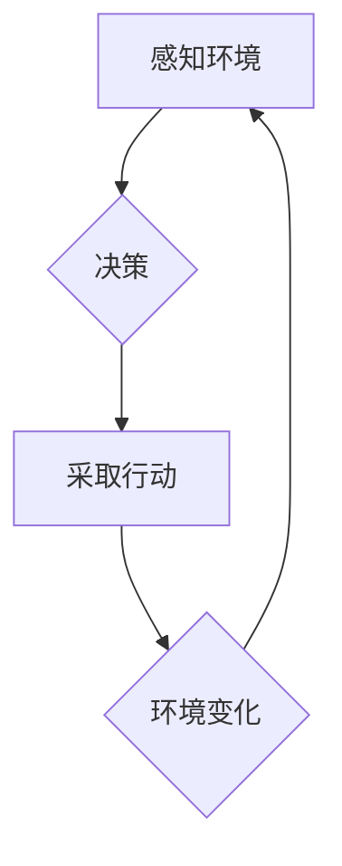

> 游戏 AI, 智能体, 决策树, 强化学习, 深度学习, 游戏开发

## 1. 背景介绍

游戏行业近年来蓬勃发展，玩家对游戏体验的要求也越来越高。为了提升游戏趣味性和沉浸感，游戏开发商不断探索新的技术手段，其中，智能体（Agent）技术扮演着越来越重要的角色。

智能体是指能够感知环境、做出决策并采取行动的软件实体。在游戏中，智能体可以赋予非玩家角色（NPC）更智能的行为，使游戏世界更加生动和真实。例如，在RPG游戏中，智能体可以控制NPC的对话、行动和战斗策略，使玩家感受到更强的代入感；在策略游戏中，智能体可以控制敌方单位，提供更具挑战性的游戏体验。

## 2. 核心概念与联系

### 2.1 智能体（Agent）

智能体是人工智能的核心概念之一，它是一个能够感知环境、做出决策并采取行动的系统。在游戏中，智能体通常被赋予特定的目标和行为规则，并通过感知环境信息和决策算法来实现目标。

### 2.2 游戏环境

游戏环境是指游戏运行的虚拟世界，包括游戏场景、游戏规则、游戏物体等。智能体需要感知和理解游戏环境才能做出有效的决策。

### 2.3 决策算法

决策算法是智能体做出行动的关键。常见的决策算法包括：

* **基于规则的决策算法:** 这种算法基于预先定义的规则来决定智能体的行动。
* **基于状态空间的决策算法:** 这种算法将游戏状态表示为一个状态空间，并使用搜索算法来找到最佳行动。
* **基于强化学习的决策算法:** 这种算法通过与环境交互，学习最优的行动策略。

### 2.4  Mermaid 流程图



## 3. 核心算法原理 & 具体操作步骤

### 3.1 算法原理概述

在游戏领域，智能体通常采用强化学习算法来学习最优的行动策略。强化学习是一种机器学习方法，它通过奖励和惩罚机制来训练智能体。智能体在与环境交互的过程中，会根据采取的行动获得奖励或惩罚，并根据这些反馈信息更新自己的策略，最终学习到最优的行动策略。

### 3.2 算法步骤详解

1. **环境初始化:** 游戏环境被初始化，包括游戏场景、游戏规则、游戏物体等。
2. **智能体初始化:** 智能体被初始化，包括其初始状态、目标和行为规则。
3. **环境感知:** 智能体感知游戏环境，获取有关游戏状态的信息，例如玩家位置、敌方位置、游戏资源等。
4. **决策:** 智能体根据感知到的环境信息和自身的策略，做出行动决策。
5. **行动执行:** 智能体执行决策，采取相应的行动，例如移动、攻击、使用技能等。
6. **环境反馈:** 环境根据智能体的行动做出反馈，例如给予奖励或惩罚。
7. **策略更新:** 智能体根据环境反馈信息，更新自身的策略，使未来的行动更加有效。
8. **重复步骤3-7:** 智能体不断与环境交互，学习最优的行动策略，直到达到预设的目标或终止条件。

### 3.3 算法优缺点

**优点:**

* **能够学习复杂的游戏策略:** 强化学习算法能够学习到复杂的游戏策略，即使游戏规则非常复杂。
* **适应性强:** 强化学习算法能够适应不断变化的游戏环境。
* **可扩展性强:** 强化学习算法可以应用于各种类型的游戏。

**缺点:**

* **训练时间长:** 强化学习算法的训练时间通常很长，需要大量的训练数据和计算资源。
* **容易陷入局部最优:** 强化学习算法容易陷入局部最优，无法找到全局最优的策略。
* **需要精心设计的奖励机制:** 强化学习算法的性能取决于奖励机制的设计，如果奖励机制设计不合理，会导致智能体学习到错误的策略。

### 3.4 算法应用领域

强化学习算法在游戏领域有着广泛的应用，例如：

* **游戏AI:** 控制游戏中的NPC，使其行为更加智能和逼真。
* **游戏平衡:** 通过调整游戏规则和奖励机制，使游戏更加平衡和公平。
* **游戏策略分析:** 分析玩家的策略，并提供改进建议。
* **游戏自动化的测试:** 自动化游戏测试，提高测试效率。

## 4. 数学模型和公式 & 详细讲解 & 举例说明

### 4.1 数学模型构建

强化学习的数学模型通常基于马尔可夫决策过程（MDP）。MDP是一个四元组 (S, A, P, R)，其中：

* **S:** 状态空间，表示游戏的所有可能状态。
* **A:** 动作空间，表示智能体可以采取的所有动作。
* **P:** 转移概率，表示从一个状态执行一个动作后转移到另一个状态的概率。
* **R:** 奖励函数，表示智能体在某个状态执行某个动作后获得的奖励。

### 4.2 公式推导过程

强化学习的目标是找到一个策略 π，使得智能体在与环境交互的过程中获得最大的总奖励。策略 π 是一个从状态空间到动作空间的映射函数。

常用的强化学习算法包括：

* **Q学习:** Q学习算法通过迭代更新 Q 值表来学习最优策略。Q 值表是一个表格，存储了每个状态-动作对的期望奖励。
* **SARSA:** SARSA 算法与 Q 学习算法类似，但它在更新 Q 值时使用的是当前状态-动作对的实际奖励。

### 4.3 案例分析与讲解

例如，在一个简单的游戏环境中，智能体需要从起点移动到终点。状态空间包括所有可能的格子位置，动作空间包括向上、向下、向左、向右四个方向。奖励函数为：

* 当智能体到达终点时，奖励为 100。
* 当智能体移动到一个障碍物上时，奖励为 -10。
* 其他情况下，奖励为 0。

使用 Q 学习算法，智能体可以学习到最优的移动策略，从而从起点到达终点。

## 5. 项目实践：代码实例和详细解释说明

### 5.1 开发环境搭建

* 操作系统：Windows/macOS/Linux
* 编程语言：Python
* 库依赖：OpenAI Gym, TensorFlow/PyTorch

### 5.2 源代码详细实现

```python
import gym
import numpy as np
from tensorflow.keras.models import Sequential
from tensorflow.keras.layers import Dense

# 创建游戏环境
env = gym.make('CartPole-v1')

# 定义神经网络模型
model = Sequential()
model.add(Dense(128, activation='relu', input_shape=(4,)))
model.add(Dense(64, activation='relu'))
model.add(Dense(2, activation='softmax'))

# 编译模型
model.compile(loss='categorical_crossentropy', optimizer='adam')

# 训练模型
for episode in range(1000):
    state = env.reset()
    done = False
    total_reward = 0

    while not done:
        # 选择动作
        action = np.argmax(model.predict(state.reshape(1, -1)))

        # 执行动作
        next_state, reward, done, _ = env.step(action)

        # 更新状态
        state = next_state

        # 更新奖励
        total_reward += reward

    # 打印奖励
    print(f'Episode {episode+1}, Total Reward: {total_reward}')

# 保存模型
model.save('cartpole_model.h5')
```

### 5.3 代码解读与分析

* 代码首先创建游戏环境，并定义一个神经网络模型。
* 模型输入为游戏状态，输出为两个动作的概率分布。
* 使用 Q 学习算法训练模型，通过与环境交互，更新模型参数。
* 训练完成后，保存模型。

### 5.4 运行结果展示

训练完成后，模型能够控制游戏中的小车平衡木杆，并保持平衡的时间越来越长。

## 6. 实际应用场景

### 6.1 游戏NPC行为设计

强化学习可以用于设计更智能的NPC行为，使其行为更加逼真和多样化。例如，在RPG游戏中，NPC可以根据玩家的行为和对话做出不同的反应，在策略游戏中，NPC可以根据游戏情况制定不同的策略。

### 6.2 游戏平衡调整

强化学习可以用于分析游戏平衡性，并根据分析结果调整游戏规则和奖励机制，使游戏更加公平和有趣。

### 6.3 游戏策略分析

强化学习可以用于分析玩家的策略，并提供改进建议。例如，在策略游戏中，强化学习可以分析玩家的行动模式，并找出玩家的弱点，从而帮助玩家制定更有效的策略。

### 6.4 未来应用展望

随着人工智能技术的不断发展，强化学习在游戏领域的应用将更加广泛。未来，强化学习可能被用于：

* 生成游戏关卡和场景
* 设计更具挑战性和趣味性的游戏
* 创建更沉浸式的游戏体验
* 辅助游戏开发人员进行游戏设计和测试

## 7. 工具和资源推荐

### 7.1 学习资源推荐

* **强化学习课程:**
    * Coursera: Reinforcement Learning Specialization
    * Udacity: Intro to Artificial Intelligence
* **强化学习书籍:**
    * Reinforcement Learning: An Introduction by Richard S. Sutton and Andrew G. Barto
    * Deep Reinforcement Learning Hands-On by Maxim Lapan

### 7.2 开发工具推荐

* **OpenAI Gym:** 一个用于强化学习研究和开发的开源库。
* **TensorFlow/PyTorch:** 深度学习框架，可以用于实现强化学习算法。

### 7.3 相关论文推荐

* **Deep Q-Network (DQN):** https://arxiv.org/abs/1312.5602
* **Proximal Policy Optimization (PPO):** https://arxiv.org/abs/1707.06347

## 8. 总结：未来发展趋势与挑战

### 8.1 研究成果总结

近年来，强化学习在游戏领域取得了显著的成果，例如 AlphaGo、AlphaStar 等游戏 AI 系统的成功应用。这些成果证明了强化学习在游戏领域的巨大潜力。

### 8.2 未来发展趋势

未来，强化学习在游戏领域的应用将更加广泛和深入，例如：

* **更智能的NPC:** NPC的行为将更加逼真和多样化，能够与玩家进行更自然的互动。
* **更具挑战性的游戏:** 游戏难度将更加智能化，能够根据玩家的水平自动调整难度。
* **更沉浸式的游戏体验:** 强化学习将被用于创建更沉浸式的游戏体验，例如动态生成的场景和故事。

### 8.3 面临的挑战

尽管强化学习在游戏领域取得了成功，但仍然面临一些挑战：

* **训练时间长:** 强化学习算法的训练时间通常很长，需要大量的计算资源。
* **数据需求量大:** 强化学习算法需要大量的训练数据，而游戏数据通常比较稀缺。
* **奖励机制设计:** 强化学习算法的性能取决于奖励机制的设计，如果奖励机制设计不合理，会导致智能体学习到错误的策略。

### 8.4 研究展望

未来，研究人员将继续探索强化学习算法的改进方法，例如：

* **开发更有效的训练算法:** 减少训练时间和数据需求。
* **设计更智能的奖励机制:** 使智能体能够学习到更有效的策略。
* **将强化学习与其他人工智能技术结合:** 例如，将强化学习与自然语言处理技术结合，使游戏中的NPC能够进行更自然的对话。


## 9. 附录：常见问题与解答

**Q1: 强化学习和监督学习有什么区别？**

**A1:** 强化学习和监督学习都是机器学习的范畴，但它们的区别在于数据类型和学习目标。监督学习使用标记数据来训练模型，目标是预测输入数据对应的输出标签。而强化学习使用奖励信号来训练模型，目标是学习一个策略，使得模型在与环境交互的过程中获得最大的总奖励。

**Q2: 强化学习算法有哪些