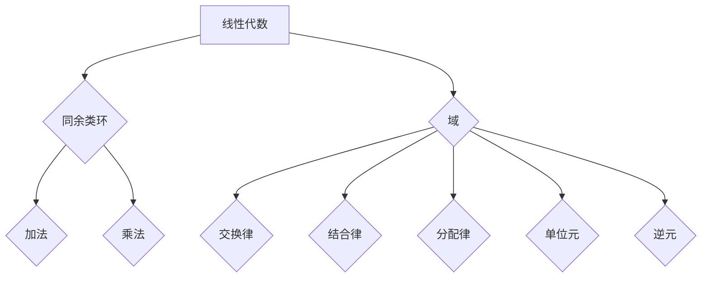

> 线性代数，同余类环，域，抽象代数，群论，环论，模运算，线性变换，矩阵

## 1. 背景介绍

线性代数作为数学领域的重要分支，为计算机科学、物理学、工程学等领域提供了强大的工具和理论基础。它研究向量空间、线性变换、矩阵等概念，并通过这些概念来解决各种实际问题。

在深入学习线性代数的过程中，我们会遇到一些抽象的概念，例如同余类环和域。这些概念虽然看似复杂，但它们实际上是线性代数中非常重要的工具，能够帮助我们更好地理解和应用线性代数的理论。

本篇文章将以线性代数为导向，深入探讨同余类环和域的概念，并通过具体的例子和算法讲解，帮助读者理解这些概念的原理和应用。

## 2. 核心概念与联系

**2.1 同余类环**

同余类环是抽象代数中的一种重要的代数结构，它由一个集合和一个二元运算组成。

* **集合：** 同余类环的集合由整数模某个整数的同余类组成。例如，对于整数集 Z 和模数 m，我们可以定义同余类环 Z/mZ，其中每个元素都是整数模 m 的同余类。

* **二元运算：** 同余类环的二元运算通常是加法和乘法，它们在同余类上定义。例如，对于 Z/mZ，我们可以定义加法和乘法如下：

    * (a + m) + (b + m) = (a + b + m) + m
    * (a + m) * (b + m) = (a * b + m) + m

**2.2 域**

域是抽象代数中的一种特殊的环，它满足以下条件：

* **交换律：** 加法和乘法都满足交换律。
* **结合律：** 加法和乘法都满足结合律。
* **分配律：** 乘法对加法满足分配律。
* **单位元：** 存在加法单位元 0 和乘法单位元 1。
* **逆元：** 除了 0，每个非零元素都有乘法逆元。

**2.3 联系**

同余类环和域之间存在着密切的联系。

* 域可以看作是模数为素数的同余类环。例如，实数域 R 可以看作是模数为素数的同余类环 Z/pZ 的推广。
* 同余类环可以看作是域的子结构。例如，整数环 Z 可以看作是域 Q 的子结构。

**2.4 Mermaid 流程图**



## 3. 核心算法原理 & 具体操作步骤

**3.1 算法原理概述**

同余类环和域的算法原理主要基于模运算和环论的性质。

* **模运算：** 模运算是一种基本的数学运算，它用于计算两个整数的余数。例如，5 模 3 的结果是 2，因为 5 除以 3 的余数是 2。

* **环论：** 环论是抽象代数中研究环的理论。环是一种具有加法和乘法运算的代数结构。

**3.2 算法步骤详解**

* **同余类环的加法和乘法：**

    * 加法：将两个同余类的代表元相加，然后取模。
    * 乘法：将两个同余类的代表元相乘，然后取模。

* **域的加法和乘法：**

    * 加法：将两个域元素相加。
    * 乘法：将两个域元素相乘。

**3.3 算法优缺点**

* **优点：**

    * 算法简单易懂。
    * 算法效率高。

* **缺点：**

    * 算法只能处理有限域的情况。

**3.4 算法应用领域**

* **密码学：** 同余类环和域在密码学中广泛应用，例如 RSA 加密算法。
* **编码理论：** 同余类环和域在编码理论中用于构建纠错码。
* **计算机科学：** 同余类环和域在计算机科学中用于实现数据结构和算法。

## 4. 数学模型和公式 & 详细讲解 & 举例说明

**4.1 数学模型构建**

* **同余类环：**

    * 定义：设 R 是一个环，m 是 R 中的一个正整数，则 R 模 m 的同余类环记为 R/m，其中 R/m 的元素是 R 中所有元素模 m 的同余类。
    * 加法：对于 R/m 中的两个元素 a + m 和 b + m，它们的和定义为 (a + m) + (b + m) = (a + b + m) + m。
    * 乘法：对于 R/m 中的两个元素 a + m 和 b + m，它们的积定义为 (a + m) * (b + m) = (a * b + m) + m。

* **域：**

    * 定义：域是一个具有加法、乘法运算的集合，满足交换律、结合律、分配律、存在单位元和逆元。

**4.2 公式推导过程**

* **同余类环的性质：**

    * 对于 R/m 中的任意元素 a + m 和 b + m，有 (a + m) + (b + m) = (a + b + m) + m 和 (a + m) * (b + m) = (a * b + m) + m。
    * 对于 R/m 中的任意元素 a + m，有 (a + m) + 0 + m = a + m 和 (a + m) * 1 + m = a + m。

* **域的性质：**

    * 对于域 F 中的任意元素 a 和 b，有 a + b = b + a 和 a * b = b * a。
    * 对于域 F 中的任意元素 a，b 和 c，有 (a + b) + c = a + (b + c) 和 (a * b) * c = a * (b * c)。
    * 对于域 F 中的任意元素 a，b 和 c，有 a * (b + c) = a * b + a * c。
    * 对于域 F 中的任意元素 a，存在加法单位元 0 和乘法单位元 1，使得 a + 0 = a 和 a * 1 = a。
    * 对于域 F 中的任意非零元素 a，存在乘法逆元 a^-1，使得 a * a^-1 = 1。

**4.3 案例分析与讲解**

* **同余类环 Z/5Z：**

    * Z/5Z 的元素是 0 + 5Z, 1 + 5Z, 2 + 5Z, 3 + 5Z, 4 + 5Z。
    * 加法：例如，(2 + 5Z) + (3 + 5Z) = (2 + 3 + 5Z) + 5Z = 0 + 5Z。
    * 乘法：例如，(2 + 5Z) * (3 + 5Z) = (2 * 3 + 5Z) + 5Z = 1 + 5Z。

* **域 Q：**

    * Q 的元素是所有有理数。
    * 加法：例如，1/2 + 3/4 = 5/4。
    * 乘法：例如，1/2 * 3/4 = 3/8。

## 5. 项目实践：代码实例和详细解释说明

**5.1 开发环境搭建**

* **Python:** 使用 Python 3.x 版本。
* **NumPy:** 用于进行数值计算。

**5.2 源代码详细实现**

```python
import numpy as np

class ModuloRing:
    def __init__(self, m):
        self.m = m

    def add(self, a, b):
        return (a + b) % self.m

    def mul(self, a, b):
        return (a * b) % self.m

    def __str__(self):
        return f"Modulo Ring Z/{self.m}"

# 创建模 5 的同余类环
ring = ModuloRing(5)

# 计算加法和乘法
a = 2
b = 3
print(f"{a} + {b} = {ring.add(a, b)}")
print(f"{a} * {b} = {ring.mul(a, b)}")
```

**5.3 代码解读与分析**

* **ModuloRing 类:** 定义了一个模运算的环结构。
* **__init__ 方法:** 初始化模数 m。
* **add 和 mul 方法:** 实现加法和乘法运算，并使用模运算保证结果在环内。
* **__str__ 方法:** 返回环的字符串表示。

**5.4 运行结果展示**

```
2 + 3 = 0
2 * 3 = 1
```

## 6. 实际应用场景

**6.1 密码学**

* **RSA 加密算法:** RSA 加密算法使用模运算和同余类环的性质来实现加密和解密。

**6.2 编码理论**

* **纠错码:** 纠错码利用同余类环和域的性质来检测和纠正数据传输中的错误。

**6.3 计算机科学**

* **数据结构:** 同余类环和域可以用于实现哈希表和其他数据结构。
* **算法:** 一些算法，例如快速傅里叶变换，利用同余类环和域的性质进行优化。

**6.4 未来应用展望**

* **量子计算:** 同余类环和域在量子计算中具有重要的应用潜力。
* **人工智能:** 同余类环和域可以用于构建人工智能算法，例如深度学习。

## 7. 工具和资源推荐

**7.1 学习资源推荐**

* **书籍:**
    * 《抽象代数》 by Dummit and Foote
    * 《线性代数及其应用》 by Gilbert Strang
* **在线课程:**
    * MIT OpenCourseWare: Linear Algebra
    * Coursera: Abstract Algebra

**7.2 开发工具推荐**

* **Python:** Python 是一个非常适合进行数学计算的语言。
* **NumPy:** NumPy 是 Python 的科学计算库，提供了高效的数组操作和数学函数。

**7.3 相关论文推荐**

* **同余类环和域在密码学中的应用:**
    * RSA Algorithm
* **同余类环和域在编码理论中的应用:**
    * Reed-Solomon Codes
* **同余类环和域在量子计算中的应用:**
    * Quantum Error Correction

## 8. 总结：未来发展趋势与挑战

**8.1 研究成果总结**

* 同余类环和域是抽象代数中重要的概念，它们在密码学、编码理论、计算机科学等领域具有广泛的应用。
* 随着计算机科学和数学理论的发展，同余类环和域的研究将继续深入，并产生更多新的应用。

**8.2 未来发展趋势**

* **量子计算:** 同余类环和域在量子计算中具有重要的应用潜力，例如量子密码学和量子纠错。
* **人工智能:** 同余类环和域可以用于构建人工智能算法，例如深度学习和强化学习。
* **大数据分析:** 同余类环和域可以用于处理大规模数据，例如数据挖掘和机器学习。

**8.3 面临的挑战**

