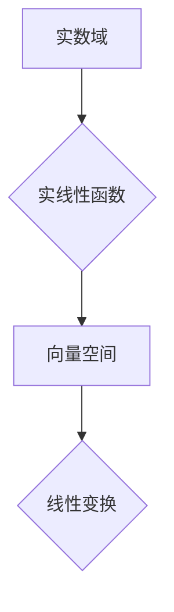

> 线性代数，实线性函数，矩阵，向量，线性变换，特征值，特征向量，应用场景

## 1. 背景介绍

线性代数作为数学领域的重要分支，为计算机科学、数据科学、人工智能等领域提供了强大的理论基础和工具。其中，实线性函数作为线性代数的核心概念之一，在理解和应用线性变换、矩阵运算等方面扮演着至关重要的角色。本文将深入探讨实线性函数的定义、性质、算法原理以及在实际应用中的意义。

## 2. 核心概念与联系

实线性函数是指从实数域到实数域的函数，满足以下两个性质：

* **齐次性:**  对于任意实数 k 和向量 x，有 f(kx) = kf(x)。
* **可加性:** 对于任意实数域中的两个向量 x 和 y，有 f(x + y) = f(x) + f(y)。

这些性质使得实线性函数具有良好的可组合性和可叠加性，为线性变换提供了理论基础。

**Mermaid 流程图:**



## 3. 核心算法原理 & 具体操作步骤

### 3.1  算法原理概述

实线性函数的实现通常依赖于矩阵运算。将向量表示为列向量，则实线性函数可以表示为一个矩阵乘法：

```
f(x) = Ax
```

其中，A 是一个 m × n 的矩阵，x 是一个 n × 1 的列向量，f(x) 是一个 m × 1 的列向量。

### 3.2  算法步骤详解

1. **构建矩阵 A:** 根据实线性函数的定义，确定矩阵 A 的元素。
2. **输入向量 x:** 将需要变换的向量 x 表示为列向量。
3. **矩阵乘法:** 计算矩阵 A 与向量 x 的乘积，得到变换后的向量 f(x)。

### 3.3  算法优缺点

**优点:**

* **简洁高效:** 矩阵乘法运算具有良好的效率，可以快速实现实线性函数的变换。
* **可组合性强:** 不同的矩阵可以组合起来实现复杂的线性变换。

**缺点:**

* **存储空间:** 对于高维向量，矩阵 A 的存储空间需求较大。
* **计算复杂度:** 当矩阵 A 的维度较大时，矩阵乘法运算的复杂度会显著增加。

### 3.4  算法应用领域

实线性函数在计算机图形学、图像处理、机器学习、数据分析等领域有着广泛的应用。例如：

* **计算机图形学:** 用于物体旋转、缩放、平移等变换。
* **图像处理:** 用于图像滤波、边缘检测等操作。
* **机器学习:** 用于特征提取、降维等步骤。

## 4. 数学模型和公式 & 详细讲解 & 举例说明

### 4.1  数学模型构建

实线性函数可以表示为一个线性变换，其数学模型可以描述为：

```
f: V -> W
```

其中，V 和 W 分别是输入空间和输出空间，f 是一个从 V 到 W 的线性变换。

### 4.2  公式推导过程

根据线性变换的定义，f 满足以下两个性质：

* **齐次性:** f(kx) = kf(x) 对于任意实数 k 和向量 x ∈ V。
* **可加性:** f(x + y) = f(x) + f(y) 对于任意向量 x, y ∈ V。

这些性质可以推导出实线性函数的矩阵表示形式：

```
f(x) = Ax
```

其中，A 是一个 m × n 的矩阵，x 是一个 n × 1 的列向量，f(x) 是一个 m × 1 的列向量。

### 4.3  案例分析与讲解

**示例:**

考虑一个二维向量空间 V 和一个一维向量空间 W，其中 V 中的向量可以表示为 (x1, x2)，W 中的向量可以表示为 (y)。

假设一个实线性函数 f 将 V 中的向量映射到 W 中的向量，其矩阵表示为：

```
A = [2 1]
    [3 0]
```

则对于向量 x = (1, 2)，其变换后的向量 f(x) 为：

```
f(x) = Ax = [2 1] * [1] = [5]
        [3 0]   [2]   [3]
```

因此，向量 (1, 2) 通过实线性函数 f 变换后得到向量 (5, 3)。

## 5. 项目实践：代码实例和详细解释说明

### 5.1  开发环境搭建

本示例使用 Python 语言进行实现，所需的库包括 NumPy 和 Matplotlib。

```
pip install numpy matplotlib
```

### 5.2  源代码详细实现

```python
import numpy as np
import matplotlib.pyplot as plt

# 定义实线性函数的矩阵 A
A = np.array([[2, 1],
              [3, 0]])

# 输入向量 x
x = np.array([1, 2])

# 计算变换后的向量 f(x)
f_x = np.dot(A, x)

# 打印结果
print("变换后的向量:", f_x)

# 可视化原向量和变换后的向量
plt.plot([0, x[0]], [0, x[1]], 'r-', label='原向量')
plt.plot([0, f_x[0]], [0, f_x[1]], 'b-', label='变换后的向量')
plt.legend()
plt.show()
```

### 5.3  代码解读与分析

1. 首先，导入 NumPy 和 Matplotlib 库。
2. 定义实线性函数的矩阵 A。
3. 输入向量 x。
4. 使用 `np.dot()` 函数计算矩阵 A 与向量 x 的乘积，得到变换后的向量 f(x)。
5. 打印变换后的向量 f(x)。
6. 使用 Matplotlib 库可视化原向量和变换后的向量。

### 5.4  运行结果展示

运行代码后，将输出变换后的向量，并绘制出原向量和变换后的向量之间的关系图。

## 6. 实际应用场景

实线性函数在各种实际应用场景中发挥着重要作用。

### 6.1  计算机图形学

在计算机图形学中，实线性函数用于实现物体旋转、缩放、平移等变换。通过改变矩阵 A 的元素，可以实现不同的变换效果。

### 6.2  图像处理

在图像处理中，实线性函数用于图像滤波、边缘检测等操作。例如，高斯滤波器可以使用实线性函数来平滑图像噪声。

### 6.3  机器学习

在机器学习中，实线性函数用于特征提取、降维等步骤。例如，主成分分析 (PCA) 算法使用实线性函数来降维。

### 6.4  未来应用展望

随着人工智能和机器学习的发展，实线性函数在未来将有更广泛的应用。例如，在深度学习中，实线性函数是神经网络的基本组成部分。

## 7. 工具和资源推荐

### 7.1  学习资源推荐

* **线性代数教材:** Gilbert Strang 的《线性代数》
* **在线课程:** Coursera 上的《线性代数》课程
* **书籍:**  《矩阵分析》

### 7.2  开发工具推荐

* **Python:**  NumPy、SciPy、Matplotlib
* **MATLAB:**  用于数值计算和图形可视化

### 7.3  相关论文推荐

* **Eigenvalues and Eigenvectors:**  https://en.wikipedia.org/wiki/Eigenvalue_and_eigenvector
* **Linear Transformations:**  https://en.wikipedia.org/wiki/Linear_transformation

## 8. 总结：未来发展趋势与挑战

### 8.1  研究成果总结

实线性函数作为线性代数的核心概念，为计算机科学和相关领域提供了强大的理论基础和工具。

### 8.2  未来发展趋势

随着人工智能和机器学习的发展，实线性函数在未来将有更广泛的应用。例如，在深度学习中，实线性函数是神经网络的基本组成部分。

### 8.3  面临的挑战

* **高维数据处理:**  对于高维数据，实线性函数的计算复杂度会显著增加，需要开发更有效的算法。
* **非线性问题处理:**  实线性函数只能处理线性问题，对于非线性问题需要结合其他方法。

### 8.4  研究展望

未来研究方向包括：

* 开发更高效的实线性函数算法。
* 将实线性函数与其他方法结合，解决非线性问题。
* 探索实线性函数在新的应用领域中的潜力。

## 9. 附录：常见问题与解答

**常见问题:**

* **实线性函数的矩阵表示形式如何确定？**

**解答:**

实线性函数的矩阵表示形式可以通过观察其变换规则和输入输出空间的维度确定。

* **实线性函数的应用场景有哪些？**

**解答:**

实线性函数在计算机图形学、图像处理、机器学习等领域有着广泛的应用。

* **如何理解实线性函数的齐次性和可加性？**

**解答:**

齐次性表示实线性函数对输入向量进行缩放后，变换结果也随之缩放。可加性表示实线性函数对两个输入向量之和进行变换，等于对两个输入向量分别进行变换后之和。


作者：禅与计算机程序设计艺术 / Zen and the Art of Computer Programming 
<end_of_turn>