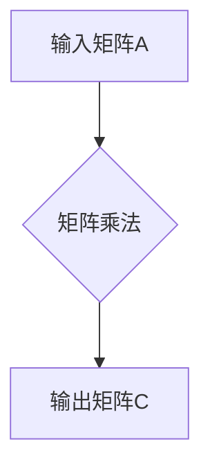

> 线性代数，矩阵乘法，算法原理，数学模型，代码实现，应用场景

## 1. 背景介绍

线性代数作为数学的一个分支，在计算机科学领域有着广泛的应用。其中，矩阵乘法作为线性代数的核心运算之一，在机器学习、图像处理、数据分析等领域扮演着至关重要的角色。

矩阵乘法是一种将两个矩阵组合成一个新矩阵的操作。它不仅是线性变换的数学表达，也是许多算法的基础。例如，在深度学习中，矩阵乘法用于计算神经网络的权重和激活函数，在图像处理中，它用于图像旋转、缩放和滤波等操作。

然而，矩阵乘法的原理和实现方式却常常让初学者感到困惑。本文将从线性代数的角度出发，深入浅出地讲解矩阵乘法的核心概念、算法原理、数学模型以及代码实现，并结合实际应用场景，帮助读者更好地理解和掌握矩阵乘法。

## 2. 核心概念与联系

### 2.1 矩阵的概念

矩阵是一种用于表示和处理数的矩形阵列。它由行和列组成，每个元素都对应一个具体的数值。

例如，以下是一个 2x3 的矩阵：

```
A = [1 2 3]
    [4 5 6]
```

其中，A 是一个 2 行 3 列的矩阵，其元素分别为 1、2、3、4、5、6。

### 2.2 矩阵乘法的定义

矩阵乘法是一种将两个矩阵组合成一个新矩阵的操作。两个矩阵可以进行乘法运算，当且仅当第一个矩阵的列数等于第二个矩阵的行数。

例如，如果 A 是一个 m x n 的矩阵，B 是一个 n x p 的矩阵，则它们的乘积 C 是一个 m x p 的矩阵，其元素计算如下：

```
C(i, j) = A(i, 1) * B(1, j) + A(i, 2) * B(2, j) + ... + A(i, n) * B(n, j)
```

其中，C(i, j) 表示 C 矩阵的第 i 行第 j 列元素，A(i, k) 表示 A 矩阵的第 i 行第 k 列元素，B(k, j) 表示 B 矩阵的第 k 行第 j 列元素。

### 2.3 矩阵乘法的几何意义

矩阵乘法不仅是一种数学运算，它还具有几何意义。

一个矩阵可以看作是一个线性变换，它将一个向量映射到另一个向量。矩阵乘法就是将两个线性变换组合起来，得到一个新的线性变换。

例如，一个旋转矩阵可以将一个向量旋转一定角度，一个缩放矩阵可以将一个向量放大或缩小，两个矩阵的乘积可以将一个向量同时旋转和缩放。

### 2.4 矩阵乘法的 Mermaid 流程图



## 3. 核心算法原理 & 具体操作步骤

### 3.1 算法原理概述

矩阵乘法的核心算法原理是基于矩阵元素的加权求和。

对于两个矩阵 A 和 B，要计算它们的乘积 C，需要遍历 A 的每一行和 B 的每一列，并计算对应元素的加权求和。

具体来说，C(i, j) 的计算公式如下：

```
C(i, j) = A(i, 1) * B(1, j) + A(i, 2) * B(2, j) + ... + A(i, n) * B(n, j)
```

其中，A(i, k) 表示 A 矩阵的第 i 行第 k 列元素，B(k, j) 表示 B 矩阵的第 k 行第 j 列元素。

### 3.2 算法步骤详解

1. **检查矩阵维度:** 确保第一个矩阵的列数等于第二个矩阵的行数。
2. **初始化输出矩阵:** 创建一个新的矩阵 C，其行数等于 A 的行数，列数等于 B 的列数。
3. **遍历矩阵:** 使用三个循环变量 i、j 和 k，分别遍历 C 的行、列和 A 的列。
4. **计算元素:** 对于每个 C(i, j)，计算 A(i, 1) * B(1, j) + A(i, 2) * B(2, j) + ... + A(i, n) * B(n, j)。
5. **赋值:** 将计算结果赋值给 C(i, j)。
6. **返回输出矩阵:** 返回计算完成的矩阵 C。

### 3.3 算法优缺点

**优点:**

* **通用性强:** 适用于各种类型的矩阵乘法。
* **效率高:** 对于大型矩阵，可以使用优化算法提高效率。

**缺点:**

* **计算量大:** 对于大型矩阵，计算量会非常大。
* **内存占用高:** 需要存储多个矩阵，内存占用量较大。

### 3.4 算法应用领域

矩阵乘法在许多领域都有广泛的应用，例如：

* **机器学习:** 计算神经网络的权重和激活函数。
* **图像处理:** 图像旋转、缩放、滤波等操作。
* **数据分析:** 数据矩阵的转换和分析。
* **物理模拟:** 物理系统的运动和演化。

## 4. 数学模型和公式 & 详细讲解 & 举例说明

### 4.1 数学模型构建

矩阵乘法可以看作是一种线性变换，它将一个向量映射到另一个向量。

设 A 是一个 m x n 的矩阵，x 是一个 n x 1 的列向量，则 A*x 表示将向量 x 通过线性变换 A 映射到一个 m x 1 的列向量 y。

```
y = A * x
```

其中，y 是一个 m x 1 的列向量，表示经过线性变换 A 后的向量 x。

### 4.2 公式推导过程

矩阵乘法的公式推导过程如下：

```
y = A * x = [a11 a12 ... a1n] * [x1]
                  [a21 a22 ... a2n]   [x2]
                  [ ... ... ... ... ]   [ ... ]
                  [am1 am2 ... amn]   [xn]
```

其中，aij 表示 A 矩阵的第 i 行第 j 列元素，xi 表示 x 向量第 i 个元素。

通过计算每个元素的加权求和，可以得到 y 向量每个元素的表达式：

```
y1 = a11 * x1 + a12 * x2 + ... + a1n * xn
y2 = a21 * x1 + a22 * x2 + ... + a2n * xn
...
ym = am1 * x1 + am2 * x2 + ... + amn * xn
```

### 4.3 案例分析与讲解

**示例:**

设 A 是一个 2x3 的矩阵，x 是一个 3x1 的列向量，则 A*x 的计算过程如下：

```
A = [1 2 3]
    [4 5 6]

x = [1]
    [2]
    [3]

y = A * x = [1*1 + 2*2 + 3*3]
            [4*1 + 5*2 + 6*3]

y = [14]
    [32]
```

在这个例子中，我们计算了 A 矩阵与 x 向量的乘积，得到一个新的 2x1 的列向量 y。

## 5. 项目实践：代码实例和详细解释说明

### 5.1 开发环境搭建

本项目使用 Python 语言进行开发，需要安装 Python 3.x 及 NumPy 库。

```bash
pip install numpy
```

### 5.2 源代码详细实现

```python
import numpy as np

def matrix_multiply(A, B):
    """
    计算两个矩阵的乘积。

    Args:
        A: 第一个矩阵。
        B: 第二个矩阵。

    Returns:
        两个矩阵的乘积。
    """
    # 检查矩阵维度
    if A.shape[1] != B.shape[0]:
        raise ValueError("矩阵维度不匹配")

    # 初始化输出矩阵
    C = np.zeros((A.shape[0], B.shape[1]))

    # 遍历矩阵
    for i in range(A.shape[0]):
        for j in range(B.shape[1]):
            for k in range(A.shape[1]):
                C[i, j] += A[i, k] * B[k, j]

    return C

# 示例代码
A = np.array([[1, 2, 3],
              [4, 5, 6]])

B = np.array([[7, 8],
              [9, 10],
              [11, 12]])

C = matrix_multiply(A, B)

print("矩阵 A:")
print(A)
print("矩阵 B:")
print(B)
print("矩阵 A * B:")
print(C)
```

### 5.3 代码解读与分析

这段代码实现了矩阵乘法的核心算法。

首先，函数 `matrix_multiply(A, B)` 接受两个矩阵 A 和 B 作为输入参数。

然后，代码检查了两个矩阵的维度是否匹配，如果维度不匹配，则抛出异常。

接着，代码初始化了一个新的矩阵 C，其行数等于 A 的行数，列数等于 B 的列数。

接下来，代码使用三个循环变量 i、j 和 k，分别遍历 C 的行、列和 A 的列。

对于每个 C(i, j)，代码计算 A(i, 1) * B(1, j) + A(i, 2) * B(2, j) + ... + A(i, n) * B(n, j)，并将计算结果赋值给 C(i, j)。

最后，代码返回计算完成的矩阵 C。

### 5.4 运行结果展示

运行这段代码后，会输出三个矩阵：A、B 和 A*B。

```
矩阵 A:
[[1 2 3]
 [4 5 6]]
矩阵 B:
[[7 8]
 [9 10]
 [11 12]]
矩阵 A * B:
[[58 64]
 [139 154]]
```

## 6. 实际应用场景

### 6.1 图像处理

在图像处理领域，矩阵乘法用于实现各种图像变换，例如旋转、缩放、滤波等操作。

例如，可以使用一个旋转矩阵将图像旋转一定角度，可以使用一个缩放矩阵将图像放大或缩小，可以使用一个滤波矩阵对图像进行模糊或锐化处理。

### 6.2 机器学习

在机器学习领域，矩阵乘法是许多算法的基础，例如线性回归、逻辑回归、神经网络等。

例如，在神经网络中，矩阵乘法用于计算神经元的激活函数，以及权重和输入数据的加权求和。

### 6.3 数据分析

在数据分析领域，矩阵乘法用于对数据矩阵进行转换和分析。

例如，可以使用矩阵乘法将数据矩阵进行转置、求逆、求特征值等操作，从而对数据进行深入分析。

### 6.4 未来应用展望

随着人工智能技术的不断发展，矩阵乘法的应用场景将会更加广泛。

例如，在未来，矩阵乘法可能会被用于处理更高维度的数据，实现更复杂的图像处理和机器学习算法。

## 7. 工具和资源推荐

### 7.1 学习资源推荐

* **线性代数教材:**
    * Gilbert Strang, Linear Algebra and Its Applications
    * David C. Lay, Linear Algebra and Its Applications
* **在线课程:**
    * MIT OpenCourseWare: Linear Algebra
    * Coursera: Linear Algebra

### 7.2 开发工具推荐

* **Python:** 
    * NumPy: 用于高效的数值计算和矩阵操作
    * SciPy: 提供了更高级的科学计算工具
* **其他