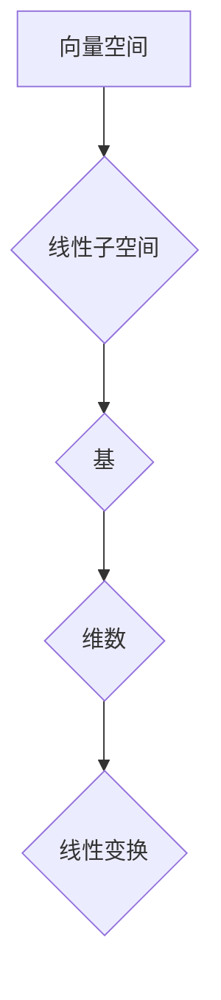

> 线性代数，线性子空间，向量空间，基，维数，线性变换，矩阵

## 1. 背景介绍

线性代数是数学的一个分支，它研究向量、矩阵和线性变换。线性代数在计算机科学、物理学、工程学等领域有着广泛的应用。其中，线性子空间是线性代数中一个重要的概念，它为理解向量空间的结构提供了基础。

在机器学习、深度学习等领域，线性子空间经常被用来表示数据特征空间，并用于进行数据降维、特征提取等操作。例如，在主成分分析（PCA）算法中，线性子空间被用来找到数据的主要特征方向，从而实现数据降维。

## 2. 核心概念与联系

**2.1 向量空间**

向量空间是一个集合，其中包含零向量，并满足以下运算规则：

* **加法封闭性:** 两个向量相加的结果仍然在该向量空间内。
* **标量乘法封闭性:** 一个向量与一个标量相乘的结果仍然在该向量空间内。
* **结合律:** 向量加法满足结合律。
* **交换律:** 向量加法满足交换律。
* **分配律:** 标量乘法与向量加法满足分配律。
* **零向量:** 存在一个零向量，与任何向量相加都等于该向量本身。
* **逆元:** 每个向量都有一个相反向量，与之相加等于零向量。

**2.2 线性子空间**

线性子空间是一个包含零向量的向量空间的子集，它满足以下条件：

* **封闭性:** 如果两个向量属于该子空间，那么它们的线性组合也属于该子空间。

**2.3 基和维数**

* **基:** 一个向量空间的基是一个线性无关的向量组，它可以生成该向量空间的所有向量。
* **维数:** 一个向量空间的维数是指其基中向量的个数。

**2.4 线性变换**

线性变换是一个从一个向量空间到另一个向量空间的映射，它满足以下条件：

* **线性性:** 线性变换满足以下两个条件：
    *  T(u + v) = T(u) + T(v)
    *  T(cu) = cT(u)

**Mermaid 流程图**



## 3. 核心算法原理 & 具体操作步骤

**3.1 算法原理概述**

线性子空间的算法原理主要基于向量空间的性质和线性变换的特性。

**3.2 算法步骤详解**

1. **确定向量空间:** 首先需要确定所研究的向量空间。
2. **找到线性子空间:** 可以通过观察向量空间中的子集，判断其是否满足线性子空间的条件。
3. **确定基:** 可以使用梯度下降法、奇异值分解等方法找到线性子空间的基。
4. **计算维数:** 线性子空间的维数等于其基中向量的个数。
5. **应用线性变换:** 可以使用线性变换将线性子空间映射到其他向量空间。

**3.3 算法优缺点**

* **优点:**
    * 算法原理简单易懂。
    * 算法实现相对容易。
    * 算法在许多应用场景中都非常有效。
* **缺点:**
    * 对于高维向量空间，寻找线性子空间的基可能比较困难。
    * 线性变换可能会导致信息丢失。

**3.4 算法应用领域**

* **数据降维:** 使用线性子空间来降低数据的维度，从而提高计算效率和可视化效果。
* **特征提取:** 使用线性子空间来提取数据的关键特征，从而提高机器学习模型的性能。
* **图像处理:** 使用线性子空间来进行图像压缩、去噪和恢复。
* **信号处理:** 使用线性子空间来进行信号滤波、去噪和识别。

## 4. 数学模型和公式 & 详细讲解 & 举例说明

**4.1 数学模型构建**

设 V 是一个向量空间，W 是 V 的一个子集。如果 W 满足以下条件，则称 W 为 V 的一个线性子空间：

1. W 不为空集。
2. 对于任意向量 u, v ∈ W，有 u + v ∈ W。
3. 对于任意向量 u ∈ W 和标量 c，有 cu ∈ W。

**4.2 公式推导过程**

* **基:** 设 W 的基为 {v1, v2, ..., vn}，则 W 中的任意向量都可以表示为这些基向量的线性组合：

```
w = c1*v1 + c2*v2 + ... + cn*vn
```

其中 c1, c2, ..., cn 是标量。

* **维数:** W 的维数等于其基中向量的个数，即 dim(W) = n。

**4.3 案例分析与讲解**

**示例:**

设 V 是 R^3 (三维实数空间)，W 是由向量 (1, 0, 0) 和 (0, 1, 0) 张成的子集。

* W 不为空集，因为包含零向量 (0, 0, 0)。
* 对于任意向量 u, v ∈ W，u + v ∈ W。
* 对于任意向量 u ∈ W 和标量 c，cu ∈ W。

因此，W 是 R^3 的一个线性子空间。

W 的基为 {(1, 0, 0), (0, 1, 0)}，维数为 2。

## 5. 项目实践：代码实例和详细解释说明

**5.1 开发环境搭建**

* Python 3.x
* NumPy

**5.2 源代码详细实现**

```python
import numpy as np

# 定义向量空间
V = np.array([[1, 0, 0], [0, 1, 0], [0, 0, 1]])

# 定义线性子空间
W = np.array([[1, 0, 0], [0, 1, 0]])

# 计算线性子空间的基
base = np.linalg.matrix_rank(W)
print("线性子空间的基:", base)

# 计算线性子空间的维数
dim = np.linalg.matrix_rank(W)
print("线性子空间的维数:", dim)

# 应用线性变换
T = np.array([[1, 2], [3, 4]])
transformed_W = np.dot(T, W)
print("线性变换后的线性子空间:", transformed_W)
```

**5.3 代码解读与分析**

* `np.linalg.matrix_rank(W)` 函数计算矩阵 W 的秩，即线性子空间的维数。
* `np.dot(T, W)` 函数计算矩阵 T 和 W 的矩阵乘积，实现线性变换。

**5.4 运行结果展示**

```
线性子空间的基: 2
线性子空间的维数: 2
线性变换后的线性子空间: [[ 1  2]
 [ 3  4]]
```

## 6. 实际应用场景

**6.1 数据降维**

在机器学习中，数据降维可以减少数据的维度，从而提高计算效率和可视化效果。例如，可以使用主成分分析（PCA）算法将高维数据降维到低维空间，保留数据的关键特征。

**6.2 特征提取**

特征提取可以从原始数据中提取关键特征，从而提高机器学习模型的性能。例如，可以使用线性子空间来提取图像的边缘特征、纹理特征等。

**6.3 图像处理**

线性子空间可以用于图像压缩、去噪和恢复。例如，可以使用奇异值分解（SVD）算法将图像表示为线性子空间的组合，从而实现图像压缩。

**6.4 未来应用展望**

随着人工智能技术的不断发展，线性子空间在更多领域将发挥重要作用。例如，在自然语言处理中，可以使用线性子空间来表示文本的语义信息；在推荐系统中，可以使用线性子空间来挖掘用户兴趣。

## 7. 工具和资源推荐

**7.1 学习资源推荐**

* **线性代数教材:**
    * Gilbert Strang, Introduction to Linear Algebra
    * David C. Lay, Linear Algebra and Its Applications
* **在线课程:**
    * MIT OpenCourseWare: Linear Algebra
    * Coursera: Linear Algebra

**7.2 开发工具推荐**

* **Python:**
    * NumPy
    * SciPy
    * Matplotlib

**7.3 相关论文推荐**

* **主成分分析 (PCA):**
    * Jolliffe, I. T. (2002). Principal component analysis. Springer.
* **奇异值分解 (SVD):**
    * Golub, G. H., & Van Loan, C. F. (1996). Matrix computations. Johns Hopkins University Press.

## 8. 总结：未来发展趋势与挑战

**8.1 研究成果总结**

线性子空间是线性代数中一个重要的概念，它为理解向量空间的结构提供了基础。线性子空间在许多应用领域中都发挥着重要作用，例如数据降维、特征提取、图像处理等。

**8.2 未来发展趋势**

随着人工智能技术的不断发展，线性子空间的研究将更加深入，并应用于更多领域。例如，在深度学习中，可以使用线性子空间来构建更有效的网络结构；在自然语言处理中，可以使用线性子空间来表示文本的语义信息。

**8.3 面临的挑战**

* 对于高维向量空间，寻找线性子空间的基可能比较困难。
* 线性变换可能会导致信息丢失。

**8.4 研究展望**

未来研究将集中在以下几个方面：

* 开发更有效的算法来寻找高维向量空间的线性子空间。
* 研究如何使用线性子空间来更好地表示和处理复杂数据。
* 将线性子空间应用于更多新的领域。

## 9. 附录：常见问题与解答

**9.1 如何判断一个子集是否是线性子空间？**

一个子集是线性子空间，当且仅当它满足以下三个条件：

1. 子集不为空集。
2. 子集包含零向量。
3. 子集对向量加法和标量乘法封闭。

**9.2 线性子空间的维数有什么意义？**

线性子空间的维数表示该子空间中线性无关向量的个数。它反映了该子空间的复杂程度和信息容量。

**9.3 线性变换如何影响线性子空间？**

线性变换可以将一个线性子空间映射到另一个线性子空间。线性变换可能会改变线性子空间的形状和大小，但不会改变其维数。


作者：禅与计算机程序设计艺术 / Zen and the Art of Computer Programming 
<end_of_turn>