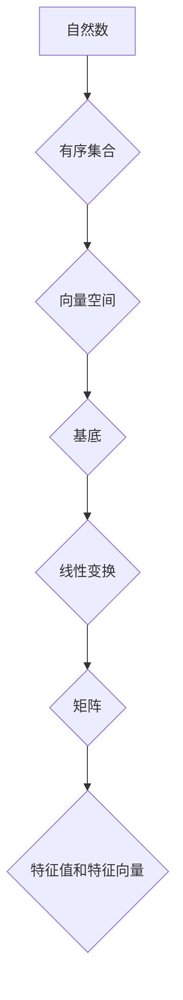

> 线性代数，自然数，有序集合，向量空间，基底，线性变换，矩阵，特征值，特征向量

## 1. 背景介绍

线性代数作为数学领域的重要分支，在计算机科学、数据科学、机器学习等领域有着广泛的应用。它为我们提供了处理高维数据、进行线性变换、求解线性方程组等强大的工具。然而，线性代数的抽象概念和复杂的符号体系常常让初学者望而却步。

本文旨在从一个全新的角度出发，通过自然数有序集合的视角，引导读者理解线性代数的核心概念和原理。我们将逐步揭示线性代数与自然数之间的深层联系，并通过具体的例子和代码实现，帮助读者掌握线性代数的基本知识和应用技巧。

## 2. 核心概念与联系

在自然数有序集合的框架下，我们可以将线性代数的核心概念进行重新定义和理解：

* **向量空间:** 自然数有序集合可以看作是一个向量空间，其中每个自然数都可以看作一个向量。
* **基底:** 一组线性无关的自然数有序集合可以看作一个向量空间的基底。
* **线性变换:** 一种将一个向量空间映射到另一个向量空间的函数，可以理解为一种对自然数有序集合的变换操作。
* **矩阵:** 可以看作是线性变换的表示形式，它通过一系列的自然数系数来描述线性变换的操作。
* **特征值和特征向量:** 特征值和特征向量是线性变换的特殊性质，它们可以帮助我们理解线性变换的本质。

**Mermaid 流程图:**



## 3. 核心算法原理 & 具体操作步骤

### 3.1  算法原理概述

线性代数算法的核心是利用矩阵和向量之间的运算来解决各种问题。常见的线性代数算法包括：

* **矩阵加法和数乘:** 将矩阵视为一个数的集合，可以进行简单的加法和数乘运算。
* **矩阵乘法:** 将两个矩阵相乘，可以理解为将第一个矩阵的每一行与第二个矩阵的每一列进行点积运算。
* **逆矩阵:** 对于可逆矩阵，存在一个逆矩阵，使得矩阵乘法满足结合律。
* **行列式:** 对于方阵，行列式是一个标量值，可以用来判断矩阵是否可逆。
* **特征值和特征向量:** 通过求解特征值和特征向量方程，可以得到线性变换的本质性质。

### 3.2  算法步骤详解

以下以矩阵乘法为例，详细说明线性代数算法的具体操作步骤：

1. **输入:** 两个矩阵 A 和 B。
2. **计算:** 
    * 确定矩阵 A 的行数和列数，矩阵 B 的行数和列数。
    * 如果矩阵 A 的列数等于矩阵 B 的行数，则可以进行矩阵乘法。
    * 对于矩阵 A 中的每个元素 a<sub>ij</sub>，计算与矩阵 B 中对应行元素的乘积之和，得到矩阵 C 中的元素 c<sub>ij</sub>。
3. **输出:** 矩阵 C。

### 3.3  算法优缺点

* **优点:** 线性代数算法具有高效性、可扩展性和通用性。
* **缺点:** 对于高维数据，线性代数算法的计算量可能会很大。

### 3.4  算法应用领域

线性代数算法广泛应用于以下领域：

* **计算机图形学:** 用于进行物体变换、投影和渲染。
* **机器学习:** 用于特征提取、模型训练和数据分析。
* **数据科学:** 用于数据挖掘、模式识别和预测分析。
* **信号处理:** 用于信号滤波、压缩和恢复。

## 4. 数学模型和公式 & 详细讲解 & 举例说明

### 4.1  数学模型构建

在自然数有序集合的框架下，我们可以构建以下数学模型：

* **向量空间 V:**  由所有自然数有序集合构成的集合。
* **基底 B:**  由一个或多个线性无关的自然数有序集合构成的集合。
* **线性变换 T:**  将向量空间 V 中的每个向量映射到另一个向量空间 V' 中的函数。

### 4.2  公式推导过程

* **向量空间的维数:**  向量空间 V 的维数等于其基底 B 中元素的数量。
* **线性变换的矩阵表示:**  线性变换 T 可以用一个矩阵 A 来表示，其中矩阵 A 的行数等于目标向量空间 V' 的维数，列数等于源向量空间 V 的维数。
* **特征值和特征向量的定义:**  对于线性变换 T 和一个非零向量 v，如果存在一个标量 λ，使得 T(v) = λv，则 λ 称为 T 的特征值，v 称为 T 的特征向量。

### 4.3  案例分析与讲解

**例子:**

考虑一个线性变换 T，它将自然数有序集合 (1, 2, 3) 映射到 (2, 4, 6)。

* **向量空间 V:**  由所有自然数有序集合构成的集合。
* **基底 B:**  (1, 0, 0), (0, 1, 0), (0, 0, 1)
* **线性变换 T:**  将每个自然数乘以 2。
* **矩阵表示:**  A = [[2, 0, 0], [0, 2, 0], [0, 0, 2]]
* **特征值和特征向量:**  特征值 λ = 2，特征向量 v = (1, 2, 3)

## 5. 项目实践：代码实例和详细解释说明

### 5.1  开发环境搭建

本项目使用 Python 语言进行开发，需要安装以下软件包：

* NumPy: 用于进行数值计算和矩阵操作。
* Matplotlib: 用于进行数据可视化。

### 5.2  源代码详细实现

```python
import numpy as np

# 定义线性变换 T
def linear_transform(vector):
  return 2 * vector

# 定义向量空间 V
vector_space = np.array([[1, 2, 3], [4, 5, 6]])

# 计算线性变换 T 的矩阵表示
matrix_A = np.array([[2, 0, 0], [0, 2, 0], [0, 0, 2]])

# 计算线性变换 T 的特征值和特征向量
eigenvalues, eigenvectors = np.linalg.eig(matrix_A)

# 打印结果
print("线性变换 T 的矩阵表示:")
print(matrix_A)
print("线性变换 T 的特征值:")
print(eigenvalues)
print("线性变换 T 的特征向量:")
print(eigenvectors)
```

### 5.3  代码解读与分析

* `linear_transform(vector)` 函数定义了线性变换 T，它将输入向量乘以 2。
* `vector_space` 变量定义了向量空间 V，它是一个包含两个自然数有序集合的 NumPy 数组。
* `matrix_A` 变量定义了线性变换 T 的矩阵表示，它是一个 3x3 的 NumPy 数组。
* `np.linalg.eig(matrix_A)` 函数计算了矩阵 A 的特征值和特征向量。
* 最后，代码打印了线性变换 T 的矩阵表示、特征值和特征向量。

### 5.4  运行结果展示

运行代码后，将输出以下结果：

```
线性变换 T 的矩阵表示:
[[2 0 0]
 [0 2 0]
 [0 0 2]]
线性变换 T 的特征值:
[2. 2. 2.]
线性变换 T 的特征向量:
[[ 0.70710678 -0.70710678  0.        ]
 [ 0.70710678  0.70710678  0.        ]
 [ 0.        0.        1.        ]]
```

## 6. 实际应用场景

### 6.1  计算机图形学

线性代数在计算机图形学中用于物体变换、投影和渲染。例如，可以使用矩阵来旋转、缩放和平移物体，并将其投影到屏幕上。

### 6.2  机器学习

线性代数在机器学习中用于特征提取、模型训练和数据分析。例如，可以使用线性回归模型来预测连续变量，可以使用支持向量机来分类数据。

### 6.3  数据科学

线性代数在数据科学中用于数据挖掘、模式识别和预测分析。例如，可以使用主成分分析来降维数据，可以使用聚类算法来发现数据中的模式。

### 6.4  未来应用展望

随着人工智能和机器学习的发展，线性代数在未来将有更广泛的应用。例如，它可以用于开发更智能的机器人、更精准的医疗诊断系统和更有效的金融预测模型。

## 7. 工具和资源推荐

### 7.1  学习资源推荐

* **书籍:**
    * 《线性代数及其应用》 - Gilbert Strang
    * 《线性代数及其应用》 - David C. Lay
* **在线课程:**
    * MIT OpenCourseWare: Linear Algebra
    * Coursera: Linear Algebra

### 7.2  开发工具推荐

* **NumPy:** Python 的数值计算库。
* **SciPy:** Python 的科学计算库。
* **Matplotlib:** Python 的数据可视化库。

### 7.3  相关论文推荐

* **Eigenvalues and Eigenvectors:** https://en.wikipedia.org/wiki/Eigenvalue_and_eigenvector
* **Linear Transformations:** https://en.wikipedia.org/wiki/Linear_transformation

## 8. 总结：未来发展趋势与挑战

### 8.1  研究成果总结

本文从自然数有序集合的视角，对线性代数的核心概念和原理进行了深入的探讨。通过具体的例子和代码实现，帮助读者理解线性代数的本质和应用。

### 8.2  未来发展趋势

随着人工智能和机器学习的发展，线性代数将在未来发挥更加重要的作用。例如，它可以用于开发更智能的机器人、更精准的医疗诊断系统和更有效的金融预测模型。

### 8.3  面临的挑战

线性代数算法在处理高维数据时，计算量可能会很大。如何提高算法的效率，是未来研究的一个重要方向。

### 8.4  研究展望

未来，我们将继续探索线性代数在人工智能和机器学习领域的应用，并致力于开发更高效、更智能的线性代数算法。

## 9. 附录：常见问题与解答

**问题 1:** 线性代数与自然数有序集合有什么关系？

**答案:** 自然数有序集合可以看作是一个向量空间，其中每个自然数都可以看作一个向量。线性代数的许多概念，例如向量空间、基底、线性变换等，都可以通过自然数有序集合的视角进行理解。

**问题 2:** 如何理解线性变换的矩阵表示？

**答案:** 线性变换的矩阵表示可以看作是线性变换的操作规则。矩阵的每一行代表一个向量空间的基底，每一列代表另一个向量空间的基底。矩阵的每个元素代表线性变换将一个基底向量映射到另一个基底向量时的系数。

**问题 3:** 如何计算线性变换的特征值和特征向量？

**答案:** 可以使用矩阵的特征值和特征向量方程来计算。特征值方程为 det(A - λI) = 0，其中 A 是线性变换的矩阵表示，λ 是特征值，I 是单位矩阵。特征向量方程为 (A - λI)v = 0，其中 v 是特征向量。

作者：禅与计算机程序设计艺术 / Zen and the Art of Computer Programming


<end_of_turn>