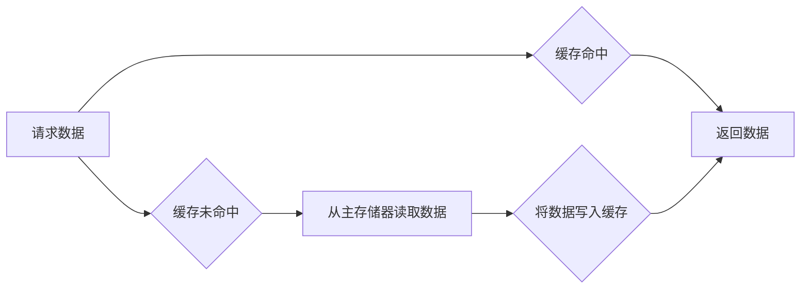

> 缓存机制、高吞吐量、数据访问、性能优化、算法设计、实例应用、数据库、网络

## 1. 背景介绍

在当今数据爆炸的时代，高吞吐量系统已成为各行各业的核心需求。无论是电商平台的商品查询、金融系统的交易处理，还是社交网络的用户数据交互，都需要快速、高效地处理海量数据请求。缓存机制作为一种重要的性能优化手段，在高吞吐量系统中发挥着至关重要的作用。

缓存机制的基本原理是将频繁访问的数据预先存储在高速缓存中，以便在需要时快速读取，从而减少对主存储器或数据库的访问，提升系统整体性能。

## 2. 核心概念与联系

### 2.1 缓存机制概述

缓存机制是一种数据存储和检索策略，旨在提高数据访问速度。它通过将数据从主存储器或数据库复制到高速缓存中，以便在需要时快速读取。

### 2.2 缓存层次结构

缓存通常采用层次结构，由多个级别组成，每个级别缓存的数据量和访问速度不同。常见的缓存层次结构包括：

* **L1 缓存：** 位于CPU内部，容量最小，访问速度最快。
* **L2 缓存：** 位于CPU外，容量比L1大，访问速度比L1慢。
* **L3 缓存：** 位于主板上的共享缓存，容量最大，访问速度相对较慢。
* **主存：** 位于主板上的随机存取存储器，容量较大，访问速度比缓存慢。
* **硬盘：** 位于计算机外壳中的非易失性存储器，容量最大，访问速度最慢。

### 2.3 缓存相关术语

* **命中率：** 缓存命中次数占总访问次数的比例。
* **存取时间：** 从请求数据到获取数据的总时间。
* **缓存淘汰策略：** 当缓存空间不足时，决定哪些数据需要从缓存中移除。

### 2.4 缓存机制的流程图



## 3. 核心算法原理 & 具体操作步骤

### 3.1 算法原理概述

缓存机制的核心算法是**缓存淘汰策略**，它决定了当缓存空间不足时，如何选择哪些数据从缓存中移除。常见的缓存淘汰策略包括：

* **FIFO（先进先出）：** 淘汰最早进入缓存的数据。
* **LRU（最近最少使用）：** 淘汰最近最少使用的缓存数据。
* **LFU（最近最频繁使用）：** 淘汰最近最不频繁使用的缓存数据。
* **ARC（Adaptive Replacement Cache）：** 基于历史访问数据，动态调整淘汰策略。

### 3.2 算法步骤详解

以LRU算法为例，其具体操作步骤如下：

1. 当请求数据时，首先检查缓存中是否存在该数据。
2. 如果存在，则命中，直接返回数据。
3. 如果不存在，则需要从主存储器读取数据。
4. 将读取到的数据写入缓存中，并更新该数据的访问时间。
5. 当缓存空间不足时，根据LRU算法淘汰最近最少使用的缓存数据。

### 3.3 算法优缺点

**LRU算法的优点：**

* 命中率较高，因为通常频繁访问的数据会被保留在缓存中。
* 算法简单易实现。

**LRU算法的缺点：**

* 需要维护每个缓存数据的访问时间，增加了一些开销。
* 对于某些特殊的数据访问模式，可能无法达到最佳的性能。

### 3.4 算法应用领域

LRU算法广泛应用于各种缓存系统，例如：

* Web服务器缓存
* 数据库缓存
* 操作系统缓存
* 虚拟机内存管理

## 4. 数学模型和公式 & 详细讲解 & 举例说明

### 4.1 数学模型构建

假设一个缓存系统有容量为`C`，访问频率为`f`，命中率为`H`，则可以构建以下数学模型：

* 缓存命中次数：`H * f`
* 缓存未命中次数：`(1 - H) * f`
* 缓存访问时间：`H * T_cache + (1 - H) * T_main`

其中：

* `T_cache`：缓存访问时间
* `T_main`：主存储器访问时间

### 4.2 公式推导过程

根据上述模型，我们可以推导出以下公式：

* 命中率：`H = (缓存命中次数) / (总访问次数)`
* 平均访问时间：`T_avg = H * T_cache + (1 - H) * T_main`

### 4.3 案例分析与讲解

假设一个缓存系统有容量为100KB，访问频率为1000次/秒，命中率为90%，缓存访问时间为10ns，主存储器访问时间为1000ns。

根据公式，我们可以计算出：

* 平均访问时间：`T_avg = 0.9 * 10ns + 0.1 * 1000ns = 90ns`

可见，缓存机制显著降低了平均访问时间，提高了系统性能。

## 5. 项目实践：代码实例和详细解释说明

### 5.1 开发环境搭建

* 操作系统：Linux
* 编程语言：Python
* 框架：Flask

### 5.2 源代码详细实现

```python
from flask import Flask, request, jsonify
from collections import OrderedDict

app = Flask(__name__)

# 缓存字典，使用OrderedDict实现LRU淘汰策略
cache = OrderedDict()

@app.route('/data/<key>')
def get_data(key):
    if key in cache:
        # 命中
        print(f"Cache hit for key: {key}")
        return jsonify(cache[key])
    else:
        # 未命中
        print(f"Cache miss for key: {key}")
        # 从数据库或其他数据源获取数据
        data = {'value': f'Data for key: {key}'}
        cache[key] = data
        return jsonify(data)

if __name__ == '__main__':
    app.run(debug=True)
```

### 5.3 代码解读与分析

* 缓存字典使用`OrderedDict`实现，它维护了元素的插入顺序，方便实现LRU淘汰策略。
* 当请求数据时，首先检查缓存中是否存在该数据。
* 如果存在，则命中，直接返回数据。
* 如果不存在，则从数据库或其他数据源获取数据，并将其写入缓存。
* 当缓存空间不足时，LRU算法会淘汰最近最少使用的缓存数据。

### 5.4 运行结果展示

运行上述代码，访问`/data/<key>`接口，可以观察到缓存命中和未命中情况。

## 6. 实际应用场景

### 6.1 网站内容缓存

网站内容缓存可以将静态页面、图片、CSS和JS文件等内容存储在缓存中，减少对服务器的访问，提高网站加载速度。

### 6.2 数据库查询缓存

数据库查询缓存可以将频繁查询的结果存储在缓存中，减少对数据库的访问，提高查询效率。

### 6.3 API接口缓存

API接口缓存可以将API接口的响应结果存储在缓存中，减少对API服务器的访问，提高接口响应速度。

### 6.4 负载均衡缓存

负载均衡缓存可以将请求数据存储在缓存中，根据缓存命中率动态分配请求到不同的服务器，提高系统负载均衡能力。

### 6.5 未来应用展望

随着云计算、大数据和人工智能等技术的快速发展，缓存机制将在未来发挥更加重要的作用。例如：

* **边缘计算缓存：** 将数据存储在靠近用户的数据中心或边缘节点，降低延迟，提高用户体验。
* **人工智能缓存：** 将机器学习模型和训练数据存储在缓存中，加速模型推理和训练速度。
* **区块链缓存：** 将区块链数据存储在缓存中，提高区块链网络的吞吐量和安全性。

## 7. 工具和资源推荐

### 7.1 学习资源推荐

* **书籍：**
    * 《深入理解计算机系统》
    * 《操作系统导论》
    * 《计算机网络》
* **在线课程：**
    * Coursera：操作系统、计算机网络、数据结构与算法
    * edX：计算机科学基础、软件工程

### 7.2 开发工具推荐

* **Redis：** 高性能的内存数据库，广泛用于缓存应用。
* **Memcached：** 轻量级的内存缓存系统，适合高并发场景。
* **Varnish Cache：** 高性能的HTTP缓存代理，用于加速网站加载速度。

### 7.3 相关论文推荐

* **LRU算法：**
    * Page, L. S. (1978). A study of replacement algorithms for a virtual memory system.
* **缓存一致性问题：**
    * Lamport, L., S. A. (1994). The concurrent programming problem.
* **边缘计算缓存：**
    * Zhang, Y., et al. (2019). Edge caching: A survey.

## 8. 总结：未来发展趋势与挑战

### 8.1 研究成果总结

缓存机制在高吞吐量系统中发挥着至关重要的作用，通过优化数据访问路径，显著提高了系统性能。

### 8.2 未来发展趋势

未来缓存机制的发展趋势包括：

* **智能化缓存：** 利用机器学习等人工智能技术，动态调整缓存策略，提高缓存命中率。
* **分布式缓存：** 将缓存分布在多个节点上，提高缓存容量和容错能力。
* **边缘计算缓存：** 将缓存部署在靠近用户的数据中心或边缘节点，降低延迟，提高用户体验。

### 8.3 面临的挑战

缓存机制的发展也面临着一些挑战：

* **缓存一致性问题：** 在分布式缓存环境下，保证缓存数据的一致性是一个难题。
* **缓存管理复杂度：** 随着缓存规模的扩大，缓存管理的复杂度也随之增加。
* **安全问题：** 缓存数据可能包含敏感信息，需要采取相应的安全措施。

### 8.4 研究展望

未来，缓存机制的研究将继续深入，探索更智能、更高效、更安全的缓存解决方案，为高吞吐量系统的发展提供更强大的支持。

## 9. 附录：常见问题与解答

### 9.1 缓存命中率如何计算？

缓存命中率 = 缓存命中次数 / 总访问次数

### 9.2 常见的缓存淘汰策略有哪些？

常见的缓存淘汰策略包括：FIFO、LRU、LFU、ARC等。

### 9.3 如何选择合适的缓存淘汰策略？

选择合适的缓存淘汰策略需要根据实际应用场景和数据访问模式进行分析。

### 9.4 如何优化缓存性能？

优化缓存性能的方法包括：

* 选择合适的缓存系统。
* 优化缓存配置参数。
* 采用合理的缓存淘汰策略。
* 减少缓存数据更新频率。


作者：禅与计算机程序设计艺术 / Zen and the Art of Computer Programming 
<end_of_turn>