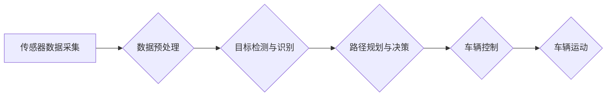

> 自动驾驶, 算法工程师, 职责变化, 深度学习, 计算机视觉, 规划与控制, 数据标注, 仿真测试, 伦理问题

## 1. 背景介绍

自动驾驶技术近年来发展迅速，从最初的实验室研究到如今的商业化应用，已经取得了令人瞩目的进展。自动驾驶汽车的出现，不仅改变了人们出行方式，也对汽车行业、交通运输体系以及社会结构产生了深远影响。

自动驾驶算法工程师作为自动驾驶技术发展的重要力量，肩负着将复杂算法转化为实际应用的重任。然而，随着自动驾驶技术的不断进步，自动驾驶算法工程师的职责也发生了显著变化。

## 2. 核心概念与联系

自动驾驶算法工程师的工作涉及多个领域，包括计算机视觉、深度学习、规划与控制、数据标注、仿真测试等。这些领域相互关联，共同构成了自动驾驶系统的核心。

**自动驾驶系统架构**



**核心概念解释:**

* **传感器数据采集:** 自动驾驶汽车依靠各种传感器，例如摄像头、雷达、激光雷达等，获取周围环境的信息。
* **数据预处理:** 收集到的原始数据通常需要进行预处理，例如降噪、去畸变等，以提高算法的精度和效率。
* **目标检测与识别:** 算法需要识别周围环境中的各种目标，例如行人、车辆、交通信号灯等，并判断其位置、速度和运动方向。
* **路径规划与决策:** 算法根据感知到的环境信息，规划出最优的驾驶路径，并做出相应的决策，例如加速、减速、转向等。
* **车辆控制:** 算法将决策指令发送到车辆的控制系统，控制车辆的运动。
* **车辆运动:** 车辆根据控制指令进行运动，实现自动驾驶功能。

## 3. 核心算法原理 & 具体操作步骤

### 3.1  算法原理概述

自动驾驶算法的核心是深度学习算法，它能够从海量数据中学习，并自动提取特征，从而实现对复杂环境的感知和决策。

**深度学习算法原理:**

深度学习算法是一种基于人工神经网络的机器学习算法。人工神经网络由多个层组成，每层都包含多个神经元。神经元之间通过连接进行信息传递，每个连接都有一个权重。通过训练，算法可以调整神经元的权重，使得网络能够学习到数据的特征。

**自动驾驶算法应用:**

深度学习算法在自动驾驶领域应用广泛，例如：

* **目标检测与识别:** 使用深度学习算法可以实现对行人、车辆、交通信号灯等目标的准确检测和识别。
* **路径规划与决策:** 深度学习算法可以学习驾驶经验，并根据感知到的环境信息规划出最优的驾驶路径。
* **车辆控制:** 深度学习算法可以控制车辆的加速、减速、转向等动作，实现自动驾驶功能。

### 3.2  算法步骤详解

**目标检测与识别算法步骤:**

1. **数据采集:** 收集大量包含目标的图像数据。
2. **数据预处理:** 对图像数据进行预处理，例如裁剪、缩放、增强等。
3. **模型训练:** 使用深度学习算法训练目标检测模型，例如YOLO、SSD等。
4. **模型评估:** 使用测试数据评估模型的性能，例如准确率、召回率等。
5. **模型部署:** 将训练好的模型部署到自动驾驶系统中。

### 3.3  算法优缺点

**深度学习算法的优点:**

* **高精度:** 深度学习算法能够从海量数据中学习，并自动提取特征，从而实现对复杂环境的准确感知和决策。
* **鲁棒性:** 深度学习算法能够对噪声和干扰具有较强的鲁棒性。
* **可扩展性:** 深度学习算法可以很容易地扩展到更大的数据集和更复杂的模型。

**深度学习算法的缺点:**

* **数据依赖:** 深度学习算法需要大量的训练数据，否则性能会下降。
* **计算资源消耗:** 训练深度学习模型需要大量的计算资源。
* **可解释性差:** 深度学习模型的决策过程难以解释，这可能会导致信任问题。

### 3.4  算法应用领域

深度学习算法在自动驾驶领域之外，还应用于其他领域，例如：

* **图像识别:** 人脸识别、物体识别、场景理解等。
* **自然语言处理:** 语音识别、机器翻译、文本摘要等。
* **医疗诊断:** 疾病诊断、影像分析等。

## 4. 数学模型和公式 & 详细讲解 & 举例说明

### 4.1  数学模型构建

自动驾驶算法的数学模型通常基于概率论、统计学和优化理论。

**目标检测模型:**

目标检测模型通常使用概率图模型来表示目标的检测结果。

**概率图模型:**

概率图模型是一种用于表示概率分布的图形模型。

**举例说明:**

假设我们有一个目标检测模型，它需要预测图像中是否存在一辆汽车。我们可以使用一个二元概率图模型来表示这个预测结果，其中一个节点表示“是否存在汽车”，另一个节点表示“图像中是否存在汽车的证据”。

### 4.2  公式推导过程

目标检测模型的训练过程通常使用最大似然估计 (Maximum Likelihood Estimation,MLE) 方法。

**最大似然估计:**

最大似然估计是一种用于估计模型参数的方法。它通过寻找使观测数据概率最大的参数值。

**公式推导:**

假设我们有一个目标检测模型，它使用一个二元概率图模型来表示目标的检测结果。我们可以使用最大似然估计方法来估计模型参数，例如汽车存在的概率和汽车证据存在的概率。

### 4.3  案例分析与讲解

**案例分析:**

假设我们有一个目标检测模型，它需要预测图像中是否存在一辆汽车。我们使用最大似然估计方法训练了这个模型，并使用测试数据评估了模型的性能。

**讲解:**

我们发现，模型在检测汽车的准确率很高，但对小汽车的检测准确率较低。这可能是因为训练数据中小汽车的比例较低，导致模型对小汽车的特征学习不足。

## 5. 项目实践：代码实例和详细解释说明

### 5.1  开发环境搭建

自动驾驶算法开发通常需要使用以下开发环境：

* **操作系统:** Linux
* **编程语言:** Python
* **深度学习框架:** TensorFlow, PyTorch
* **计算机视觉库:** OpenCV

### 5.2  源代码详细实现

以下是一个简单的目标检测代码示例，使用 TensorFlow 和 OpenCV 库实现：

```python
import tensorflow as tf
import cv2

# 加载预训练的模型
model = tf.keras.models.load_model('object_detection_model.h5')

# 读取图像
image = cv2.imread('image.jpg')

# 预处理图像
image = cv2.resize(image, (300, 300))
image = image / 255.0

# 使用模型进行预测
predictions = model.predict(image[None, ...])

# 绘制检测结果
for prediction in predictions[0]:
    class_id = int(prediction[1])
    confidence = prediction[2]
    if confidence > 0.5:
        x1 = int(prediction[3] * image.shape[1])
        y1 = int(prediction[4] * image.shape[0])
        x2 = int(prediction[5] * image.shape[1])
        y2 = int(prediction[6] * image.shape[0])
        cv2.rectangle(image, (x1, y1), (x2, y2), (0, 255, 0), 2)
        cv2.putText(image, class_names[class_id], (x1, y1 - 10), cv2.FONT_HERSHEY_SIMPLEX, 0.5, (0, 255, 0), 2)

# 显示图像
cv2.imshow('Detection Result', image)
cv2.waitKey(0)
```

### 5.3  代码解读与分析

* **加载预训练模型:** 使用 TensorFlow 的 `load_model` 函数加载预训练的模型。
* **读取图像:** 使用 OpenCV 的 `imread` 函数读取图像。
* **预处理图像:** 对图像进行缩放和归一化处理。
* **使用模型进行预测:** 使用模型对图像进行预测，得到目标的类别和置信度。
* **绘制检测结果:** 使用 OpenCV 的 `rectangle` 和 `putText` 函数绘制检测结果。

### 5.4  运行结果展示

运行代码后，将显示带有检测结果的图像。

## 6. 实际应用场景

自动驾驶算法在实际应用场景中发挥着重要作用，例如：

* **自动驾驶汽车:** 自动驾驶汽车依靠自动驾驶算法实现自动驾驶功能。
* **无人机:** 无人机使用自动驾驶算法实现自主飞行。
* **机器人:** 机器人使用自动驾驶算法实现自主导航。

### 6.4  未来应用展望

自动驾驶算法的未来应用前景广阔，例如：

* **智能交通系统:** 自动驾驶算法可以用于构建智能交通系统，提高交通效率和安全性。
* **物流运输:** 自动驾驶算法可以用于无人驾驶卡车和无人驾驶货车，提高物流效率和降低成本。
* **医疗服务:** 自动驾驶算法可以用于无人驾驶救护车，提高医疗服务效率。

## 7. 工具和资源推荐

### 7.1  学习资源推荐

* **书籍:**
    * 《深度学习》
    * 《自动驾驶汽车》
* **在线课程:**
    * Coursera: 深度学习
    * Udacity: 自动驾驶工程师
* **开源项目:**
    * TensorFlow
    * PyTorch
    * OpenAI Gym

### 7.2  开发工具推荐

* **IDE:** PyCharm, VS Code
* **深度学习框架:** TensorFlow, PyTorch
* **计算机视觉库:** OpenCV

### 7.3  相关论文推荐

* **目标检测:**
    * You Only Look Once: Unified, Real-Time Object Detection
    * Single Shot MultiBox Detector
* **路径规划与决策:**
    * Deep Reinforcement Learning for End-to-End Autonomous Driving
    * End-to-End Learning for Self-Driving Cars

## 8. 总结：未来发展趋势与挑战

### 8.1  研究成果总结

自动驾驶算法在近年来取得了显著进展，例如目标检测、路径规划、车辆控制等方面的算法精度和效率都有很大提升。

### 8.2  未来发展趋势

* **更强的鲁棒性和安全性:** 自动驾驶算法需要能够应对更复杂和不确定的环境，并保证更高的安全性。
* **更强的泛化能力:** 自动驾驶算法需要能够适应不同的车型、道路条件和气候环境。
* **更强的解释性和可信度:** 自动驾驶算法的决策过程需要更加透明和可解释，以提高公众的信任度。

### 8.3  面临的挑战

* **数据获取和标注:** 自动驾驶算法需要大量的标注数据，而数据获取和标注成本较高。
* **算法复杂性和计算资源:** 自动驾驶算法非常复杂，需要大量的计算资源进行训练和推理。
* **伦理问题:** 自动驾驶算法的决策可能会涉及伦理问题，例如在紧急情况下如何做出选择。

### 8.4  研究展望

未来，自动驾驶算法的研究将继续朝着更安全、更可靠、更智能的方向发展。

## 9. 附录：常见问题与解答

**常见问题:**

* **自动驾驶算法的安全性如何保证？**

**解答:**

自动驾驶算法的安全性是至关重要的。为了提高安全性，自动驾驶算法需要经过严格的测试和验证，并采用多重冗余设计，例如使用多个传感器和算法进行融合决策。

* **自动驾驶算法的成本如何？**

**解答:**

自动驾驶算法的成本取决于具体的应用场景和算法复杂度。目前，自动驾驶算法的成本仍然较高，但随着技术的进步和规模