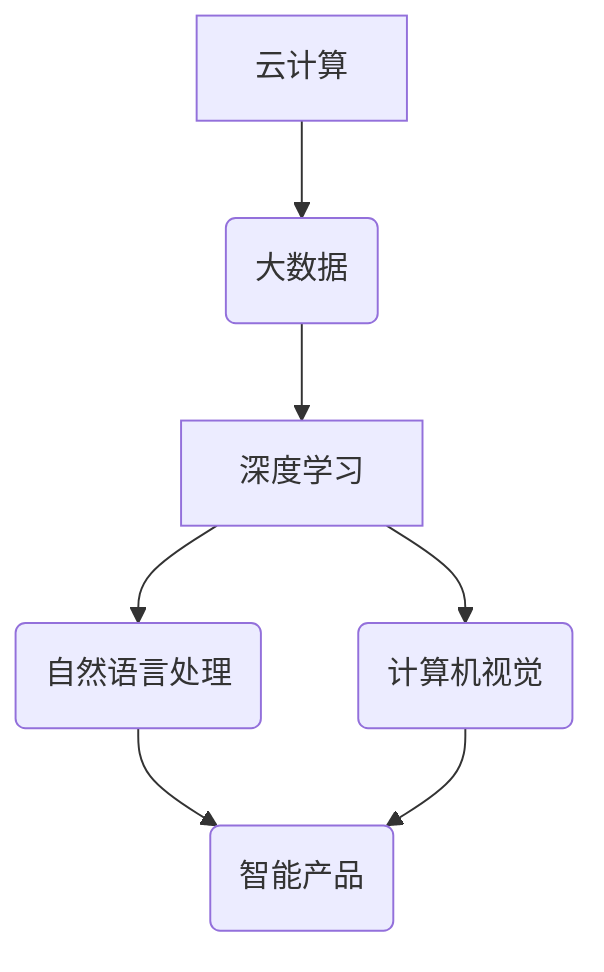

> 人工智能、深度学习、自然语言处理、计算机视觉、机器学习、云计算、大数据

## 1. 背景介绍

近年来，科技发展日新月异，人工智能（AI）技术作为科技发展的重要驱动力，正在深刻地改变着我们的生活和工作方式。从智能手机的语音助手到自动驾驶汽车，AI技术已渗透到各个领域，并展现出巨大的应用潜力。

随着AI技术的不断发展，行业最新产品也呈现出以下趋势：

* **智能化程度不断提升:**  产品将更加智能化，能够更好地理解用户需求，提供个性化服务。
* **数据驱动型决策:**  产品将更加依赖数据分析，利用大数据和机器学习算法进行决策，提高效率和准确性。
* **边缘计算的兴起:**  产品将更加注重边缘计算，将计算能力部署到设备边缘，实现更快速、更低延迟的响应。
* **跨平台融合:**  产品将更加注重跨平台融合，实现不同平台之间的互联互通，提供更便捷的用户体验。

## 2. 核心概念与联系

**2.1 核心概念**

* **深度学习 (Deep Learning):**  深度学习是机器学习的一种，它利用多层神经网络来模拟人类大脑的学习过程，能够从海量数据中自动提取特征，实现更精准的预测和识别。
* **自然语言处理 (Natural Language Processing, NLP):**  NLP是人工智能的一个分支，它致力于使计算机能够理解和处理人类语言，包括文本和语音。
* **计算机视觉 (Computer Vision):**  计算机视觉是人工智能的一个分支，它致力于使计算机能够“看”和理解图像和视频，例如识别物体、场景和人脸。
* **云计算 (Cloud Computing):**  云计算是一种按需使用的计算资源模式，它提供计算、存储、网络等资源，用户可以根据需要随时随地访问和使用这些资源。
* **大数据 (Big Data):**  大数据是指海量、高速度、高多样性的数据，它蕴含着丰富的价值，但需要强大的计算能力和分析工具才能挖掘出来。

**2.2 核心概念联系**

这些核心概念相互关联，共同推动着行业最新产品的技术发展。例如，深度学习可以用于自然语言处理和计算机视觉，云计算可以提供大数据处理和存储能力，大数据可以为深度学习提供训练数据。



## 3. 核心算法原理 & 具体操作步骤

**3.1 算法原理概述**

深度学习算法的核心是多层神经网络，它由多个神经元组成的层级结构组成。每个神经元接收来自上一层的输入信号，并对其进行处理，然后将处理后的信号传递到下一层。通过训练，神经网络可以学习到数据的特征表示，并根据这些特征进行预测或分类。

**3.2 算法步骤详解**

1. **数据预处理:**  将原始数据进行清洗、转换和格式化，使其适合深度学习算法的训练。
2. **网络结构设计:**  根据任务需求设计神经网络的结构，包括神经元的数量、连接方式和激活函数等。
3. **参数初始化:**  为神经网络中的参数进行随机初始化。
4. **前向传播:**  将输入数据通过神经网络进行前向传播，得到输出结果。
5. **损失函数计算:**  计算输出结果与真实值的差异，即损失函数的值。
6. **反向传播:**  利用梯度下降算法，反向传播损失函数的梯度，更新神经网络的参数。
7. **迭代训练:**  重复步骤4-6，直到损失函数达到预设的阈值。

**3.3 算法优缺点**

**优点:**

* **学习能力强:**  深度学习算法能够自动学习数据的特征，无需人工特征工程。
* **性能优异:**  在许多任务中，深度学习算法能够取得比传统算法更好的性能。
* **应用广泛:**  深度学习算法可以应用于图像识别、自然语言处理、语音识别等多个领域。

**缺点:**

* **数据依赖性强:**  深度学习算法需要大量的训练数据才能达到良好的性能。
* **计算资源消耗大:**  训练深度学习模型需要大量的计算资源和时间。
* **可解释性差:**  深度学习模型的决策过程比较复杂，难以解释其决策依据。

**3.4 算法应用领域**

深度学习算法已广泛应用于以下领域：

* **图像识别:**  人脸识别、物体检测、图像分类
* **自然语言处理:**  机器翻译、文本摘要、情感分析
* **语音识别:**  语音转文本、语音助手
* **推荐系统:**  商品推荐、内容推荐
* **医疗诊断:**  疾病诊断、影像分析

## 4. 数学模型和公式 & 详细讲解 & 举例说明

**4.1 数学模型构建**

深度学习模型的核心是神经网络，其数学模型可以表示为多层感知机（MLP）。

**4.2 公式推导过程**

* **激活函数:**  激活函数用于引入非线性，使神经网络能够学习复杂的模式。常用的激活函数包括 sigmoid 函数、ReLU 函数等。

* **损失函数:**  损失函数用于衡量模型预测结果与真实值的差异。常用的损失函数包括均方误差（MSE）、交叉熵损失等。

* **梯度下降算法:**  梯度下降算法用于更新神经网络的参数，使其朝着最小化损失函数的方向进行调整。

**4.3 案例分析与讲解**

以图像分类为例，假设我们有一个包含猫和狗的图像数据集。我们可以使用深度学习模型来训练一个分类器，能够识别出图像中是猫还是狗。

* **输入层:**  接收图像像素值作为输入。
* **隐藏层:**  多个隐藏层用于提取图像特征。
* **输出层:**  输出两个类别概率，分别代表猫和狗的概率。

训练过程中，模型会根据损失函数的值，利用梯度下降算法更新参数，最终使得模型能够准确地识别出图像中的猫和狗。

## 5. 项目实践：代码实例和详细解释说明

**5.1 开发环境搭建**

* **操作系统:**  Linux 或 macOS
* **编程语言:**  Python
* **深度学习框架:**  TensorFlow 或 PyTorch
* **其他工具:**  Git、Jupyter Notebook

**5.2 源代码详细实现**

```python
import tensorflow as tf

# 定义模型结构
model = tf.keras.models.Sequential([
    tf.keras.layers.Conv2D(32, (3, 3), activation='relu', input_shape=(28, 28, 1)),
    tf.keras.layers.MaxPooling2D((2, 2)),
    tf.keras.layers.Conv2D(64, (3, 3), activation='relu'),
    tf.keras.layers.MaxPooling2D((2, 2)),
    tf.keras.layers.Flatten(),
    tf.keras.layers.Dense(10, activation='softmax')
])

# 编译模型
model.compile(optimizer='adam',
              loss='sparse_categorical_crossentropy',
              metrics=['accuracy'])

# 训练模型
model.fit(x_train, y_train, epochs=10)

# 评估模型
loss, accuracy = model.evaluate(x_test, y_test)
print('Test loss:', loss)
print('Test accuracy:', accuracy)
```

**5.3 代码解读与分析**

这段代码定义了一个简单的卷积神经网络模型，用于手写数字识别任务。

* **Conv2D:**  卷积层，用于提取图像特征。
* **MaxPooling2D:**  最大池化层，用于降低特征图的尺寸，提高模型的鲁棒性。
* **Flatten:**  扁平化层，将多维特征图转换为一维向量。
* **Dense:**  全连接层，用于分类。

**5.4 运行结果展示**

训练完成后，模型可以用来预测新的手写数字。

## 6. 实际应用场景

**6.1 智能客服:**  利用自然语言处理技术，构建智能客服系统，能够自动理解用户问题，并提供准确的回复。

**6.2 自动驾驶:**  利用计算机视觉和深度学习技术，实现自动驾驶汽车的感知、决策和控制。

**6.3 医疗诊断:**  利用深度学习技术，分析医学影像数据，辅助医生进行疾病诊断。

**6.4 金融风险控制:**  利用机器学习算法，分析金融数据，识别潜在的风险。

**6.5 个性化推荐:**  利用深度学习技术，分析用户行为数据，提供个性化的商品或内容推荐。

**6.6 未来应用展望**

随着人工智能技术的不断发展，其应用场景将更加广泛，例如：

* **人机交互:**  更加自然、智能的人机交互方式，例如语音控制、手势识别等。
* **个性化教育:**  根据学生的学习情况，提供个性化的学习方案和辅导。
* **智能制造:**  利用人工智能技术，实现智能制造，提高生产效率和产品质量。
* **医疗保健:**  人工智能技术将进一步推动医疗保健的进步，例如疾病预防、精准治疗等。

## 7. 工具和资源推荐

**7.1 学习资源推荐**

* **在线课程:**  Coursera、edX、Udacity 等平台提供丰富的深度学习课程。
* **书籍:**  《深度学习》、《动手学深度学习》等书籍。
* **博客:**  机器之心、AI 算法等博客。

**7.2 开发工具推荐**

* **深度学习框架:**  TensorFlow、PyTorch、Keras 等。
* **编程语言:**  Python。
* **数据处理工具:**  Pandas、NumPy 等。

**7.3 相关论文推荐**

* **AlexNet:**  ImageNet Classification with Deep Convolutional Neural Networks
* **VGGNet:**  Very Deep Convolutional Networks for Large-Scale Image Recognition
* **ResNet:**  Deep Residual Learning for Image Recognition

## 8. 总结：未来发展趋势与挑战

**8.1 研究成果总结**

近年来，人工智能技术取得了长足的进步，深度学习算法在图像识别、自然语言处理等领域取得了突破性进展。

**8.2 未来发展趋势**

* **模型规模和复杂度提升:**  模型规模将继续扩大，模型复杂度将进一步提高，从而实现更强大的学习能力。
* **跨模态学习:**  模型将能够处理多种模态数据，例如文本、图像、音频等，实现更全面的理解和分析。
* **可解释性增强:**  研究人员将致力于提高深度学习模型的可解释性，使其决策过程更加透明和可理解。
* **边缘计算和联邦学习:**  模型将更加注重边缘计算和联邦学习，实现更私密、更安全的应用。

**8.3 面临的挑战**

* **数据获取和隐私保护:**  深度学习算法依赖于海量数据，如何获取高质量数据并保护用户隐私是一个重要的挑战。
* **模型可解释性和信任度:**  深度学习模型的决策过程比较复杂，难以解释其决策依据，如何提高模型的可解释性和信任度是一个重要的研究方向。
* **伦理和社会影响:**  人工智能技术的快速发展也带来了伦理和社会影响，例如算法偏见、就业问题等，需要引起社会广泛关注和讨论。

**8.4 研究展望**

未来，人工智能技术将继续发展，并对我们的生活和工作方式产生更深远的影响。研究人员将继续致力于解决人工智能技术面临的挑战，并探索其更广泛的应用场景。


## 9. 附录：常见问题与解答

**9.1 如何选择合适的深度学习框架？**

选择深度学习框架需要根据具体项目需求和个人偏好。TensorFlow 和 PyTorch 是目前最流行的深度学习框架，它们都具有强大的功能和活跃的社区支持。

**9.2 如何处理数据不平衡问题？**

数据不平衡问题是指训练数据中某些类别的数据比其他类别的数据多。可以采用以下方法处理数据不平衡问题：

* **