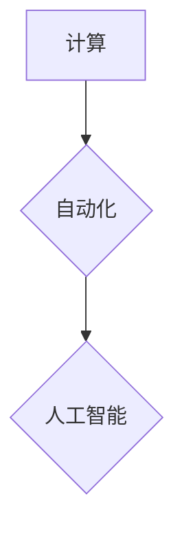

> 计算、自动化、人工智能、机器学习、深度学习、算法、数据结构、软件架构

## 1. 背景介绍

在信息时代，计算已成为人类社会不可或缺的一部分。从我们日常使用的智能手机到复杂的科学研究，计算都扮演着至关重要的角色。随着技术的不断发展，计算能力正在以指数级增长，这为我们带来了前所未有的机遇和挑战。

自动化是计算发展的重要趋势。通过自动化，我们可以解放人力，提高效率，并实现更复杂的任务。从工业生产线上的机器人手臂到金融领域的自动交易系统，自动化已在各个领域得到广泛应用。

人工智能（AI）是自动化领域的一个重要分支。AI的目标是让机器能够像人类一样思考和学习。近年来，人工智能取得了长足的进步，特别是深度学习技术的突破，使得AI在图像识别、自然语言处理等领域取得了令人瞩目的成就。

## 2. 核心概念与联系

**2.1 计算的本质**

计算本质上是信息的处理过程。信息可以是数字、文字、图像、声音等各种形式。计算通过一系列的逻辑操作对信息进行转换、分析和处理，最终产生新的信息。

**2.2 自动化的定义**

自动化是指通过程序、设备或系统自动执行任务，减少或消除人工干预的过程。自动化可以提高效率、降低成本、提高质量，并释放人力用于更复杂的任务。

**2.3 人工智能的定义**

人工智能是指让机器能够像人类一样思考、学习和解决问题的能力。AI的目标是开发能够理解、学习和应用知识的智能系统。

**2.4 核心概念联系**

计算、自动化和人工智能之间存在着密切的联系。

* 计算是自动化的基础。自动化依赖于计算能力来执行任务。
* 自动化是人工智能的重要应用场景。人工智能算法可以被用于自动化各种任务，例如图像识别、自然语言处理和决策支持。
* 人工智能的进步推动了计算和自动化的发展。人工智能算法的不断改进使得自动化更加智能化和高效化。

**2.5 Mermaid 流程图**



## 3. 核心算法原理 & 具体操作步骤

**3.1 算法原理概述**

深度学习算法是一种基于人工神经网络的机器学习算法。它能够从海量数据中学习复杂的模式和特征，并用于各种任务，例如图像识别、自然语言处理和语音识别。

**3.2 算法步骤详解**

1. **数据预处理:** 将原始数据转换为深度学习算法可以理解的形式，例如归一化、编码和特征提取。
2. **网络结构设计:** 设计一个包含多个隐藏层的深度神经网络，每个隐藏层包含多个神经元。
3. **权值初始化:** 为神经网络中的每个连接赋予一个随机权值。
4. **前向传播:** 将输入数据通过神经网络传递，计算每个神经元的输出值。
5. **反向传播:** 计算误差，并根据误差调整神经网络的权值。
6. **优化算法:** 使用优化算法，例如梯度下降，来更新神经网络的权值，降低误差。
7. **训练和验证:** 将数据分为训练集和验证集，使用训练集训练模型，使用验证集评估模型的性能。
8. **测试:** 使用测试集评估模型的最终性能。

**3.3 算法优缺点**

**优点:**

* 能够学习复杂的模式和特征。
* 性能优于传统机器学习算法。
* 适用范围广泛。

**缺点:**

* 需要大量的训练数据。
* 计算资源需求高。
* 训练过程复杂。

**3.4 算法应用领域**

* 图像识别
* 自然语言处理
* 语音识别
* 机器翻译
* 医疗诊断
* 金融预测

## 4. 数学模型和公式 & 详细讲解 & 举例说明

**4.1 数学模型构建**

深度学习算法的核心是多层感知机（MLP）。MLP由多个神经元组成的层组成，每个神经元接收来自上一层的输入，并通过激活函数进行处理，输出到下一层。

**4.2 公式推导过程**

* **激活函数:** 激活函数用于引入非线性，使神经网络能够学习复杂的模式。常见的激活函数包括 sigmoid 函数、ReLU 函数和 tanh 函数。

* **损失函数:** 损失函数用于衡量模型的预测结果与真实值的差异。常见的损失函数包括均方误差（MSE）和交叉熵损失（Cross-Entropy Loss）。

* **梯度下降:** 梯度下降是一种优化算法，用于更新神经网络的权值，降低损失函数的值。

**4.3 案例分析与讲解**

假设我们有一个简单的 MLP，用于分类手写数字。

* 输入层：784 个神经元，对应于 MNIST 数据集中的图像像素。
* 隐藏层：128 个神经元。
* 输出层：10 个神经元，对应于 0-9 的数字类别。

使用 sigmoid 函数作为激活函数，MSE 作为损失函数，并使用梯度下降算法进行训练。

## 5. 项目实践：代码实例和详细解释说明

**5.1 开发环境搭建**

使用 Python 语言和 TensorFlow 或 PyTorch 深度学习框架进行开发。

**5.2 源代码详细实现**

```python
import tensorflow as tf

# 定义模型结构
model = tf.keras.models.Sequential([
    tf.keras.layers.Flatten(input_shape=(28, 28)),
    tf.keras.layers.Dense(128, activation='relu'),
    tf.keras.layers.Dense(10, activation='softmax')
])

# 编译模型
model.compile(optimizer='adam',
              loss='sparse_categorical_crossentropy',
              metrics=['accuracy'])

# 训练模型
model.fit(x_train, y_train, epochs=10)

# 评估模型
loss, accuracy = model.evaluate(x_test, y_test)
print('Test loss:', loss)
print('Test accuracy:', accuracy)
```

**5.3 代码解读与分析**

* `tf.keras.models.Sequential`: 创建一个顺序模型，层级结构清晰。
* `tf.keras.layers.Flatten`: 将二维图像数据转换为一维向量。
* `tf.keras.layers.Dense`: 定义全连接层，每个神经元连接到上一层的所有神经元。
* `activation='relu'`: 使用 ReLU 激活函数。
* `optimizer='adam'`: 使用 Adam 优化算法。
* `loss='sparse_categorical_crossentropy'`: 使用交叉熵损失函数。
* `metrics=['accuracy']`: 使用准确率作为评估指标。

**5.4 运行结果展示**

训练完成后，模型可以用于预测新的手写数字。

## 6. 实际应用场景

**6.1 图像识别**

深度学习算法可以用于识别图像中的物体、场景和人物。例如，自动驾驶汽车使用图像识别技术来识别道路、行人和其他车辆。

**6.2 自然语言处理**

深度学习算法可以用于理解和生成自然语言。例如，聊天机器人使用自然语言处理技术来与用户进行对话。

**6.3 语音识别**

深度学习算法可以用于将语音转换为文本。例如，语音助手使用语音识别技术来理解用户的语音指令。

**6.4 医疗诊断**

深度学习算法可以用于辅助医生进行诊断。例如，深度学习模型可以用于识别医学图像中的肿瘤。

**6.5 金融预测**

深度学习算法可以用于预测股票价格、信用风险和欺诈行为。

**6.6 未来应用展望**

深度学习算法的应用场景还在不断扩展。未来，深度学习将应用于更多领域，例如个性化教育、精准医疗和智能制造。

## 7. 工具和资源推荐

**7.1 学习资源推荐**

* **书籍:**
    * 深度学习 (Deep Learning) - Ian Goodfellow, Yoshua Bengio, Aaron Courville
    * 构建深度学习模型 (Hands-On Machine Learning with Scikit-Learn, Keras & TensorFlow) - Aurélien Géron
* **在线课程:**
    * 深度学习 Specialization - Andrew Ng (Coursera)
    * fast.ai - Practical Deep Learning for Coders
* **博客和网站:**
    * TensorFlow Blog
    * PyTorch Blog
    * Towards Data Science

**7.2 开发工具推荐**

* **Python:** 
* **TensorFlow:** 
* **PyTorch:** 
* **Keras:** 

**7.3 相关论文推荐**

* **ImageNet Classification with Deep Convolutional Neural Networks** - Alex Krizhevsky, Ilya Sutskever, Geoffrey E. Hinton
* **Sequence to Sequence Learning with Neural Networks** - Ilya Sutskever, Oriol Vinyals, Quoc V. Le
* **Attention Is All You Need** - Ashish Vaswani, Noam Shazeer, Niki Parmar, Jakob Uszkoreit, Llion Jones, Aidan N. Gomez, Łukasz Kaiser, Illia Polosukhin

## 8. 总结：未来发展趋势与挑战

**8.1 研究成果总结**

近年来，深度学习取得了长足的进步，在图像识别、自然语言处理等领域取得了令人瞩目的成就。

**8.2 未来发展趋势**

* **模型规模和复杂度:** 深度学习模型将继续朝着更大、更复杂的方向发展。
* **数据效率:** 研究人员将致力于开发更能利用少量数据的深度学习算法。
* **可解释性:** 研究人员将致力于提高深度学习模型的可解释性，使其更容易被理解和信任。
* **边缘计算:** 深度学习将被部署到边缘设备上，实现更快速的响应和更低的延迟。

**8.3 面临的挑战**

* **数据获取和标注:** 深度学习算法需要大量的训练数据，而获取和标注高质量数据仍然是一个挑战。
* **计算资源:** 训练大型深度学习模型需要大量的计算资源，这对于个人开发者和小型公司来说是一个障碍。
* **伦理问题:** 深度学习算法可能会带来伦理问题，例如偏见和隐私泄露。

**8.4 研究展望**

未来，深度学习将继续发展，并应用于更多领域。研究人员将致力于解决深度学习面临的挑战，并探索新的应用场景。

## 9. 附录：常见问题与解答

**9.1 如何选择合适的深度学习框架？**

TensorFlow 和 PyTorch 是两个最流行的深度学习框架。TensorFlow 更适合于生产环境，而 PyTorch 更适合于研究和开发。

**9.2 如何处理过拟合问题？**

过拟合是指模型在训练数据上表现良好，但在测试数据上表现差。可以使用正则化、 dropout 和数据增强等技术来解决过拟合问题。

**9.3 如何评估深度学习模型的性能？**

可以使用准确率、召回率、F1-score 等指标来评估深度学习模型的性能。

作者：禅与计算机程序设计艺术 / Zen and the Art of Computer Programming


<end_of_turn>