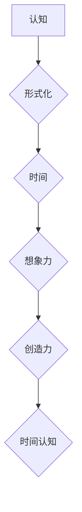

> 认知、形式化、时间、想象力、创造力、人工智能、算法、数学模型

## 1. 背景介绍

时间，这个无形却又无处不在的概念，是人类认知世界和理解自身存在的基石。我们用时间来衡量事物发生的先后顺序，来规划我们的生活，来追忆过去，憧憬未来。然而，时间究竟是什么？它是否存在于客观世界，还是仅仅是人类思维的产物？

从古至今，哲学家们一直在探索时间的神秘本质。一些人认为时间是永恒不变的，是宇宙的基石；另一些人则认为时间是相对的，是人类感知的产物。现代物理学的发展也为我们提供了新的视角，例如爱因斯坦的相对论表明，时间并非绝对的，而是与空间相互交织，构成时空。

然而，无论从哪个角度来看，时间都是一个极其复杂的概念，它与我们的认知、思维、情感和行为息息相关。

## 2. 核心概念与联系

**2.1 认知的本质**

认知是指人类通过感知、记忆、思考、语言等方式，对世界进行理解和加工的过程。它是一个复杂而动态的过程，涉及到大脑的多种功能和神经网络的相互作用。

**2.2 形式化的意义**

形式化是指将抽象的概念用符号、规则和逻辑关系来表示，使其更加清晰、严谨和可计算。形式化可以帮助我们更好地理解和分析复杂系统，并为人工智能的开发提供基础。

**2.3 时间的认知形式化**

人类对时间的认知并非天生就有的，而是通过经验积累和抽象思考逐渐形成的。我们通过观察自然界的规律，例如日夜交替、四季更替，来感知时间的流逝。我们用语言、符号和计量单位来表达时间，并将其融入到我们的思维和行为中。

**2.4 想象力和创造力的作用**

想象力和创造力是人类认知的重要驱动力。它们让我们能够超越现实的局限，构建新的概念和模式，并将其转化为现实。在认知时间方面，想象力和创造力也发挥着至关重要的作用。

我们能够想象未来的时间，并根据自己的愿望和目标来规划未来。我们能够回忆过去的事件，并从中汲取经验教训。我们能够创造出新的时间概念，例如“永恒”和“无限”。

**Mermaid 流程图**



## 3. 核心算法原理 & 具体操作步骤

**3.1 算法原理概述**

时间认知的算法原理可以概括为以下几个方面：

* **时间序列分析:** 通过分析时间序列数据，例如历史事件、天气变化、市场波动等，来识别时间规律和趋势。
* **时间建模:** 使用数学模型和符号语言来表示时间概念和关系，例如时间线、时间图谱、时间网络等。
* **时间预测:** 基于时间序列分析和时间建模，预测未来的时间事件和趋势。
* **时间规划:** 根据时间预测和个人目标，制定时间计划和安排。

**3.2 算法步骤详解**

1. **数据收集:** 收集与时间相关的各种数据，例如历史事件、天气记录、市场数据、个人行为记录等。
2. **数据预处理:** 对收集到的数据进行清洗、转换和格式化，使其适合算法处理。
3. **时间序列分析:** 使用时间序列分析算法，例如ARIMA模型、LSTM网络等，来识别时间规律和趋势。
4. **时间建模:** 根据时间序列分析结果，构建时间模型，例如时间线、时间图谱、时间网络等。
5. **时间预测:** 使用时间模型和预测算法，例如回归分析、机器学习等，来预测未来的时间事件和趋势。
6. **时间规划:** 根据时间预测和个人目标，制定时间计划和安排。

**3.3 算法优缺点**

* **优点:** 能够识别时间规律、预测未来事件、辅助时间规划。
* **缺点:** 依赖于数据质量、难以处理复杂时间关系、存在预测误差。

**3.4 算法应用领域**

* **金融市场:** 预测股票价格、识别市场趋势、进行风险管理。
* **天气预报:** 预测天气变化、预警自然灾害。
* **交通管理:** 预测交通流量、优化交通路线。
* **医疗保健:** 预测疾病发生、辅助诊断治疗。

## 4. 数学模型和公式 & 详细讲解 & 举例说明

**4.1 数学模型构建**

时间可以被视为一个连续的实数轴，其起点可以任意设定，例如公元前1年。时间间隔可以用差值表示，例如从公元前1年到公元1年是一个2年的时间间隔。

**4.2 公式推导过程**

* 时间差值公式:  Δt = t2 - t1

其中，Δt表示时间差值，t2表示结束时间，t1表示开始时间。

* 时间间隔公式:  T = t2 - t1

其中，T表示时间间隔，t2表示结束时间，t1表示开始时间。

**4.3 案例分析与讲解**

例如，假设现在的时间是2023年1月1日，那么公元前1年的时间差值为：

Δt = 2023 - (-1) = 2024年

**4.4 时间的相对性**

爱因斯坦的相对论表明，时间并非绝对的，而是与速度和引力场有关。

* 时间膨胀公式:  t' = t / √(1 - v^2/c^2)

其中，t'表示观察者相对静止参考系的时间，t表示静止参考系的时间，v表示相对速度，c表示光速。

* 引力时间膨胀公式:  t' = t √(1 - 2GM/rc^2)

其中，t'表示在引力场中的时间，t表示在弱引力场中的时间，G表示万有引力常数，M表示引力源的质量，r表示观察者到引力源的距离，c表示光速。

## 5. 项目实践：代码实例和详细解释说明

**5.1 开发环境搭建**

* 操作系统: Ubuntu 20.04 LTS
* 编程语言: Python 3.8
* 开发工具: Jupyter Notebook

**5.2 源代码详细实现**

```python
import numpy as np
from sklearn.linear_model import LinearRegression

# 生成时间序列数据
time = np.arange(0, 10, 0.1)
data = np.sin(time) + np.random.normal(0, 0.2, size=len(time))

# 训练线性回归模型
model = LinearRegression()
model.fit(time[:, np.newaxis], data)

# 预测未来时间点的数据
future_time = np.arange(10, 11, 0.1)
future_data = model.predict(future_time[:, np.newaxis])

# 可视化结果
import matplotlib.pyplot as plt
plt.plot(time, data, label='训练数据')
plt.plot(future_time, future_data, label='预测数据')
plt.legend()
plt.show()
```

**5.3 代码解读与分析**

* 该代码首先生成一个时间序列数据，并添加一些随机噪声。
* 然后，使用线性回归模型对数据进行训练，学习时间序列的趋势。
* 最后，使用训练好的模型预测未来时间点的数值，并与原始数据进行可视化比较。

**5.4 运行结果展示**

运行该代码后，会生成一个图表，展示原始数据和预测数据之间的关系。

## 6. 实际应用场景

**6.1 金融市场预测**

时间序列分析和预测模型可以用于预测股票价格、识别市场趋势、进行风险管理。

**6.2 天气预报**

时间序列分析和预测模型可以用于预测天气变化、预警自然灾害。

**6.3 交通管理**

时间序列分析和预测模型可以用于预测交通流量、优化交通路线。

**6.4 医疗保健**

时间序列分析和预测模型可以用于预测疾病发生、辅助诊断治疗。

**6.5 未来应用展望**

随着人工智能技术的不断发展，时间认知的算法和应用场景将会更加广泛和深入。例如，未来可能出现能够预测个人健康状况、规划个性化学习路径、辅助决策等基于时间认知的智能系统。

## 7. 工具和资源推荐

**7.1 学习资源推荐**

* **书籍:**
    * 《时间简史》 - 史蒂芬·霍金
    * 《时间：物理学家的视角》 - 约翰·霍尔
    * 《认知科学导论》 - 迈克尔·科尔曼
* **在线课程:**
    * Coursera: 时间序列分析
    * edX: 人工智能导论
* **网站:**
    * Wolfram Alpha: 数学计算和知识库
    * Stack Overflow: 程序员问答社区

**7.2 开发工具推荐**

* **编程语言:** Python, R
* **数据分析工具:** Pandas, NumPy, Scikit-learn
* **可视化工具:** Matplotlib, Seaborn

**7.3 相关论文推荐**

* **时间序列分析:**
    * Box, G. E. P., & Jenkins, G. M. (1976). Time series analysis: Forecasting and control. Holden-Day.
* **时间建模:**
    * Allen, J. F. (1983). Maintaining knowledge about temporal intervals. Communications of the ACM, 26(11), 832-843.
* **时间预测:**
    * Schmidhuber, J. (2015). Deep learning in neural networks: An overview. Neural Networks, 61, 35-48.

## 8. 总结：未来发展趋势与挑战

**8.1 研究成果总结**

近年来，时间认知的研究取得了显著进展，特别是人工智能技术的快速发展为时间认知的算法和应用提供了强大的支持。

**8.2 未来发展趋势**

* **更精准的时间预测:** 利用深度学习等先进算法，提高时间预测的精度和可靠性。
* **更复杂的时空建模:** 建立更复杂的时空模型，能够更好地刻画时间和空间之间的相互关系。
* **个性化时间管理:** 基于个人行为数据和目标，提供个性化的时间管理建议和工具。

**8.3 面临的挑战**

* **数据质量问题:** 时间认知算法依赖于高质量的数据，而现实世界中的数据往往存在噪声、缺失和不一致性等问题。
* **复杂时间关系:** 现实世界中的时间关系往往非常复杂，难以用简单的模型来表示。
* **伦理问题:** 时间认知技术的应用可能会引发一些伦理问题，例如时间操控、隐私泄露等。

**8.4 研究展望**

未来，时间认知的研究将继续朝着更精准、更复杂、更智能的方向发展。我们需要不断探索新的算法和模型，并解决数据质量、复杂时间关系和伦理问题等挑战，才能真正发挥时间认知技术的巨大潜力。

## 9. 附录：常见问题与解答

**9.1 如何处理时间序列数据中的噪声？**

可以使用滤波算法、平滑算法等方法来处理时间序列数据中的噪声。

**9.2 如何选择合适的算法模型？**

选择合适的算法模型需要根据具体应用场景和数据特点来决定。

**9.3 时间认知技术有哪些伦理问题？**

时间认知技术的应用可能会引发一些伦理问题，例如时间操控、隐私泄露等。我们需要谨慎地考虑这些问题，并制定相应的伦理规范和法律法规。


作者：禅与计算机程序设计艺术 / Zen and the Art of Computer Programming 
<end_of_turn>