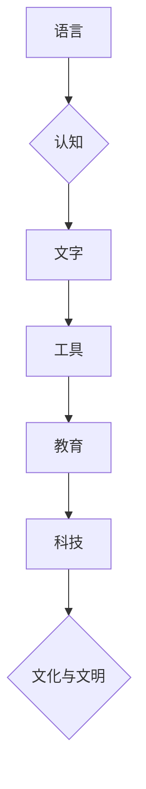

> 认知、形式化、语言、文字、工具、教育、科技、文化、文明、人工智能

## 1. 背景介绍

人类文明的演进是一个不断探索和理解自身认知的过程。从远古人类的原始工具使用到现代人工智能的快速发展，我们一直在寻求一种更有效、更精确的方式来表达、记录和处理信息。语言、文字、工具、教育和科技，这些都是人类认知形式化的重要体现。

语言是人类最早的认知工具，它让我们能够交流思想、传递知识和构建社会关系。文字的出现则进一步扩展了人类的认知能力，让我们能够记录历史、传播文化和传承智慧。工具的革新则推动了人类生产力的发展，让我们能够更有效地改造世界。教育和科技的进步则不断提升了人类的认知水平，让我们能够更深入地理解世界和自身。

## 2. 核心概念与联系

**2.1 认知形式化**

认知形式化是指将人类的认知过程和知识表示为一种可被计算机理解和处理的形式。它旨在通过抽象、符号化和逻辑化等手段，将复杂的认知过程转化为可计算的规则和算法。

**2.2 认知形式化与人工智能**

人工智能的本质是模拟和实现人类的智能行为。而认知形式化是人工智能实现的关键技术之一。通过将人类的认知过程形式化，我们可以构建人工智能系统，使其能够理解、学习和解决复杂问题。

**2.3 认知形式化与人类文明**

认知形式化是人类文明进步的重要驱动力。它推动了语言、文字、工具、教育和科技的发展，最终形成了我们今天所知的复杂社会和文化。

**Mermaid 流程图**



## 3. 核心算法原理 & 具体操作步骤

**3.1 算法原理概述**

认知形式化的核心算法原理是将人类的认知过程抽象为一系列规则和步骤，并将其转化为计算机可执行的代码。这些算法通常包括：

* **知识表示:** 将人类的知识表示为计算机可理解的形式，例如符号、逻辑表达式或图结构。
* **推理机制:** 允许计算机根据已有的知识进行逻辑推理，得出新的结论。
* **学习算法:** 允许计算机从数据中学习新的知识和规则。

**3.2 算法步骤详解**

1. **知识获取:** 从各种来源收集人类的知识，例如文本、图像、音频等。
2. **知识表示:** 将收集到的知识转化为计算机可理解的形式，例如符号、逻辑表达式或图结构。
3. **知识推理:** 使用逻辑推理机制，根据已有的知识得出新的结论。
4. **知识更新:** 根据新的信息更新已有的知识库。
5. **知识应用:** 将形式化的知识应用于实际问题解决，例如自然语言处理、机器学习、决策支持等。

**3.3 算法优缺点**

**优点:**

* 可以将人类的复杂认知过程转化为可计算的规则和算法。
* 可以提高人工智能系统的智能水平和应用范围。
* 可以促进人类对自身认知的理解。

**缺点:**

* 知识表示和推理机制的构建仍然是一个挑战。
* 算法的复杂性可能导致计算效率低下。
* 形式化的知识库可能难以覆盖人类认知的全部范围。

**3.4 算法应用领域**

* 自然语言处理
* 机器学习
* 决策支持
* 医疗诊断
* 自动驾驶

## 4. 数学模型和公式 & 详细讲解 & 举例说明

**4.1 数学模型构建**

认知形式化的数学模型通常基于逻辑、概率和图论等数学工具。例如，可以使用逻辑表达式来表示知识，可以使用概率模型来描述不确定性，可以使用图论来表示知识之间的关系。

**4.2 公式推导过程**

例如，我们可以使用逻辑推理规则来推导新的知识。例如，如果我们知道“所有猫都是哺乳动物”，并且知道“小猫是猫”，那么我们可以推导出“小猫是哺乳动物”。

**4.3 案例分析与讲解**

例如，我们可以使用概率模型来分析文本的主题。我们可以将文本中的每个词语表示为一个随机变量，然后使用贝叶斯定理来计算每个主题的概率。

## 5. 项目实践：代码实例和详细解释说明

**5.1 开发环境搭建**

可以使用Python语言和相关的库来实现认知形式化算法。例如，可以使用NLTK库进行自然语言处理，可以使用Scikit-learn库进行机器学习。

**5.2 源代码详细实现**

```python
# 使用NLTK库进行文本分类
import nltk

# 下载停用词列表
nltk.download('stopwords')

# 定义文本分类函数
def classify_text(text):
    # 将文本转换为小写
    text = text.lower()
    # 去除停用词
    stop_words = nltk.corpus.stopwords.words('english')
    words = [word for word in text.split() if word not in stop_words]
    # 使用朴素贝叶斯分类器进行分类
    classifier = nltk.NaiveBayesClassifier.train(training_data)
    return classifier.classify(words)

# 训练数据
training_data = [
    ('This is a positive sentence.', 'positive'),
    ('This is a negative sentence.', 'negative'),
]

# 测试文本
test_text = 'This is a great day!'

# 分类结果
category = classify_text(test_text)
print(category)
```

**5.3 代码解读与分析**

这段代码使用NLTK库进行文本分类。首先，它下载了停用词列表，然后定义了一个文本分类函数。该函数将文本转换为小写，去除停用词，并使用朴素贝叶斯分类器进行分类。最后，它使用训练数据训练分类器，并对测试文本进行分类。

**5.4 运行结果展示**

运行这段代码后，会输出分类结果，例如“positive”。

## 6. 实际应用场景

认知形式化技术在各个领域都有广泛的应用场景，例如：

* **自然语言处理:** 机器翻译、文本摘要、情感分析、对话系统等。
* **机器学习:** 知识图谱构建、推荐系统、异常检测等。
* **决策支持:** 医疗诊断、金融风险评估、法律推理等。
* **自动驾驶:** 路况感知、决策规划、路径规划等。

**6.4 未来应用展望**

随着人工智能技术的不断发展，认知形式化技术将发挥越来越重要的作用。未来，我们可以期待看到：

* 更智能、更灵活的人工智能系统。
* 更深入的认知理解和知识发现。
* 更广泛的应用场景和社会影响。

## 7. 工具和资源推荐

**7.1 学习资源推荐**

* **书籍:**
    * 《人工智能：现代方法》
    * 《深度学习》
    * 《认知科学导论》
* **在线课程:**
    * Coursera: 人工智能
    * edX: 深度学习
    * Udacity: 机器学习工程师

**7.2 开发工具推荐**

* **Python:** 广泛用于人工智能开发的编程语言。
* **TensorFlow:** 深度学习框架。
* **PyTorch:** 深度学习框架。
* **NLTK:** 自然语言处理库。
* **Scikit-learn:** 机器学习库。

**7.3 相关论文推荐**

* 《深度学习》
* 《循环神经网络》
* 《生成对抗网络》

## 8. 总结：未来发展趋势与挑战

**8.1 研究成果总结**

认知形式化技术取得了显著的进展，为人工智能的发展提供了重要的理论基础和技术支撑。

**8.2 未来发展趋势**

未来，认知形式化技术将朝着以下方向发展：

* 更智能、更灵活的人工智能系统。
* 更深入的认知理解和知识发现。
* 更广泛的应用场景和社会影响。

**8.3 面临的挑战**

认知形式化技术仍然面临着一些挑战，例如：

* 知识表示和推理机制的构建仍然是一个挑战。
* 算法的复杂性可能导致计算效率低下。
* 形式化的知识库可能难以覆盖人类认知的全部范围。

**8.4 研究展望**

未来，我们需要继续探索新的知识表示和推理机制，提高算法的效率和鲁棒性，并构建更全面的知识库，以推动认知形式化技术的进一步发展。

## 9. 附录：常见问题与解答

**常见问题:**

* 什么是认知形式化？
* 认知形式化技术有哪些应用场景？
* 认知形式化技术面临哪些挑战？

**解答:**

* 认知形式化是指将人类的认知过程和知识表示为一种可被计算机理解和处理的形式。
* 认知形式化技术在各个领域都有广泛的应用场景，例如自然语言处理、机器学习、决策支持等。
* 认知形式化技术仍然面临着一些挑战，例如知识表示和推理机制的构建、算法的复杂性和知识库的覆盖范围等。


作者：禅与计算机程序设计艺术 / Zen and the Art of Computer Programming 
<end_of_turn>