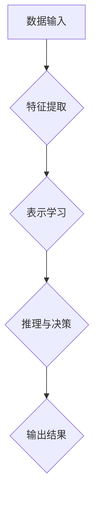

> 深刻化学习，认知过程，人工智能，神经网络，深度学习，迁移学习，泛化能力

## 1. 背景介绍

人工智能（AI）的发展日新月异，特别是深度学习的兴起，为我们带来了前所未有的机遇和挑战。深度学习模型在图像识别、自然语言处理、语音识别等领域取得了令人瞩目的成就。然而，现有的深度学习模型仍然存在一些局限性，例如：

* **数据依赖性强:** 深度学习模型通常需要海量数据进行训练，而获取高质量数据的成本往往很高。
* **过拟合问题:** 模型在训练数据上表现良好，但在未见过的数据上表现欠佳。
* **可解释性差:** 深度学习模型的决策过程往往是“黑箱”式的，难以解释模型的决策依据。

为了克服这些局限性，研究者们提出了“深刻化学习”的概念。深刻化学习旨在通过增强模型的认知能力，使其能够更好地理解和处理信息，从而提高模型的泛化能力、鲁棒性和可解释性。

## 2. 核心概念与联系

**2.1 深刻化学习的概念**

深刻化学习是指通过构建更复杂的、更具认知能力的 AI 模型，使其能够更好地理解和处理信息。它不仅仅是单纯地增加模型的规模和参数量，而是要通过设计更合理的模型架构、学习算法和训练策略，使其能够模拟人类的认知过程，例如：

* **抽象化:** 从低层次的特征提取到高层次的抽象概念的学习。
* **推理:** 基于已有的知识和经验进行逻辑推理和决策。
* **迁移学习:** 将已学到的知识应用到新的任务和领域中。

**2.2 深刻化学习与认知过程的关系**

认知过程是人类获取、处理和利用信息的一系列复杂活动，包括感知、记忆、推理、决策等。深刻化学习的目标是通过构建更复杂的 AI 模型，使其能够模拟和学习这些认知过程，从而提高模型的智能水平。

**2.3 深刻化学习的架构**

深刻化学习的架构通常包含以下几个关键部分：

* **多层感知机 (MLP):** 用于提取特征和学习表示。
* **卷积神经网络 (CNN):** 用于处理图像和视频数据。
* **循环神经网络 (RNN):** 用于处理序列数据，例如文本和语音。
* **注意力机制:** 用于聚焦模型对重要信息的关注。
* **强化学习:** 用于训练模型在特定环境中进行决策和行动。

**Mermaid 流程图**



## 3. 核心算法原理 & 具体操作步骤

### 3.1 算法原理概述

**3.1.1 深刻化学习算法**

深刻化学习算法主要包括以下几种：

* **深度信念网络 (DBN):** 一种基于无监督学习的深度学习模型，能够学习数据的层次表示。
* **自动编码器 (AE):** 一种用于特征提取和降维的深度学习模型。
* **生成对抗网络 (GAN):** 一种用于生成新数据的深度学习模型，由生成器和判别器两部分组成。

**3.1.2 迁移学习算法**

迁移学习算法旨在将已学到的知识应用到新的任务和领域中，主要包括以下几种：

* **特征迁移:** 将预训练模型的特征提取层迁移到新的任务中。
* **参数迁移:** 将预训练模型的参数迁移到新的任务中。
* **知识蒸馏:** 将知识从大型模型蒸馏到小型模型中。

### 3.2 算法步骤详解

**3.2.1 深刻化学习算法步骤**

1. **数据预处理:** 对输入数据进行清洗、转换和归一化。
2. **模型构建:** 根据任务需求选择合适的深度学习模型架构。
3. **模型训练:** 使用训练数据训练模型，并通过优化算法调整模型参数。
4. **模型评估:** 使用测试数据评估模型的性能，并根据评估结果进行模型调优。
5. **模型部署:** 将训练好的模型部署到实际应用场景中。

**3.2.2 迁移学习算法步骤**

1. **源任务训练:** 在源任务上训练一个深度学习模型。
2. **特征提取或参数迁移:** 将源任务模型的特征提取层或参数迁移到目标任务中。
3. **目标任务微调:** 使用目标任务数据对迁移模型进行微调。
4. **模型评估:** 使用目标任务数据评估模型的性能。

### 3.3 算法优缺点

**3.3.1 深刻化学习算法**

* **优点:** 能够学习更复杂的特征表示，提高模型的泛化能力和准确性。
* **缺点:** 需要大量的训练数据和计算资源，训练时间较长，可解释性较差。

**3.3.2 迁移学习算法**

* **优点:** 可以有效利用已有知识，减少训练数据和时间成本，提高模型的泛化能力。
* **缺点:** 源任务和目标任务之间需要有一定的相关性，否则迁移效果不佳。

### 3.4 算法应用领域

**3.4.1 深刻化学习算法**

* **图像识别:** 人脸识别、物体检测、图像分类等。
* **自然语言处理:** 文本分类、情感分析、机器翻译等。
* **语音识别:** 语音转文本、语音助手等。
* **医疗诊断:** 病理图像分析、疾病预测等。

**3.4.2 迁移学习算法**

* **医疗诊断:** 将已有的医学图像数据迁移到新的疾病诊断任务中。
* **自然语言处理:** 将预训练语言模型迁移到新的语言任务中。
* **机器人控制:** 将已有的机器人控制策略迁移到新的环境中。

## 4. 数学模型和公式 & 详细讲解 & 举例说明

### 4.1 数学模型构建

**4.1.1 深刻化学习模型的数学表示**

深度学习模型可以表示为一个多层的神经网络，其中每一层都包含多个神经元。每个神经元接收来自上一层的输入信号，并通过激活函数进行处理，输出到下一层。

**4.1.2 迁移学习模型的数学表示**

迁移学习模型可以看作是源任务模型在目标任务上的微调过程。目标任务的损失函数通常是源任务损失函数的变体，以适应目标任务的数据分布。

### 4.2 公式推导过程

**4.2.1 激活函数的导数**

激活函数的导数用于反向传播算法中更新模型参数。常用的激活函数及其导数如下：

* **ReLU:** f(x) = max(0, x), df/dx = 1 if x > 0, 0 otherwise
* **Sigmoid:** f(x) = 1 / (1 + exp(-x)), df/dx = f(x) * (1 - f(x))
* **Tanh:** f(x) = (exp(x) - exp(-x)) / (exp(x) + exp(-x)), df/dx = 1 - f(x)^2

**4.2.2 损失函数的梯度**

损失函数用于衡量模型预测结果与真实值的差异。梯度下降算法用于更新模型参数，使其能够最小化损失函数。损失函数的梯度可以表示为：

∇L = ∂L / ∂θ

其中，L 是损失函数，θ 是模型参数。

### 4.3 案例分析与讲解

**4.3.1 深刻化学习案例分析**

* **图像识别:** 使用 ResNet 模型进行图像分类，其深度结构能够学习到更复杂的特征表示，从而提高模型的准确率。

**4.3.2 迁移学习案例分析**

* **医疗诊断:** 使用预训练的 ImageNet 模型进行医学图像分类，将源任务的知识迁移到目标任务中，减少训练数据和时间成本。

## 5. 项目实践：代码实例和详细解释说明

### 5.1 开发环境搭建

* **操作系统:** Ubuntu 20.04
* **编程语言:** Python 3.8
* **深度学习框架:** TensorFlow 2.0
* **其他工具:** Jupyter Notebook

### 5.2 源代码详细实现

```python
import tensorflow as tf

# 定义模型架构
model = tf.keras.models.Sequential([
    tf.keras.layers.Conv2D(32, (3, 3), activation='relu', input_shape=(28, 28, 1)),
    tf.keras.layers.MaxPooling2D((2, 2)),
    tf.keras.layers.Conv2D(64, (3, 3), activation='relu'),
    tf.keras.layers.MaxPooling2D((2, 2)),
    tf.keras.layers.Flatten(),
    tf.keras.layers.Dense(10, activation='softmax')
])

# 编译模型
model.compile(optimizer='adam',
              loss='sparse_categorical_crossentropy',
              metrics=['accuracy'])

# 训练模型
model.fit(x_train, y_train, epochs=10)

# 评估模型
loss, accuracy = model.evaluate(x_test, y_test)
print('Test loss:', loss)
print('Test accuracy:', accuracy)
```

### 5.3 代码解读与分析

* **模型架构:** 该代码定义了一个简单的卷积神经网络模型，用于手写数字识别任务。模型包含两层卷积层、两层最大池化层、一层全连接层和一层输出层。
* **激活函数:** 使用 ReLU 作为激活函数，可以提高模型的学习能力。
* **损失函数:** 使用 sparse_categorical_crossentropy 作为损失函数，用于多分类任务。
* **优化器:** 使用 Adam 作为优化器，可以加速模型训练。

### 5.4 运行结果展示

训练完成后，模型可以用于预测新的手写数字。

## 6. 实际应用场景

### 6.1 深刻化学习应用场景

* **自动驾驶:** 深刻化学习模型可以用于识别道路标志、车辆和行人，从而帮助自动驾驶汽车安全行驶。
* **医疗诊断:** 深刻化学习模型可以用于分析医学图像，辅助医生诊断疾病。
* **金融风险管理:** 深刻化学习模型可以用于识别欺诈交易和预测金融风险。

### 6.2 迁移学习应用场景

* **个性化推荐:** 将预训练的语言模型迁移到新的用户数据上，进行个性化推荐。
* **跨语言翻译:** 将预训练的语言模型迁移到新的语言任务中，进行跨语言翻译。
* **小样本学习:** 将预训练的模型迁移到新的任务中，即使只有少量训练数据也能达到较好的性能。

### 6.4 未来应用展望

随着深度学习技术的不断发展，深刻化学习将在更多领域得到应用，例如：

* **智能机器人:** 深刻化学习可以帮助机器人更好地理解和交互环境，从而实现更智能的行动和决策。
* **虚拟现实和增强现实:** 深刻化学习可以用于生成更逼真的虚拟场景和增强现实体验。
* **个性化教育:** 深刻化学习可以根据学生的学习情况提供个性化的学习内容和教学方法。

## 7. 工具和资源推荐

### 7.1 学习资源推荐

* **书籍:**
    * Deep Learning by Ian Goodfellow, Yoshua Bengio, and Aaron Courville
    * Hands-On Machine Learning with Scikit-Learn, Keras & TensorFlow by Aurélien Géron
* **在线课程:**
    * Deep Learning Specialization by Andrew Ng (Coursera)
    * Fast.ai Deep Learning Course
* **博客和网站:**
    * Towards Data Science
    * Machine Learning Mastery

### 7.2 开发工具推荐

* **深度学习框架:** TensorFlow, PyTorch, Keras
* **数据处理工具:** Pandas, NumPy
* **可视化工具:** Matplotlib, Seaborn

### 7.3 相关论文推荐

* **ImageNet Classification with Deep Convolutional Neural Networks** by Alex Krizhevsky, Ilya Sutskever, and Geoffrey E.