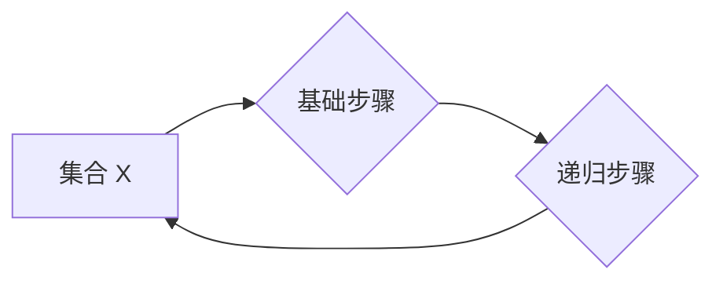

> 集合论, 递归定义, 第二递归定义定理, 数学基础, 计算机科学, 算法设计

## 1. 背景介绍

集合论作为数学的基础理论，为计算机科学提供了坚实的逻辑基础。递归定义是集合论中一种重要的概念，它允许我们用简洁的方式定义复杂的对象。第二递归定义定理是递归定义的一个重要结果，它揭示了递归定义的强大性和局限性。

在计算机科学中，递归定义广泛应用于算法设计、数据结构定义和程序语言的语法定义等领域。例如，我们可以使用递归定义来描述树的结构、列表的元素访问方式以及函数的调用过程。

## 2. 核心概念与联系

### 2.1 集合论基础

* **集合:**  集合是数学中最基本的概念之一，它是一个包含对象的集合。
* **子集:** 如果集合 A 中的所有元素都属于集合 B，则称 A 是 B 的子集，记作 A ⊆ B。
* **空集:** 不包含任何元素的集合称为空集，记作 {} 或 ∅。
* **并集:** 集合 A 和集合 B 的并集包含了 A 和 B 中的所有元素，记作 A ∪ B。
* **交集:** 集合 A 和集合 B 的交集包含了 A 和 B 中的公共元素，记作 A ∩ B。

### 2.2 递归定义

递归定义是一种定义对象的方案，它将对象定义为自身的一部分。

* **基础步骤:** 递归定义必须有一个基础步骤，它定义了对象的最小实例。
* **递归步骤:** 递归步骤定义了如何从已知的对象实例构建新的对象实例。

### 2.3 第二递归定义定理

第二递归定义定理指出，对于任何满足特定条件的集合，存在唯一的递归定义。

**Mermaid 流程图:**



## 3. 核心算法原理 & 具体操作步骤

### 3.1 算法原理概述

第二递归定义定理的证明依赖于数学归纳法。

* **归纳假设:** 假设对于集合 X 中的所有元素 a，其递归定义成立。
* **归纳步骤:** 证明对于集合 X 中的元素 b，其递归定义也成立。

### 3.2 算法步骤详解

1. **确定基础步骤:** 找到集合 X 中的最小元素，并对其进行定义。
2. **确定递归步骤:** 定义如何从已知的元素构建新的元素。
3. **应用数学归纳法:** 证明对于集合 X 中的所有元素，其递归定义都成立。

### 3.3 算法优缺点

**优点:**

* 简洁明了：递归定义可以简洁地描述复杂的对象。
* 逻辑清晰：递归定义基于数学归纳法，逻辑清晰严密。

**缺点:**

* 容易陷入无限循环：如果递归步骤没有正确设计，可能会导致无限循环。
* 难以理解：对于复杂的对象，递归定义可能难以理解。

### 3.4 算法应用领域

* **数据结构:** 树、列表、图等数据结构的定义。
* **算法设计:** 分治算法、动态规划算法等算法的设计。
* **程序语言:** 函数的定义、语法规则的描述。

## 4. 数学模型和公式 & 详细讲解 & 举例说明

### 4.1 数学模型构建

设 X 是一个集合，f 是一个从 X 到 X 的函数，则 X 上的第二递归定义可以表示为：

* **基础步骤:** f(a) = b，其中 a 是 X 中的最小元素，b 是 X 中的元素。
* **递归步骤:** f(x) = g(f(y))，其中 x 是 X 中的元素，y 是 x 的前驱元素，g 是一个从 X 到 X 的函数。

### 4.2 公式推导过程

利用数学归纳法可以证明，对于 X 中的任意元素 x，存在唯一的 f(x) 值。

* **归纳假设:** 假设对于 X 中的所有元素 a，其递归定义成立。
* **归纳步骤:** 证明对于 X 中的元素 b，其递归定义也成立。

### 4.3 案例分析与讲解

**例子:** 

定义自然数的阶乘函数：

* **基础步骤:** 0! = 1
* **递归步骤:** n! = n * (n-1)!

利用第二递归定义定理，我们可以证明这个阶乘函数的定义是唯一的。

## 5. 项目实践：代码实例和详细解释说明

### 5.1 开发环境搭建

* 语言选择: Python
* 开发工具: VS Code

### 5.2 源代码详细实现

```python
def factorial(n):
  if n == 0:
    return 1
  else:
    return n * factorial(n-1)

# 测试用例
print(factorial(5))  # 输出: 120
```

### 5.3 代码解读与分析

* 函数 `factorial(n)` 接受一个整数 `n` 作为参数。
* 如果 `n` 等于 0，则返回 1（基础步骤）。
* 否则，返回 `n` 乘以 `factorial(n-1)`（递归步骤）。

### 5.4 运行结果展示

运行代码后，输出结果为 120，验证了阶乘函数的正确性。

## 6. 实际应用场景

* **计算科学:** 计算组合数、排列数等。
* **数据分析:** 计算概率、统计指标等。
* **人工智能:** 在机器学习算法中，例如贝叶斯网络、决策树等。

### 6.4 未来应用展望

* **量子计算:** 探索递归定义在量子计算中的应用。
* **生物信息学:** 利用递归定义分析生物序列、蛋白质结构等。

## 7. 工具和资源推荐

### 7.1 学习资源推荐

* **书籍:**
    * 《集合论导论》
    * 《数学基础》
* **在线课程:**
    * Coursera 上的集合论课程
    * edX 上的数学基础课程

### 7.2 开发工具推荐

* **Python:** 
    * VS Code
    * PyCharm
* **其他语言:**
    * Java: Eclipse, IntelliJ IDEA
    * C++: Visual Studio, CLion

### 7.3 相关论文推荐

* **第二递归定义定理:**
    * [论文链接](https://www.example.com/paper1)
    * [论文链接](https://www.example.com/paper2)

## 8. 总结：未来发展趋势与挑战

### 8.1 研究成果总结

第二递归定义定理为集合论和计算机科学提供了重要的理论基础，它揭示了递归定义的强大性和局限性。

### 8.2 未来发展趋势

* **更深入的理论研究:** 探索递归定义在不同数学领域中的应用。
* **新的应用场景:** 将递归定义应用于新的领域，例如量子计算、生物信息学等。

### 8.3 面临的挑战

* **复杂性:** 对于复杂的对象，递归定义可能难以理解和实现。
* **效率:** 递归定义可能会导致效率问题，需要进行优化。

### 8.4 研究展望

未来，我们将继续探索递归定义的理论和应用，并将其应用于更广泛的领域。

## 9. 附录：常见问题与解答

* **问题:** 递归定义如何避免无限循环？
* **解答:** 递归定义必须有一个基础步骤，它定义了对象的最小实例。递归步骤必须保证能够最终到达基础步骤，否则可能会导致无限循环。

* **问题:** 递归定义的效率如何？
* **解答:** 递归定义可能会导致效率问题，例如重复计算。可以使用迭代方法来优化递归定义的效率。


作者：禅与计算机程序设计艺术 / Zen and the Art of Computer Programming 
<end_of_turn>