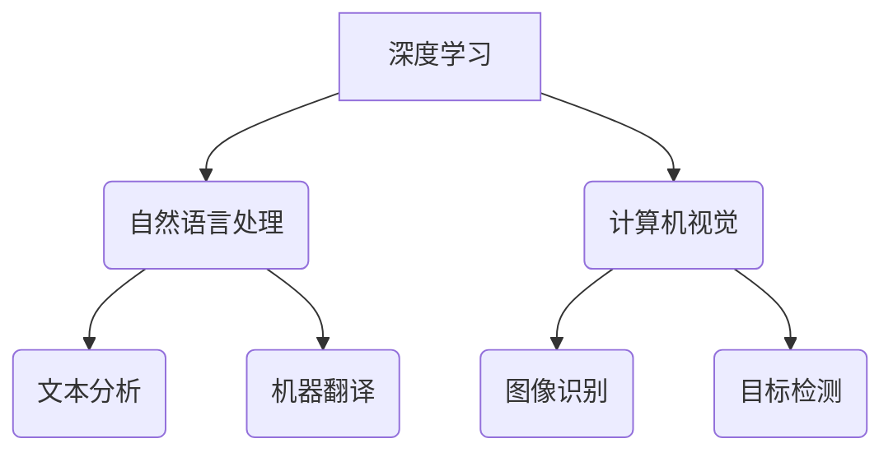

> 人工智能 (AI)
> 深度学习 (Deep Learning)
> 自然语言处理 (NLP)
> 计算机视觉 (Computer Vision)
> 机器学习 (Machine Learning)
> 大数据 (Big Data)
> 计算能力 (Computing Power)

## 1. 背景介绍

人工智能 (AI) 正以惊人的速度发展，深刻地改变着我们的生活和工作方式。从自动驾驶汽车到智能语音助手，AI 的应用领域日益广泛。然而，推动 AI 发展的三大核心力量往往被忽视。本文将深入探讨这三大核心力量，并分析其相互关联性和未来发展趋势。

## 2. 核心概念与联系

**2.1  深度学习 (Deep Learning)**

深度学习是机器学习的一种重要分支，它利用多层神经网络来模拟人类大脑的学习过程。通过训练大量的样本数据，深度学习模型能够自动提取特征，并进行复杂的模式识别和预测。

**2.2  自然语言处理 (NLP)**

自然语言处理 (NLP) 旨在使计算机能够理解和处理人类语言。NLP 技术涵盖了文本分析、机器翻译、语音识别等多个领域。深度学习的进步为 NLP 领域带来了革命性的变化，使得机器能够更准确地理解和生成自然语言。

**2.3  计算机视觉 (Computer Vision)**

计算机视觉 (Computer Vision) 旨在赋予计算机“看”的能力。通过图像和视频数据，计算机视觉模型能够识别物体、场景、人脸等，并进行相应的分析和决策。深度学习在计算机视觉领域取得了突破性的进展，例如图像识别、目标检测、图像分割等任务的准确率大幅提升。

**2.4  核心概念联系**

这三大核心力量相互关联，共同推动着 AI 的发展。深度学习为 NLP 和计算机视觉提供了强大的技术基础，而 NLP 和计算机视觉的应用场景又为深度学习提供了更丰富的训练数据。



## 3. 核心算法原理 & 具体操作步骤

### 3.1  算法原理概述

深度学习的核心算法是多层神经网络，它由多个神经元组成的层级结构组成。每个神经元接收来自上一层的输入信号，并通过激活函数进行处理，输出到下一层。通过训练大量的样本数据，神经网络的权重和偏置会不断调整，最终实现对输入数据的学习和预测。

### 3.2  算法步骤详解

1. **数据预处理:** 将原始数据转换为深度学习模型可以理解的格式，例如将文本数据转换为词向量，将图像数据转换为像素矩阵。
2. **网络结构设计:** 根据具体任务选择合适的网络结构，例如卷积神经网络 (CNN) 用于图像识别，循环神经网络 (RNN) 用于自然语言处理。
3. **模型训练:** 使用训练数据训练深度学习模型，通过反向传播算法调整模型参数，使模型的预测结果与真实值尽可能接近。
4. **模型评估:** 使用测试数据评估模型的性能，例如计算准确率、召回率、F1-score等指标。
5. **模型部署:** 将训练好的模型部署到实际应用场景中，例如将图像识别模型部署到手机应用程序中。

### 3.3  算法优缺点

**优点:**

* 能够自动提取特征，无需人工特征工程。
* 能够处理复杂的数据模式，例如图像、文本、语音等。
* 性能优于传统机器学习算法。

**缺点:**

* 需要大量的训练数据。
* 计算资源需求高。
* 模型解释性差，难以理解模型的决策过程。

### 3.4  算法应用领域

深度学习算法广泛应用于各个领域，例如：

* **计算机视觉:** 图像识别、目标检测、图像分割、人脸识别等。
* **自然语言处理:** 文本分类、机器翻译、语音识别、聊天机器人等。
* **语音识别:** 语音转文本、语音助手等。
* **医疗诊断:** 病理图像分析、疾病预测等。
* **金融分析:** 欺诈检测、风险评估等。

## 4. 数学模型和公式 & 详细讲解 & 举例说明

### 4.1  数学模型构建

深度学习模型的数学基础是神经网络，它由多个层级结构组成。每个层级包含多个神经元，每个神经元接收来自上一层的神经元的输出信号，并通过激活函数进行处理，输出到下一层。

### 4.2  公式推导过程

**激活函数:**

激活函数的作用是将神经元的输入信号转换为输出信号，并引入非线性特性。常用的激活函数包括 sigmoid 函数、ReLU 函数、tanh 函数等。

**损失函数:**

损失函数用于衡量模型的预测结果与真实值的差距。常用的损失函数包括均方误差 (MSE)、交叉熵损失 (Cross-Entropy Loss) 等。

**反向传播算法:**

反向传播算法用于调整模型参数，使模型的预测结果与真实值尽可能接近。它通过计算损失函数对每个参数的梯度，并使用梯度下降算法更新参数值。

### 4.3  案例分析与讲解

**举例说明:**

假设我们有一个简单的深度学习模型，用于分类手写数字。模型的输入是一个 28x28 的图像，输出是一个 10 维的向量，分别代表数字 0 到 9 的概率。

**损失函数:**

我们使用交叉熵损失函数来衡量模型的预测结果与真实值的差距。

**反向传播算法:**

通过反向传播算法，我们可以计算损失函数对每个参数的梯度，并使用梯度下降算法更新参数值。

## 5. 项目实践：代码实例和详细解释说明

### 5.1  开发环境搭建

* Python 3.x
* TensorFlow 或 PyTorch 深度学习框架
* Jupyter Notebook 或 VS Code 代码编辑器

### 5.2  源代码详细实现

```python
import tensorflow as tf

# 定义模型结构
model = tf.keras.models.Sequential([
    tf.keras.layers.Flatten(input_shape=(28, 28)),
    tf.keras.layers.Dense(128, activation='relu'),
    tf.keras.layers.Dense(10, activation='softmax')
])

# 编译模型
model.compile(optimizer='adam',
              loss='sparse_categorical_crossentropy',
              metrics=['accuracy'])

# 训练模型
model.fit(x_train, y_train, epochs=10)

# 评估模型
loss, accuracy = model.evaluate(x_test, y_test)
print('Test loss:', loss)
print('Test accuracy:', accuracy)
```

### 5.3  代码解读与分析

* **模型结构:** 模型由两层全连接层组成，第一层有 128 个神经元，使用 ReLU 激活函数，第二层有 10 个神经元，使用 softmax 激活函数，输出数字 0 到 9 的概率。
* **编译模型:** 使用 Adam 优化器、交叉熵损失函数和准确率作为评估指标。
* **训练模型:** 使用训练数据训练模型 10 个 epochs。
* **评估模型:** 使用测试数据评估模型的性能。

### 5.4  运行结果展示

训练完成后，模型的准确率会随着 epochs 的增加而提高。最终的准确率取决于训练数据的质量和模型的复杂度。

## 6. 实际应用场景

### 6.1  自动驾驶

深度学习算法在自动驾驶领域发挥着至关重要的作用，例如：

* **目标检测:** 识别道路上的车辆、行人、交通信号灯等物体。
* **路径规划:** 根据周围环境规划行驶路线。
* **驾驶决策:** 根据传感器数据和环境信息做出驾驶决策。

### 6.2  医疗诊断

深度学习算法可以辅助医生进行疾病诊断，例如：

* **病理图像分析:** 识别肿瘤、炎症等病变。
* **疾病预测:** 根据患者的医疗记录和症状预测疾病风险。
* **药物研发:** 筛选潜在的药物候选物。

### 6.3  金融分析

深度学习算法可以帮助金融机构进行风险管理和投资决策，例如：

* **欺诈检测:** 识别信用卡欺诈、网络钓鱼等欺诈行为。
* **风险评估:** 评估贷款、投资等风险。
* **股票预测:** 根据市场数据预测股票价格走势。

### 6.4  未来应用展望

随着深度学习算法的不断发展，其应用场景将更加广泛，例如：

* **个性化教育:** 根据学生的学习情况提供个性化的学习方案。
* **智能家居:** 通过语音控制、图像识别等技术实现智能家居。
* **机器人技术:** 开发更加智能、灵活的机器人。

## 7. 工具和资源推荐

### 7.1  学习资源推荐

* **书籍:**
    * 深度学习 (Deep Learning) - Ian Goodfellow, Yoshua Bengio, Aaron Courville
    * 构建深度学习模型 (Hands-On Machine Learning with Scikit-Learn, Keras & TensorFlow) - Aurélien Géron
* **在线课程:**
    * Coursera: 深度学习 Specialization
    * Udacity: 深度学习 Nanodegree
    * fast.ai: 深度学习课程

### 7.2  开发工具推荐

* **TensorFlow:** 开源深度学习框架，支持多种硬件平台。
* **PyTorch:** 开源深度学习框架，以其灵活性和易用性而闻名。
* **Keras:** 高级深度学习 API，可以运行在 TensorFlow、Theano 或 CNTK 后端。

### 7.3  相关论文推荐

* **ImageNet Classification with Deep Convolutional Neural Networks** - Alex Krizhevsky, Ilya Sutskever, Geoffrey E. Hinton
* **Sequence to Sequence Learning with Neural Networks** - Ilya Sutskever, Oriol Vinyals, Quoc V. Le
* **Attention Is All You Need** - Ashish Vaswani, Noam Shazeer, Niki Parmar, Jakob Uszkoreit, Llion Jones, Aidan N. Gomez, Łukasz Kaiser, Illia Polosukhin

## 8. 总结：未来发展趋势与挑战

### 8.1  研究成果总结

深度学习在过去几年取得了显著的进展，在计算机视觉、自然语言处理等领域取得了突破性的成果。

### 8.2  未来发展趋势

* **模型规模和复杂度:** 模型规模和复杂度将继续增加，例如 Transformer 模型的出现。
* **数据效率:** 研究更有效利用数据，提高模型的训练效率。
* **可解释性:** 研究更易于理解和解释深度学习模型的决策过程。
* **安全性和可靠性:** 研究提高深度学习模型的安全性和可靠性，防止模型被攻击或产生错误结果。

### 8.3  面临的挑战

* **数据获取和标注:** 深度学习模型需要大量的训练数据，获取和标注这些数据成本高昂。
* **计算资源:** 训练大型深度学习模型需要大量的计算资源，例如 GPU 和 TPU。
* **模型解释性:** 深度学习模型的决策过程难以理解，这可能会导致模型的应用受到限制。
* **伦理问题:** 深度学习技术可能带来一些伦理问题，例如算法偏见、隐私泄露等。

### 8.4  研究展望

未来，深度学习研究将继续朝着更强大、更安全、更可解释的方向发展。


## 9. 附录：常见问题与解答

**Q1: 深度学习和机器学习有什么区别？**

**A1:** 机器学习是人工智能的一个子领域，它旨在使计算机能够从数据中学习，而无需明确编程。深度学习是机器学习的一种特殊形式，它利用多层神经网络来模拟人类大脑的学习过程。

**Q2: 如何选择合适的深度学习框架？**

**A2:** TensorFlow 和 PyTorch 是两个最流行的深度学习框架。TensorFlow 更适合于生产环境，而 PyTorch 更易于研究和开发。

**Q3: 如何评估深度学习模型的性能？**

**A3:** 常见的评估指标包括准确率、召回率、F1-score、AUC 等。