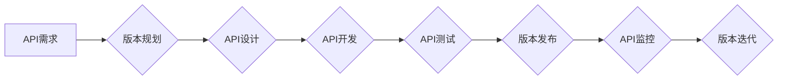

> API版本控制，版本管理，API文档，API测试，API生命周期，RESTful API，版本迭代

## 1. 背景介绍

在当今软件开发领域，API（Application Programming Interface）扮演着越来越重要的角色。它们连接着不同的应用程序和系统，促进数据和功能的共享。随着API的日益普及，API版本控制也变得至关重要。

API版本控制是指对API进行版本管理，确保不同版本的API之间保持兼容性，并能够顺利进行版本迭代和更新。良好的API版本控制策略可以帮助开发团队：

* **维护API稳定性:** 确保现有应用程序能够正常使用新版本的API，避免因版本不兼容导致的应用程序崩溃或功能失效。
* **简化版本管理:** 方便跟踪API的变更历史，方便开发团队理解API的演变过程。
* **提高开发效率:** 允许开发团队同时开发多个API版本，并根据需要进行版本发布和更新。
* **增强API可维护性:**  方便对API进行维护和更新，降低API维护成本。

## 2. 核心概念与联系

API版本控制的核心概念包括：

* **版本号:** 用于标识API的不同版本，通常采用语义化版本号（Semantic Versioning）规范。
* **版本迭代:**  API版本更新的过程，包括添加新功能、修改现有功能或修复bug。
* **兼容性:**  不同版本API之间的数据格式、接口参数和行为的兼容性。
* **版本发布:** 将新版本的API发布到线上环境，供用户使用。
* **版本弃用:**  不再维护和支持的旧版本的API。

**API版本控制流程图:**



## 3. 核心算法原理 & 具体操作步骤

### 3.1  算法原理概述

API版本控制的核心算法原理是基于版本号的语义化版本号规范，以及版本迭代和兼容性管理策略。

语义化版本号规范定义了版本号的三个部分：

* **主版本号:**  表示API的重大版本更新，例如从1.0到2.0。
* **次版本号:**  表示API的次要版本更新，例如从1.0到1.1。
* **修订号:**  表示API的修补版本更新，例如从1.1到1.1.1。

根据语义化版本号规范，API版本控制策略通常遵循以下原则：

* **向后兼容:** 新版本API应该与旧版本API保持向后兼容，即旧版本应用程序能够正常使用新版本的API。
* **版本迭代:**  API版本迭代应该遵循一定的规范，例如使用语义化版本号规范，并提供详细的变更日志。
* **版本弃用:**  旧版本的API应该在一定时间后被弃用，并提供相应的迁移方案。

### 3.2  算法步骤详解

API版本控制的具体操作步骤如下：

1. **版本规划:**  在开始开发API之前，需要进行版本规划，确定API的版本号策略、迭代周期和弃用策略。
2. **API设计:**  根据版本规划，设计API的接口规范、数据格式和行为。
3. **API开发:**  根据API设计文档，开发API的实现代码。
4. **API测试:**  对开发的API进行测试，确保其功能正确、性能良好和兼容性强。
5. **版本发布:**  将经过测试的API发布到线上环境，供用户使用。
6. **API监控:**  对发布的API进行监控，收集用户反馈和性能数据。
7. **版本迭代:**  根据用户反馈和性能数据，对API进行迭代更新，修复bug、添加新功能或改进性能。

### 3.3  算法优缺点

**优点:**

* **提高API稳定性:**  确保现有应用程序能够正常使用新版本的API。
* **简化版本管理:**  方便跟踪API的变更历史。
* **提高开发效率:**  允许开发团队同时开发多个API版本。
* **增强API可维护性:**  方便对API进行维护和更新。

**缺点:**

* **增加开发成本:**  需要额外的开发时间和资源来进行版本管理。
* **增加维护成本:**  需要维护多个API版本，增加维护成本。
* **可能导致兼容性问题:**  如果版本迭代不当，可能会导致兼容性问题。

### 3.4  算法应用领域

API版本控制广泛应用于各种软件开发领域，例如：

* **Web应用程序:**  用于管理Web应用程序的API接口。
* **移动应用程序:**  用于管理移动应用程序的API接口。
* **云计算平台:**  用于管理云计算平台的API接口。
* **物联网:**  用于管理物联网设备的API接口。

## 4. 数学模型和公式 & 详细讲解 & 举例说明

### 4.1  数学模型构建

API版本控制的数学模型可以基于图论和关系数据库的概念构建。

* **图论:**  API版本可以看作图中的节点，API之间的依赖关系可以看作图中的边。
* **关系数据库:**  API版本的信息可以存储在关系数据库中，例如版本号、发布日期、变更日志等。

### 4.2  公式推导过程

API版本控制的数学模型可以用于推导以下公式：

* **版本依赖度:**  计算两个API版本之间的依赖度，例如版本A依赖于版本B，则版本依赖度为1，否则为0。
* **版本兼容性:**  判断两个API版本是否兼容，例如版本A与版本B兼容，则兼容性为1，否则为0。
* **版本迭代路径:**  计算从一个API版本到另一个API版本的迭代路径，例如从版本1.0到版本2.0的迭代路径可能是1.1、1.2、2.0。

### 4.3  案例分析与讲解

假设有一个API版本控制系统，其中包含以下API版本：

* 版本1.0
* 版本1.1
* 版本1.2
* 版本2.0

根据API版本控制的数学模型，我们可以计算以下信息：

* 版本1.1依赖于版本1.0，版本依赖度为1。
* 版本1.2依赖于版本1.1，版本依赖度为1。
* 版本2.0依赖于版本1.2，版本依赖度为1。
* 版本1.0与版本2.0兼容，兼容性为1。
* 从版本1.0到版本2.0的迭代路径可能是1.1、1.2、2.0。

## 5. 项目实践：代码实例和详细解释说明

### 5.1  开发环境搭建

API版本控制项目可以使用以下开发环境搭建：

* **操作系统:**  Linux、macOS或Windows
* **编程语言:**  Python、Java或Go
* **数据库:**  MySQL、PostgreSQL或MongoDB
* **版本控制系统:**  Git

### 5.2  源代码详细实现

以下是一个使用Python语言实现的API版本控制系统的代码示例：

```python
class ApiVersion:
    def __init__(self, version, description, released_at):
        self.version = version
        self.description = description
        self.released_at = released_at

    def __str__(self):
        return f"Version: {self.version}, Description: {self.description}, Released At: {self.released_at}"

# 创建API版本实例
version1 = ApiVersion("1.0", "Initial release", "2023-03-01")
version2 = ApiVersion("1.1", "Added new feature", "2023-03-15")

# 打印API版本信息
print(version1)
print(version2)
```

### 5.3  代码解读与分析

这段代码定义了一个`ApiVersion`类，用于表示API的版本信息。

* `__init__`方法用于初始化API版本实例，包括版本号、描述和发布日期。
* `__str__`方法用于返回API版本信息的字符串表示。

### 5.4  运行结果展示

运行这段代码会输出以下结果：

```
Version: 1.0, Description: Initial release, Released At: 2023-03-01
Version: 1.1, Description: Added new feature, Released At: 2023-03-15
```

## 6. 实际应用场景

### 6.1  电商平台API版本控制

电商平台的API通常用于处理商品信息、订单管理、支付处理等业务。API版本控制可以帮助电商平台：

* **保证现有应用程序的稳定性:**  新版本的API不会影响现有应用程序的正常使用。
* **方便进行功能迭代:**  电商平台可以根据用户需求，逐步迭代API功能，例如添加新的支付方式、物流配送方式等。
* **简化版本管理:**  电商平台可以方便地跟踪API的变更历史，方便进行版本管理和维护。

### 6.2  社交媒体平台API版本控制

社交媒体平台的API通常用于处理用户数据、消息推送、内容分享等业务。API版本控制可以帮助社交媒体平台：

* **保证现有应用程序的兼容性:**  新版本的API不会影响现有应用程序的正常使用。
* **方便进行功能更新:**  社交媒体平台可以根据用户需求，逐步更新API功能，例如添加新的社交功能、个性化设置等。
* **简化版本管理:**  社交媒体平台可以方便地跟踪API的变更历史，方便进行版本管理和维护。

### 6.3  金融平台API版本控制

金融平台的API通常用于处理用户账户、交易记录、风险控制等业务。API版本控制可以帮助金融平台：

* **保证系统稳定性:**  新版本的API不会影响现有系统的正常运行。
* **方便进行功能升级:**  金融平台可以根据监管要求和用户需求，逐步升级API功能，例如添加新的支付方式、风险控制机制等。
* **简化版本管理:**  金融平台可以方便地跟踪API的变更历史，方便进行版本管理和维护。

### 6.4  未来应用展望

随着API的日益普及，API版本控制将变得更加重要。未来，API版本控制技术将朝着以下方向发展：

* **自动化:**  利用自动化工具进行API版本管理，减少人工干预。
* **智能化:**  利用人工智能技术，自动分析API变更，并提供版本迭代建议。
* **云化:**  将API版本控制服务迁移到云平台，提供更灵活、更便捷的API版本管理服务。

## 7. 工具和资源推荐

### 7.1  学习资源推荐

* **语义化版本号规范:** https://semver.org/
* **API版本控制最佳实践:** https://www.apigee.com/blog/api-strategy/api-versioning-best-practices
* **API版本控制工具:** https://www.atlassian.com/software/api-platform

### 7.2  开发工具推荐

* **Swagger:**  用于定义和文档化RESTful API
* **Postman:**  用于测试和调试API
* **Git:**  用于版本控制

### 7.3  相关论文推荐

* **API Versioning: A Survey**
* **Semantic Versioning for APIs**

## 8. 总结：未来发展趋势与挑战

### 8.1  研究成果总结

API版本控制技术已经取得了显著的成果，为软件开发提供了更稳定、更灵活、更易维护的API管理方案。

### 8.2  未来发展趋势

未来，API版本控制技术将朝着自动化、智能化、云化方向发展，并与其他软件开发技术更加紧密地结合。

### 8.3  面临的挑战

API版本控制技术还面临着一些挑战，例如：

* **兼容性问题:**  不同版本的API之间可能存在兼容性问题，需要进行严格的测试和验证。
* **版本管理复杂性:**  随着API版本的增加，版本管理会变得越来越复杂，需要开发更智能的版本管理工具。
* **安全问题:**  API版本